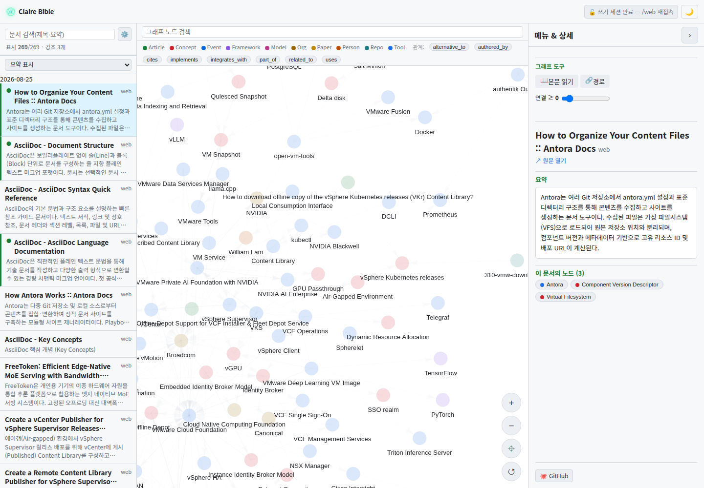
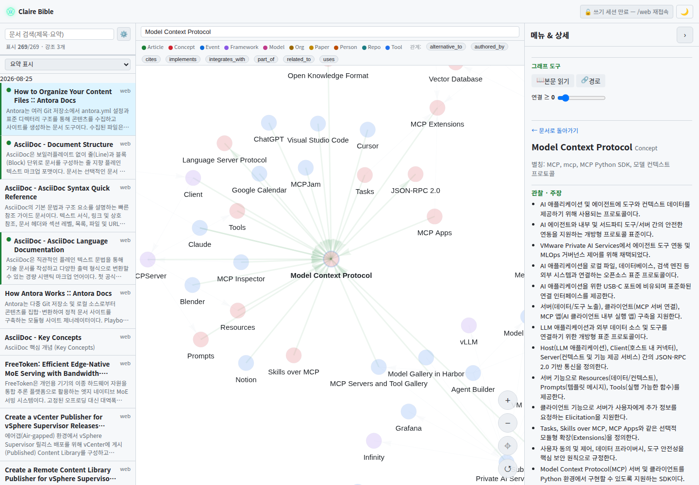
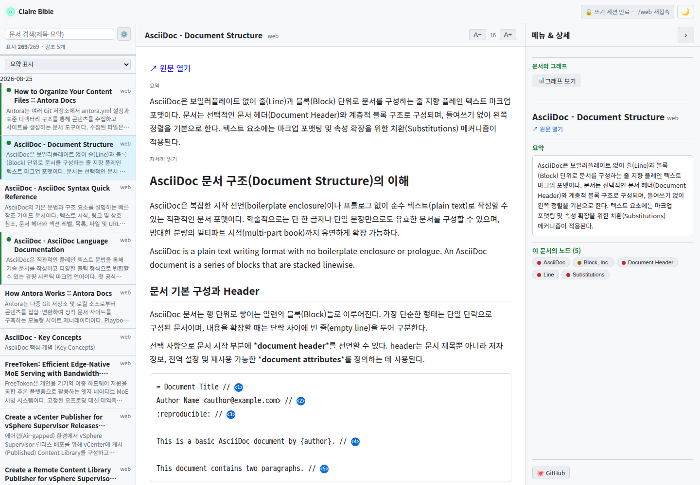
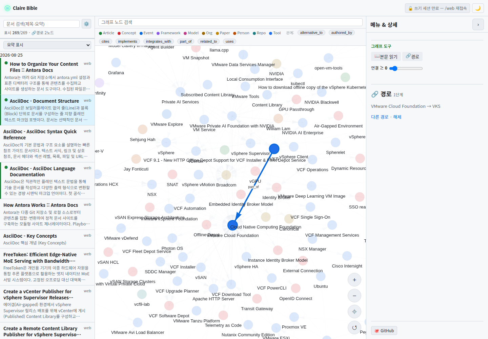
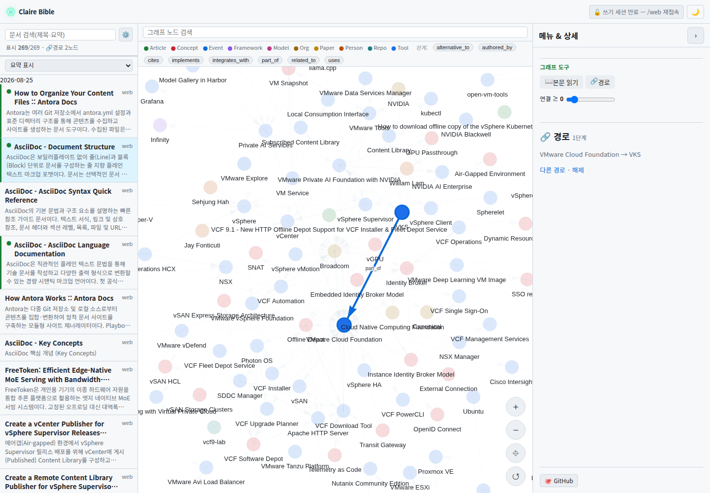
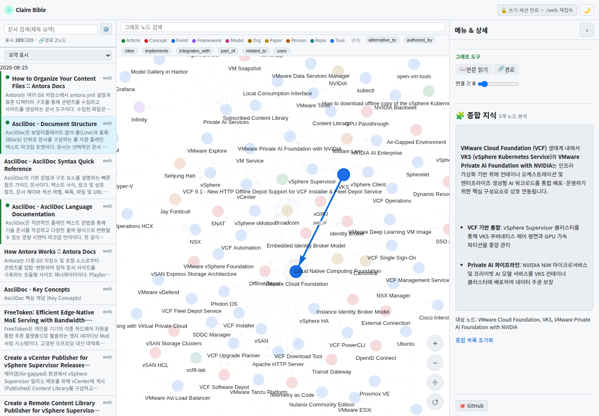

# Claire Bible

텔레그램으로 던진 링크/문서/키워드를 **스크랩 → Gemini로 구조화 → 팔란티어식 타입 온톨로지 그래프**로 적재하고,
새 자료를 **기존에 쌓인 그래프와 연결**하며, 나중에 키워드로 **검색 → LLM 정리**해 보여주는 **개인용 지식베이스**.

- 설계 상세: [PLAN.md](PLAN.md) · 비전·로드맵: [GOALS.md](GOALS.md)

## 상태

v1 파이프라인 완성 + 개인용 컨테이너 운영 구조. 단일 사용자 전용이며 멀티테넌시는
범위 밖이다([GOALS.md](GOALS.md) 참조). 자동복구·헬스·circuit breaker·능동 알림을
제공한다.

## 웹 UI

Claire Bible은 적재된 지식베이스를 시각적으로 탐색하고 분석할 수 있는 단일 페이지 반응형 웹 인터페이스를 제공합니다.

### 지식 그래프 탐색

좌측의 일자별 문서 목록과 중앙의 온톨로지 지식 그래프를 연계하여 전체 지식 구조와 관계망을 직관적으로 탐색합니다. 노드 타입별 컬러링, 연결 차수(Degree) 기반 물리 레이아웃, 상단 범례를 통한 관계 필터링 및 카메라 줌/포커스 컨트롤을 지원합니다.



### 검색과 노드 상세

키워드로 그래프 내 엔티티를 검색하고, 선택된 노드의 관찰·주장(Observations), 별칭(Aliases), 출처 문서(AI 요약 및 원문 링크), 방향성이 포함된 타입 관계(Neighbors), 실시간 웹 맥락 조사(🔬 더 알아보기) 기능을 한 화면에서 확인합니다.



### 문서 읽기

수집된 기술 문서와 아티클을 전용 리더 뷰로 쾌적하게 열람합니다. Markdown과 AsciiDoc(.adoc) 듀얼 포맷 본문 렌더링, AI 요약 하이라이트, 글자 크기 조절(A−/A+), 제목 편집(✏️), 공유 링크(🔗) 및 FTS5/시맨틱 하이브리드 검색을 제공합니다.



### 연결 경로

지식 베이스 내 임의의 두 엔티티 간 최단 관계 경로(BFS)를 계산하여 그래프 상에 시각적으로 강조합니다. 우측 패널에서 단계별 관계 전개 과정(`A → 관계 → B → ...`)을 요약하여 복잡한 개념 간의 연결 고리를 손쉽게 파악할 수 있습니다.



### 자료 적재

웹 브라우저에서 URL, 원문 텍스트, 메모, "제목 URL" 공유 문구를 직접 입력하여 지식 그래프에 즉시 적재합니다. NDJSON 실시간 스트리밍으로 수집/추출 진행 상황을 확인하며, 수집된 문서 내의 관련 링크는 백그라운드 1홉 자동 확장을 통해 함께 구축됩니다.



### 다중 노드 종합

관심 있는 복수의 엔티티를 바구니(🧩 종합)에 담아 LLM으로 공통 맥락과 상호 작용을 종합 분석합니다. 서로 다른 문서에서 추출된 지식들이 어떻게 융합되고 연계되는지 심층 브리핑 형태로 도출합니다.



## 로컬 개발 빠른 시작 (Quick Start)

```bash
uv sync                      # 의존성 설치
cp .env.example .env         # 로컬 개발 설정 준비 (기본 provider: mock)
uv run claire preflight      # 환경/벡터백엔드/설정 사전 점검
uv run claire doctor         # 지식그래프 및 DB 무결성 진단 (자동수복: --heal)
uv run claire ingest "https://example.com/article"   # 문서 수집 및 적재
uv run claire search "키워드"                          # 하이브리드 검색 + LLM 인용 정리
uv run claire bot            # 텔레그램 봇 실행 (long-polling)
```

### 테스트 및 품질 검증 (Testing)

Claire Bible은 백엔드 로직과 런타임을 검증하는 단위/통합 테스트(`pytest`)와 반응형 웹 인터페이스 및 SPA 내비게이션을 검증하는 E2E 브라우저 테스트(`Playwright`)를 제공합니다.

```bash
# 1. Python 단위 및 통합 테스트 (2026-08-27 기준: 673개)
uv run pytest

# 2. Playwright 브라우저 E2E 테스트 (최초 1회 설치)
npm --prefix e2e install           # Playwright 의존성 설치
npx --prefix e2e playwright install chromium # 브라우저 바이너리 설치
npx --prefix e2e playwright test   # 모바일/태블릿/데스크톱 E2E 테스트 스위트 실행
```

> 💡 **참고**: `node_modules/`, `test-results/`, `playwright-report/`, `.pytest_cache/` 등 테스트 산출물은 `.gitignore`에 등록되어 있어 Git 저장소를 항상 깨끗하게 유지합니다.


## 주요 명령어 요약

Claire Bible은 호스트 오케스트레이션 도구인 **`cb-manuscript`**와 애플리케이션 CLI인 **`claire`**를 제공합니다.

| 도구 | 주요 명령어 예시 | 역할 및 설명 |
| :--- | :--- | :--- |
| **`cb-manuscript`** | `init`, `preflight`, `install`, `update` | 호스트 환경 검증, 이미지 빌드, 롤링 업데이트 |
| | `doctor`, `doctor --heal` | 지식그래프 참조 무결성 진단 및 원클릭 자동 수복 |
| | `regenerate --tables --all --apply` | 특정 문서 또는 표(Table) 포함 문서 컴포넌트 LLM 재생성 |
| | `backup`, `restore`, `format-migrate` | DB/Vault 아카이브 백업·복원, 본문 포맷 일괄 변환 |
| | `up`, `down`, `restart`, `status`, `logs` | Docker Compose 서비스 수명주기 제어 |
| **`claire`** | `ingest`, `search` | 지식 문서 수집/적재, FTS+벡터 하이브리드 인용 검색 |
| *(앱 CLI)* | `doctor`, `preflight`, `health`, `status` | 지식그래프 수복, 환경 점검, 헬스 JSON, 운영 상태 |
| | `reextract`, `backfill-detail`, `dedup-merge`| 전체/표 선별 그래프 재추출, 본문 백필, 근사 중복 문서 병합 |
| | `queue status`, `queue list inbox` | `raw_inbox`·`refresh_queue`·`expand_queue`의 상태 분포와 대기·오류 항목 조회 |

> 💡 **전체 명령어 및 세부 옵션 안내**: 모든 명령어, 세부 옵션, 미구현 상태 및 제약사항에 대한 상세 설명은 **[전체 CLI 명령어 레퍼런스 (`docs/origin/implementation/COMMANDS.md`)](docs/origin/implementation/COMMANDS.md)**를 참고하십시오.

`regenerate --apply`, `reextract`, 백필, 포맷 적용과 큐 1회 실행은 문서별 진행률·세부 단계·중단 위치를 표준 오류 출력으로 보고한다. 대상별 적용 범위와 재개 경계는 [작업 진행률 및 중단 보고](docs/origin/implementation/COMMANDS.md#작업-진행률-및-중단-보고)를 따른다.

## 컨테이너 운영

배포된 인스턴스의 호스트 수명주기는 루트의 `cb-manuscript`로만 조작한다.
`cb-manuscript`는 `.env`, 설치·업데이트와 Compose를 담당하고,
`cb-manuscript app`은 같은 배포 설정과 데이터로 `claire` one-off 명령을 실행한다.
영속 서비스의 컨테이너 내부 명령은 Compose가 직접 `claire`를 호출한다. 세부 경계와
health 종료 코드 차이는 [운영 명령 경계](docs/origin/implementation/OPERATIONS.md)를 참고한다.

### 최초 설치 및 구성

`cb-manuscript`는 준비된 Linux 호스트에서 설정 검증·이미지 build·DB
migration·서비스 기동을 일관된 순서로 수행한다.

#### 1. 호스트 준비

Linux 호스트가 기준이다. Windows에서는 WSL Ubuntu의 Linux 파일시스템에 checkout을
두고 실행한다. 다음 항목이 필요하다.

- Bash와 Python 3.10 이상(`fcntl`, `sqlite3` 표준 모듈 포함)
- Git
- 실행 중인 Docker Engine과 Docker CLI
- `docker compose` 형태의 Docker Compose plugin
- 현재 사용자 계정의 Docker daemon 접근 권한
- checkout, `data/`, `vault/`, `.cb-manuscript/`를 읽고 쓸 권한
- 최초 image build를 위한 container registry·OS package repository·Python
  package index의 DNS/HTTPS 접근

##### Ubuntu 설치 예시

```bash
sudo apt update
sudo apt install -y bash ca-certificates curl git python3
```

Docker Engine, Docker CLI와 Compose plugin은
[Docker 공식 Ubuntu 설치 안내](https://docs.docker.com/engine/install/ubuntu/)에
따라 준비한다. 설치 후 현재 계정에 Docker daemon 접근 권한을 적용하고 버전을
확인한다.

```bash
python3 --version          # 3.10 이상
python3 -c 'import fcntl, sqlite3'
git --version
docker --version
docker compose version
docker info --format '{{.ServerVersion}}'
```

저장소를 clone한 뒤 루트로 이동한다. private repository는 credential manager 또는
SSH 인증을 사용한다.

```bash
git clone https://github.com/fofwisdom/claire-bible.git
cd claire-bible
```

컨테이너 image build가 Python 3.11, `uv`, Chromium과 애플리케이션 Python 패키지를
설치한다. 호스트 `uv`는 [로컬 소스 개발](#로컬-소스-개발)과 기본 원격 배포 CI에서
사용한다.

#### 2. 환경 파일과 저장 경로 준비

저장소 루트에서 `init`을 먼저 실행한다.

```bash
./cb-manuscript init
```

이 명령은 다음 작업을 수행한다.

- `.env.example`을 `.env`로, `.env.dev.example`을 `.env.dev`로 복사
- 기존 환경 파일과 비어 있지 않은 설정 유지
- production/development selector와 `CLAIRE_ANONYMOUS_READONLY=1` 보충
- 비어 있는 `CLAIRE_INJECT_TOKEN`을 URL-safe owner token으로 생성
- 환경 파일을 mode `0600`으로 설정
- 기본 `data/`, `vault/` 디렉터리 생성

설치할 profile에 따라 설정 파일과 명령을 선택한다.

| 목적 | 적용 설정 | 명령 형태 |
|---|---|---|
| 같은 호스트에서 격리된 시험 | `.env` 다음 `.env.dev` overlay | `./cb-manuscript dev <command>` |
| production 운영 | `.env` | `./cb-manuscript <command>` |

development의 기본값은 `127.0.0.1:8766`, mock provider, Telegram bot 비활성화다. 같은
호스트에서 시험한다면 `init` 직후 사용할 수 있다. 다른 개발 장치에서 접속할 때는
`.env.dev`의 `CB_API_BIND`와 `CLAIRE_PUBLIC_URL`을 실제 고정 LAN IPv4 기준으로 함께
변경한다.

production에서는 `.env`의 예시 hostname을 포함한 다음 값을 실제 환경에 맞게
변경한다.

```dotenv
CLAIRE_ENVIRONMENT=production
CB_API_BIND=192.168.10.25
CB_API_PORT=8765
CLAIRE_PUBLIC_URL=https://kb.example.net/
CLAIRE_CORS_ALLOWED_ORIGINS=
CLAIRE_ANONYMOUS_READONLY=1
```

- `CB_API_BIND`는 Claire 호스트에 실제 할당된 단일 IPv4여야 한다.
- `CB_API_PORT`는 사용 가능한 port여야 한다.
- `CLAIRE_PUBLIC_URL`은 실제 DNS hostname의 root HTTPS URL이어야 한다.
- production HTTPS와 인증서는 별도 reverse proxy가 담당한다.
- production host의 API source 제한은 reverse proxy IP를 기준으로
  [`DOCKER-USER` chain](https://docs.docker.com/engine/install/ubuntu/#firewall-limitations)에
  설정한다.
- `CB_DATA_DIR`·`CB_VAULT_DIR`을 바꾸면 해당 host 디렉터리를 미리 만들고 Docker bind
  mount와 쓰기 권한을 확인한다.

DNS, reverse proxy, TLS, Host 전달과 방화벽 구성은 [외부 접속과 reverse
proxy](docs/origin/implementation/EXTERNAL_ACCESS.md)를 따른다.

#### 3. Provider와 Telegram 선택

최초 기동은 기본 mock provider와 비활성 Telegram 구성으로 확인할 수 있다.

```dotenv
CLAIRE_PROVIDER=mock
GEMINI_API_KEY=
TELEGRAM_BOT_TOKEN=
```

호스트에 인증된 Antigravity CLI(`agy`)를 사용할 경우 `CLAIRE_PROVIDER`를 `antigravity`로 설정한다 (별도 API 키 불필요).

```dotenv
CLAIRE_PROVIDER=antigravity
CLAIRE_AGY_BIN=agy
CLAIRE_AGY_MODEL=gemini-3.7-flash
CLAIRE_AGY_EFFORT=medium
```

직접 Gemini API를 사용하려면 `CLAIRE_PROVIDER`를 `gemini`로 변경하고 `GEMINI_API_KEY`를 설정한다.

```dotenv
CLAIRE_PROVIDER=gemini
GEMINI_API_KEY=replace-with-gemini-api-key
```

Telegram bot을 활성화할 때 `TELEGRAM_BOT_TOKEN`과 `CLAIRE_ALLOWED_USERS`의 허용할
숫자 user ID를 설정한다.

`CLAIRE_ANONYMOUS_READONLY=1`(기본값)은 숨김 문서를 제외한 공개 지식베이스의 읽기 API를
자격증명 없이 공개한다. 완전히 인증 전용(비공개)으로 운영하려면 `0`으로 변경한다.

PDF 논문 및 심층 문서 적재 시 원문 추출 상한(`CLAIRE_PDF_MAX_EXTRACT_CHARS=50000`)과 1차 논문 분류 최저 effort(`CLAIRE_PDF_CLASSIFIER_EFFORT=low`), 15,000자 이상 논문에 대한 고수준 추론(`CLAIRE_PDF_PAPER_EFFORT=high`)이 자동으로 적용된다. (.env 내 여러 프로바이더 선언 시 최저 effort 프로바이더를 1차 분류기로 자동 선택) 상세 내용은 [PDF_INGESTION_AND_ADAPTIVE_EFFORT_DESIGN.md](docs/origin/design/PDF_INGESTION_AND_ADAPTIVE_EFFORT_DESIGN.md)를 참조한다.

#### 4. 사전 검사, 설치, 설치 후 확인

`preflight`와 `install`은 별도 명령이다. 선택한 profile에서 다음 순서로 실행한다.

```bash
# production
./cb-manuscript preflight
./cb-manuscript install

# development
./cb-manuscript dev preflight
./cb-manuscript dev install
```

`preflight`는 Docker CLI·Compose·daemon, Git, 환경 파일과 Compose 문법을 확인한다.
설치 전에 다음 운영 조건도 확인한다.

- `CB_API_BIND`가 실제 host interface에 존재하는지
- `CB_API_PORT`가 비어 있는지
- Docker build와 데이터 증가에 필요한 디스크 공간
- custom data/vault 경로의 mount·쓰기 권한
- registry·APT·Python package index 접근
- production DNS·reverse proxy·TLS·방화벽
- Gemini와 Telegram 자격증명의 실제 유효성

설치가 끝나면 같은 profile에서 상태와 health, 지식그래프 무결성을 확인한다. development는 각
명령 앞에 `dev`를 붙인다.

```bash
./cb-manuscript status
./cb-manuscript health
./cb-manuscript app doctor      # 지식그래프 및 DB 무결성 점검 (자동수복: --heal)
./cb-manuscript app health
./cb-manuscript app preflight
./cb-manuscript logs --tail 100 api
```

`install`의 마지막 검증 범위는 API 컨테이너의 DB·schema liveness다. 설치 후 실제
환경에서 Gemini 호출, Telegram 메시지, scraping, reverse proxy와 브라우저 접속을
각각 확인한다.

### 주요 운영 명령

| 명령 | 설명 |
|---|---|
| `./cb-manuscript update` | fast-forward source → build → stop → migrate → up |
| `./cb-manuscript update --no-fetch` | 이미 동기화된 소스로 재배치 |
| `./cb-manuscript up` | 서비스 스택 시작 |
| `./cb-manuscript down` | 서비스 스택 중지 |
| `./cb-manuscript restart` | 서비스 스택 재시작 |
| `./cb-manuscript backup` | 백업 생성 (`backups/cb-YYYYMMDD-HHMMSS/`) |
| `./cb-manuscript backup --format archive` | 압축 백업 생성 (`backups/cb-YYYYMMDD-HHMMSS.tar.gz`) |
| `./cb-manuscript restore` | 대화형 백업 목록 조회 및 번호 선택 복원 |
| `./cb-manuscript restore backups/cb-YYYYMMDD-HHMMSS --yes` | 특정 백업 지정 복원 |
| `./cb-manuscript health` | 실행 중인 API 컨테이너의 DB·schema liveness 확인 |
| `./cb-manuscript logs -f api` | API 컨테이너 실시간 로그 확인 |
| `./cb-manuscript shell` | 컨테이너 셸 접속 |
| `./cb-manuscript app --help` | 배포 이미지의 전체 앱 명령 확인 |
| `./cb-manuscript app status` | 배포된 앱의 one-off 상태 조회 |
| `./cb-manuscript app health` | degraded까지 평가하는 전체 health 확인 |
| `./cb-manuscript compose -- ps` | 고급 Compose 탈출구 |

`CLAIRE_ENVIRONMENT`는 `development` 또는 `production` 중 하나가 반드시 필요하다.
bare 명령의 환경 선택은 프로세스 값을 먼저 본다. 다만 설정 파일의 역할까지 바꾸지는
않으므로 `.env`는 `production`, `.env.dev`는 `development`를 선언해야 한다.
development가 선택되면 `.env` 다음에 `.env.dev`와 개발 Compose overlay를 적용한다.
기존 `dev` prefix는 development 별칭으로 유지하지만 프로세스 환경이 production이면
충돌로 중단한다. `CLAIRE_PUBLIC_URL`과 CORS 목록은 선택된 env 파일의 값을 검사하고
그대로 컨테이너에 전달한다.

기존 설치를 처음 이 구조로 올릴 때는 lifecycle 명령 전에 `./cb-manuscript init`을 한
번 다시 실행한다. 기존 secret과 명시된 값을 유지하면서 누락된 환경 selector와
`CLAIRE_ANONYMOUS_READONLY=1`을 production/development 파일에 각각 보충한다. 그 뒤
production `.env`에는 실제 외부 hostname의
`CLAIRE_PUBLIC_URL=https://.../`을 반드시 설정하고, 필요할 때만 exact HTTPS origin을
`CLAIRE_CORS_ALLOWED_ORIGINS`에 넣는다.

exact `CLAIRE_ANONYMOUS_READONLY=1`(기본값)은 canonical same-origin 또는 Origin 헤더가 없는
요청에서 자격증명 없는 읽기 전용 접근을 허용한다. 이는 owner 인증이나 쓰기 기능을 끄는
설정이 아니며, 숨김 문서(`hidden=1`) 및 그와 연관된 엔티티는 익명 읽기 계층에서 철저히
제외되어 안전하게 공개된다. 완전히 인증 전용으로 운영하려면 `CLAIRE_ANONYMOUS_READONLY=0`으로
설정한다. 공개 전에 [외부 접속과 reverse proxy](docs/origin/implementation/EXTERNAL_ACCESS.md)의
방화벽·rate limit 경계를 적용한다.

`app`, `shell`, 고급 `compose` one-off는 인스턴스 잠금을 잡아 lifecycle 및 백업·복원과
동시에 실행되지 않는다. migration, Compose 관리 daemon과 파괴적 유지보수는 실수로
실행되지 않도록 기본 차단된다. `app --advanced ...`는 전문가용 raw passthrough이며
서비스 정지, migration 순서, 백업 또는 복구 가능성을 보장하지 않는다.

백업은 현재 profile의 `data`와 `vault`를 writer 정지 상태에서 함께 캡처하고,
SQLite snapshot·`quick_check`·foreign-key 검사·SHA-256 manifest를 검증한 뒤에만
공개한다. 백업 시마다 초 단위 타임스탬프(`cb-YYYYMMDD-HHMMSS`)로 구분되어 생성되므로
기존 백업을 덮어쓰지 않고 안전하게 보존된다. 기본은 폴더이고 `--format archive`는 `.tar.gz` 파일을 만든다.
`--component data` 또는 `--component vault`로 일부만 선택할 수 있다. 동일 ID 산출물은
묵시적으로 덮어쓰지 않으며 새 상태로 교체하려면 `--replace`가 필요하다. `.env`의
secret과 호스트 topology는 v1 backup에 포함하지 않는다.

복원은 인자 없이 `./cb-manuscript restore`를 실행하면 존재하는 백업 목록을 최신순으로 나열하고
번호로 선택하여 복원할 수 있다. 특정 파일 또는 폴더 경로를 지정하여 직접 복원할 수도 있다.
profile·project·hash·SQLite를 서비스 정지 전에 검증하며, 대화형 확인 또는 `--yes` 플래그가 필요하다.
선택한 component를 교체한 뒤 migration과 liveness까지 성공해야 완료한다. 실패하면 직전 data/vault를 되돌리고
원래 실행 중이던 컨테이너만 재개한다.

`./cb-manuscript health`는 실행 중인 API 컨테이너의 DB·schema liveness를 확인한다.
주의 항목이 누적된 `degraded` 상태도 출력하지만 liveness가 정상이면 성공한다.
`./cb-manuscript app health`는 전체 애플리케이션 상태를 평가하므로 `degraded`이면
종료 코드 1을 반환한다.

`update`는 dirty worktree와 non-fast-forward 갱신을 거부한다. 새 이미지 build가 성공한
뒤 현재 project와 이전 고정 이름 컨테이너를 중지하고 migration을 한 번만 실행한다.
SQLite migration 중에는 짧은 쓰기 중단이 발생한다. migration 전에 실패하면 직전에
실행 중이던 컨테이너만 다시 시작한다. 새 스택 기동 이후 실패는 진단을 위해 그 상태를
유지하며 자동 rollback으로 오인하지 않는다. 이 update 실패 정책은 별도의
`cb-manuscript restore` component rollback과 구분한다.

환경 파일:

| 파일 | 역할 |
|---|---|
| `.env` | production 기본 runtime·Compose 설정과 secret |
| `.env.dev` | development project·포트·데이터 경로 override |
| `.env.deploy` | production SSH/rsync 접속 설정. 컨테이너에는 전달하지 않음 |

Compose project 이름은 `CB_PROJECT_NAME`으로 고정한다. 운영은 기본 `claire-bible`,
개발은 `claire-bible-dev`이며 고정 `container_name`을 사용하지 않는다. 설치 후 이름이
바뀌면 중복 writer 방지를 위해 명령이 거부된다. 이전 이름으로 `down`을 완료한 뒤 표시된
상태 파일을 제거해야 이름을 전환할 수 있다.

5개 서비스는 같은 이미지와 `data`·`vault`를 공유한다.

| 서비스 | 역할 |
|---|---|
| `bot` | 선택적 Telegram long-polling |
| `api` | ASGI API·웹 UI. 컨테이너는 전체 interface에서 듣고 호스트는 `CB_API_BIND`의 정확한 IPv4에만 게시 |
| `refresh` | 갱신 큐 처리 |
| `recover` | error inbox 자동 재적재 |
| `expand` | 1홉 자동확장 큐 처리 |

### 원격 호환 실행

워크스테이션에서 원격 호스트로 전송해야 하면 접속 설정을 runtime `.env`와 분리한다.
워크스테이션에는 Bash, Python 3.10 이상, Docker Compose, SSH, rsync와 기본 CI
실행용 `uv`가 필요하다. 원격 호스트에는 Bash, Python 3.10 이상, rsync, 실행 중인
Docker Engine과 Compose, 배포 경로 쓰기·Docker daemon 접근 권한, image build용
외부 네트워크가 필요하다.

Ubuntu 워크스테이션의 원격 전송 도구는 APT로 설치한다. 기본 CI용 `uv`는
[공식 standalone installer](https://docs.astral.sh/uv/getting-started/installation/)로
준비한다.

```bash
# 배포 워크스테이션
sudo apt update
sudo apt install -y openssh-client rsync
curl -LsSf https://astral.sh/uv/install.sh | sh
```

설치 후 새 shell session에서 `uv --version`을 확인한다.

원격 Ubuntu 호스트는 위의 Docker·Python 준비에 SSH server와 `rsync`를
추가한다.

```bash
# 원격 대상 호스트
sudo apt update
sudo apt install -y openssh-server rsync
sudo systemctl enable --now ssh
```

```bash
./cb-manuscript init
# production .env를 실제 bind, URL, provider 설정으로 편집
cp .env.deploy.example .env.deploy
# DEPLOY_REMOTE, DEPLOY_PATH (예: private/claire), DEPLOY_ENV_SYNC 입력
./cb-manuscript remote install
./cb-manuscript remote update
```

원격 전송은 `deploy.sh` 호환 계층을 사용하지만 실제 컨테이너 lifecycle은 원격의
`cb-manuscript`가 수행한다. `DEPLOY_ENV_SYNC=if-missing|always|never`로 원격 runtime
`.env` 동기화 정책을 정한다. 원격 install/update는 production 전용이며 로컬과 원격
명령 모두 `CLAIRE_ENVIRONMENT=production`으로 고정된다.

기본 `DEPLOY_ENV_SYNC=if-missing`은 원격 `.env`가 없을 때만 로컬 production `.env`를
전송한다. 최초 설치에는 유효한 로컬 `.env` 또는 이미 준비된 원격 `.env` 중 하나가
반드시 필요하다. `remote install` 전에 원격 호스트의 Python·Docker·Compose 버전,
daemon 접근, 배포 경로 권한과 build 네트워크를 확인한다.

웹 접속은 [외부 접속과 reverse proxy](docs/origin/implementation/EXTERNAL_ACCESS.md)를 따른다. development는
고정 IPv4로 직접 HTTP 접속하고, production은 별도 LAN reverse proxy가 hostname과
클라이언트 TLS를 담당한 뒤 Claire의 HTTP upstream으로 전달한다. production HTTPS와
인증서 발급·갱신은 LAN reverse proxy에서 관리한다.

### 장애 대응

- **추출 실패(Gemini 429/quota/크레딧 소진)**: 원본은 `raw_inbox` error 로 보관(유실 0).
  `recover`가 지수백오프로 자동 재적재. 영구실패(`failed`) 누적 시 텔레그램으로 소유자 경보.
  크레딧 충전 등으로 회복되면 due 항목이 자동 복구된다.
- **기동 여부 확인**: `./cb-manuscript health`로 API 컨테이너의 liveness를 확인한다.
- **주의 상태 진단**: `./cb-manuscript app health`의 `degraded`, `attention` 필드를
  확인한다. `degraded`이면 명령도 실패로 종료한다.

## 구조

```
src/claire/
  config.py        설정(.env)
  cli.py           CLI 진입점
  telegram_bot.py  텔레그램 진입점
  api/             ASGI API와 웹 UI
  health.py        건강 상태 산출(/health · CLI 공유)
  notify.py        텔레그램 소유자 경보
  ingest/          fetcher 라우터 + normalize + dedup + IngestService(공유 통로) + 자동복구
  ontology/        타입 온톨로지(코드 인터페이스) + registry(domain/range)
  extract/         structured 추출 + provider 어댑터(mock/gemini/antigravity) + resolver(약어 동의어 수렴) + circuit breaker
  store/           SQLite(graph+FTS+vec) + 마이그레이션 + vault(.md) export
  expand/          1홉 자동 확장
  retrieval/       하이브리드 검색 + LLM 정리
```
