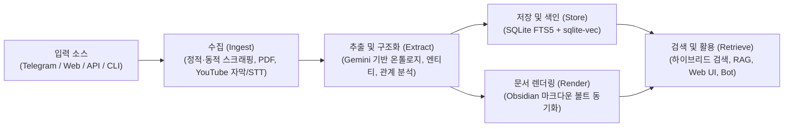

# Claire Bible

> **Telegram & Web Ingestion 기반 개인 지식 베이스 및 온톨로지 지식 그래프 엔진**

Claire Bible은 웹 페이지, YouTube 영상(자막/STT), PDF, 일반 텍스트 등 일상의 다양한 정보 소스를 수집하여 구조화된 지식으로 정제해 주는 개인 지식 관리 시스템(PKM)입니다.  
Gemini LLM을 통해 핵심 내용과 엔티티 및 관계(Palantir 스타일 온톨로지)를 자동으로 추출하며, SQLite(FTS5 + 벡터)와 로컬 Obsidian 마크다운 볼트(Vault)로 이중 영속화하여 강력한 검색과 시각적 탐색을 제공합니다.

---

## 🚀 핵심 파이프라인


```mermaid
flowchart LR
    A["입력 소스\n(Telegram / Web / API / CLI)"] --> B["수집 (Ingest)\n(정적·동적 스크래핑, PDF, YouTube 자막/STT)"]
    B --> C["추출 및 구조화 (Extract)\n(Gemini 기반 온톨로지, 엔티티, 관계 분석)"]
    C --> D["저장 및 색인 (Store)\n(SQLite FTS5 + sqlite-vec)"]
    C --> E["문서 렌더링 (Render)\n(Obsidian 마크다운 볼트 동기화)"]
    D --> F["검색 및 활용 (Retrieve)\n(하이브리드 검색, RAG, Web UI, Bot)"]
    E --> F
```

1. **Ingest (수집)**: 텔레그램 메시지, 브라우저 확장/API, CLI를 통해 URL이나 텍스트를 인박스(Inbox)로 전달합니다.
2. **Extract (구조화 추출)**: Gemini 모델을 호출하여 상세 요약, 메타데이터, 온톨로지 엔티티 및 상호 관계를 정형화합니다.
3. **Store & Render (저장 및 렌더링)**: SQLite 데이터베이스에 FTS5 텍스트 색인과 벡터 임베딩을 저장하고, 로컬 Obsidian 볼트에 사람이 읽기 쉬운 마크다운 문서로 기록합니다.
4. **Retrieve & Interface (활용)**: 하이브리드 검색(키워드 + 시맨틱)을 지원하며, 텔레그램 봇 대화 및 자체 웹 인터페이스를 통해 조회·탐색할 수 있습니다.

---

## ✨ 주요 기능

- **다채로운 소스 파싱**: 정적 웹 문서, 동적 JS 렌더링 페이지, YouTube 영상 자막(및 대체 음성 STT), PDF 파일 지원.
- **온톨로지 지식 그래프**: 단순 문서 저장을 넘어 엔티티 간 연결 관계(Entity-Relation Graph)를 추출하여 축적.
- **하이브리드 검색 (Hybrid Search)**: SQLite FTS5 전문 검색(BM25)과 `sqlite-vec` 기반 벡터 임베딩 유사도 검색 결합.
- **Obsidian 호환 볼트**: 생성된 모든 문서는 프런트매터와 위키링크(`[[Entity]]`)를 포함한 로컬 마크다운 파일로 저장.
- **멀티 인터페이스**: Telegram 롱폴링 봇, FastAPI/Starlette 기반 Web API 및 뷰어, 풍부한 관리용 CLI 제공.

---

## 🚀 시작하기 (Getting Started)

### 1. 개발 빠른 시작 (Local Development)
로컬 가상환경에서 빠르게 의존성을 설정하고 개발 서버를 기동합니다.

```bash
# 1. 의존성 동기화 및 환경 설정 초기화
uv sync
./cb-manuscript dev init

# 2. DB 스키마 생성 및 무결성 진단
uv run claire migrate
uv run claire audit --json

# 3. 개발 서버 또는 봇 실행
uv run claire serve-api        # Web API & UI (기본 포트: 8765)
# uv run claire bot            # Telegram 봇 (선택)
```

---

### 2. 프로덕션 시작 - 에이전트 명령 (Production Launch - Agent)
AI 코딩 에이전트(Antigravity, Claude Code, Cursor, CI/CD 러너)가 대화형 프롬프트 없이 무인으로 프로덕션을 빌드·배포·검증하고 관리자 링크를 발급하는 표준 파이프라인입니다.

```bash
# Step 1. 인프라 및 환경 사전 점검 (종료 코드 0 확인)
./cb-manuscript preflight

# Step 2. 무중단 빌드, DB 마이그레이션 및 서비스 기동
./cb-manuscript install

# Step 3. 시스템 및 지식그래프 무결성 전수 감사 (clean: true 확인)
./cb-manuscript app audit --check all --json

# Step 4. 최종 서비스 헬스체크 (status: success 확인)
./cb-manuscript app health --json

# Step 5. 소유자(Owner) Web UI 1회용 매직 로그인 링크 획득
./cb-manuscript app auth --scope owner --json
```

---

### 3. 프로덕션 시작 - 직접 (Production Launch - Manual)
시스템 운영자가 호스트 셸에서 직접 프로덕션 서비스를 배포하고 관리하는 절차입니다.

```bash
# 1. 환경 설정 초기화 (소유자 토큰 자동 생성 및 파일 권한 0600 부여)
./cb-manuscript init

# 2. 도커 및 설정 사전 점검
./cb-manuscript preflight

# 3. 배포 파이프라인 실행 (빌드 → DB 마이그레이션 → 컨테이너 기동 → 헬스체크)
./cb-manuscript install

# 4. 웹 UI 1회용 로그인 링크 발급
./cb-manuscript app auth --scope owner

# [운영 및 유지보수]
./cb-manuscript status             # 컨테이너 구동 현황 확인
./cb-manuscript logs -f api        # 실시간 서비스 로그 모니터링
./cb-manuscript app audit --heal   # 지식그래프 결함 점검 및 자동 수복
./cb-manuscript update             # 최신 소스코드 무중단 롤링 업데이트
```

---

## 📋 주요 CLI 명령어 안내

`claire` CLI는 지식 베이스의 운영과 유지보수를 위한 다양한 서브커맨드를 제공합니다:

| 명령어 | 설명 |
| :--- | :--- |
| `claire audit` | **[통합 감사]** 지식그래프 무결성, 오염 잔재, 툼스톤 위반 전수 점검 및 자동 수복 (`--heal`) |
| `claire reprocess` | **[통합 재처리]** 요약, 상세, 그래프, 포맷 등 파생 데이터 일괄 갱신 엔진 |
| `claire auth` | Web UI 1회용 로그인 매직 링크 및 세션 토큰 즉시 발급 (`--scope owner/readonly`) |
| `claire doc` | 문서 상태 플래그(상단 고정 `--pin`, 숨김 `--hide`, 읽음 `--seen`) 수동 제어 |
| `claire share` | 특정 문서의 외부 공개용 익명 공유 링크(`/p?s=token`) 발급 |
| `claire health` | DB, 인박스, 큐 상태를 에이전트 친화적 JSON 형태로 진단 |
| `claire ingest` | 단일 웹 페이지, 영상(자막/STT), PDF 또는 텍스트 즉시 수집 및 구조화 |
| `claire search` | 하이브리드 검색 (BM25 전문 색인 + 벡터 시맨틱 유사도 + LLM 요약) |

전체 옵션 및 파라미터는 `uv run claire --help` 및 [docs/origin/implementation/COMMANDS.md](file:///home/fow/Projects/claire-bible/docs/origin/implementation/COMMANDS.md)를 참조하십시오.

---

## 📂 프로젝트 구조

```
claire-bible/
├── src/claire/
│   ├── api/             # ASGI 웹 서비스 및 엔드포인트
│   ├── extract/         # Gemini 기반 구조화·온톨로지 추출 로직
│   ├── ingest/          # 스크래퍼 및 콘텐츠 페처 (웹, 영상, PDF)
│   ├── ontology/        # 온톨로지 스키마 및 그래프 정의
│   ├── render/          # Obsidian 마크다운 및 HTML 렌더러
│   ├── retrieval/       # FTS5 + sqlite-vec 하이브리드 검색 엔진
│   ├── store/           # SQLite 저장소 및 트랜잭션 관리
│   ├── cli.py           # 통합 CLI 진입점
│   └── telegram_bot.py  # 텔레그램 봇 인터페이스
├── data/                # SQLite DB 및 런타임 저장소
├── vault/               # 동기화되는 Obsidian 마크다운 볼트
├── pyproject.toml       # 패키지 명세 및 의존성
└── docker-compose.yml   # 프로덕션/컨테이너 구동 설정
```

---

## 📄 라이선스

이 프로젝트는 [LICENSE.md](file:///home/fow/Projects/claire-bible/LICENSE.md)에 명시된 라이선스 조건을 따릅니다.
