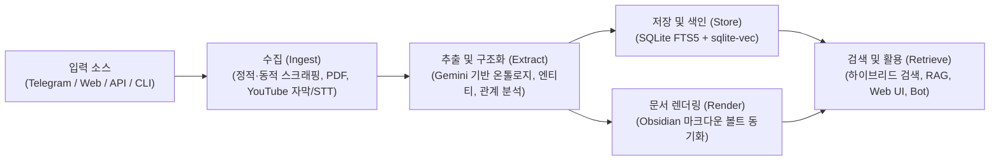

# Claire Bible

> **Telegram & Web Ingestion 기반 개인 지식 베이스 및 온톨로지 지식 그래프 엔진**

Claire Bible은 웹 페이지, YouTube 영상(자막/STT), PDF, 일반 텍스트 등 일상의 다양한 정보 소스를 수집하여 구조화된 지식으로 정제해 주는 개인 지식 관리 시스템(PKM)입니다.  
Gemini LLM을 통해 핵심 내용과 엔티티 및 관계(Palantir 스타일 온톨로지)를 자동으로 추출하며, SQLite(FTS5 + 벡터)와 로컬 Obsidian 마크다운 볼트(Vault)로 이중 영속화하여 강력한 검색과 시각적 탐색을 제공합니다.

---

## 🚀 핵심 파이프라인


```mermaid
flowchart LR
    A["입력 소스\n(Telegram / Web / API / CLI)"] --> B["수집 (Ingest)\n(정적·동적 스크래핑, PDF, YouTube 자막/STT)"]
    B --> C["추출 및 구조화 (Extract)\n(Gemini 기반 온톨로지, 엔티티, 관계 분석)"]
    C --> D["저장 및 색인 (Store)\n(SQLite FTS5 + sqlite-vec)"]
    C --> E["문서 렌더링 (Render)\n(Obsidian 마크다운 볼트 동기화)"]
    D --> F["검색 및 활용 (Retrieve)\n(하이브리드 검색, RAG, Web UI, Bot)"]
    E --> F
```

1. **Ingest (수집)**: 텔레그램 메시지, 브라우저 확장/API, CLI를 통해 URL이나 텍스트를 인박스(Inbox)로 전달합니다.
2. **Extract (구조화 추출)**: Gemini 모델을 호출하여 상세 요약, 메타데이터, 온톨로지 엔티티 및 상호 관계를 정형화합니다.
3. **Store & Render (저장 및 렌더링)**: SQLite 데이터베이스에 FTS5 텍스트 색인과 벡터 임베딩을 저장하고, 로컬 Obsidian 볼트에 사람이 읽기 쉬운 마크다운 문서로 기록합니다.
4. **Retrieve & Interface (활용)**: 하이브리드 검색(키워드 + 시맨틱)을 지원하며, 텔레그램 봇 대화 및 자체 웹 인터페이스를 통해 조회·탐색할 수 있습니다.

---

## ✨ 주요 기능

- **다채로운 소스 파싱**: 정적 웹 문서, 동적 JS 렌더링 페이지, YouTube 영상 자막(및 대체 음성 STT), PDF 파일 지원.
- **온톨로지 지식 그래프**: 단순 문서 저장을 넘어 엔티티 간 연결 관계(Entity-Relation Graph)를 추출하여 축적.
- **하이브리드 검색 (Hybrid Search)**: SQLite FTS5 전문 검색(BM25)과 `sqlite-vec` 기반 벡터 임베딩 유사도 검색 결합.
- **Obsidian 호환 볼트**: 생성된 모든 문서는 프런트매터와 위키링크(`[[Entity]]`)를 포함한 로컬 마크다운 파일로 저장.
- **멀티 인터페이스**: Telegram 롱폴링 봇, FastAPI/Starlette 기반 Web API 및 뷰어, 풍부한 관리용 CLI 제공.

---

## 🛠️ 빠른 시작 (Quick Start)

### 1. 요구 사항
- Python `>= 3.10`
- [uv](https://github.com/astral-sh/uv) (권장) 또는 Python 가상환경

### 2. 설치 및 환경 설정

```bash
# 저장소 클론 및 이동
git clone https://github.com/fofwisdom/claire-bible.git
cd claire-bible

# uv를 사용한 의존성 설치
uv sync

# 환경 변수 파일 복사 및 설정
cp .env.example .env
```

`.env` 파일에서 최소 필수 설정을 입력합니다:
- `TELEGRAM_BOT_TOKEN`: 텔레그램 봇 토큰 (BotFather 발급)
- `TELEGRAM_ALLOWED_USERS`: 봇 사용을 허용할 Telegram User ID
- `GEMINI_API_KEY`: Google Gemini API 키

### 3. 데이터베이스 초기화 및 진단

```bash
# DB 스키마 생성 및 마이그레이션
uv run claire migrate

# 설정 및 환경 진단
uv run claire preflight
uv run claire doctor
```

---

## 💻 실행 방법

### Telegram 봇 실행
텔레그램 봇을 실행하여 링크나 텍스트를 메시지로 전달받습니다.
```bash
uv run claire bot
```

### Web API & UI 서빙
웹 대시보드 및 REST API를 구동합니다 (기본 포트: 8765).
```bash
uv run claire serve-api
```

### CLI 직접 수집 및 검색
```bash
# 단일 URL 수집 및 처리
uv run claire ingest "https://example.com/article"

# 지식 베이스 검색 (하이브리드 검색 + LLM 요약)
uv run claire search "검색할 질문이나 키워드"
```

### Docker Compose 환경
백그라운드 서비스(Bot, API, 백그라운드 워커)를 컨테이너로 통합 구동할 수 있습니다.
```bash
docker compose up -d
```

---

## 📋 주요 CLI 명령어 안내

`claire` CLI는 지식 베이스의 운영과 유지보수를 위한 다양한 서브커맨드를 제공합니다:

| 명령어 | 설명 |
| :--- | :--- |
| `claire status` | 시스템 현황, 큐 상태, DB 레코드 요약 출력 |
| `claire health` | DB, 인박스, 큐 상태를 JSON 형태로 진단 |
| `claire doctor` | 지식 그래프 및 DB 무결성 검사 및 자동 복구 |
| `claire queue` | 인박스, 리프레시, 확장 큐 모니터링 |
| `claire dedup-scan` | MinHash 기반 유사/중복 문서 탐색 |
| `claire re-embed` | 전체 엔티티/문서 벡터 임베딩 재연산 |
| `claire link-relations` | 기존 축적 문서 간 교차 관계 재분석 및 연결 |

전체 옵션은 `uv run claire --help`를 통해 확인할 수 있습니다.

---

## 📂 프로젝트 구조

```
claire-bible/
├── src/claire/
│   ├── api/             # ASGI 웹 서비스 및 엔드포인트
│   ├── extract/         # Gemini 기반 구조화·온톨로지 추출 로직
│   ├── ingest/          # 스크래퍼 및 콘텐츠 페처 (웹, 영상, PDF)
│   ├── ontology/        # 온톨로지 스키마 및 그래프 정의
│   ├── render/          # Obsidian 마크다운 및 HTML 렌더러
│   ├── retrieval/       # FTS5 + sqlite-vec 하이브리드 검색 엔진
│   ├── store/           # SQLite 저장소 및 트랜잭션 관리
│   ├── cli.py           # 통합 CLI 진입점
│   └── telegram_bot.py  # 텔레그램 봇 인터페이스
├── data/                # SQLite DB 및 런타임 저장소
├── vault/               # 동기화되는 Obsidian 마크다운 볼트
├── pyproject.toml       # 패키지 명세 및 의존성
└── docker-compose.yml   # 프로덕션/컨테이너 구동 설정
```

---

## 📄 라이선스

이 프로젝트는 [LICENSE.md](file:///home/fow/Projects/claire-bible/LICENSE.md)에 명시된 라이선스 조건을 따릅니다.
