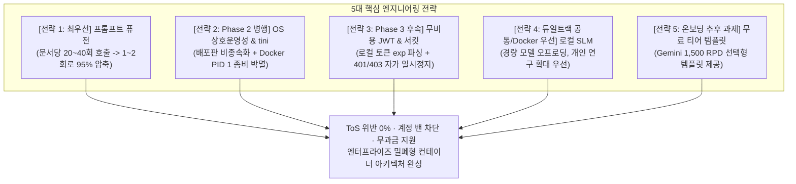
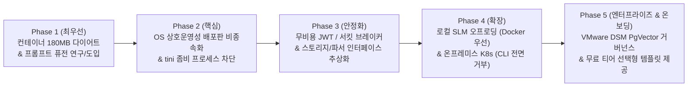

# [종합 확정 마스터 로드맵] 클레어바이블(Claire-Bible) ToS 준수 듀얼 트랙 아키텍처 및 단계별 실행 전략

**문서 번호:** PLAN-ARCH-20260905-07 (Rev.7 / Master Synthesis)  
**작성 주체:** 플래너 서브에이전트 (운영·컨테이너·프로바이더 분석 및 감사관 전 시점 결론 종합)  
**기반 데이터:** 프로덕션 서버 실사, 프로바이더 ToS 분석 리포트, 레드팀 감사 보고서

---

## 1. 듀얼 트랙의 방향성 및 하이퍼스케일러 이용약관(ToS) 준수 선언

클레어바이블은 하이퍼스케일러(OpenAI, Google 등)의 **이용약관(ToS)과 레이트 리밋(RPM/TPM)을 엄격히 준수**하고, 개발자 계정의 영구 정지(Account Ban) 및 비인가 자동화 스크래퍼 오남용을 원천 차단하는 방어적 아키텍처를 지향합니다. 이를 위해 시스템의 목적과 운영 범위를 명확히 규정하는 **듀얼 트랙(Dual-Track)** 체계를 공식 선언합니다.

```
[클레어바이블 ToS 준수 듀얼 트랙 체계]

Track 1: 개인 연구 및 개발 주도 트랙 (Lightweight Docker Track)
 ├─ 목적: 개인 개발자가 지식 정의와 수집 과정을 연구·주도하기 위한 '시험적 일부 자동화' 환경
 ├─ 특성: ~180MB 초경량 코어, SQLite 단일 정본, 로컬-퍼스트, Zero-Config, pypdf
 └─ ToS 방어: 24/7 상시 무인 남용 차단, 프롬프트 퓨전(호출 95% 압축), 로컬 SLM 우선 구현

Track 2: 조직 관점의 지식베이스 연구 트랙 (On-Premises K8s Track)
 ├─ 목적: 엔터프라이즈 및 조직 관점에서의 대규모 지식베이스 아키텍처와 거버넌스를 연구하기 위한 환경
 ├─ 특성: VMware DSM PostgreSQL + pgvector 동시성 백본, K8s Pod 스케일아웃, 독립 Docling 방화벽
 └─ CLI 전면 거부 정책: Antigravity CLI 및 Codex CLI 사용 요청을 '원천 거부(Strictly Denied)'
     └─ 대안: 공식 종량제 API, OpenAI-compatible 엔터프라이즈 엔드포인트, 사내 vLLM/Ollama 직접 연결
```

### 1.1 Track 1: 개인 연구 및 개발 주도 트랙 (Docker / Compose)
* **정체성**: 개인 개발자가 지식 정의와 온톨로지 수집 파이프라인을 스스로 연구하고 주도하기 위한 **"시험적 일부 자동화(Experimental Partial Automation)"** 환경입니다.
* **ToS 준수 원칙**:
  * 개발자 CLI 도구(`agy`, `codex`)를 24/7 무인 배치 스크래퍼로 상시 방치하는 것을 정책적으로 금지합니다.
  * 단건 온디맨드 수집 시에도 **프롬프트 퓨전(Prompt Fusion)**을 강제하여 Burst 호출을 차단하고 계정을 안전하게 보호합니다.

### 1.2 Track 2: 조직 관점의 지식베이스 연구 트랙 (On-Premises Kubernetes)
* **정체성**: 다중 사용자 및 조직 관점에서 지식베이스의 영속성, ACID 동시성, 고가용성 거버넌스 아키텍처를 심층 연구하기 위한 환경입니다.
* **CLI 전면 거부 및 대체 연결 정책 (Strict CLI Rejection & Alternative Binding)**:
  * 온프레미스 K8s 환경에서는 **Antigravity CLI(`agy`) 및 Codex CLI(`codex`)의 사용 요청을 완전히 거부(Strictly Rejected)**합니다. 개발자 개인 CLI 도구를 엔터프라이즈 K8s Pod에 바인딩하는 것은 보안 및 라이선스 위반 안티패턴이기 때문입니다.
  * **대체 수단 제공**: 사내 엔터프라이즈 게이트웨이, 공식 Google GenAI API, OpenAI API 호환 엔드포인트, 또는 K8s 클러스터 내부의 vLLM/Ollama 서비스로 직접 연결할 수 있는 **엔터프라이즈 대체 연결 구성(Enterprise Alternative Configuration)**을 기본 제공합니다.

---

## 2. 5대 핵심 엔지니어링 전략 및 우선순위



### 2.1 [전략 1] 프롬프트 퓨전 (Prompt Fusion) — *[최우선 과제 (Top Priority)]*
* **배경**: 단 1건의 문서 인제스트에도 `classify_paper`, `extract`, `render_detail`, `classify_watch`, `resolve_or_create`로 인해 **20~40회의 기계적 폭포 호출(Call Amplification)**이 1분 사이에 발생하여 계정 밴의 주원인이 됨.
* **실행 사양**:
  1. 판별·추출·상세렌더링을 1회의 **멀티태스크 구조화 JSON 프롬프트**로 통합.
  2. 엔티티 10개에 대해 30회 개별 호출하던 `resolve_or_create` 루프를 **1회의 배치 매칭(Batch Resolution)**으로 압축.
* **목표**: **문서 1건당 호출 횟수를 20~40회에서 1~2회로 95% 감축**. 하이퍼스케일러 봇 탐지를 원천 회피하며 속도를 10배 이상 향상.

### 2.2 [전략 2] 리눅스 OS 상호운영성 개편 및 좀비 프로세스 차단 — *[Phase 2 병행 과제]*
* **배경**: 호스트 OS(Debian) 종속성(CA 마운트, 타임존)과 Docker PID 1 환경에서 CLI 도구의 고아 손자 프로세스가 `<defunct>` 좀비로 누적되어 컨테이너가 침몰하는 결함.
* **실행 사양 (동시 추진)**:
  1. **좀비 프로세스 차단**: `Dockerfile`에 리눅스 표준 init 프로세스인 `tini` 탑재 (`ENTRYPOINT ["/usr/bin/tini", "--"]`). 커널 레벨에서 고아/손자 프로세스 자동 `waitpid` 수거.
  2. **Self-Contained CA & 사설 CA 합성 (ACT-1)**: 호스트 CA 마운트 폐기, 컨테이너 내 Mozilla 번들과 `/app/certs/custom/` 사설 CA를 동적 합성하는 파이프라인 구축.
  3. **비루트 전환 및 소유권 마이그레이션 (ACT-2 & 3)**: 비루트 `claire (10001)` 적용, `cb-manuscript update`에 소유권 마이그레이션 훅 추가, Rootless Podman `keep-id` 지원.
  4. **SELinux `:z` 레이블 및 타임존 `TZ` 표준화 (ACT-5)**: 볼륨 마운트 소문자 `:z` 플래그 적용, `/etc/localtime` 마운트 폐기 및 `TZ` 환경변수 일원화.

### 2.3 [전략 3] 무비용 로컬 JWT 검사 및 리액티브 서킷 브레이커 — *[OS 개편 후속 과제 (Phase 3)]*
* **배경**: 데몬 루프 주기마다 프로세스를 띄우는 능동 프로빙은 그 자체로 쿼터를 소모하는 DoS가 됨.
* **실행 사양**:
  1. OS 상호운영성 개편(Phase 2) 완료 후 Phase 3 단계에서 추진.
  2. 바이너리 실행 없이 호스트에 저장된 토큰 캐시(`~/.gemini/token.json` 등)의 `exp` 타임스탬프를 순수 파이썬 JSON 파싱으로 0.1ms 만에 무비용 검사.
  3. 실제 401/403 수신 시에만 리액티브 서킷 브레이커를 Open하여 데몬 루프를 일시 정지하고 텔레그램 1회 알림 발송.

### 2.4 [전략 4] 경량 로컬 SLM 하이브리드 오프로딩 — *[듀얼 트랙 공통, Docker 구현 우선]*
* **배경**: 사용자의 비용 부담을 원천 차단하고 ToS 리스크를 우회하기 위한 하이브리드 전략.
* **실행 사양**:
  1. 단순 분류(`classify_paper`, `classify_watch`) 및 엔티티 중복 판정은 로컬 경량 모델(Qwen 2.5 7B, Gemma 2 9B 등 Ollama/vLLM)로 오프로딩.
  2. 듀얼 트랙(Docker 및 K8s) 모두에 제공하되, **개인 개발자의 연구 수준 확대를 최우선으로 지원하기 위해 Docker 구현을 우선(Docker Priority)**하여 배포.

### 2.5 [전략 5] 무료 티어 활용 템플릿 선택형 제공 — *[온보딩 추후 개선 과제]*
* **배경**: Google AI Studio는 Gemini 2.0 Flash에 대해 **일일 1,500회(1,500 RPD) / 분당 15회(15 RPM)의 완전 무료 티어(Free of Charge)**를 공식 제공함. 개인 지식 베이스의 일일 사용량을 100% 충당 가능.
* **실행 사양**:
  * 새로 유입된 온보딩 개발자가 복잡한 설정이나 비용 고민 없이 즉시 도입할 수 있도록, `.env.example` 및 배포 스크립트에 **원클릭 템플릿 선택형 옵션(`CB_PROFILE=free-tier`)**으로 제공하는 작업을 **추후 개선 과제**로 확정.

---

## 3. 종합 단계별 실행 마일스톤 (Phase 1 ~ Phase 5)



| 마일스톤 | 과제명 | 핵심 엔지니어링 내용 | 성격 및 우선순위 |
| :--- | :--- | :--- | :---: |
| **Phase 1** | **컨테이너 다이어트 및 프롬프트 퓨전** | - `scrapling/playwright` 사이드카 분리로 메인 이미지 **디스크 ~180MB, 압축 ~70MB** 달성<br/>- **[최우선] 프롬프트 퓨전 파이프라인 연구/도입 (문서당 호출 수 20~40회 ➔ 1~2회로 95% 압축)** | **최우선 (즉시)** |
| **Phase 2** | **OS 상호운영성 개편 및 좀비 차단 병행** | - **[tini 탑재]** Docker PID 1 init 프로세스 탑재로 고아/손자 좀비 프로세스 영구 소멸<br/>- **[ACT-1]** 사설 CA 자동 합성 파이프라인 및 Self-Contained Mozilla 번들 구축<br/>- **[ACT-2 & 3]** 비루트(claire:10001) 전환, 사전 마이그레이션 훅, Rootless Podman keep-id 지원<br/>- **[ACT-5]** SELinux 소문자 `:z` 플래그 및 `/home/claire/.gemini:z` 경로 격리<br/>- `/etc/localtime` 폐기 및 `TZ` 환경변수 표준화 | **높음 (핵심 인프라)** |
| **Phase 3** | **무비용 JWT 점검 및 인터페이스 추상화** | - **[OS 개편 후속]** 토큰 캐시 `exp` 타임스탬프 무비용(0.1ms) 검사 및 리액티브 서킷 브레이커 도입<br/>- `StorageBackend` Protocol (SQLite vs DSM PostgreSQL)<br/>- `PdfParser` Protocol (`docs/PDF_PARSER_AND_VISION_GUARDRAILS_DESIGN.md` 준수) | **중간 (안정화)** |
| **Phase 4** | **로컬 SLM 오프로딩 및 온프레미스 K8s** | - **[Docker 우선]** 경량 로컬 SLM(Ollama/vLLM) 하이브리드 오프로딩 구현 (듀얼 트랙 지원)<br/>- **[K8s CLI 전면 거부]** Antigravity/Codex CLI 사용 요청 차단 및 대체 엔터프라이즈 연결 제공<br/>- 온프레미스 Helm 차트 패키징 및 폐쇄망 전용 `docling-serve` 독립 워커 분리 배포 | **중간 (확장)** |
| **Phase 5** | **엔터프라이즈 백본 및 온보딩 템플릿** | - VMware DSM PgVector 연동을 통한 온프레미스 다중 Pod ACID 동시성 및 거버넌스 확립<br/>- **[추후 개선]** Google AI Studio 무료 티어(1,500 RPD) 즉시 도입을 위한 선택형 온보딩 템플릿 제공 | **추후 과제 (완성)** |

---

## 4. 최종 결론

1. **지식 무결성과 인프라의 완전한 분리**:
   - PDF 파서 및 시각 오염 3대 가드레일(마진 크롭, Pillow 수직 직렬 합성, 역할 분리 프롬프트)은 [docs/PDF_PARSER_AND_VISION_GUARDRAILS_DESIGN.md](PDF_PARSER_AND_VISION_GUARDRAILS_DESIGN.md)로 분리되어 안전하게 관리됩니다.
2. **법적/기술적 지속 가능성 확보**:
   - 하이퍼스케일러의 ToS를 준수하기 위해 **개인 트랙의 프롬프트 퓨전(호출 95% 압축)**과 **K8s 트랙의 CLI 전면 거부 및 대체 연결 정책**을 엄격히 수립하였습니다.
3. **완벽한 OS 상호운영성 및 무과금 연구 지원**:
   - `tini` 탑재와 OS 상호운영성 개편(Phase 2)을 통해 어떤 리눅스(Ubuntu, RHEL, Alpine, Photon OS)에서도 즉시 구동되는 180MB 밀폐형 컨테이너를 완성하며, 로컬 SLM(Docker 우선)과 Gemini 무료 티어(1,500 RPD)를 결합하여 개발자의 연구 비용 부담을 영(0)으로 만듭니다.
