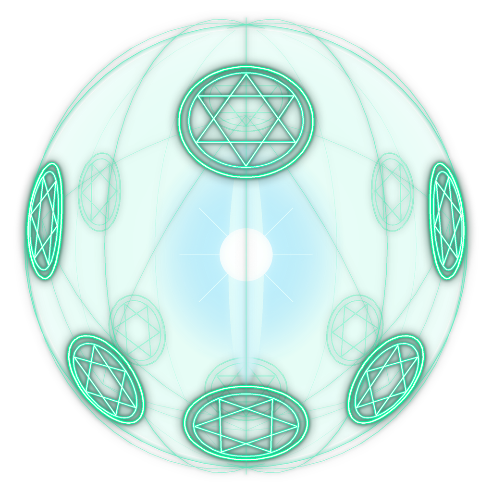

# 파비콘

### 시각 효과 디테일
- **3D 구체 기하학**: 구면상에 배치된 육망성(Hexagram) 이중 링 마법진 및 구체 경위도/측지선 에너지 격자
- **네온 발광 레이어 (Multi-pass Bloom)**:
  - 내부 에메랄드 반투명 볼륨 글로우
  - 선명한 화이트-민트 코어 라인 + 네온 에메랄드 빛 번짐
  - 중앙의 밝은 청백색 코어 광원 및 세로형 광선 스파크
- **반투명 알파 채널**: 배경이 완전 투명(RGBA Alpha)으로 처리되어 다크 모드 및 라이트 모드 웹 브라우저 탭, 모바일 홈 화면 등 어디서나 매끄럽게 어우러집니다.
