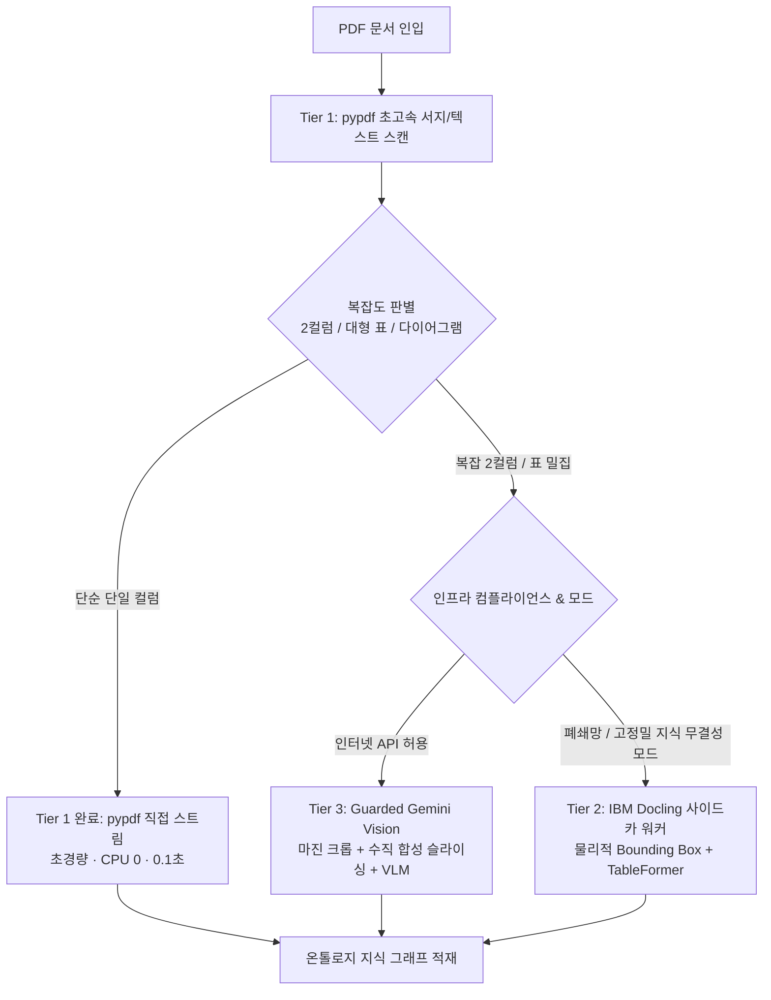
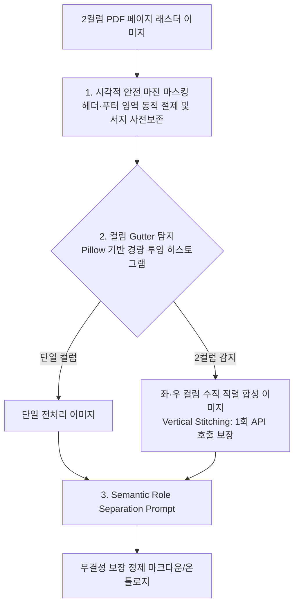

# PDF Ingestion, Multi-Tier Parsers & Visual Pollution Control Design

> **문서 상태**: 설계 및 구현 규격 (Specification) — *감사 및 레드팀 감수 반영 완료*  
> **관련 문서**: [PDF_INGESTION_AND_ADAPTIVE_EFFORT_DESIGN.md](origin/design/PDF_INGESTION_AND_ADAPTIVE_EFFORT_DESIGN.md), [INGESTION_INTEGRITY_AND_POLLUTION_CONTROL_RESEARCH.md](origin/design/INGESTION_INTEGRITY_AND_POLLUTION_CONTROL_RESEARCH.md)

---

## 1. 개요 및 설계 목적

본 문서는 클레어바이블(Claire-Bible) 파이프라인에서 학술 논문(2컬럼 조판), 정부/기업 보고서, 기술 사양서 등 복잡한 PDF 문서를 처리할 때 발생하는 **구조적 결함(라인 인터리빙, 표 붕괴)** 및 **시각 오염(Visual Contamination: 워터마크, 헤더/푸터, 차트 눈금 난립에 따른 온톨로지 독화)**을 방지하기 위한 다계층(Tier 1~3) 파서 아키텍처와 가드레일 구현 규격을 정의합니다.

기존 인프라 컨테이너 로드맵에서 기능적 구현 상세를 본 전용 문서로 완전히 분리하여 독립적인 기능 라이프사이클을 가집니다.

---

## 2. 3단계 계층형 트라이아지(Triage) 파이프라인

문서의 시각적 복잡도, 데이터 민감도, 인프라 컴플라이언스(인터넷 API 허용 여부)에 따라 3단계로 자동 라우팅합니다.



### 2.1 Tier 1: Lightweight Stream (`pypdf`)
* **역할**: 디지털 텍스트 레이어가 깨끗한 일반 단일 컬럼 문서, 도서, 안내문 처리.
* **특징**:
  * 파싱 시간: 0.1~0.5초.
  * 자원 소모: RAM < 50MB, CPU 점유율 미미, 컨테이너 크기 기여 0MB.
* **한계**: 2컬럼 논문에서 좌우 컬럼의 동일 행 텍스트가 줄단위로 교차 결합되는 라인 인터리빙(Line Interleaving) 발생.

### 2.2 Tier 2: Structural Knowledge Firewall (`docling-worker`)
* **역할**: 온프레미스 폐쇄망 환경 및 "시각 오염 제로"를 요구하는 전문 학술/특허 문서의 결정론적 구조화.
* **특징**:
  * 객체 분할(LayoutLMv3)을 통해 본문, 표, 그림, 수식의 Bounding Box를 물리적으로 분리.
  * TableFormer 엔진으로 셀 병합/복합 헤더 표를 마크다운/HTML 테이블로 정밀 복원.
  * 헤더/푸터/워터마크를 클래스 태그 단위로 원천 배제하여 **온톨로지 독화 차단**.
* **배포 형태**: 메인 이미지에 포함하지 않고, 독립 사이드카 또는 K8s 전용 워커(`docling-serve`)로 분리 배포.

### 2.3 Tier 3: Guarded Multimodal (`gemini-vision`)
* **역할**: 인터넷 API가 허용된 환경에서 로컬 GPU/CPU 부하 없이 클라우드 멀티모달 VLM을 통해 고난도 시각 문서 해석.
* **특징**: E2E VLM의 시각적 노이즈 유입 문제를 해결하기 위해 후술할 **3대 안전 가드레일**을 필수로 통과.

---

## 3. 시각(視覺) 오염 방지 3대 가드레일 (Safety Guardrails)

순수 Vision LLM에 PDF 이미지를 무방비로 투입할 경우, 배경 워터마크(arXiv, IEEE, CONFIDENTIAL)와 러닝 헤더/푸터가 본문에 스며들거나, 차트 축 눈금(`0.01`, `0.05`)이 독립 엔티티로 오추출되는 **'온톨로지 독화(Ontology Poisoning)'**가 발생합니다. 이를 차단하기 위해 3대 가드레일을 적용합니다.



### 3.1 가드레일 1: 시각적 안전 마진 마스킹 (Safe Visual Margin Masking)
* **기제**:
  * 일괄적 8% 절단으로 인한 콤팩트 문서 제목/초록 유실(Amputation)을 방지하기 위해, **상단 서지 영역 선행 스캔 후 동적 안전 마진(Dynamic Safe Margin)** 적용.
  * 러닝 헤더/저널명 영역 및 하단 페이지 번호/저작권/DOI 영역을 물리적으로 화이트아웃(White-out) 또는 Bounding Box 절제.
* **차단 효과**: 페이지 번호, 저널명, 볼륨 정보가 본문 문장 중간에 토큰으로 유입되는 현상 기하학적 차단.

### 3.2 가드레일 2: Pillow 기반 초경량 Gutter 탐지 및 수직 합성 (Vertical Stitching)
* **초경량 의존성 보장 (OpenCV/PyMuPDF 배제)**:
  * 컨테이너 180MB 다이어트 목표를 훼손하지 않기 위해 무거운 `opencv-python-headless`(50MB+)나 `fitz`를 일체 쓰지 않고, 이미 설치된 **`Pillow (PIL)`와 순수 Python 픽셀 바이트 연산**만으로 중앙 수직 투영 히스토그램(Vertical Projection Histogram)을 계산.
* **수직 직렬 합성(Vertical Stitching)을 통한 API 비용 최적화**:
  * 2컬럼 이미지를 2개의 별도 이미지로 분할 호출하면 API 호출 수와 과금이 2배(30페이지 = 60회)로 폭증하여 Rate Limit 위험 발생.
  * 대신 **좌측 컬럼 이미지 바로 아래에 우측 컬럼 이미지를 수직으로 이어붙인(Vertical Stitching) 단일 1컬럼 합성 이미지**를 생성하여 Gemini Vision에 1회 호출로 주입.
  * **차단 효과**: 시각적 읽기 순서 붕괴(Reading Order Collapse)를 완벽히 차단하면서도 **API 호출 수와 비용을 정확히 50% 절감**.

### 3.3 가드레일 3: 의미적 역할 분리 네거티브 프롬프트 (Semantic Role Separation)
* **기제**: Gemini 프롬프트에 엄격한 배제 조건(Negative Constraints) 부여:
```text
[STRICT EXTRACTION CONSTRAINTS]
1. DO NOT extract running headers, footers, page numbers, or publication metadata into the body.
2. DO NOT transcribe background watermarks (e.g., 'arXiv', 'IEEE', 'DRAFT', 'CONFIDENTIAL').
3. For Charts, Graphs, and Diagrams: Extract ONLY the high-level semantic summary and caption. DO NOT parse individual axis tick labels, numbers, or fragmented legend abbreviations into standalone entities.
4. Mathematical Formulas: Transcribe into standard LaTeX syntax ($...$ or $$...$$). Do not break operators across lines.
```

---

## 4. 코드베이스 인터페이스 규격 (`src/claire/ingest/fetchers/pdf.py`)

```python
from typing import Protocol, BinaryIO, Any
from dataclasses import dataclass

@dataclass
class PdfExtractResult:
    title: str | None
    text: str
    links: list[str]
    anchors: dict[str, str]
    error: str | None
    images: list[Any]
    biblio: dict[str, Any]
    parser_used: str  # "pypdf" | "docling" | "gemini_vision"
    parser_fallback: bool = False

class PdfParser(Protocol):
    def extract(self, stream: BinaryIO, url: str | None = None) -> PdfExtractResult: ...

class LocalPypdfParser:
    """Tier 1: 초경량 로컬 pypdf 파서."""
    def extract(self, stream: BinaryIO, url: str | None = None) -> PdfExtractResult: ...

class RemoteDoclingParser:
    """Tier 2: 독립 사이드카 docling-serve 연동 클라이언트."""
    def __init__(self, endpoint_url: str):
        self.endpoint = endpoint_url
    def extract(self, stream: BinaryIO, url: str | None = None) -> PdfExtractResult: ...

class GuardedGeminiVisionParser:
    """Tier 3: 3대 가드레일(Pillow 수직합성 슬라이싱, 안전 마진 크롭, 프롬프트 가드) 내장 멀티모달 파서."""
    def __init__(self, client, model: str = "gemini-2.0-flash"):
        self.client = client
        self.model = model
    def extract(self, stream: BinaryIO, url: str | None = None) -> PdfExtractResult: ...
```
