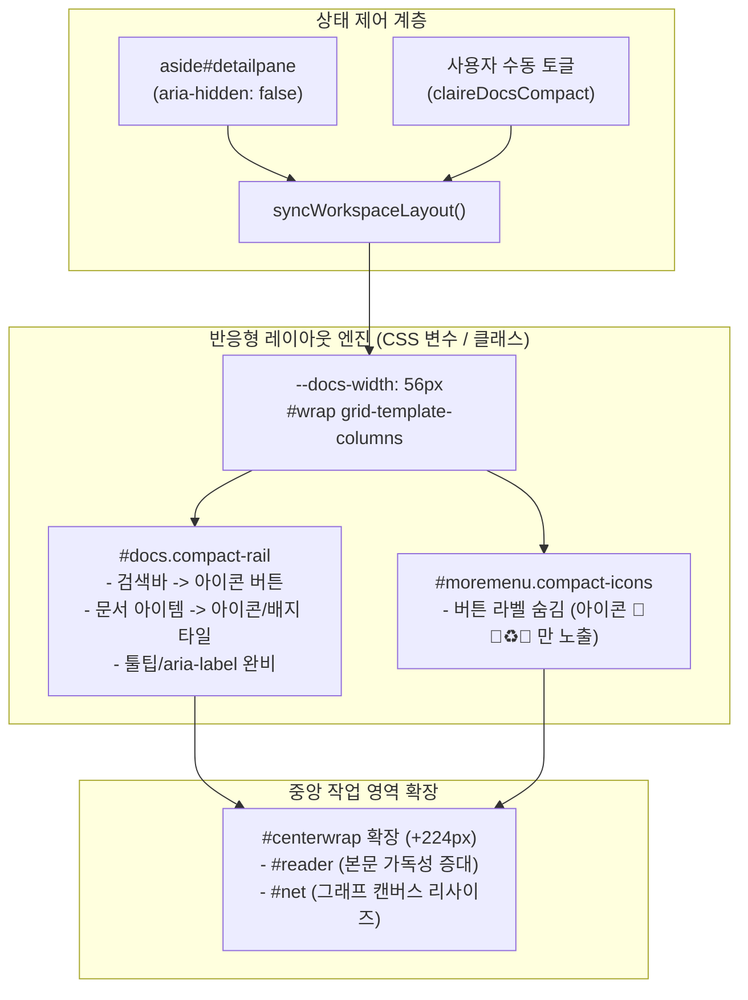

# aside#detailpane 활성화 시 메뉴 아이콘 모드(Icon-Only) 전환 설계

작성일: 2026-08-21 · 상태: **구현 및 적용 (Implemented)** · 기준: [GOALS.md](../../GOALS.md) / [PLAN.md](../../PLAN.md)
관련: `src/claire/graphview.py`

---

## 1. 배경 및 문제 정의

- **레이아웃 구조**:
  - 데스크톱(1100px 초과): 3열 그리드 (`#docs` 280px + `#centerwrap` 1fr + `#detailpane` 360px)
  - 중간 폭(720px ~ 1100px): 2열 그리드 (`#docs` 280px + `#centerwrap` 1fr) + `#detailpane` 드로어(오른쪽 슬라이드)
- **문제점**:
  - `aside#detailpane`이 열려 활성화(`aria-hidden="false"`)되면 360px의 화면 너비를 점유하므로, 중앙의 문서 크게 읽기(`div#reader`)나 지식 그래프(`section#netwrap`)의 가로 폭이 좁아져 시각적 몰입도와 가독성이 저하됩니다.
  - 좌측 문서 목록(`aside#docs`, 280px) 및 우측 상단 도구 메뉴(`div#moremenu`)가 텍스트 라벨과 부가 정보를 모두 펼쳐두고 있어 불필요하게 넓은 영역을 점유합니다.
- **목표**:
  - `aside#detailpane`의 `aria-hidden`이 `false`일 때, 메뉴를 아이콘만 노출하는 **컴팩트 레일(Icon-Only Rail, 너비 ~56px)** 형태로 전환할 수 있는 기능을 제공합니다.
  - 이를 통해 **약 224px 이상의 가로 공간을 즉시 회수**하여 중앙 작업 영역의 뷰포트를 극대화합니다.
  - 접근성(A11y), 키보드 내비게이션, 스크린 리더 호환성을 완벽히 유지합니다.

---

## 2. 설계 아키텍처 및 상태 모델

---

## 3. 핵심 설계 명세

### 3.1 레이아웃 및 너비 전환 메커니즘
1. **CSS 변수 기반의 반응형 그리드**:
   - `:root`에 `--docs-width: 280px`, `--docs-compact-width: 56px`, `--detail-width: 360px` 정의.
   - `#wrap`의 그리드 템플릿 컬럼을 `var(--docs-width, 280px) minmax(360px, 1fr) var(--detail-width, 360px)`로 동적화.
2. **트리거 및 상태 동기화**:
   - `aside#detailpane`이 `aria-hidden="false"`가 되거나 사용자가 컴팩트 모드를 활성화하면:
     - `#docs`에 `compact-rail` 클래스 적용 및 너비 56px로 축소.
     - `#moremenu`에 `compact-icons` 클래스 적용.
     - `body`에 `detail-active` 상태 속성 연동.
3. **사용자 수동 제어 (Manual Override)**:
   - 좌측 패널 상단 헤더에 사이드바 접기/펼치기 토글 단추(`docstogglebtn`)를 배치하여, 사용자가 필요에 따라 `Icon-only` ↔ `Full-width`로 수동 전환 가능.
   - 설정 상태는 `localStorage`(`claireDocsCompact`)에 저장 및 복원.

---

### 3.2 컴포넌트별 아이콘 모드 UI 명세

#### A. 좌측 문서 패널 (`aside#docs` → Compact Rail)
- **너비**: 280px → **56px** (부드러운 transition 적용)
- **헤더 영역 (`.dhead`)**:
  - 전체 검색창(`input#docq`)과 줄 수 셀렉터(`select#desclines`)는 기본 숨김 처리되며 컴팩트 토글 버튼 노출.
  - 검색 아이콘 클릭 시 즉시 검색창 포커스 또는 확장.
- **문서 아이템 (`.docitem`)**:
  - 제목·요약 텍스트는 숨김(`display: none`) 처리.
  - 문서 식별자(미열람 배지 ●, 즐겨찾기 별 ⭐, 갱신 추적 🔄, 그래프 액션 📊 등) 중심의 40x40px 정사각형/원형 타일 아이콘으로 렌더링.
  - 마우스 호버 및 포커스 시 브라우저 툴팁(`title`) 또는 `aria-label`로 문서 제목 및 요약 정보 온전히 제공.
  - 클릭 시 기존과 동일하게 문서 열람/그래프 선택 동작 수행.

#### B. 우측 도구 메뉴 (`div#moremenu` → Compact Icon Row)
- **버튼 텍스트 라벨 축소**:
  - `#synthbtn`: `🧩 종합 (0)` → `🧩 (0)`
  - `#addbtn`: `➕ 적재` → `➕`
  - `#dedupbtn`: `♻️ 중복정리` → `♻️`
  - `#pathbtn`: `🔗 경로` → `🔗`
  - `#repolink`: `🐙 GitHub` → `🐙`
- 각 버튼의 텍스트를 ``로 감싸 아이콘 모드 시 레이아웃 폭을 최소화.

---

### 3.3 접근성(A11y) 및 키보드 지원
- **스크린 리더(Screen Reader)**: 아이콘만 표시되더라도 버튼 및 항목의 `aria-label`, `role`, `aria-expanded`는 온전히 유지.
- **키보드 포커스**:
  - `Tab`, `Shift+Tab`, `Arrow Up/Down`을 통한 문서 탐색 동작 유지.
  - `:focus-visible` 시 56px 레일 내부에서 포커스 링이 잘리지 않도록 `outline-offset` 보정.
- **모션 감소(prefers-reduced-motion)**: 너비 전환 시 transition을 비활성화하여 즉시 변경.
