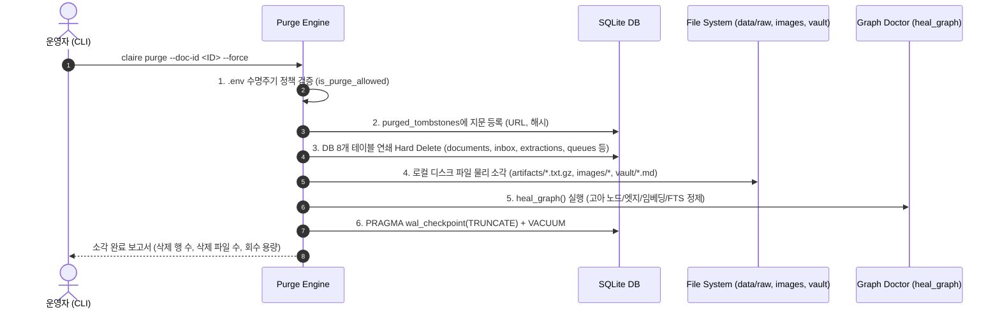

# 데이터 수명주기(Data Lifecycle) 및 오염 소각(Purge) 아키텍처 설계

## 1. 설계 배경 및 변경 사유: 도메인 특성에 따른 지식 수명주기

지식 관리 및 온톨로지 시스템에서 데이터의 수명주기 정책은 다루는 도메인의 본질적 특성에 따라 근본적으로 달라져야 합니다.

```text
[지성사 / 학술 연구 도메인]
  과거 가설 (t0) ──> 반증 및 발전 (t1) ──> 현재 이론 (t2)
  * 시간(Time)이 하나의 유효한 지식 축(Dimension)으로 작동. 과거 데이터 보존 필수.

[엔지니어링 / 기술 문서 / 성경 역본 도메인]
  폐기된 레거시 API/역본 (v1)  ≠  현재 정본 규격 (v2)
  * 버전 편차(Version Divergence)가 치명적 오염(Pollution) 및 환각(Hallucination) 유발.
  * 구버전 잔재 보관 자체가 시스템 신뢰도에 치명적 위험 초래.
```

### A. 지성사·학술 연구 vs 엔지니어링·버전 문서의 본질적 차이
1. **학술 논문 및 지성(사상)의 흐름**:
   - 시간의 흐름 자체가 지식의 유효한 발전 축입니다.
   - 과거의 가설, 논쟁, 반증 과정은 그 자체로 맥락적 가치를 지니며, 폐기된 이론이라도 "역사적 맥락"으로서 보존되어야 합니다.
2. **엔지니어링 명세, 코드베이스, 성경 역본**:
   - 엔지니어링 문서와 특정 정본(Canonicity)이 요구되는 텍스트는 **"현재 유효한 규격/역본과의 일치성"**이 생명입니다.
   - 폐기되거나 오류가 있는 레거시 버전의 본문이 시스템에 적재되어 있으면:
     - LLM이 구버전 API나 잘못된 구절을 사실로 인지하여 온톨로지 추출 및 RAG 질의응답에서 심각한 환각(Hallucination)을 생성합니다.
     - 지식 그래프의 엔티티와 관계(Edge)가 오염되어 전체 지식망의 무결성이 붕괴됩니다.
     - 라이선스/저작권 위반 또는 보안 취약점 문서의 경우, 데이터를 보유하고 있는 것만으로도 법적·운영적 리스크가 발생합니다.

### B. 업스트림 Append-Only 철학의 한계
업스트림 설계자는 **무손실 재생산성(Lossless Reproducibility)**을 최우선하여 다음과 같은 3계층 아키텍처를 구축했습니다:
- **Layer 1 (`raw_inbox`)**: 인입 원본을 받은 그대로 영구 보존.
- **Layer 2 (`data/raw/artifacts/*.txt.gz`)**: 추출 텍스트를 압축 보존.
- **LLM Tier (`extractions`)**: 모델의 원시 JSON 출력을 영구 보존.

이 철학은 "인입된 모든 데이터가 유익하다"는 전제에서는 이상적이지만, **자동 확장(Auto-Expansion)이나 크롤러가 쓸모없거나 유해한 레거시 텍스트를 대량 적재한 경우** 다음과 같은 치명적 맹점을 드러냅니다:
1. **오염 데이터의 영구 잔존**: `hidden=1`(숨김)으로 처리해도 L1/L2 스토리지에 남아있어, 향후 모델이나 프롬프트 개선을 위해 `reextract` 또는 Replay를 실행하면 **오염 데이터가 즉시 부활**합니다.
2. **스토리지 영구 비대화**: 삭제가 불가능하여 SQLite 파일 및 디스크 아티팩트 용량이 지속적으로 낭비됩니다.
3. **재수집 방어 불가**: 단순히 DB 행만 지울 경우, 자동 확장이 동일 URL이나 해시를 발견했을 때 새로운 문서로 다시 긁어옵니다.

---

## 2. 설계 원칙: 사용자 선택권과 원자적 소각 (Controlled Purge)

본 설계는 업스트림의 무손실 재생산성을 훼손하지 않으면서, 엔지니어링/성경 프로젝트의 무결성을 완벽히 지키기 위해 **3대 핵심 원칙**을 정립합니다.

1. **`.env` 기반 수명주기 선택권 (Lifecycle Policy Selector)**:
   - 운영자가 `.env` 설정을 통해 시스템을 엄격한 `append-only` 모드로 운영할지, `purgeable` 모드로 운영할지 직접 결정합니다.
   - `append-only` 모드에서는 실수에 의한 파괴적 삭제 명령(`claire purge`)이 원천 차단됩니다.
2. **툼스톤(Tombstone) 영구 차단 레지스트리**:
   - 소각된 문서의 지문(URL, Canonical URL, Content-Hash)만 초경량 메타데이터로 영구 보관합니다.
   - 향후 Replay, Re-extract, 1홉 자동 확장이 발생하더라도 **소각된 데이터의 재유입 및 재합성을 100% 원천 차단**합니다.
3. **원자적 5단계 연쇄 소각 (Cascade Purge Protocol)**:
   - DB 테이블 8개, 로컬 파일시스템 아티팩트, 지식 그래프 참조 무결성(`heal_graph`), SQLite 물리적 압축(`VACUUM`)을 단일 작업으로 연쇄 소각합니다.
4. **상시 잔재 검증 체계 (Zero-Residual Audit)**:
   - 이용자가 언제든 CLI(`claire audit`) 또는 `doctor`를 통해 오염 잔재가 0건임을 수학적/물리적으로 증명할 수 있습니다.

---

## 3. 상세 아키텍처 및 동작 메커니즘

### A. 환경 설정 (`.env`)

```bash
# 데이터 수명주기 정책: append-only (기본값) 또는 purgeable
CLAIRE_DATA_LIFECYCLE=append-only

# 명시적 소각 허용 플래그 (0: 불허, 1: 허용)
CLAIRE_ALLOW_PURGE=0
```

- `CLAIRE_DATA_LIFECYCLE=append-only` (또는 `CLAIRE_ALLOW_PURGE=0`): `claire purge` 호출 시 즉시 차단되고 정책 안내 출력.
- `CLAIRE_DATA_LIFECYCLE=purgeable` (또는 `CLAIRE_ALLOW_PURGE=1`): `claire purge` 명령어 실행 가능.

---

### B. 툼스톤 스키마 (`purged_tombstones`)

```sql
CREATE TABLE IF NOT EXISTS purged_tombstones (
    id TEXT PRIMARY KEY,             -- 소각된 document_id
    url TEXT,                        -- 원본 URL
    canonical_url TEXT,              -- 정규화 URL
    content_hash TEXT,               -- 본문 SHA-256 해시
    reason TEXT NOT NULL,            -- 소각 사유 (e.g. 'legacy_pollution', 'copyright')
    purged_at REAL NOT NULL          -- 소각 타임스탬프
);
CREATE INDEX IF NOT EXISTS idx_tombstones_canon ON purged_tombstones(canonical_url);
CREATE INDEX IF NOT EXISTS idx_tombstones_hash ON purged_tombstones(content_hash);
```

---

### C. 5단계 원자적 연쇄 소각 흐름 (Cascade Purge Engine)



1. **정책 검증**: `settings.is_purge_allowed` 확인. 미허용 시 차단.
2. **툼스톤 기록**: 대상 문서의 `url`, `canonical_url`, `content_hash`를 `purged_tombstones`에 영구 기록.
3. **DB 연쇄 삭제 (Single Transaction)**:
   - `expand_queue`, `refresh_queue`, `doc_shares`, `document_snapshots`, `extractions`, `proposals`, `raw_inbox`, `documents`
4. **로컬 파일 소각 (Disk Unlink)**:
   - `data/raw/artifacts/<doc_id>.txt.gz` 삭제
   - `data/images/<doc_id>_*` 삭제
   - `vault/` 내 해당 문서 투영 마크다운 삭제
5. **지식 그래프 수복 (`heal_graph`)**:
   - 엔티티/관계의 `sources` 배열에서 소각된 `doc_id` 정제.
   - 출처가 사라진 고아(Ghost) 엔티티 및 관계, 고아 임베딩 삭제, FTS5 색인 재구축.
6. **물리 공간 회수 (Compaction)**:
   - WAL 체크포인트 후 `VACUUM`을 실행하여 OS에 디스크 공간 즉각 반환.

---

### D. 수집 및 자동 확장 인터셉터 (Tombstone Guard)

`ingest/router.py`와 `expand/onehop.py` 유입 단계에서 `is_tombstoned(conn, url, canon, hash)`를 호출합니다.

- 일치하는 항목이 발견되면 파이프라인에서 즉시 `dropped` 처리되어 시스템에 재인입되지 않습니다.

---

### E. 상시 잔재 검증 체계 (Audit)

```bash
# 1. 특정 키워드/URL/ID에 대한 전 시스템 잔재 전수 검사
claire audit --target "오염키워드_또는_URL"

# 2. 통합 시스템 무결성 및 툼스톤 정합성 점검
claire doctor
```

- **검증 항목**:
  1. `documents`, `document_snapshots` 잔재
  2. `raw_inbox`, `extractions`, 큐 테이블 잔재
  3. `entities.sources`, `relations.sources` 내 유령 참조 잔재
  4. 로컬 디스크 파일(`raw/artifacts`, `images`) 잔재
  5. 고아 임베딩 및 FTS 역색인 잔재
  6. 미반환된 SQLite Freelist 용량 (`PRAGMA freelist_count`)
