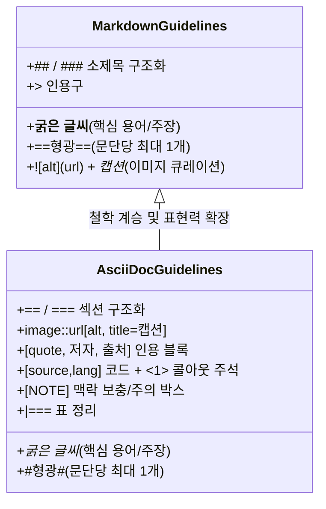

# AsciiDoc(ADOC) 지원 및 듀얼 포맷 본문 읽기 파이프라인 설계 및 구현 명세서

작성일: 2026-08-20 · 상태: **구현 및 검증 완료** · 기준: [GOALS.md](../../GOALS.md) 트랙2(추출·연결 품질) 및 트랙3(가독성·소비 품질) / 관련: [ONEHOP_MERGE_DESIGN.md](ONEHOP_MERGE_DESIGN.md)

---

## 1. 개요 및 배경

Claire Bible의 본문 가독 렌더링(`documents.detail`)은 사용자가 원문을 직접 읽지 않아도 핵심 맥락과 세부 사항을 쉽게 파악할 수 있도록 LLM이 생성하는 재구성된 본문입니다.

기존에는 마크다운(Markdown, MD) 단일 형식으로 본문이 생성 및 렌더링되었으나, 기술 지식의 특성상 **인용(Quote), 코드 블록(Code Block) 및 라인별 콜아웃(Callout), 보충 주의(Note Box), 비교 표(Table)** 등의 복합적이고 구조화된 표현력을 극대화하기 위해 **AsciiDoc(ADOC)** 포맷을 도입하고 사용자가 환경설정 및 CLI 플래그로 듀얼 포맷을 유연하게 선택할 수 있도록 설계·구현되었습니다.

### 업스트림 설계자 철학의 계승
- **가독성과 사실성 최우선**: 요약이 아닌 여러 단락의 서술체 문어체 유지, 원문에 없는 사실 생성 금지.
- **엄격한 시각적 큐레이션**:
  - 형광 하이라이트(MD `==...==`, ADOC `#...#`)는 문단당 1개 이하로 극도로 절제.
  - 이미지는 다이어그램/차트/아키텍처 등 지식 습득에 필수적인 것만 선별하고 맥락 캡션을 병기.
- **기능 과시 지양 & 실용적 복합 활용**:
  - AsciiDoc의 화려한 문법을 백화점식으로 나열하지 않고, **"인용 / 코드 / 주석 / 표"**의 본질적 결합에 집중.

---

## 2. 데이터 수명주기 및 영향 검토

| 단계 | 동작 방식 및 영향 | 안전성 및 격리 수준 |
| :--- | :--- | :--- |
| **적재 (Ingest)** | • 원문 수집(`raw_text`) $\rightarrow$ 구조화 추출(`extract`) $\rightarrow$ 가독 본문 생성(`render_detail`)<br>• 온톨로지 추출은 `raw_text`를 직접 사용하므로 ADOC 문법이 지식 그래프(엔티티/관계)에 영향을 주지 않음. | **완전 격리 (Isolated)** |
| **1-홉 병합 (One-Hop)** | • GeekNews 부모 글 + GitHub 자식 글 병합 시 원문이 append 통합됨.<br>• `ensure_document_detail(..., force=True)`로 통합 본문이 ADOC/MD로 재생성되어 인용/코드/노트/표로 풍부하게 재구성됨. | **통합 재생성 (Enriched)** |
| **재적재 / 복구 (Refresh)** | • 본문 내용 불변(`nochange`) 시: 그래프 불변 상태에서 이미지/포맷 갱신만 수행.<br>• 내용 변경 시: in-place 갱신 및 `detail` 재생성. | **비파괴적 (Non-destructive)** |
| **중복 병합 (Dedup-Merge)** | • 근사 중복 시 Keeper 문서의 `detail` 및 `detail_format`을 유지하고 Loser 참조를 안전하게 재배치. | **일관성 유지 (Consistent)** |
| **검색 (FTS5 / Vector)** | • FTS5 및 벡터 임베딩은 `documents.raw_text`와 `entities.observations`를 인덱싱하므로 ADOC 문법 태그가 검색 랭킹을 왜곡하지 않음. | **검색 무왜곡 (Zero-skew)** |
| **맥락 소비 (RAG / MCP)** | • `follow.py`와 `research.py`는 부모 문서 맥락으로 `detail[:2000]`을 사용.<br>• ADOC의 `[quote]`, `[NOTE]`, `[source]` 블록이 LLM의 문맥 이해도를 향상시킴. | **소비 향상 (Enhanced)** |

---

## 3. 본문 구조 가이드라인 (MD vs ADOC)



### ADOC 실용 본문 작성 규칙
1. **핵심 인용 (Quotes)**:
   ```asciidoc
   [quote, 저자 또는 출처, 발언 맥락]
   ____
   원문의 본질을 꿰뚫는 핵심 명제나 핵심 발언
   ____
   ```
2. **코드 및 라인별 콜아웃 (Code & Callouts)**:
   ```asciidoc
   [source,python]
   ----
   def process_pipeline(doc):
       format = doc.detail_format  # <1>
       return render(doc, format)  # <2>
   ----
   <1> 저장된 본문 포맷 식별
   <2> 포맷에 따른 전용 렌더러 호출
   ```
3. **맥락 보충 및 주의사항 (Admonition Notes)**:
   ```asciidoc
   [NOTE]
   ====
   독립적인 라이브러리 추가 없이 기존 파이프라인과 100% 호환되도록 구성되었습니다.
   ====
   ```
4. **정리 및 비교 표 (Tables)**:
   ```asciidoc
   |===
   |기능 |마크다운(MD) |아스키독(ADOC)
   |인용 |`>` 단순 블록 |`[quote]` 출처/맥락 메타데이터 지원
   |코드 주석 |본문 별도 설명 |`<1>` 인라인 번호 뱃지 콜아웃
   |===
   ```

---

## 4. 시스템 아키텍처 및 구현 명세

### 1) 환경 설정 ([config.py](../../src/claire/config.py), [.env.example](../../.env.example))
```python
class Settings(BaseSettings):
    render_format: str = "adoc"  # "adoc" 또는 "md" (기본값 adoc)

    @field_validator("render_format", mode="before")
    @classmethod
    def _validate_render_format(cls, v: str | None) -> str:
        s = (v or "md").strip().lower()
        if s in ("asciidoc", "adoc"):
            return "adoc"
        if s in ("markdown", "md"):
            return "md"
        raise ValueError(f"render_format must be 'md' or 'adoc', got {v!r}")
```

### 2) 데이터베이스 스키마 및 마이그레이션 ([store/db.py](../../src/claire/store/db.py))
- `SCHEMA_VERSION = 10` 상향.
- `documents` 테이블에 `detail_format TEXT DEFAULT 'md'` 컬럼 추가.
- `set_document_detail(conn, doc_id, detail, format="md")`: 본문 저장 시 해당 포맷을 함께 기록.
- `get_document_detail_format(conn, doc_id)`: 문서별 포맷 조회 (기본값 `"md"` 폴백).

### 3) 프롬프트 라우팅 ([extract/prompts.py](../../src/claire/extract/prompts.py))
- `render_detail_prompt(body, images, merged=False, scale=1, format="md")`:
  - `format="adoc"`인 경우 `render_detail_prompt_adoc`으로 라우팅되어 AsciiDoc 전용 구조화 지침을 전달.
  - `format="md"`인 경우 `render_detail_prompt_md`로 라우팅.

### 4) 프로바이더 및 파이프라인 ([extract/](../../src/claire/extract/), [ingest/](../../src/claire/ingest/))
- `Provider.render_detail(doc, format="md")` 시그니처 표준화 (`GeminiProvider`, `AntigravityProvider`, `MockProvider`).
- `ensure_document_detail(conn, provider, doc, *, force=False, format=None)`에서 `format` 매개변수 우선 적용 및 `doc.meta`/설정값 자동 매핑.
- `IngestService.ingest()`, `refresh_document()`, `reextract_all()`, `backfill_details()`, `merge_source_into_document()`에 `format` 전달 체계 완비.

### 5) 운영 도구 (`cb-manuscript app`) 및 CLI 명령어 확장
사용자는 호스트 OS에서 `cb-manuscript app`을 통해 포맷 점검 및 전환 작업을 편리하게 수행할 수 있습니다:
```bash
# [권장] cb-manuscript app 을 통한 포맷 마이그레이션 Dry-Run 진단 (기본 동작, .env의 CLAIRE_RENDER_FORMAT 기준)
./cb-manuscript app format-migrate

# [권장] 미적용(불일치/누락) 문서만 선별하여 포맷 마이그레이션 적용 (확인 프롬프트 포함)
./cb-manuscript app format-migrate --apply

# [권장] 비대화형 환경 자동 승인 마이그레이션 실행
./cb-manuscript app format-migrate --apply --yes

# [고급/유지보수] 컨테이너 명령어 직접 호출
# detail이 비어있거나 포맷이 다른 문서를 ADOC 포맷으로 선별 백필
./cb-manuscript app backfill-detail --format adoc

# 포맷 전환을 동반한 전체 지식그래프 재추출 (파괴적 리빌드)
./cb-manuscript app --advanced reextract --format adoc

# 컨테이너 내부 직접 실행 시:
# ADOC 포맷으로 단건 적재
claire ingest "https://example.com/article" --format adoc

# 포맷 마이그레이션 점검 및 적용
claire format-migrate
claire format-migrate --apply

# 포맷 현황 진단 리포트 출력
claire format-status

# 미적용 문서 선별 백필
claire backfill-detail --format adoc
```

### 6) Antora 스타일 백엔드 AOT 렌더링 파이프라인 ([render/aot.py](../../src/claire/render/aot.py), [graphview.py](../../src/claire/graphview.py))
- **Antora AOT(Ahead-of-Time) 사전 컴파일 모델 도입**:
  - 클라이언트 브라우저가 Asciidoctor.js(~800KB+)를 CDN에서 다운로드하고 `unsafe-eval`로 파싱하던 기존 JIT 방식을 완전히 탈피.
  - **백엔드 AOT 사전 컴파일**: 문서 적재(`ensure_document_detail`) 및 DB 저장(`set_document_detail`) 시점에 `claire.render.aot` 모듈이 AsciiDoc 및 Markdown을 시맨틱 HTML(`detail_html`)로 사전 컴파일하여 저장.
  - **Zero-eval 엄격한 CSP 달성**: 브라우저에서 `unsafe-eval`을 유발하는 Asciidoctor.js CDN 스크립트와 `eval` 런타임 코드를 100% 제거하고 엄격한 `script-src 'self'` 준수.
- **초고속 제로-런타임 서빙**:
  - `document_detail()` API 및 `/p?s=token` 공유 페이지는 DB에 사전 컴파일된 `detail_html`을 반환하여 모달 오픈 시 지연 시간 0ms 달성.
  - 최종 HTML 출력은 항상 `DOMPurify.sanitize()`를 거쳐 XSS 방어.
- **CSS 테마 일치**:
  - Light/Dark 테마 변수(`--bg`, `--card-bg`, `--accent`, `--mark-bg` 등)와 100% 호환되는 Admonition Box, Quote Block, Callout Badge(`.conum`), Table 스타일 적용.
- `#reader` 모달 및 `/p?s=token` 공유 페이지(`shared_html`) 모두에 동일 듀얼 렌더러 적용.

---

## 5. 검증 결과

본 기능은 [tests/test_adoc_render.py](../../tests/test_adoc_render.py)를 통해 다음 8가지 핵심 항목을 검증 완료하였습니다:
1. `test_config_render_format_validation`: 환경설정 유효성 및 소문자 정규화 검증.
2. `test_aot_render_adoc`: AOT 렌더러의 AsciiDoc 문법 전체(인용, 코드 콜아웃, Admonition, 표, 형광, 이미지 등) 시맨틱 HTML 컴파일 검증.
3. `test_aot_render_md`: AOT 렌더러의 Markdown 및 `==형광==` 컴파일 검증.
4. `test_db_detail_format_storage_and_migration`: DB 컬럼 마이그레이션, `detail_html` 저장 및 포맷 조회 검증.
5. `test_prompts_dual_format`: MD/ADOC 모드별 프롬프트 분기 및 핵심 규칙 포함 검증.
6. `test_mock_provider_dual_format`: MockProvider의 포맷별 stub 생성 검증.
7. `test_pipeline_ensure_document_detail_format`: 파이프라인의 포맷 반영 및 `detail_html` DB 저장 검증.
8. `test_graphview_detail_format_and_html`: Graphview API 응답의 `detail_html` 포함 및 HTML 템플릿의 Asciidoctor CDN 미포함(Zero-eval) 검증.

