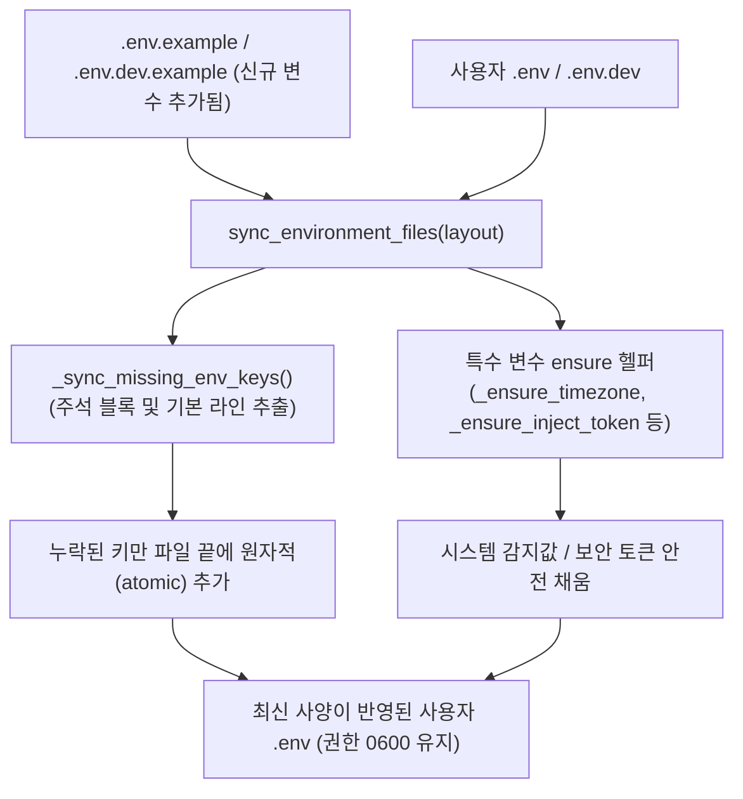

# 운영 지원 업데이트 및 마이그레이션 설계 (`OPERATIONAL_MIGRATION.md`)

이 문서는 Claire Bible의 수명주기 관리 도구(`cb-manuscript`)가 버전 업데이트 및 배포 시 **환경 변수(`.env`)와 데이터베이스 스키마**를 안전하게 자동 마이그레이션하는 규칙과 설계 원칙을 정의합니다.

이후 다른 워크스페이스나 개발자가 코드베이스를 수정하거나 새 설정을 추가할 때도 본 명세에 정의된 원칙을 준수해야 합니다.

---

## 1. 핵심 원칙

1. **단일 명령 기반의 안정적 운영 지원 (Single-Command Reliable Operations)**:
   - 운영자가 수동으로 `.env`의 변경점을 비교하거나 DB 마이그레이션을 별도로 신경 쓸 필요 없이, `./cb-manuscript update` (또는 `install`) 명령 하나만으로 환경 변수 백필, 스키마 갱신, 컨테이너 수명주기가 안전하게 완료되어 안정적인 운영 상태가 유지되어야 합니다.
2. **사용자 설정 절대 보존 (Preservation of User State)**:
   - 사용자가 기존에 설정한 API 키, 토큰, 포트 번호, 타임존 등의 값은 어떠한 경우에도 덮어쓰지 않고 원본 그대로 유지됩니다.
3. **완전한 멱등성 (Strict Idempotency)**:
   - `./cb-manuscript update`를 1번 실행하든, 연속으로 100번 실행하든 동일한 상태가 유지되어야 하며 운영 오류나 중복 추가가 발생하지 않아야 합니다.
4. **선행 스키마 마이그레이션 (Pre-activation Migration)**:
   - 데이터베이스 변경점은 새 컨테이너가 서비스를 시작하기 전(`_transition` 단계) 단독 컨테이너에서 `claire migrate`로 선행 적용되어야 합니다.

---

## 2. 환경 변수 자동 백필 아키텍처

### 환경 변수 동기화 동작 메커니즘
- **`_sync_missing_env_keys(target_path, template_path)`**:
  - `template_path`(`.env.example` 등)를 파싱하여 각 환경 변수 위에 정의된 주석 블록과 키=기본값 정의를 읽어옵니다.
  - `target_path`(`.env` 등)에 해당 키가 존재하지 않으면, 주석과 함께 파일 끝에 추가합니다.
- **특수 변수 핸들러**:
  - `CLAIRE_ENVIRONMENT`: `production` / `development` 정확성 검증 및 보충.
  - `TZ`: 호스트 시스템의 `timedatectl` / `/etc/timezone` / `/etc/localtime`에서 감지된 타임존 자동 보충.
  - `CLAIRE_ANONYMOUS_READONLY`: 기본값 `1` 안전 보충.
  - `CLAIRE_INJECT_TOKEN`: 비어 있을 경우 32자 이상의 안전한 암호학적 난수 토큰 자동 생성.

---

## 3. 라이프사이클 명령 연동

| 명령 | 환경변수 동기화 | 스키마 마이그레이션 | 비고 |
|---|---|---|---|
| `./cb-manuscript init` | 전체 템플릿 복사 및 누락 변수 백필 | - | 초기 배포 및 복구 |
| `./cb-manuscript update` | upstream fetch 후 신규 변수 자동 백필 및 runtime 리로드 | 컨테이너 빌드 후 서비스 재시작 전 `_migrate()` 실행 | 일상 운영 업데이트 |
| `./cb-manuscript install` | 신규 변수 자동 백필 및 runtime 리로드 | 컨테이너 빌드 후 서비스 재시작 전 `_migrate()` 실행 | 최초 설치 및 재설치 |

---

## 4. 새 기능/변수 추가 시 개발자 체크리스트

다른 워크스페이스나 개발자가 신규 환경 변수 또는 데이터베이스 변경을 도입할 때는 다음 절차를 따릅니다:

### [1] 신규 환경 변수 추가 시
1. **템플릿 등록**: `.env.example` (프로덕션) 및 `.env.dev.example` (개발) 파일에 설명 주석과 함께 기본값을 등록합니다.
2. **코드 참조**: `src/claire/` 또는 `ops/cb_manuscript.py`에서 `os.environ.get()` 또는 `Runtime`을 통해 안전한 fallback과 함께 참조합니다.
3. **자동 백필 검증**: `tests/test_cb_manuscript.py`에 `test_update_backfills_...`와 같은 회귀 테스트를 실행하여 백필 및 멱등성을 검증합니다.

### [2] 데이터베이스 스키마 변경 시
1. **멱등적 DDL 작성**: `src/claire/dbm.py`의 `migrate_schema()`에 `CREATE TABLE IF NOT EXISTS` 또는 컬럼 존재 여부 체크 후 `ALTER TABLE ... ADD COLUMN`을 작성합니다.
2. **테스트 추가**: `tests/test_migrate.py`에 재실행 시 에러가 발생하지 않는지 테스트를 추가합니다.
