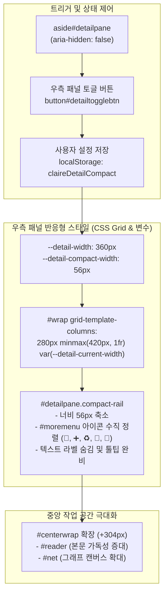

# aside#detailpane(우측 메뉴) 아이콘 모드(Icon-Only) 전환 설계

작성일: 2026-08-21 · 상태: **구현 및 적용 (Implemented)** · 기준: [GOALS.md](../../GOALS.md) / [PLAN.md](../../PLAN.md)
관련: `src/claire/graphview.py`

---

## 1. 배경 및 문제 정의

- **레이아웃 구조**:
  - 데스크톱(1100px 초과): 3열 그리드 (`#docs` 280px + `#centerwrap` 1fr + `#detailpane` 360px)
  - 중간 폭(720px ~ 1100px): 2열 그리드 (`#docs` 280px + `#centerwrap` 1fr) + `#detailpane` 드로어(오른쪽 슬라이드)
- **문제점**:
  - `aside#detailpane`이 열려 활성화(`aria-hidden="false"`)되면 360px의 화면 너비를 고정 점유하므로, 중앙의 문서 크게 읽기(`div#reader`)나 지식 그래프(`section#netwrap`)의 가로 폭이 좁아져 시각적 몰입도와 가독성이 저하됩니다.
  - 우측 상단 도구 메뉴(`div#moremenu`)의 액션 버튼(`🧩 종합 (0)`, `➕ 적재`, `♻️ 중복정리`, `🔗 경로`, `🐙 GitHub`)과 부가 정보가 가로 폭을 넓게 차지합니다.
- **목표**:
  - `aside#detailpane`의 `aria-hidden`이 `false`일 때, 우측 메뉴를 **아이콘만 노출하는 컴팩트 레일(Icon-Only Rail, 너비 ~56px)** 형태로 전환할 수 있는 기능을 제공합니다.
  - 이를 통해 **약 304px의 가로 공간을 즉시 회수**하여 중앙 작업 영역(본문 읽기/그래프)의 뷰포트를 극대화합니다.
  - 컴팩트 레일 상태에서도 각 도구 아이콘에 `title` 및 `aria-label` 툴팁/접근성을 온전히 제공하여 빠르고 편리한 도구 접근을 보장합니다.

---

## 2. 설계 아키텍처 및 상태 모델

---

## 3. 핵심 설계 명세

### 3.1 레이아웃 및 너비 전환 메커니즘
1. **CSS 변수 기반 그리드**:
   - `:root`에 `--detail-width: 360px`, `--detail-compact-width: 56px` 정의.
   - `#wrap`의 3번째 컬럼을 `var(--detail-width, 360px)`로 설정하고, 컴팩트 모드(`body.detail-compact` / `#detailpane.compact-rail`) 시 `var(--detail-compact-width, 56px)`로 전환.
2. **우측 메뉴 컴팩트 레일 UI (`#detailpane.compact-rail`)**:
   - **너비**: 360px → **56px** (부드러운 CSS transition 적용).
   - **헤더 (`#detailhead`)**:
     - 상단 헤더에 접기/펼치기 토글 단추(`button#detailtogglebtn`)를 배치.
     - 토글 버튼 클릭 시 `360px(Full)` ↔ `56px(Icon-only)` 수동 전환.
   - **도구 메뉴 (`#moremenu`)**:
     - `.action-btn-row`: 버튼들을 수직(Column) 중앙 정렬로 배치.
     - 버튼 텍스트(``) 숨김 처리 (`display: none`), 아이콘(`🧩`, `➕`, `♻️`, `🔗`, `🐙`)만 중앙 정렬하여 40x40px 타깃 제공.
     - 보조 컨트롤(슬라이더, 텍스트 상태)은 컴팩트 모드 시 깔끔하게 숨김 처리.
   - **상세 패널 (`#panel`)**:
     - 컴팩트 레일 상태에서는 상세 본문 숨김 처리 또는 노드 클릭 시 필요에 따라 전체 패널로 확장.

### 3.2 접근성(A11y) 및 키보드 지원
- **스크린 리더(Screen Reader)**: 아이콘만 표시되더라도 버튼 및 항목의 `aria-label`, `title`, `aria-expanded`는 온전히 유지.
- **키보드 포커스**:
  - `Tab`, `Shift+Tab`을 통한 도구 버튼 탐색 동작 유지.
  - `:focus-visible` 시 56px 레일 내부에서 포커스 링이 선명하게 표시.
- **모션 감소(prefers-reduced-motion)**: 너비 전환 시 transition을 비활성화하여 즉시 변경.
