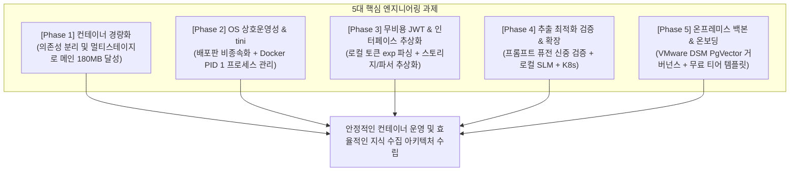
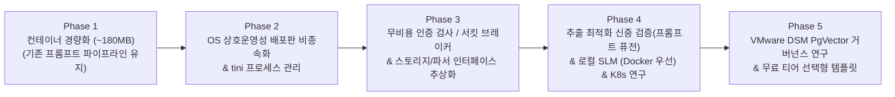

# 클레어바이블(Claire-Bible) 듀얼 트랙 아키텍처 및 단계별 실행 계획

**문서 번호:** PLAN-ARCH-20260907-08 (Rev.8)  
**작성 주체:** 아키텍처 플래너  
**기반 데이터:** 프로덕션 서버 실사, 프로바이더 ToS 분석 리포트, 감사 리포트

---

## 1. 듀얼 트랙 방향성 및 이용약관(ToS) 준수 기준

클레어바이블은 모델 프로바이더(OpenAI, Google 등)의 **이용약관(ToS)과 레이트 리밋(RPM/TPM)을 준수**하고, 불필요한 자동화 호출 오남용을 방지하는 구조를 지향합니다. 시스템의 목적과 운영 범위를 명확히 구분하기 위해 **듀얼 트랙(Dual-Track)** 체계로 정리합니다.

```
[클레어바이블 듀얼 트랙 체계]

Track 1: 개인 연구 및 개발 주도 트랙 (Lightweight Docker Track)
 ├─ 목적: 개인 개발자가 지식 정의와 수집 과정을 연구·주도하기 위한 '시험적 일부 자동화' 환경
 ├─ 특성: ~180MB 초경량 코어, SQLite 단일 정본, 로컬-퍼스트, Zero-Config, pypdf
 └─ ToS 대응: 24/7 무인 자동 호출 억제, 로컬 SLM 연동 지원, Phase 4 추출 최적화

Track 2: 조직 관점의 지식베이스 연구 트랙 (On-Premises K8s Track)
 ├─ 목적: 엔터프라이즈 및 조직 관점에서의 대규모 지식베이스 아키텍처와 거버넌스를 연구하기 위한 환경
 ├─ 특성: VMware DSM PostgreSQL + pgvector 동시성 백본, K8s Pod 스케일아웃, 독립 Docling 방화벽
 └─ CLI 배제 정책: Antigravity CLI 및 Codex CLI 대신 엔터프라이즈 엔드포인트 연결
     └─ 대안: 종량제 API 엔드포인트, OpenAI-compatible 게이트웨이, 사내 vLLM/Ollama 직접 연결
```

### 1.1 Track 1: 개인 연구 및 개발 주도 트랙 (Docker / Compose)
* **정체성**: 개인 개발자가 지식 정의와 온톨로지 수집 파이프라인을 스스로 연구하고 주도하기 위한 **"시험적 일부 자동화(Experimental Partial Automation)"** 환경입니다.
* **ToS 준수 원칙**:
  * 개발자 CLI 도구(`agy`, `codex`)를 24/7 무인 배치 스크래퍼로 상시 방치하는 것을 지양합니다.
  * 단건 온디맨드 수집 위주로 동작하며, Phase 4에서 기존 추출 품질과의 정합성을 검증한 후 프롬프트 퓨전 등 호출 최적화를 신중히 적용합니다.

### 1.2 Track 2: 조직 관점의 지식베이스 연구 트랙 (On-Premises Kubernetes)
* **정체성**: 다중 사용자 및 조직 관점에서 지식베이스의 영속성, ACID 동시성, 고가용성 거버넌스 아키텍처를 심층 연구하기 위한 환경입니다.
* **CLI 배제 및 대체 연결 정책 (CLI Rejection & Alternative Binding)**:
  * 온프레미스 K8s 환경에서는 개발자 개인 CLI 도구(`agy`, `codex`)를 파이프라인에 직접 결합하지 않습니다.
  * **대체 수단 제공**: 사내 엔터프라이즈 게이트웨이, Google GenAI API, OpenAI API 호환 규격, 또는 K8s 클러스터 내부의 vLLM/Ollama 서비스로 직접 연결할 수 있는 **엔터프라이즈 대체 연결 구성(Enterprise Alternative Configuration)**을 기본 제공합니다.

---

## 2. 5대 핵심 엔지니어링 과제 및 실행 방향



### 2.1 [과제 1 / Phase 1] 컨테이너 경량화 및 의존성 분리
* **배경**: 현재 프로덕션 컨테이너의 코어 이미지가 약 582MB(압축) / 2.17GB(비압축)에 달해, 소형 VPS 환경 배포와 자원 효율성에 부담이 됨.
* **실행 사양**:
  1. Multi-stage 빌드를 적용하여 불필요한 빌드 도구와 캐시 레이어를 제거.
  2. 무거운 브라우저 엔진(`scrapling[fetchers]`, `playwright`, `patchright`)을 메인 컨테이너에서 분리하여 필요 시 독립 사이드카로 구성.
* **목표**: 메인 컨테이너 디스크 크기를 **약 180MB(압축 시 ~70MB)** 수준으로 경량화하고, 기존 프롬프트 파이프라인을 그대로 유지하여 산출물의 정합성과 동작 안정성을 우선 확보.

### 2.2 [과제 2 / Phase 2] 리눅스 OS 상호운영성 개편 및 좀비 프로세스 방지
* **배경**: 호스트 OS(Debian 계열) 종속적인 경로 마운트와 Docker PID 1 환경에서 CLI 자식 프로세스가 고아/좀비(`<defunct>`)로 누적되는 문제 해결.
* **실행 사양**:
  1. **프로세스 관리 표준화**: `Dockerfile`에 리눅스 표준 init 프로세스인 `tini`를 탑재(`ENTRYPOINT ["/usr/bin/tini", "--"]`)하여 고아 자식 프로세스를 자동 회수.
  2. **Self-Contained CA 및 사설 CA 합성 (ACT-1)**: 호스트 CA 디렉터리 직접 마운트를 지양하고, 컨테이너 내부 번들과 사내 사설 CA(`/app/certs/custom/`)를 자동 합성하는 구조 적용.
  3. **비루트 사용자 전환 및 소유권 마이그레이션 (ACT-2 & 3)**: 비루트 계정(`claire:10001`) 적용 및 기존 데이터 소유권 마이그레이션 지원, Rootless Podman 호환성 확보.
  4. **SELinux `:z` 레이블 및 타임존 `TZ` 일원화 (ACT-5)**: 볼륨 마운트 시 SELinux `:z` 옵션 적용, `/etc/localtime` 마운트 대신 `TZ` 환경변수 표준화.

### 2.3 [과제 3 / Phase 3] 무비용 로컬 인증 검사 및 인터페이스 추상화
* **배경**: 데몬 루프 주기마다 CLI를 직접 실행하여 인증 상태를 프로빙하는 것은 불필요한 부하를 유발할 수 있음.
* **실행 사양**:
  1. 호스트에 캐시된 인증 파일(예: `~/.gemini/token.json`)의 `exp` 만료 타임스탬프를 로컬 파이썬 JSON 파싱(0.1ms 수준)으로 검사하여 외부 호출 비용을 배제.
  2. 401/403 에러 발생 시 데몬 루프를 일시 정지하고 알림을 전송하는 리액티브 서킷 브레이커 적용.
  3. 저장소 계층(`StorageBackend`: SQLite / PostgreSQL) 및 PDF 파서 계층(`PdfParser`)의 인터페이스 추상화 완료.

### 2.4 [과제 4 / Phase 4] 추출 최적화 신중 검증 및 확장 (프롬프트 퓨전 / 로컬 SLM / K8s)
* **배경**:
  * 프롬프트 퓨전(여러 추출 단계를 하나의 멀티태스크 프롬프트로 통합)은 호출 횟수(20~40회 -> 1~2회)를 대폭 줄일 수 있으나, **기존 단계별 프롬프트의 산출물(스키마 준수율, 세부 엔티티 추출 품질 등)과 차이가 발생할 수 있으므로 신중한 비교 검증이 선행**되어야 함.
* **실행 사양**:
  1. **프롬프트 퓨전 A/B 비교 및 단계적 검증**:
     * 기존 파이프라인 산출물과 멀티태스크 퓨전 프롬프트 산출물 간의 정합성·품질 비교 벤치마크 테스트 수행.
     * 엔티티 추출 재현율과 상세 렌더링 품질이 기존 결과와 동등함을 확인한 후 점진적으로 전환.
  2. **경량 로컬 SLM 하이브리드 오프로딩 (Docker 우선)**:
     * 단순 분류(`classify_paper`, `classify_watch`) 및 중복 검사에 경량 로컬 모델(Ollama/vLLM 등)을 연동.
     * 개인 개발자의 로컬 연구 환경 확대를 지원하기 위해 Docker 구성을 우선 제공.
  3. **온프레미스 K8s 연구 트랙 패키징**:
     * CLI 도구 대신 엔터프라이즈 엔드포인트를 사용하는 K8s Helm 패키징 및 독립 `docling-serve` 워커 분리 배포.

### 2.5 [과제 5 / Phase 5] 온프레미스 백본 거버넌스 및 온보딩 템플릿
* **배경**: 다중 Pod 환경에서의 지식베이스 거버넌스 연구 및 신규 유입 개발자를 위한 온보딩 지원.
* **실행 사양**:
  1. **VMware DSM PgVector 연동**: VMware Data Services Manager 기반 PostgreSQL + pgvector를 활용한 ACID 동시성 및 온프레미스 거버넌스 연구 환경 구축.
  2. **무료 티어 선택형 템플릿 제공**: Google AI Studio 무료 티어(일일 1,500 RPD)를 손쉽게 활용할 수 있는 선택형 온보딩 프로파일(`CB_PROFILE=free-tier`) 지원.

---

## 3. 종합 단계별 실행 마일스톤 (Phase 1 ~ Phase 5)



| 마일스톤 | 과제명 | 핵심 엔지니어링 내용 | 성격 및 접근 방향 |
| :--- | :--- | :--- | :---: |
| **Phase 1** | **컨테이너 경량화 및 의존성 분리** | - `scrapling/playwright` 분리로 메인 이미지 **디스크 ~180MB, 압축 ~70MB** 달성<br/>- 기존 추출 프롬프트 파이프라인을 온전히 유지하여 산출물 정합성 확보 | **즉시 추진 (저위험/고효율)** |
| **Phase 2** | **OS 상호운영성 및 프로세스 안정화** | - **[tini 탑재]** Docker PID 1 init 프로세스로 고아/좀비 프로세스 방지<br/>- **[ACT-1]** 사설 CA 자동 합성 및 컨테이너 내부 Mozilla 번들 정립<br/>- **[ACT-2 & 3]** 비루트(`claire:10001`) 전환, 마이그레이션 훅, Rootless Podman 호환<br/>- **[ACT-5]** SELinux `:z` 옵션 적용, `/etc/localtime` 마운트 대신 `TZ` 일원화 | **기반 인프라** |
| **Phase 3** | **무비용 인증 검사 및 인터페이스 추상화** | - 토큰 캐시 `exp` 로컬 JSON 파싱(비용 0) 및 리액티브 서킷 브레이커<br/>- `StorageBackend` Protocol (SQLite vs DSM PostgreSQL)<br/>- `PdfParser` Protocol (`design/PDF_PARSER_AND_VISION_GUARDRAILS_DESIGN.md` 준수) | **안정화** |
| **Phase 4** | **추출 최적화 신중 검증 및 확장** | - **[프롬프트 퓨전 신중 검증]** 기존 산출물과의 A/B 비교 벤치마크 및 정합성 확인 후 점진적 적용<br/>- **[로컬 SLM (Docker 우선)]** 경량 로컬 모델(Ollama/vLLM) 하이브리드 오프로딩<br/>- **[K8s 연구 트랙]** CLI 배제 및 엔터프라이즈 엔드포인트 연동, 독립 `docling-serve` 분리 | **기능 검증 및 확장** |
| **Phase 5** | **온프레미스 백본 및 온보딩 템플릿** | - VMware DSM PgVector 연동을 통한 조직 관점의 지식베이스 거버넌스 연구<br/>- Google AI Studio 무료 티어(일일 1,500회) 지원 온보딩 템플릿 제공 | **엔터프라이즈 연구 및 지원** |

---

## 4. 결론

1. **기능 구현과 인프라 설계의 분리**:
   - PDF 파서 및 시각 오염 가드레일은 [design/PDF_PARSER_AND_VISION_GUARDRAILS_DESIGN.md](design/PDF_PARSER_AND_VISION_GUARDRAILS_DESIGN.md)에서 독립적으로 관리됩니다.
2. **산출물 안정성을 고려한 점진적 최적화**:
   - 컨테이너 경량화(Phase 1) 단계에서는 기존 프롬프트 구조를 유지하여 결과물 일관성을 지키고, 프롬프트 퓨전은 Phase 4에서 충분한 비교 벤치마크를 거쳐 신중하게 도입합니다.
3. **OS 상호운영성 및 연구 환경 지원**:
   - Phase 2의 배포판 비종속화 및 `tini` init 프로세스를 통해 컨테이너 이식성을 확립하고, 로컬 SLM 및 무료 티어를 활용하여 개발자의 연구 환경을 안정적으로 지원합니다.
