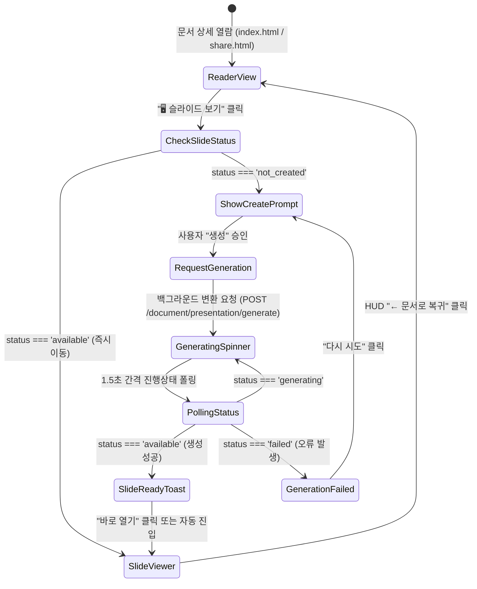

# Asciidoctor reveal.js 프레젠테이션 프론트엔드 및 UI/UX 아키텍처 설계 명세서
(Asciidoctor reveal.js Presentation Frontend & UI/UX Architecture Specification)

작성일: 2026-10-01 · 상태: **설계 완료 (Ready for Implementation)** · 작성자: 프론트엔드/UI/UX 아키텍트

---

## 1. 개요 및 배경

Claire Bible은 지식 그래프 및 기술 문서를 효율적으로 축적하고 열람하는 지식 관리 시스템(KMS)으로, 핵심 콘텐츠 규격으로 순수 **AsciiDoc(ADOC)** 포맷을 채택하고 있다.
본 설계는 적재된 AsciiDoc 문서의 구조적 완성도(인용, 코드 블록, 콜아웃, Admonition, 비교 표, 2D 섹션 구조)를 그대로 계승하여, 웹 브라우저 환경에서 고품질 테크니컬 발표 장표를 즉시 시청하고 제어할 수 있는 **Asciidoctor reveal.js 프레젠테이션 뷰어 및 UI/UX 시스템**을 정의한다.

### 핵심 설계 원칙 (Core Architectural Principles)
1. **Zero-Friction User Journey**: 문서 리더기(`index.html`)와 공개 공유 뷰(`share.html`) 어디서나 원클릭으로 슬라이드로 진입하며, 미생성 시 상태 기반 비동기 생성 파이프라인을 매끄럽게 연결.
2. **Distraction-Free Dedicated Viewer**: reveal.js의 2D 캔버스(`horizontal`/`vertical`)를 방해하지 않는 상단 오버레이 글래스모피즘 HUD(Heads-Up Display) 유틸리티 툴바 제공.
3. **Design System Continuity**: Claire Bible 시그니처 폰트(`Noto Sans KR`, `JetBrains Mono`, `D2Coding`)와 CSS 변수 기반 다크/라이트 테마를 reveal.js DOM에 100% 동기화.
4. **Deep AsciiDoc Technical Slide Fidelity**: Admonition 카드, 소스코드 라인 콜아웃(`<1>`), `[cols]` 표, 인용구 등 기술 발표에 필수적인 블록의 스타일 규격을 극대화.
5. **Multi-Device & Responsive Excellence**: 모바일 터치 제스처(2D 스와이프), 가변 화면비 자동 스케일링, 인쇄 모드(`?print-pdf`), 스피커 노트(`S` 키)의 완벽 지원.

---

## 2. 사용자 여정 (User Journey) 및 진입점 인터랙션



### 1) 문서 상세 뷰어 내 진입점 배치
- **중앙 리더기 (`index.html` 내 `#reader .rtools`)**:
  - `rzoom` 버튼군 우측, `rshare` 버튼 좌측에 직관적인 슬라이드 프로젝터 아이콘 버튼 배치:
    ```html
    <button class="rslides" id="rslidesbtn" onclick="handlePresentationClick()" title="프레젠테이션 슬라이드로 보기 (단축키: P)" aria-label="프레젠테이션 보기">
      <span class="btn-icon">🖥️</span>
      <span class="rslides-spinner" style="display:none" aria-hidden="true"></span>
    </button>
    ```
- **문서 메타데이터 영역 (`docMetaHtml`) 태그/뱃지**:
  - 상태에 따른 유동적 칩(Chip) 렌더링:
    - 슬라이드 준비 완료: `<a href="/presentation?id={docId}" class="focus-tag presentation-tag" target="_blank" rel="noopener">🎞️ 슬라이드 보기</a>`
    - 미생성 상태: `<button class="focus-tag presentation-cta-tag" onclick="requestSlideGeneration('{docId}')">✨ 슬라이드 생성</button>`
- **공유 뷰어 (`share.html`)**:
  - 외부 공유 링크 사용자에게도 일관된 경험을 제공하기 위해 상단 메타 영역에 `↗ Presentation Slides (Reveal.js)` 링크를 노출하고, 우측 상단에 플로팅 퀵 토글 버튼(FAB)을 지원.

### 2) 프레젠테이션 생성 유도 및 비동기 상태 인터랙션
- **상태 정의 (Lifecycle States)**:
  - `not_created`: 슬라이드가 아직 생성되지 않은 상태.
  - `generating`: 백엔드 `asciidoctor-revealjs` 파이프라인에서 슬라이드 HTML/에셋을 컴파일 중인 상태.
  - `available`: 컴파일이 완료되어 서빙 가능한 상태.
  - `failed`: 문법 오류 또는 변환 런타임 오류로 실패한 상태.
- **상호작용 상세**:
  1. **생성 유도 모달 / 팝오버**: 사용자가 미생성 상태에서 버튼 클릭 시 가벼운 안내 팝오버가 노출되며, AsciiDoc 섹션 기반(H2=가로 슬라이드, H3=세로 심층 슬라이드) 2D 슬라이드 구성 방식을 간략히 안내.
  2. **비동기 스피너 전환**: `POST /document/presentation/generate?id={docId}` 호출과 동시에 버튼 아이콘이 회전 스피너(`rslides-spinner`)로 변경되고 비활성화(`disabled`) 처리.
  3. **폴링 및 완료 토스트**: 클라이언트는 1.5초 간격으로 상태를 조회하며, 완료 시 햅틱/애니메이션과 함께 완료 토스트 알림창(`"슬라이드가 성공적으로 생성되었습니다! [바로 보기]"`)을 띄워 사용자의 흐름을 방해하지 않고 자연스럽게 슬라이드로 안내.

---

## 3. 프레젠테이션 전용 뷰어 페이지 (`presentation.html`) 설계

iframe 방식의 포커스 트래핑 및 전체화면 제약을 원천 방지하기 위해 **독립형 전용 템플릿(Standalone Template)** 구조를 채택한다.
슬라이드 화면 상단에는 사용자가 마우스를 올리거나 터치할 때만 부드럽게 나타나는 **플로팅 오버레이 HUD(Heads-Up Display) 툴바**를 구성한다.

```
+----------------------------------------------------------------------------------------------------+
|  [← 문서로 복귀]  문서 제목: 분산 아키텍처 심층 분석          [03.2 / 18] [Progress Bar]     🗺️ 🎙️ 🗂️ 🖨️ ⚙️ 🔗 ⛶ | <-- Floating HUD
+----------------------------------------------------------------------------------------------------+
|                                                                                                    |
|                                                                                                    |
|                                      REVEAL.JS 2D SLIDE STAGE                                      |
|                                                                                                    |
|                                                                                                    |
|                                                                                                    |
+----------------------------------------------------------------------------------------------------+
|                                                                                [ 2D Navigation Controls ] |
+----------------------------------------------------------------------------------------------------+
```

### 1) 플로팅 오버레이 툴바 (Floating HUD Toolbar) 사양
- **무방해(Distraction-Free) 자동 숨김 인터랙션**:
  - 기본 상태: `opacity: 0; pointer-events: none; transform: translateY(-8px); transition: all 0.25s ease;`
  - 활성화 조건: 마우스 커서가 화면 상단 60px 이내로 진입, 화면 터치, 키보드 조작, 또는 마우스 이동 시 `opacity: 1; pointer-events: auto; transform: translateY(0);`
  - 3초간 추가 인터랙션이 없으면 부드럽게 페이드아웃.
- **툴바 영역별 세부 기능**:
  - **좌측 (Context & Return)**:
    - `[← 문서로 복귀]`: 클릭 시 부모 창 또는 이전 리더기(`#reader`) 위치로 복귀.
    - 문서 제목(`h1.hud-title`): 긴 제목은 텍스트 말줄임 처리, 호버 시 툴팁 제공.
  - **중앙 (Coordinates & Indicator)**:
    - 2D 좌표 표시: `02.1 / 15` (가로 2번 대주제, 세로 1번 서브 슬라이드 / 전체 15개 섹션).
    - 상단 미니 슬라이드 진행률 게이지.
  - **우측 유틸리티 액션 그룹**:
    - 🗺️ `2D 네비게이션 가이드`: 클릭 또는 `?` 키 입력 시 2D 조작 안내 모달 표시.
    - 🎙️ `발표자 모드 (Speaker Notes)`: `S` 키 연동, 스피커 노트 및 듀얼 타이머 창 분리 실행.
    - 🗂️ `슬라이드 개요 (Overview)`: `O` / `ESC` 키 연동, 전체 슬라이드 줌아웃 타일 맵 토글.
    - 🖨️ `PDF 인쇄 (?print-pdf)`: `?print-pdf` 모드로 전환하여 브라우저 인쇄 다이얼로그 호출.
    - ⚙️ `프레젠테이션 설정`: 테마, 화면 전환 효과, 슬라이드 번호 형식을 조절하는 드롭다운.
    - 🔗 `슬라이드 링크 복사`: 현재 슬라이드의 2D 좌표(`#/2/1`)가 포함된 URL 클립보드 복사.
    - ⛶ `전체화면 (Fullscreen)`: `F` 키 연동, 브라우저 전체화면 진입/해제.

### 2) `presentation.html` 템플릿 마크업 구조
```html
<!doctype html>
<html lang="ko" data-theme="dark">
<head>
  <meta charset="utf-8"/>
  <meta name="viewport" content="width=device-width, initial-scale=1.0, maximum-scale=1.0, user-scalable=no"/>
  <title>__TITLE__ — Presentation — Claire Bible</title>
  <link rel="icon" type="image/svg+xml" href="/favicon.svg"/>
  <!-- Fonts -->
  <link rel="stylesheet" href="/static/css/theme.css"/>
  <link rel="stylesheet" href="/static/css/claire-reveal.css"/>
  <!-- Reveal.js Core & Plugins Styles -->
  <link rel="stylesheet" href="/static/vendor/reveal/reveal.css"/>
  <link rel="stylesheet" href="/static/vendor/reveal/plugin/highlight/monokai.css"/>
  <script src="/static/vendor/reveal/reveal.js"></script>
  <script src="/static/vendor/reveal/plugin/highlight/highlight.js"></script>
  <script src="/static/vendor/reveal/plugin/notes/notes.js"></script>
</head>
<body class="presentation-mode">
  <!-- 상단 플로팅 오버레이 HUD -->
  <header class="presentation-hud" id="hud" aria-label="프레젠테이션 컨트롤 도구">
    <div class="hud-left">
      <a href="__RETURN_URL__" class="hud-btn hud-back-btn" title="문서 리더기로 복귀 (ESC)">
        <span class="hud-icon">←</span> <span class="hud-label">문서로 복귀</span>
      </a>
      <span class="hud-title" title="__TITLE__">__TITLE__</span>
    </div>
    <div class="hud-center">
      <span class="hud-counter" id="hudCounter">01 / 01</span>
      <div class="hud-progress-track"><div class="hud-progress-bar" id="hudProgressBar"></div></div>
    </div>
    <div class="hud-right">
      <button class="hud-btn" id="btnHelp" title="조작 가이드 (?)" aria-label="조작 가이드">🗺️</button>
      <button class="hud-btn" id="btnNotes" title="발표자 모드 (S)" aria-label="발표자 모드">🎙️</button>
      <button class="hud-btn" id="btnOverview" title="슬라이드 개요 (O)" aria-label="슬라이드 개요">🗂️</button>
      <button class="hud-btn" id="btnPrint" title="PDF 인쇄 (?print-pdf)" aria-label="PDF 인쇄">🖨️</button>
      <button class="hud-btn" id="btnSettings" title="슬라이드 설정" aria-label="슬라이드 설정">⚙️</button>
      <button class="hud-btn" id="btnShare" title="현재 슬라이드 링크 복사" aria-label="링크 복사">🔗</button>
      <button class="hud-btn" id="btnFullscreen" title="전체화면 전환 (F)" aria-label="전체화면">⛶</button>
    </div>
  </header>

  <!-- 2D 네비게이션 가이드 모달 -->
  <div class="hud-modal" id="navHelpModal" style="display:none;" onclick="if(event.target===this)this.style.display='none'">
    <div class="hud-modal-card">
      <div class="hud-modal-header">
        <h3>🗺️ 2D 슬라이드 내비게이션 안내</h3>
        <button class="hud-modal-close" onclick="document.getElementById('navHelpModal').style.display='none'">✕</button>
      </div>
      <div class="hud-modal-body">
        <div class="nav-grid-guide">
          <div class="guide-item horizontal">
            <span class="guide-key">←  →</span>
            <strong>가로 이동 (주제 전환)</strong>
            <p>AsciiDoc의 <code>== 레벨 2 섹션</code> 단위로 주요 대주제 장표를 전환합니다.</p>
          </div>
          <div class="guide-item vertical">
            <span class="guide-key">↑  ↓</span>
            <strong>세로 이동 (심층 분석)</strong>
            <p>AsciiDoc의 <code>=== 레벨 3 서브섹션</code> 단위로 세부 코드, 다이어그램을 탐색합니다.</p>
          </div>
        </div>
        <div class="shortcut-list">
          <div><kbd>F</kbd> 전체화면 토글</div>
          <div><kbd>O</kbd> / <kbd>ESC</kbd> 슬라이드 개요 줌아웃</div>
          <div><kbd>S</kbd> 발표자 전용 스피커 노트 분리창</div>
          <div><kbd>?</kbd> 키보드 단축키 안내</div>
        </div>
      </div>
    </div>
  </div>

  <!-- 설정 드롭다운 패널 -->
  <div class="hud-dropdown" id="settingsDropdown" style="display:none;">
    <div class="dropdown-item">
      <label for="themeSelect">테마 (Theme)</label>
      <select id="themeSelect">
        <option value="dark" selected>Claire Dark (권장)</option>
        <option value="light">Claire Light</option>
      </select>
    </div>
    <div class="dropdown-item">
      <label for="transitionSelect">화면 전환 효과</label>
      <select id="transitionSelect">
        <option value="slide" selected>Slide (부드러운 슬라이딩)</option>
        <option value="fade">Fade (차분한 디졸브)</option>
        <option value="convex">Convex (3D 큐브)</option>
        <option value="zoom">Zoom (확대/축소)</option>
        <option value="none">None (즉시 전환)</option>
      </select>
    </div>
    <div class="dropdown-item">
      <label for="numberingSelect">슬라이드 번호 체계</label>
      <select id="numberingSelect">
        <option value="h.v" selected>2D 좌표 (h.v, 예: 2.1)</option>
        <option value="c/t">전체 진행률 (c / t, 예: 5 / 24)</option>
        <option value="none">숨김 (None)</option>
      </select>
    </div>
  </div>

  <!-- Reveal.js 메인 컨테이너 -->
  <div class="reveal">
    <div class="slides">
      __SLIDES_CONTENT__
    </div>
  </div>

  <script src="/static/js/presentation.js"></script>
</body>
</html>
```

---

## 4. 맞춤형 디자인 시스템 (`claire-reveal.css` & 테마 규격)

Asciidoctor reveal.js 변환 결과물은 `.reveal` 스코프 내부에서 실행되므로, 기존 Claire Bible의 `theme.css` 디자인 토큰을 상속받아 프레젠테이션 해상도에 맞게 최적화된 **커스텀 테마 레이어**를 구성한다.

```
+------------------------------------------------------------------------------------+
|  Claire Bible CSS 변수 시스템 (:root 및 [data-theme="dark"])                       |
|  --bg, --fg, --muted, --card-bg, --accent, --accent2, --border                      |
+------------------------------------------------------------------------------------+
                                      │
                                      ▼
+------------------------------------------------------------------------------------+
|  .reveal 슬라이드 타이포그래피 및 레이아웃 스코프                                     |
|  • 제목: Noto Sans KR (700), 단색 고대비 / 그라데이션                                |
|  • 본문: Noto Sans KR (400, 500), 행간 1.55                                        |
|  • 코드: JetBrains Mono / D2Coding (400, 700)                                       |
|  • 인용: Noto Serif KR (400, 700), Georgia                                          |
+------------------------------------------------------------------------------------+
       │                       │                       │                       │
       ▼                       ▼                       ▼                       ▼
┌──────────────┐        ┌──────────────┐        ┌──────────────┐        ┌──────────────┐
│ [source]코드 │        │ [NOTE] 등    │        │ [cols] 비교표│        │ [quote] 인용 │
│ • 다크배경   │        │ • 4px 보더   │        │ • 얼룩말 무늬│        │ • 대형 따옴표│
│ • 콜아웃<1>  │        │ • 시그니처색 │        │ • 콤팩트 패딩│        │ • 메타 뱃지  │
└──────────────┘        └──────────────┘        └──────────────┘        └──────────────┘
```

### 1) 테마 토큰 및 타이포그래피 통합
```css
/* --- Claire Bible Reveal.js Custom Presentation Theme --- */
.reveal {
  font-family: 'Noto Sans KR', system-ui, -apple-system, BlinkMacSystemFont, 'Segoe UI', Roboto, sans-serif;
  font-size: 28px;
  font-weight: 400;
  color: var(--fg);
  background-color: var(--bg);
}

.reveal h1, .reveal h2, .reveal h3, .reveal h4, .reveal h5, .reveal h6 {
  font-family: 'Noto Sans KR', system-ui, sans-serif;
  font-weight: 700;
  letter-spacing: -0.025em;
  text-transform: none;
  line-height: 1.25;
  color: var(--fg);
  margin-bottom: 0.6em;
}

.reveal h1 { font-size: 2.1em; color: var(--accent); }
.reveal h2 { font-size: 1.6em; border-bottom: 2px solid var(--border); padding-bottom: 0.2em; }
.reveal h3 { font-size: 1.25em; color: var(--fg); }

/* 인라인 코드 */
.reveal code {
  font-family: 'JetBrains Mono', 'D2Coding', Menlo, Consolas, monospace;
  background-color: var(--chip-bg);
  color: var(--accent);
  padding: 0.15em 0.35em;
  border-radius: 4px;
  font-size: 0.88em;
}
```

### 2) 기술 장표 컴포넌트 규격
- **비교 표 (`|===`, `[cols="..."]`)**:
  ```css
  .reveal table {
    width: 100%;
    margin: 0.8em 0;
    border-collapse: collapse;
    font-size: 0.72em;
    border: 1px solid var(--border);
    border-radius: 6px;
    overflow: hidden;
  }
  .reveal th {
    background: var(--chip-bg);
    color: var(--fg);
    font-weight: 700;
    padding: 0.5em 0.8em;
    border: 1px solid var(--border);
    border-bottom: 2px solid var(--accent);
  }
  .reveal td {
    padding: 0.45em 0.8em;
    border: 1px solid var(--border);
    vertical-align: middle;
  }
  .reveal tbody tr:nth-child(even) {
    background-color: rgba(255, 255, 255, 0.03);
  }
  [data-theme="light"] .reveal tbody tr:nth-child(even) {
    background-color: rgba(0, 0, 0, 0.02);
  }
  ```
- **Admonition 카드 (`[NOTE]`, `[IMPORTANT]`, `[TIP]`, `[WARNING]`, `[CAUTION]`)**:
  ```css
  .reveal .admonitionblock {
    margin: 0.9em 0;
    padding: 0.7em 1.1em;
    border-radius: 8px;
    background: var(--card-bg);
    box-shadow: 0 4px 14px var(--shadow);
    border-left: 5px solid var(--accent);
    text-align: left;
    font-size: 0.82em;
  }
  .reveal .admonitionblock.note { border-left-color: var(--accent); }
  .reveal .admonitionblock.tip { border-left-color: var(--accent2); }
  .reveal .admonitionblock.important { border-left-color: #a371f7; }
  .reveal .admonitionblock.warning { border-left-color: #f85149; }
  .reveal .admonitionblock.caution { border-left-color: var(--rel); }

  .reveal .admonitionblock .title {
    font-weight: 700;
    text-transform: uppercase;
    font-size: 0.85em;
    margin-bottom: 0.3em;
    letter-spacing: 0.04em;
    color: var(--muted);
  }
  ```
- **인용구 블록 (`[quote, author, source]`)**:
  ```css
  .reveal .quoteblock {
    margin: 1em auto;
    padding: 0.9em 1.4em;
    background: var(--card-bg);
    border-left: 4px solid var(--accent);
    border-radius: 0 8px 8px 0;
    box-shadow: 0 4px 12px var(--shadow);
    text-align: left;
    max-width: 90%;
  }
  .reveal .quoteblock blockquote {
    font-family: 'Noto Serif KR', Georgia, serif;
    font-size: 0.9em;
    line-height: 1.6;
    color: var(--fg);
    margin: 0;
    padding: 0;
    border: none;
  }
  .reveal .quoteblock .attribution {
    margin-top: 0.5em;
    text-align: right;
    font-size: 0.75em;
    color: var(--muted);
  }
  ```
- **소스코드 블록 (`[source, lang]`) 및 AsciiDoc 콜아웃**:
  ```css
  .reveal pre {
    width: 100%;
    margin: 0.8em 0;
    border-radius: 8px;
    border: 1px solid var(--border);
    box-shadow: 0 6px 18px var(--shadow);
    background: #0d1117 !important; /* 항상 고대비 코드 블록 유지 */
  }
  .reveal pre code {
    font-family: 'JetBrains Mono', 'D2Coding', Menlo, monospace;
    font-size: 0.68em;
    line-height: 1.5;
    padding: 1em 1.2em;
    color: #e6edf3;
  }
  /* AsciiDoc 라인 콜아웃 뱃지 (<1>, <2>) */
  .reveal .conum {
    display: inline-block;
    background: var(--accent);
    color: #ffffff;
    border-radius: 50%;
    width: 20px;
    height: 20px;
    line-height: 20px;
    text-align: center;
    font-size: 12px;
    font-weight: 700;
    margin-right: 6px;
    vertical-align: middle;
    font-family: 'JetBrains Mono', 'D2Coding', monospace;
  }
  .reveal .colist {
    margin-top: 0.6em;
    font-size: 0.72em;
    text-align: left;
    font-family: 'Noto Sans KR', sans-serif;
  }
  ```

---

## 5. 모바일 및 반응형 대응

### 1) 터치 제스처 스와이프 인터랙션
- reveal.js의 터치 내비게이션(`touch: true`)을 활성화하여 모바일 기기에서의 자연스러운 2D 스와이프를 지원:
  - **좌우 스와이프**: 대주제 챕터(Horizontal Slide) 전환.
  - **상하 스와이프**: 해당 챕터의 상세 서브섹션(Vertical Slide) 전환.
- **최초 진입 제스처 가이드**:
  - 모바일 터치 디바이스 감지 시, 첫 진입 후 2.5초간 화면 중앙에 은은한 펄스 제스처 아이콘(`↔ 가로: 주제 / ↕ 세로: 심층`)을 오버레이한 뒤 페이드아웃.

### 2) 화면 비율 자동 스케일링 및 반응형 규칙
- **Reveal.js 캔버스 스케일링 설정**:
  ```javascript
  Reveal.initialize({
    width: 1280,
    height: 720,
    margin: 0.05,
    minScale: 0.2,
    maxScale: 2.2,
    responsive: true
  });
  ```
- **모바일 세로 모드(Portrait) 및 협폭 뷰포트 대응**:
  - 화면 폭이 768px 이하이거나 세로 모드일 때:
    - 폰트 기본 단위를 축소(`font-size: 20px`)하여 장표 내용이 화면 밖으로 넘치지 않도록 보호.
    - 슬라이드 내 세로 내용이 길 경우 자동 스크롤 컨테이너(`.scrollable-slide`) 활성화.
    - 화면 상단에 "최상의 시청을 위해 화면을 가로로 회전해주세요 🔄" 안내 바를 일시적으로 표시.
- **모바일 친화적 하단 터치 독 (Bottom Navigation Dock)**:
  - 모바일 환경에서는 상단 HUD 툴바를 간소화하고, 하단에 엄지손가락으로 쉽게 누를 수 있는 반투명 플로팅 독(`<`, `>`, `Overview`, `Close`)을 배치.

---

## 6. 인터랙션 및 프레젠테이션 설정 (Settings Engine)

발표 환경(밝은 조명 회의실, 빔 프로젝터, 온라인 웨비나)에 맞춰 즉각 슬라이드 동작을 변경할 수 있도록 설정 엔진을 제공한다.

### 1) 세부 사용자 설정 항목
| 설정 항목 | 선택 옵션 | 기본값 | 동작 설명 |
| :--- | :--- | :--- | :--- |
| **테마 (Theme)** | `Dark`, `Light` | `Dark` | `document.documentElement`의 `data-theme` 속성을 토글하여 즉시 색상 반전. |
| **화면 전환 (Transition)** | `slide`, `fade`, `convex`, `zoom`, `none` | `slide` | `Reveal.configure({ transition: value })`로 실시간 반영. |
| **슬라이드 번호 표기** | `h.v` (2D 좌표), `c/t` (누적), `none` | `h.v` | `slideNumber` 속성을 갱신하고 상단 HUD 카운터와 실시간 동기화. |
| **자동 슬라이드 타이머** | `Off`, `5s`, `10s`, `15s` | `Off` | 리허설 및 전시 부스용 자동 진행(`autoSlide: ms`). |

### 2) 클라이언트 설정 동기화 스크립트 (`presentation.js`)
```javascript
/**
 * Claire Bible - Reveal.js Presentation Controller
 */
(function() {
  const PREFS_KEY = 'claire_presentation_prefs';
  const defaultPrefs = {
    theme: 'dark',
    transition: 'slide',
    slideNumber: 'h.v'
  };

  let prefs = Object.assign({}, defaultPrefs);
  try {
    const saved = localStorage.getItem(PREFS_KEY);
    if(saved) prefs = Object.assign(prefs, JSON.parse(saved));
  } catch(e) {}

  // Reveal.js 초기화
  Reveal.initialize({
    hash: true,
    history: true,
    controls: true,
    progress: true,
    center: true,
    touch: true,
    transition: prefs.transition,
    slideNumber: prefs.slideNumber === 'none' ? false : prefs.slideNumber,
    plugins: [ RevealHighlight, RevealNotes ]
  }).then(() => {
    applyTheme(prefs.theme);
    setupHud();
    setupHotkeys();
    updateHudProgress();
  });

  Reveal.on('slidechanged', updateHudProgress);

  function applyTheme(theme) {
    document.documentElement.setAttribute('data-theme', theme);
    document.getElementById('themeSelect').value = theme;
  }

  function updateHudProgress() {
    const indices = Reveal.getIndices();
    const total = Reveal.getTotalSlides();
    const current = Reveal.getSlidePastCount() + 1;

    // 2D 표기 (h.v)
    const h = indices.h + 1;
    const v = indices.v > 0 ? '.' + (indices.v + 1) : '';
    document.getElementById('hudCounter').textContent = `${h}${v} / ${total}`;

    const progressPct = total > 1 ? ((current - 1) / (total - 1)) * 100 : 0;
    document.getElementById('hudProgressBar').style.width = progressPct + '%';
  }

  function setupHud() {
    const hud = document.getElementById('hud');
    let timer = null;

    function showHud() {
      hud.classList.add('visible');
      clearTimeout(timer);
      timer = setTimeout(() => hud.classList.remove('visible'), 3000);
    }

    window.addEventListener('mousemove', (e) => {
      if(e.clientY < 60 || hud.classList.contains('menu-open')) showHud();
    });
    window.addEventListener('touchstart', showHud);

    // 버튼 이벤트 바인딩
    document.getElementById('btnHelp').onclick = () => {
      const m = document.getElementById('navHelpModal');
      m.style.display = m.style.display === 'none' ? 'flex' : 'none';
    };
    document.getElementById('btnNotes').onclick = () => Reveal.getPlugin('notes')?.open();
    document.getElementById('btnOverview').onclick = () => Reveal.toggleOverview();
    document.getElementById('btnFullscreen').onclick = toggleFullscreen;
    document.getElementById('btnShare').onclick = copySlideLink;
    document.getElementById('btnPrint').onclick = () => {
      const url = new URL(window.location.href);
      url.searchParams.set('print-pdf', '');
      window.location.href = url.toString();
    };

    // 설정 드롭다운
    const settingsBtn = document.getElementById('btnSettings');
    const settingsDropdown = document.getElementById('settingsDropdown');
    settingsBtn.onclick = (e) => {
      e.stopPropagation();
      const open = settingsDropdown.style.display !== 'none';
      settingsDropdown.style.display = open ? 'none' : 'block';
      hud.classList.toggle('menu-open', !open);
    };
    window.addEventListener('click', () => {
      settingsDropdown.style.display = 'none';
      hud.classList.remove('menu-open');
    });

    // 설정 변경 반영
    document.getElementById('themeSelect').onchange = (e) => {
      prefs.theme = e.target.value;
      applyTheme(prefs.theme);
      savePrefs();
    };
    document.getElementById('transitionSelect').onchange = (e) => {
      prefs.transition = e.target.value;
      Reveal.configure({ transition: prefs.transition });
      savePrefs();
    };
    document.getElementById('numberingSelect').onchange = (e) => {
      prefs.slideNumber = e.target.value;
      Reveal.configure({ slideNumber: prefs.slideNumber === 'none' ? false : prefs.slideNumber });
      savePrefs();
    };
  }

  function savePrefs() {
    try { localStorage.setItem(PREFS_KEY, JSON.stringify(prefs)); } catch(e) {}
  }

  function toggleFullscreen() {
    if(!document.fullscreenElement) {
      document.documentElement.requestFullscreen().catch(() => {});
    } else {
      document.exitFullscreen().catch(() => {});
    }
  }

  function copySlideLink() {
    const url = window.location.href;
    navigator.clipboard.writeText(url).then(() => {
      alert('현재 슬라이드 링크가 클립보드에 복사되었습니다.');
    });
  }

  function setupHotkeys() {
    window.addEventListener('keydown', (e) => {
      if(e.key === '?') {
        e.preventDefault();
        const m = document.getElementById('navHelpModal');
        m.style.display = m.style.display === 'none' ? 'flex' : 'none';
      }
    });
  }
})();
```

---

## 7. 기대 효과 및 향후 로드맵

1. **지식 문서의 장표화 효율성 극대화**: 엔지니어가 작성한 단일 AsciiDoc 원본에서 웹 리더기, PDF 아카이브, 인터랙티브 2D reveal.js 슬라이드가 한 번에 서비스되어 중복 장표 제작 비용이 완전히 제거됨.
2. **독보적인 테크니컬 프레젠테이션 품질**: CJK 폰트 렌더링, 코드 블록 콜아웃, Admonition 카드의 높은 시각적 완성도로 학회 발표 및 기술 세미나 환경에서 최상의 전달력 확보.
3. **완전한 반응형 및 크로스 플랫폼 지원**: 데스크톱 키보드 조작부터 모바일 2D 터치 스와이프, 고해상도 PDF 인쇄까지 일관된 UX 제공.
