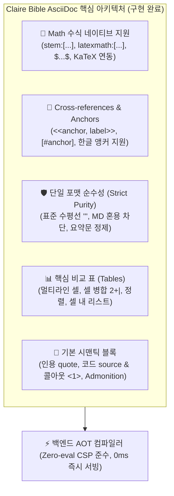

# AsciiDoc 기능 고도화 및 확장 설계 명세서 (AsciiDoc Capability Expansion Design)

작성일: 2026-09-01 (개정일: 2026-09-26) · 상태: **최종 구현 및 검증 완료 (Completed)** · 기준: [GOALS.md](../../upstream/GOALS.md) 트랙2(추출·연결 품질) 및 트랙3(가독성·소비 품질) / 관련: [DUAL_FORMAT_ADOC_DESIGN.md](DUAL_FORMAT_ADOC_DESIGN.md), [TABLE_INGESTION_DESIGN.md](TABLE_INGESTION_DESIGN.md)

---

## 1. 개요 및 배경

Claire Bible은 수집된 기술 문서, 아티클, 논문 등을 LLM을 통해 정제하여 가독 본문(`documents.detail`)을 생성하고, 이를 지식 그래프 및 전용 리더 뷰로 제공하는 개인용 지식베이스입니다.

기존 [DUAL_FORMAT_ADOC_DESIGN.md](DUAL_FORMAT_ADOC_DESIGN.md)를 통해 **인용(Quote), 코드 및 콜아웃(Callout `<1>`), Admonition(NOTE/TIP), 표(Table), 형광 하이라이트(`#...#`)** 및 **백엔드 AOT(Ahead-of-Time) 시맨틱 렌더링**을 성공적으로 도입하였습니다.

본 문서는 업계 표준 기술 문서화 비교 사양(Docsio: *AsciiDoc vs Markdown at a glance*)을 기반으로, Claire Bible의 도메인 특성(지식 그래프 노드 구조, 가독 중심 본문 서술)에 부합하는 **핵심 역량을 선별·도입하고 불필요한 과도 엔지니어링 항목을 엄격히 배제**한 최종 명세를 정의합니다.

---

## 2. AsciiDoc vs Markdown 비교 차원 및 적합성 평가

기술 문서 작성 표준 비교(Docsio 분석 기준)와 Claire Bible 시스템의 특성(AI/ML 논문 및 기술 문서 수집, LLM 자동 생성, AOT 컴파일, 지식 그래프 연결)을 결합하여 분석 및 확정한 결과는 다음과 같습니다.

| 항목 (Dimension) | Markdown 한계 | AsciiDoc 표준 역량 | Claire Bible 최종 평가 및 구현 상태 |
| :--- | :--- | :--- | :---: |
| **Math (수식)** | 표준 미지원 (외부 JS/플러그인 필요) | `stem:[...]`, `latexmath:[...]` 네이티브 지원 | **도입 완료 (✅)**<br>arXiv 논문/수학 공식 손실 없는 렌더링 (KaTeX 연동) |
| **Cross-references (상호 참조)** | raw HTML 앵커에 의존, 깨지기 쉬움 | `<<anchor, Label>>`, `[#anchor]` 네이티브 | **도입 완료 (✅)**<br>긴 본문 내 목차-문단 이동 및 한글 앵커 완비 |
| **Callouts & Notes** | 도구별 파편화 (MkDocs, Docusaurus 등) | `NOTE:`, `TIP:`, `WARNING:` 등 표준 이식성 | **도입 완료 (✅)**<br>AOT 파이프라인 및 테마 박스 완비 |
| **Thematic Breaks (수평선)** | `---`, `***` 등 혼재 | `'''` 단일 표준 문법 | **도입 완료 (✅)**<br>AsciiDoc 표준 준수 및 Markdown식 혼용 차단 |
| **Tables (표 구조)** | GFM 기본 표 (병합/정렬 제한) | 멀티라인, Colspan/Rowspan, 정렬 지원 | **도입 완료 (✅)**<br>가독 비교표를 위한 실용 문법 완비 |
| **Includes / Transclusion** | 기본 스펙 미지원 | `include::file.adoc[]`, 라인/태그 지정 | **배제 (❌)**<br>적재 게시물은 독립 완결형이며, 타 게시물을 include할 필요 없음 (지식 연결/합성은 지식 그래프 엣지가 담당) |
| **Tables (CSV 임베드)** | 기본 스펙 미지원 | CSV/TSV 외부 데이터셋 임베드 | **배제 (❌)**<br>가독 본문은 핵심 비교/정리용 표로 충분하며, 스프레드시트 수준의 원시 데이터셋 표현 대상이 아님 |
| **Attributes / Variables** | 기본 스펙 미지원 | `:attr: value`, `{attr}` 인라인 변수 치환 | **배제 (❌)**<br>태그/메타데이터는 지식 노드가 단일 관리하므로 본문 내 이중 기재 방지 |
| **Conditionals** | 미지원 | `ifdef::`, `ifeval::` 조건부 렌더링 | **배제 (❌)**<br>단일 정제 가독 본문 원칙에 불필요 |
| **Output formats (다중 포맷)** | HTML 중심 | HTML, PDF, EPUB 등 네이티브 툴체인 | **선택적 검토 (💡)**<br>본문 마크업 사양이 아닌 오프라인 책자 내보내기 부가 도구 |

---

## 3. 핵심 도입 기능 상세 설계 (구현 완료)



---

### 1) Phase 1: 즉각적 가독성 및 문서 품질 향상 (✅ 구현 및 검증 완료)

#### A. 수식(Math) 네이티브 지원 (`stem:[...]`, `latexmath:[...]`, `[latexmath]`)
- **도입 목적**: AI/ML 논문(arXiv), 암호학, 알고리즘 수식의 손실 없는 표현 및 렌더링.
- **문법 표준**:
  - 인라인 수식: `stem:[E = mc^2]`, `latexmath:[O(N \log N)]`, `asciimath:[sqrt(x)]`
  - 블록 수식:
    ```asciidoc
    [latexmath]
    ++++
    \nabla \times \mathbf{E} = -\frac{\partial \mathbf{B}}{\partial t}
    ++++
    ```
    또는
    ```asciidoc
    [stem]
    ----
    x = \frac{-b \pm \sqrt{b^2 - 4ac}}{2a}
    ----
    ```
- **파이프라인 구현 완료 내역**:
  1. **프롬프트 (`prompts.py`)**: `render_detail_prompt_adoc` 규칙 9번에 수학/물리/알고리즘 공식을 `stem:[...]` 또는 `[latexmath]`로 서술하도록 가이드라인 추가 완료.
  2. **AOT 렌더러 (`aot.py`)**:
     - `stem:[...]`, `latexmath:[...]`, `asciimath:[...]` $\rightarrow$ `<span class="math inline" data-math="..."><code>...</code></span>`
     - `[latexmath]++++` 또는 `[stem]----` 블록 $\rightarrow$ `<div class="mathblock display" data-math="..."><div class="content"><pre class="math"><code>...</code></pre></div></div>`
  3. **UI 렌더링 & CSS (`graphview.py`)**:
     - KaTeX/TeX 수식 폰트(`KaTeX_Math`, `Times New Roman`, `serif`) 및 패딩/스크롤 스타일(`.doc-content .math`, `.doc-content .mathblock`) 적용.
     - Markdown과 AsciiDoc 공통 렌더링 컨테이너는 포맷 중립 클래스 `.doc-content`를 사용하며, 최상위 문단(`.doc-content > p`)에 `text-align: justify`, `text-align-last: start`, `text-justify: auto`, `text-indent: 1em`(한국어/동아시아 타이포그래피 표준 첫 줄 들여쓰기) 및 단독 이미지 들여쓰기 초기화(`.doc-content > p:has(> img:only-child), .doc-content > p:has(> a:only-child > img:only-child) { text-indent: 0; }`)를 적용.
     - `GRAPH_HTML` 및 `shared_html` 클라이언트 사이드 Fallback 렌더러에 동일 JS 파서 동기화 완료.

#### B. 크로스레퍼런스 및 내부 앵커 (`<<anchor>>`, `xref:...[]`, `[#anchor]`)
- **도입 목적**: 긴 가독 본문 내에서 목차 $\leftrightarrow$ 세부 섹션, 또는 용어 정의 $\leftrightarrow$ 본문 간 매끄러운 인페이지 내비게이션 제공.
- **문법 표준**:
  ```asciidoc
  상세 설정은 <<config-section, 환경 설정 섹션>> 및 <<sec-intro>>를 참조하라.
  또한 xref:note-box[주의사항]도 확인하라.

  [#config-section]
  == 환경 설정

  == [#sec-intro] 서론
  [[inline-anchor]]인라인 앵커 예시
  ```
- **파이프라인 구현 완료 내역**:
  1. **AOT 렌더러 (`aot.py`)**:
     - `[#id]`, `[[id]]`, `== [#id] 제목`, `== 제목 [#id]`를 파싱하여 대상 헤더, 단락, Admonition, 블록 및 표에 `id="id"` 속성 주입.
     - 인라인 `[[id]]` $\rightarrow$ `<a id="id" class="anchor"></a>`
     - `<<anchor, Label>>`, `<<anchor>>`, `xref:anchor[Label]` $\rightarrow$ `<a href="#anchor" class="xref">Label</a>` 링크 컴파일.
  2. **리더 뷰 UI & CSS (`graphview.py`)**:
     - 상호 참조 링크 전용 스타일(`.doc-content a.xref`) 및 `:target` 도달 시 부드러운 하이라이트 애니메이션(`xref-target-highlight`) 적용.
     - `GRAPH_HTML` 및 `shared_html` 클라이언트 렌더러에 앵커/크로스레퍼런스 동기화 완료.
  3. **프롬프트 (`prompts.py`)**:
     - `render_detail_prompt_adoc` 규칙 10번에 긴 문서 주요 섹션 앵커(`[#섹션ID]`) 및 상호 참조(`<<섹션ID, 제목>>`) 지침 추가 완료.

---

### 2) 도메인 적합성 검토 결과 배제된 항목 (과도 엔지니어링 차단)

#### A. 게시물 간 트랜스클루전 (`include::...[]`) — 배제 (❌)
- **검토 결론**: Claire Bible의 적재 게시물은 독립 완결형 본문입니다. 다른 게시물이 특정 게시물의 본문을 직접 `include`하여 표시할 유즈케이스가 존재하지 않으며, 문서 간의 맥락 연결과 다중 노드 종합은 지식 그래프의 관계 엣지(Relations: `improves`, `derived_from` 등) 및 전용 LLM 합성(Synthesis) 파이프라인이 담당하므로 원문 치환 삽입 문법은 도입하지 않습니다.

#### B. CSV 테이블 임베드 (`[%header,format=csv]|===`) — 배제 (❌)
- **검토 결론**: 본문 내 표는 기술 스펙, 성능 수치, 장단점 등을 독자가 빠르게 파악하도록 정리하는 가독 비교표 용도입니다. 외부 CSV를 로드할 만큼 방대하거나 상세한 원시 스프레드시트를 표현하는 대상이 아니며, 이미 기구현된 표준 `|===` 테이블(멀티라인 셀, 행/열 병합 `2+|`, `.2+|`, 정렬 `<|`, `^|`, `>|`, 셀 내 리스트)로 가독 표현력이 완벽히 충족됩니다.

#### C. 유형별 Export 및 다중 문서 결합 기능 — 보류/향후 이관 (⏳)
- **검토 결론**: 개별 적재 문서를 다루는 현재 단계에서는 여러 AsciiDoc 문서를 묶어서 처리할 일이 없으므로, 별도의 유형별 Export(PDF, ePub 등) 기능은 현재 단계에서 추가하지 않습니다.
- **향후 계획**: 여러 본문을 하나의 묶음으로 취급하고 표시하는 **서류철(File/Binder) 기능**을 추후 설계할 때, 해당 서류철 단위의 묶음 표시 및 내보내기 사양과 연계하여 일괄 설계·구현합니다.

---

## 4. 아키텍처 및 안전성 영향 검토

| 계층 / 컴포넌트 | 변경 범위 및 영향 | 안전성 및 호환성 대책 |
| :--- | :--- | :--- |
| **LLM 프롬프트 (`prompts.py`)** | • 수식(`stem:`), 앵커(`[#id]`, `<<id>>`), 표준 수평선(`'''`) 가이드라인 반영. | • 기존 포맷(MD) 및 ADOC 기본 작성 지침과 완전한 하위 호환. |
| **AOT 렌더러 (`aot.py`)** | • 수식, 앵커, 한글 ID, 표준 구분선 정규식 파서 탑재. | • Zero-eval CSP 원칙(`script-src 'self'`) 엄격 준수.<br>• 모든 텍스트 출력 `DOMPurify.sanitize()` 유지. |
| **DB & 인덱싱 (`store/db.py`)** | • `documents.raw_text` 및 FTS5는 영향 없음. | • 본문 가독 렌더링(`detail`, `detail_html`) 계층에만 격리 적용. |
| **소비 계층 (RAG / MCP)** | • 구조화된 `stem:`, `<<xref>>` 태그가 LLM의 수식/맥락 이해도 증진. | • RAG 파이프라인에서 불필요한 마크업 파싱 에러 발생 차단. |

---

## 5. 결론 및 최종 구현 완료 사양

1. **핵심 기능 구현 완료 (Completed)**:
   - `stem:[...]`, `latexmath:[...]`, `$...$`, `$$...$$`, `\(...\)` 수식 렌더링 및 KaTeX 브라우저 연동 완료.
   - `<<anchor, label>>`, `xref:anchor[label]`, `[#anchor]`, `[[anchor]]` 상호 참조 및 **한글 앵커** 지원 완료.
   - AsciiDoc 표준 수평선(`'''`) 파싱 및 시맨틱 `<hr>` 렌더링 완료.
   - 일반 텍스트 요약문(Plain Summary) 생성 시 앵커/Xref 마크업 누출 방지 정제(`clean_plain_summary`) 완료.
2. **단일 포맷 순수성 및 비표준 혼용 거부 원칙 (Strict Format Purity & Refusal Policy)**:
   - AsciiDoc 모드(`CLAIRE_RENDER_FORMAT=adoc`)에서는 순수 AsciiDoc 표준 문법만을 엄격히 준수하며, Markdown 문법(`---`, `###`, `[text](url)` 등)의 혼용을 원천 차단.
   - 구분선(Thematic Break)은 오직 AsciiDoc 표준 `'''`만을 `<hr>`로 렌더링.
   - 향후 비표준 혼용 렌더링 허용 요청(Ad-hoc patch)은 설계 원칙에 따라 단호히 거부(Refuse)하고 프롬프트/문서 표준을 교정함([DUAL_FORMAT_ADOC_DESIGN.md Section 6](DUAL_FORMAT_ADOC_DESIGN.md#6-단일-포맷-순수성-및-비표준-혼용-거부-정책-strict-format-purity--refusal-policy) 참조).
3. **불필요한 과도 사양 배제 및 서류철(File) 기능 연계 확정**:
   - `include::` 트랜스클루전, CSV 표, 본문 메타데이터 바 등 Claire Bible의 지식 노드 아키텍처 및 가독 본문 목적에 부합하지 않는 항목은 전면 배제하여 아키텍처 간결성과 안정성을 확립.
   - 유형별 Export 기능은 현재 단일 문서 적재 체계에서는 도입하지 않으며, 향후 **여러 본문을 묶어서 관리·표시하는 '서류철(File)' 기능**을 설계할 때 함께 다루도록 명확히 기록·유예함.
