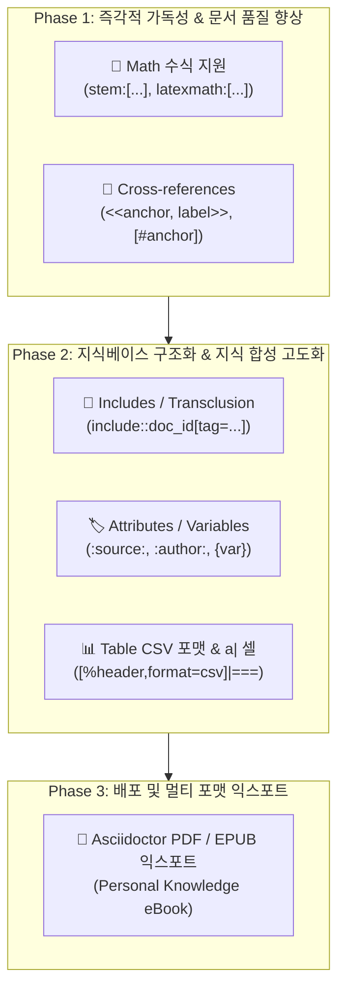

# AsciiDoc 기능 고도화 및 확장 설계 명세서 (AsciiDoc Capability Expansion Design)

작성일: 2026-09-01 · 상태: **설계 및 로드맵 수립 (Proposed / Roadmap)** · 기준: [GOALS.md](../../../GOALS.md) 트랙2(추출·연결 품질) 및 트랙3(가독성·소비 품질) / 관련: [DUAL_FORMAT_ADOC_DESIGN.md](DUAL_FORMAT_ADOC_DESIGN.md), [TABLE_INGESTION_DESIGN.md](TABLE_INGESTION_DESIGN.md)

---

## 1. 개요 및 배경

Claire Bible은 수집된 기술 문서, 아티클, 논문 등을 LLM을 통해 정제하여 가독 본문(`documents.detail`)을 생성하고, 이를 지식 그래프 및 전용 리더 뷰로 제공하는 개인용 지식베이스입니다.

기존 [DUAL_FORMAT_ADOC_DESIGN.md](DUAL_FORMAT_ADOC_DESIGN.md)를 통해 **인용(Quote), 코드 및 콜아웃(Callout `<1>`), Admonition(NOTE/TIP), 표(Table), 형광 하이라이트(`#...#`)** 및 **백엔드 AOT(Ahead-of-Time) 시맨틱 렌더링**을 성공적으로 도입하였습니다.

본 문서는 업계 표준 기술 문서화 비교 사양(Docsio: *AsciiDoc vs Markdown at a glance*)을 기반으로, 현재 Claire Bible의 AsciiDoc 구현 수준을 한 단계 더 도약시키기 위한 **핵심 기능 선별, 우선순위, 아키텍처 확장 및 단계별 도입 명세**를 정의합니다.

---

## 2. AsciiDoc vs Markdown 비교 차원 및 적합성 평가

기술 문서 작성 표준 비교(Docsio 분석 기준)와 Claire Bible 시스템의 특성(AI/ML 논문 및 기술 문서 수집, LLM 자동 생성, AOT 컴파일, 다중 노드 지식 합성)을 결합하여 분석한 결과는 다음과 같습니다.

| 항목 (Dimension) | Markdown 한계 | AsciiDoc 표준 역량 | Claire Bible 도입 가치 및 적합성 |
| :--- | :--- | :--- | :---: |
| **Math (수식)** | 표준 미지원 (외부 JS/플러그인 필요) | `stem:[...]`, `latexmath:[...]` 네이티브 지원 | **최우선 (⭐⭐⭐)**<br>arXiv 논문/수학 공식 손실 없는 렌더링 |
| **Cross-references (상호 참조)** | raw HTML 앵커에 의존, 깨지기 쉬움 | `<<anchor, Label>>`, `[#anchor]` 네이티브 | **최우선 (⭐⭐⭐)**<br>긴 본문 내 목차-문단 이동 및 용어 참조 |
| **Includes / Transclusion** | 기본 스펙 미지원 | `include::file.adoc[]`, 라인/태그 지정 | **높음 (⭐⭐⭐)**<br>다중 노드 지식 합성 및 1-홉 병합 모듈화 |
| **Attributes / Variables** | 기본 스펙 미지원 | `:attr: value`, `{attr}` 인라인 변수 치환 | **높음 (⭐⭐)**<br>본문 상단 메타데이터 바 및 태그 뱃지 자동화 |
| **Tables (표 고도화)** | GFM 기본 표 (병합/캡션 불가) | CSV/TSV 임베드, `a\|` AsciiDoc 셀 스타일 | **높음 (⭐⭐)**<br>LLM 토큰 효율화(CSV) 및 표 내 복합 블록 |
| **Output formats (다중 포맷)** | HTML 중심 | HTML, PDF, EPUB 등 네이티브 툴체인 | **중장기 (⭐)**<br>개인 지식 서적(e-Book/PDF) 일괄 내보내기 |
| **Callouts & Notes** | 도구별 파편화 (MkDocs, Docusaurus 등) | `NOTE:`, `TIP:`, `WARNING:` 등 표준 이식성 | **기구현 (✅)**<br>이미 AOT 파이프라인으로 완비됨 |
| **Conditionals** | 미지원 | `ifdef::`, `ifeval::` 조건부 렌더링 | **선택적 (💡)**<br>요약 모드 / 상세 모드 뷰 스위칭 검토 |

---

## 3. 핵심 도입 기능 상세 설계 (단계별 로드맵)



---

### 1) Phase 1: 즉각적 가독성 및 문서 품질 향상

#### A. 수식(Math) 네이티브 지원 (`stem:[...]`, `[latexmath]`)
- **도입 목적**: AI/ML 논문(arXiv), 암호학, 알고리즘 수식의 손실 없는 표현 및 렌더링.
- **문법 표준**:
  - 인라인 수식: `stem:[E = mc^2]` 또는 `latexmath:[O(N \log N)]`
  - 블록 수식:
    ```asciidoc
    [latexmath]
    ++++
    \nabla \times \mathbf{E} = -\frac{\partial \mathbf{B}}{\partial t}
    ++++
    ```
- **파이프라인 구현 방안**:
  1. **프롬프트 (`prompts.py`)**: LLM이 기술 문서 재구성 시 수학/물리/알고리즘 공식을 `stem:[...]` 또는 `[latexmath]`로 서술하도록 가이드라인 추가.
  2. **AOT 렌더러 (`aot.py`)**:
     - `stem:[...]` $\rightarrow$ `<span class="math inline" data-math="...">...</span>`
     - `[latexmath]` 블록 $\rightarrow$ `<div class="math display" data-math="...">...</div>`
  3. **UI 렌더링**: CSP `'self'`를 준수하는 KaTeX 사전 렌더링 또는 프론트엔드 안전 모듈 연동.

#### B. 크로스레퍼런스 및 내부 앵커 (`<<anchor>>`, `[#anchor]`)
- **도입 목적**: A4 2~4장에 달하는 긴 가독 본문 내에서 목차 $\leftrightarrow$ 세부 섹션, 또는 용어 정의 $\leftrightarrow$ 본문 간 매끄러운 인페이지 내비게이션 제공.
- **문법 표준**:
  ```asciidoc
  상세 설정은 <<config-section, 환경 설정 섹션>>을 참조하라.

  [#config-section]
  == 환경 설정
  ```
- **파이프라인 구현 방안**:
  1. **AOT 렌더러 (`aot.py`)**:
     - `[#id]` 및 `[[id]]` 블록 메타데이터를 파싱하여 직후 등장하는 헤더/블록에 `id="id"` 속성 부여.
     - `<<anchor, Label>>` 또는 `<<anchor>>`를 `<a href="#anchor" class="xref">Label</a>` 링크로 컴파일.
  2. **리더 뷰 UI**: 클릭 시 모달 내부 부드러운 스크롤(`scrollIntoView({behavior: 'smooth'})`) 및 하이라이트 애니메이션 적용.

---

### 2) Phase 2: 지식베이스 구조화 및 지식 합성(Synthesis) 고도화

#### C. 문서 간 트랜스클루전 (Includes / Transclusion: `include::...[]`)
- **도입 목적**: 다중 노드 종합 문서(Multi-node Synthesis) 및 1-홉 병합(One-Hop Merge) 시, 하위 문서의 본문을 물리적으로 복제하지 않고 모듈형으로 결합하여 계보(Provenance)를 보존.
- **문법 확장**:
  ```asciidoc
  == 핵심 요약
  include::doc_78a502779928[tag=summary]

  == 아키텍처 비교
  include::doc_8c2ff9d10ff1[lines=15..45]
  ```
- **파이프라인 구현 방안**:
  1. 가상 URI 해석기(`VirtualIncludeResolver`): `doc_<id>` 또는 `canonical_url` 식별자를 DB 조회하여 지정된 태그/라인 슬라이스를 추출 및 인라인 치환.
  2. 원본 수정 시 종합 문서가 항상 최신 맥락을 동기화하여 유지.

#### D. 문서 속성 및 메타데이터 바 (`:attr:`, `{attr}`)
- **도입 목적**: 문서 출처, 저자, 발표일, 핵심 키워드 등의 메타데이터를 본문과 구조적으로 결합.
- **문법 표준**:
  ```asciidoc
  :author: Geoffrey Hinton
  :published-at: 2026-03-15
  :source-url: https://arxiv.org/abs/...
  :difficulty: Advanced
  ```
- **파이프라인 구현 방안**:
  - `aot.py`가 문서 헤더의 속성(`:key: value`)을 딕셔너리로 수집.
  - 본문 최상단에 메타데이터 카드(`<div class="doc-metadata-bar">`)를 자동으로 생성하여 가독성 증대.

#### E. 표(Table) CSV 포맷 및 `a|` AsciiDoc 셀 지원
- **도입 목적**:
  - `[%header,format=csv]|===`: 복잡한 정렬 파이프 대신 CSV 문자열을 사용하여 **LLM 생성 토큰 30~50% 절감**.
  - `a|`: 표 내부 셀에 인라인 코드 블록이나 리스트를 포함하는 복합 데이터 시각화 지원.

---

### 3) Phase 3: 배포 및 멀티 포맷 익스포트

#### F. 개인 지식 서적(e-Book) 및 PDF/EPUB 내보내기
- **도입 목적**: 축적된 지식베이스나 다중 노드 종합 연구 문서를 오프라인 열람 가능한 단일 전자책(PDF/EPUB)으로 변환.
- **구현 방안**:
  - Asciidoctor CLI 툴체인 컨테이너 연동 (`Asciidoctor-pdf`, `Asciidoctor-epub3`).
  - `cb-manuscript app export-book --topic "LLM Agent"` 명령어로 큐레이션된 책자 자동 빌드.

---

## 4. 아키텍처 및 안전성 영향 검토

| 계층 / 컴포넌트 | 변경 범위 및 영향 | 안전성 및 호환성 대책 |
| :--- | :--- | :--- |
| **LLM 프롬프트 (`prompts.py`)** | • 수식(`stem:`), 앵커(`[#id]`, `<<id>>`), CSV 표 가이드라인 추가. | • 기존 포맷(MD) 및 ADOC 기본 작성 지침과 완전한 하위 호환. |
| **AOT 렌더러 (`aot.py`)** | • 수식, 앵커, 메타데이터 바, CSV 표 정규식 파서 추가. | • Zero-eval CSP 원칙(`script-src 'self'`) 엄격 준수.<br>• 모든 텍스트 출력 `DOMPurify.sanitize()` 유지. |
| **DB & 인덱싱 (`store/db.py`)** | • `documents.raw_text` 및 FTS5는 영향 없음. | • 본문 가독 렌더링(`detail`, `detail_html`) 계층에만 격리 적용. |
| **소비 계층 (RAG / MCP)** | • 구조화된 `stem:`, `<<xref>>` 태그가 LLM의 수식/맥락 이해도 증진. | • RAG 파이프라인에서 불필요한 마크업 파싱 에러 발생 차단. |

---

## 5. 결론 및 권장 실행 단계

1. **1단계 (즉시 적용 권장)**: `stem:[...]` 수식 렌더링 및 `<<anchor>>` 상호 참조 지원을 [`render/aot.py`](../../src/claire/render/aot.py)와 [`extract/prompts.py`](../../src/claire/extract/prompts.py)에 반영하여 기술/학술 문서의 리더 경험을 극대화.
2. **2단계 (중기 적용)**: 다중 노드 종합(Synthesis) 고도화 시점에 `include::doc_id` 트랜스클루전 및 문서 속성(`:key: val`) 메타 바 구축.
3. **3단계 (장기 적용)**: Asciidoctor PDF 툴체인을 결합한 지식 아카이브 전자책 내보내기 기능 구현.
