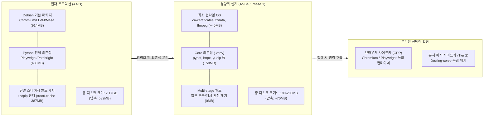
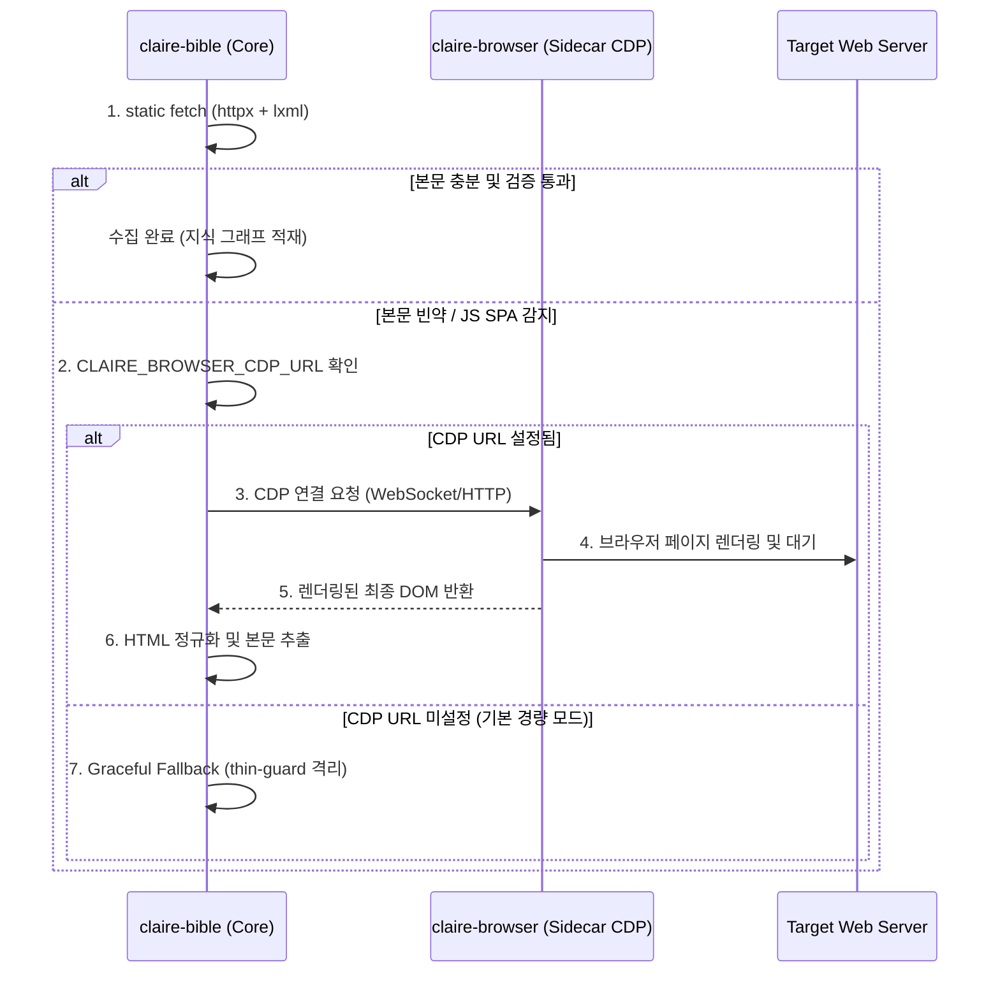

# Container Slimming & Dependency Decoupling Design

> **문서 번호:** SPEC-CONTAINER-20260908-01 (Phase 1)  
> **문서 상태:** 설계 및 구현 규격 (Specification)  
> **상위 문서:** [CLAIRE_ARCHITECTURE_ROADMAP.md](../CLAIRE_ARCHITECTURE_ROADMAP.md) (과제 1 / Phase 1)  
> **관련 문서:** [PDF_PARSER_AND_VISION_GUARDRAILS_DESIGN.md](./PDF_PARSER_AND_VISION_GUARDRAILS_DESIGN.md), [OPERATIONS.md](../implementation/OPERATIONS.md)

---

## 1. 개요 및 설계 목적

본 문서는 클레어바이블(Claire-Bible) 메인 컨테이너의 비대화 문제를 해결하고, 자원 제약이 있는 소형 VPS 및 개인 연구 환경에서도 가볍고 신속하게 동작할 수 있도록 **컨테이너 경량화 및 의존성 분리(Container Slimming & Dependency Decoupling)** 아키텍처를 정의합니다.

프로덕션 서버(`root@clairebible.netspheres.org`) 실사 결과, 단일 이미지 크기가 **디스크 2.17GB, 압축 582MB**에 달하는 것으로 확인되었습니다. 본 설계는 기존의 추출 프롬프트 파이프라인과 산출물의 정합성을 온전히 유지하면서, 메인 이미지 크기를 **약 180~200MB (압축 시 ~70MB)** 수준으로 90% 이상 감축하는 것을 목표로 합니다.



---

## 2. 프로덕션 실사 기반 비대화 원인 분석 (Root Cause Analysis)

프로덕션 호스트에서 `docker history`, `dpkg-query`, `du` 명령을 통해 추출한 계층별 자원 점유 현황은 다음과 같습니다.

### 2.1 레이어별 용량 점유 실사 데이터

| 점유 계층 | 주요 항목 및 패키지 | 실사 크기 | 비대화 원인 분석 |
| :--- | :--- | :--- | :--- |
| **시스템 APT 패키지** | `chromium` (314MB), `libllvm19` (126MB), `chromium-common` (64MB), `mesa-libgallium` (41MB), `libgtk-3` (30MB) 등 | **914MB** | Headless 스크래핑을 위해 브라우저 엔진 전체 및 그래픽/X11 런타임이 무차별 유입됨. |
| **Python 패키지 (`.venv`)** | `playwright` (134MB), `patchright` (134MB), `curl_cffi` (38MB), `cryptography` (15MB), `yt-dlp` (12MB) | **400MB** | `scrapling[fetchers]` extra 설치 시 Playwright/Patchright 이중 렌더러가 동시에 포함됨. |
| **빌드 캐시 및 루트 잔재** | `/root/.cache` (uv 및 pip 캐시 레이어 387MB), 빌드 도구 | **387MB** | Single-stage 빌드로 인해 `uv` 빌드 도구와 다운로드된 휠 캐시가 최종 이미지 레이어에 잔류. |
| **기본 OS 및 앱 소스** | `python:3.11-slim` 기본 런타임 (~125MB), `src/` 코드 (~12MB) | **137MB** | 필수 기본 요소. |
| **총계** | **claire-bible:local** | **2.17GB** | **비압축 2.17GB / 압축 전송 크기 582MB** |

### 2.2 감축 설계 방향

1. **브라우저 엔진 분리**: 914MB에 달하는 시스템 Chromium 및 300MB 규모의 Playwright/Patchright를 메인 컨테이너에서 배제.
2. **Multi-stage 빌드 도입**: 빌드 도구(`uv`)와 패키지 다운로드 캐시(`/root/.cache`)가 런타임 이미지에 남지 않도록 빌드 스테이지와 런타임 스테이지를 물리적으로 격리.
3. **미디어 유틸리티 선별 유지 (옵션 A 확정)**: 개인 연구 및 봇 환경의 멀티모달 오디오 수집(YouTube STT 등) 편의성을 위해 경량 `ffmpeg`와 `yt-dlp`는 메인 컨테이너에 유지하여 최종 크기 ~180-200MB 달성.

---

## 3. 2-Stage Multi-stage 빌드 파이프라인 규격

### 3.1 빌드 구조 다이어그램

```mermaid
flowchart TD
    subgraph Stage1 ["Stage 1: Builder (ghcr.io/astral-sh/uv)"]
        UvBin["uv 바이너리 마운트"]
        CopyDef["pyproject.toml, uv.lock 복사"]
        CacheMount["--mount=type=cache,target=/root/.cache/uv"]
        UvSync["uv sync --frozen --no-dev\nCore + Audio (ffmpeg/yt-dlp) 빌드"]
        VenvBuilt["정제된 경량 .venv (~50MB)"]
        
        UvBin --> CopyDef --> CacheMount --> UvSync --> VenvBuilt
    end

    subgraph Stage2 ["Stage 2: Runtime (python:3.11-slim)"]
        SlimBase["python:3.11-slim (~125MB)"]
        MinApt["apt-get install ca-certificates tzdata ffmpeg (~40MB)"]
        CopyVenv["COPY --from=builder /app/.venv /app/.venv"]
        CopySrc["COPY src/ /app/src/"]
        
        SlimBase --> MinApt --> CopyVenv --> CopySrc
        FinalImg["최종 런타임 이미지\n디스크 ~180-200MB / 압축 ~70MB"]
        CopySrc --> FinalImg
    end
```



### 3.2 Dockerfile 명세

```dockerfile
# syntax=docker/dockerfile:1.6

# ------------------------------------------------------------------------------
# Stage 1: 의존성 해석 및 가상환경 빌드 (Builder)
# ------------------------------------------------------------------------------
FROM python:3.11-slim AS builder

WORKDIR /app

# 공식 uv 바이너리 추출 (바이너리 단일 파일 마운트)
COPY --from=ghcr.io/astral-sh/uv:0.4.18 /uv /uvx /bin/

ENV UV_COMPILE_BYTECODE=1 \
    UV_LINK_MODE=copy \
    PYTHONUNBUFFERED=1

# 의존성 정의 파일 선행 복사 (캐시 레이어 최적화)
COPY pyproject.toml uv.lock README.md ./

# Core 및 Audio extra 설치 (브라우저 관련 extra stealth/docling 배제)
# BuildKit 캐시 마운트를 통해 호스트 캐시를 공유하고 레이어 잔재 원천 차단
RUN --mount=type=cache,target=/root/.cache/uv \
    uv sync --frozen --no-dev --no-install-project --extra audio

# 애플리케이션 소스 복사 후 프로젝트 설치
COPY src/ ./src/
RUN --mount=type=cache,target=/root/.cache/uv \
    uv sync --frozen --no-dev --extra audio

# ------------------------------------------------------------------------------
# Stage 2: 최소 런타임 환경 (Runtime)
# ------------------------------------------------------------------------------
FROM python:3.11-slim AS runtime

WORKDIR /app

ENV PYTHONUNBUFFERED=1 \
    PATH="/app/.venv/bin:/host-bin:$PATH" \
    SSL_CERT_FILE=/etc/ssl/certs/ca-certificates.crt \
    SSL_CERT_DIR=/etc/ssl/certs \
    REQUESTS_CA_BUNDLE=/etc/ssl/certs/ca-certificates.crt \
    CURL_CA_BUNDLE=/etc/ssl/certs/ca-certificates.crt \
    HF_HOME=/app/data/cache/huggingface

# 최소 필수 런타임 라이브러리: 인증서, 타임존, 오디오 추출용 ffmpeg
RUN apt-get update && apt-get install -y --no-install-recommends \
        ca-certificates \
        tzdata \
        ffmpeg \
    && rm -rf /var/lib/apt/lists/*

# Builder 스테이지로부터 순수 가상환경과 소스코드만 이관
COPY --from=builder /app/.venv /app/.venv
COPY src/ ./src/
COPY pyproject.toml README.md ./

CMD ["claire", "bot"]
```

---

## 4. 의존성 분리 및 사이드카(Sidecar) 아키텍처

### 4.1 의존성 분류 체계

| 분류 | 의존 라이브러리 | 용도 및 특성 | 컨테이너 배치 |
| :--- | :--- | :--- | :---: |
| **Core (기본)** | `pydantic`, `httpx`, `python-telegram-bot`, `google-genai`, `lxml`, `youtube-transcript-api`, `pypdf`, `starlette`, `uvicorn`, `mcp` | 지식 그래프 온톨로지 생성, 일반 웹 정적 스크래핑, 텍스트 PDF 추출, REST/MCP API 제공 | **메인 컨테이너** |
| **Media Audio (선별)** | `yt-dlp[curl-cffi]`, 시스템 `ffmpeg` | YouTube/영상 오디오 스트림 획득 및 Gemini STT 전처리 | **메인 컨테이너** |
| **Browser (사이드카)** | `scrapling[fetchers]`, `playwright`, `patchright`, 시스템 `chromium` | 난독화 JS SPA 렌더링, 정적 봇차단 우회용 동적 헤더 시뮬레이션 | **브라우저 사이드카 (선택)** |
| **Parser (사이드카)** | `docling`, `torch`, `layoutlmv3` | 온프레미스 고정밀 표/레이아웃 객체 분할 (Tier 2) | **Docling 워커 (선택)** |

### 4.2 브라우저 사이드카 연동 규격

복잡한 클라이언트 사이드 렌더링(CSR)이 필수적인 URL을 수집해야 하는 경우, 메인 컨테이너가 직접 브라우저를 구동하는 대신 독립 구동되는 사이드카의 CDP(Chrome DevTools Protocol) 포트로 접속합니다.



### 4.3 Docker Compose 프로파일 규격 (`docker-compose.yml`)

```yaml
services:
  # 경량 코어 서비스 (기본 실행)
  bot:
    <<: *claire-service
    profiles: ["bot", "default"]
    command: ["claire", "bot"]

  api:
    <<: *claire-service
    profiles: ["api", "default"]
    command: ["claire", "serve-api"]

  # 선택형 브라우저 사이드카 (필요 시 --profile browser 로 가동)
  browser:
    image: zenika/alpine-chrome:latest
    profiles: ["browser"]
    restart: unless-stopped
    command:
      - --no-sandbox
      - --disable-gpu
      - --remote-debugging-address=0.0.0.0
      - --remote-debugging-port=9222
    environment:
      - CONNECTION_TIMEOUT=30000
    expose:
      - "9222"
```

---

## 5. 코드베이스 연동 및 무중단 폴백 (Graceful Degradation)

메인 컨테이너에서 브라우저 패키지가 제거되어도 기존 파이프라인의 안전성이 깨지지 않도록 `src/claire/ingest/fetchers/web.py`에서 다음 원칙을 준수합니다.

1. **Lazy Import 및 예외 방어**:
   - `scrapling` 및 `DynamicFetcher` 임포트 실패(`ImportError`)를 안전하게 처리하여 프로세스 크래시를 방지합니다.
2. **원격 CDP 라우팅 추상화**:
   - 환경변수 `CLAIRE_BROWSER_CDP_URL`이 설정되어 있으면 원격 브라우저로 렌더링을 위임하고, 미설정 시 로컬 실행을 시도하지 않고 즉시 정적 fallback 정책을 따릅니다.
3. **Thin-guard 보존**:
   - 브라우저 부재로 JS SPA 렌더링에 실패하더라도, 빈 텍스트가 정상 데이터로 적재되지 않도록 기존 `MIN_CONTENT` 및 `validate_web_content` 가드가 실패를 기록(`raw_inbox error`)하여 정합성을 유지합니다.

---

## 6. 산출물 정합성 및 파이프라인 불변 원칙

> [!IMPORTANT]
> **추출 파이프라인 불변(Zero Change) 원칙**:
> - 본 Phase 1(컨테이너 경량화) 단계에서는 지식 그래프 추출, 온톨로지 매핑, 요약 및 렌더링과 관련된 **LLM 프롬프트 및 파이프라인 로직을 일체 수정하지 않습니다**.
> - 프롬프트 퓨전(Prompt Fusion) 등 LLM 호출 최적화는 Phase 4 마일스톤에서 기존 산출물과의 A/B 비교 벤치마크를 거쳐 신중하게 추진됩니다.

---

## 7. 정량적 검증 기준 (Acceptance Criteria)

| 검증 항목 | 목표 기준 | 검증 방법 |
| :--- | :--- | :--- |
| **이미지 디스크 크기** | **<= 200MB** (기존 2.17GB 대비 90% 이상 절감) | `docker images claire-bible:local --format "{{.Size}}"` |
| **이미지 전송(압축) 크기** | **<= 80MB** (기존 582MB 대비 85% 이상 절감) | 레지스트리 푸시 또는 `docker save \| gzip \| wc -c` |
| **빌드 캐시 누수 제거** | 최종 이미지 내 `/root/.cache` 크기 **0MB** | `docker run --rm claire-bible:local du -sh /root/.cache` |
| **산출물 정합성** | 단위 테스트 및 정적 스크래핑/PDF 파싱 100% 통과 | `uv run pytest tests/test_web_scrape.py tests/test_pdf_fetch.py` |
| **오디오 수집 유지** | YouTube 트랜스크립트 및 오디오 추출 정상 구동 | `uv run pytest tests/test_video_fetcher.py tests/test_youtube_fetcher.py` |
