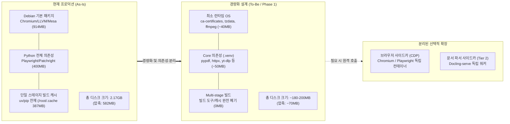

# Container Slimming & Dependency Decoupling Design

> **문서 번호:** SPEC-CONTAINER-20260908-01 (Phase 1) **문서 상태:** 설계 및 구현 규격 (Specification) **상위 문서:** [CLAIRE_ARCHITECTURE_ROADMAP.md](../CLAIRE_ARCHITECTURE_ROADMAP.md) (과제 1 / Phase 1) **관련 문서:** [PDF_PARSER_AND_VISION_GUARDRAILS_DESIGN.md](./PDF_PARSER_AND_VISION_GUARDRAILS_DESIGN.md), [OPERATIONS.md](../implementation/OPERATIONS.md)

---

## 1. 개요 및 설계 목적

본 문서는 클레어바이블(Claire-Bible) 메인 컨테이너의 비대화 문제를 해결하고, 자원 제약이 있는 소형 VPS 및 개인 연구 환경에서도 가볍고 신속하게 동작할 수 있도록 **컨테이너 경량화 및 의존성 분리(Container Slimming & Dependency Decoupling)** 아키텍처를 정의한다.

프로덕션 서버(`root@clairebible.netspheres.org`) 실사 결과, 단일 이미지 크기가 **디스크 2.17GB, 압축 582MB**에 달하는 것으로 확인되었다. 본 설계는 기존의 추출 프롬프트 파이프라인과 산출물의 정합성을 온전히 유지하면서, 메인 이미지 크기를 **약 180~200MB (압축 시 ~70MB)** 수준으로 90% 이상 감축하는 것을 목표로 한다.

```mermaid
flowchart LR
    subgraph AsIs ["현재 프로덕션 (As-Is)"]
        direction TB
        A1["Debian 기본 패키지\nChromium/LLVM/Mesa (914MB)"]
        A2["Python 전체 의존성\nPlaywright/Patchright (400MB)"]
        A3["단일 스테이지 빌드 캐시\nuv/pip 잔재 (/root/.cache 387MB)"]
        A1 --- A2 --- A3
        TotalA["총 디스크 크기: 2.17GB\n(압축: 582MB)"]
    end

    subgraph ToBe ["경량화 설계 (To-Be / Phase 1)"]
        direction TB
        B1["최소 런타임 OS\nca-certificates, tzdata, ffmpeg (~40MB)"]
        B2["Core 의존성 (.venv)\npypdf, httpx, yt-dlp 등 (~50MB)"]
        B3["Multi-stage 빌드\n빌드 도구/캐시 완전 폐기 (0MB)"]
        B1 --- B2 --- B3
        TotalB["총 디스크 크기: ~180-200MB\n(압축: ~70MB)"]
    end

    subgraph Decoupled ["분리된 선택적 확장"]
        C1["브라우저 사이드카 (CDP)\nChromium / Playwright 독립 컨테이너"]
        C2["문서 파서 사이드카 (Tier 2)\nDocling-serve 독립 워커"]
    end

    AsIs ==>|경량화 및 의존성 분리| ToBe
    ToBe -.->|필요 시 원격 호출| Decoupled
```

---

## 2. 프로덕션 실사 기반 비대화 원인 분석 (Root Cause Analysis)

프로덕션 호스트에서 `docker history`, `dpkg-query`, `du` 명령을 통해 추출한 계층별 자원 점유 현황은 다음과 같다.

### 2.1 레이어별 용량 점유 실사 데이터

| 점유 계층 | 주요 항목 및 패키지 | 실사 크기 | 비대화 원인 분석 |
| :--- | :--- | :--- | :--- |
| **시스템 APT 패키지** | `chromium` (314MB), `libllvm19` (126MB), `chromium-common` (64MB), `mesa-libgallium` (41MB), `libgtk-3` (30MB) 등 | **914MB** | Headless 스크래핑을 위해 브라우저 엔진 전체 및 그래픽/X11 런타임이 무차별 유입됨. |
| **Python 패키지 (`.venv`)** | `playwright` (134MB), `patchright` (134MB), `curl_cffi` (38MB), `cryptography` (15MB), `yt-dlp` (12MB) | **400MB** | `scrapling[fetchers]` extra 설치 시 Playwright/Patchright 이중 렌더러가 동시에 포함됨. |
| **빌드 캐시 및 루트 잔재** | `/root/.cache` (uv 및 pip 캐시 레이어 387MB), 빌드 도구 | **387MB** | Single-stage 빌드로 인해 `uv` 빌드 도구와 다운로드된 휠 캐시가 최종 이미지 레이어에 잔류. |
| **기본 OS 및 앱 소스** | `python:3.11-slim` 기본 런타임 (~125MB), `src/` 코드 (~12MB) | **137MB** | 필수 기본 요소. |
| **총계** | **claire-bible:local** | **2.17GB** | **비압축 2.17GB / 압축 전송 크기 582MB** |

### 2.2 감축 설계 방향

1. **브라우저 엔진 분리**: 914MB에 달하는 시스템 Chromium 및 300MB 규모의 Playwright/Patchright를 메인 컨테이너에서 배제.
2. **Multi-stage 빌드 도입**: 빌드 도구(`uv`)와 패키지 다운로드 캐시(`/root/.cache`)가 런타임 이미지에 남지 않도록 빌드 스테이지와 런타임 스테이지를 물리적으로 격리.
3. **미디어 유틸리티 선별 유지 (옵션 A 확정)**: 개인 연구 및 봇 환경의 멀티모달 오디오 수집(YouTube STT 등) 편의성을 위해 경량 `ffmpeg`와 `yt-dlp`는 메인 컨테이너에 유지하여 최종 크기 ~180-200MB 달성.

---

## 3. 산출물 정합성 및 파이프라인 불변 원칙

> [!IMPORTANT] **추출 파이프라인 불변(Zero Change) 원칙**:
> - 본 Phase 1(컨테이너 경량화) 단계에서는 지식 그래프 추출, 온톨로지 매핑, 요약 및 렌더링과 관련된 **LLM 프롬프트 및 파이프라인 로직을 일체 수정하지 않습니다**.
> - 프롬프트 퓨전(Prompt Fusion) 등 LLM 호출 최적화는 Phase 4 마일스톤에서 기존 산출물과의 A/B 비교 벤치마크를 거쳐 신중하게 추진된다.

