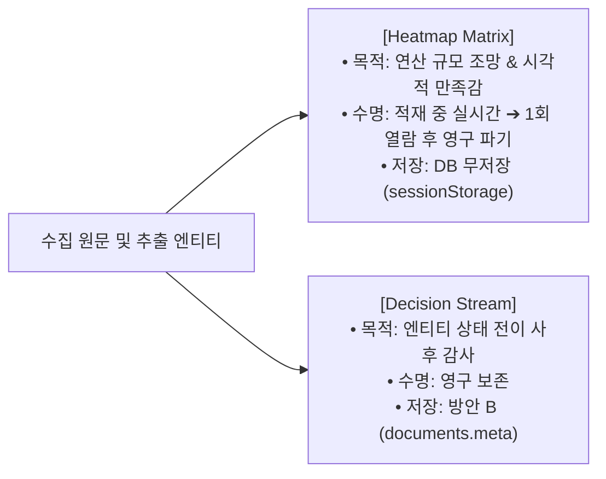
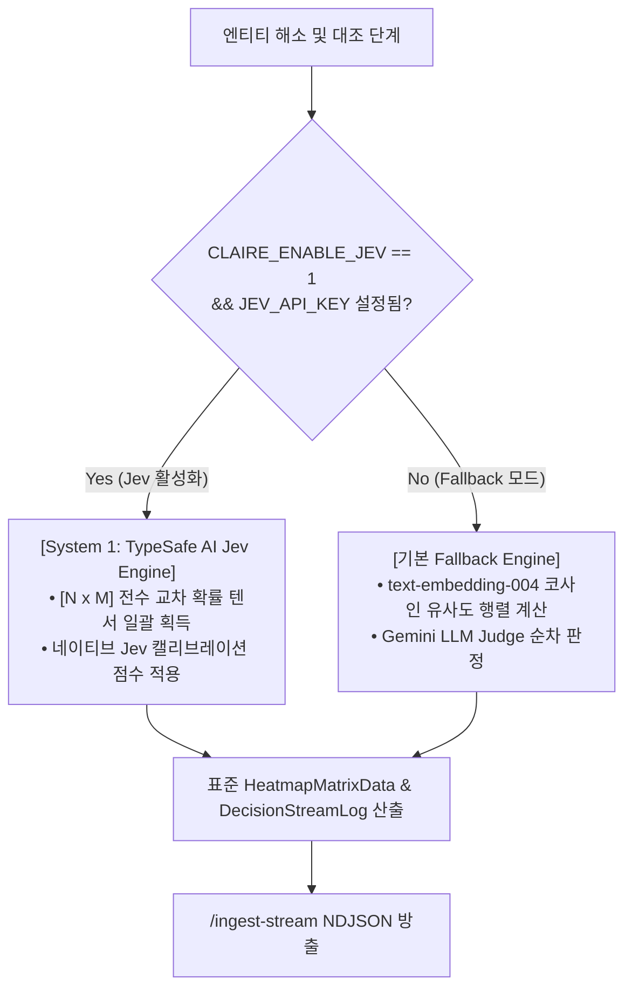
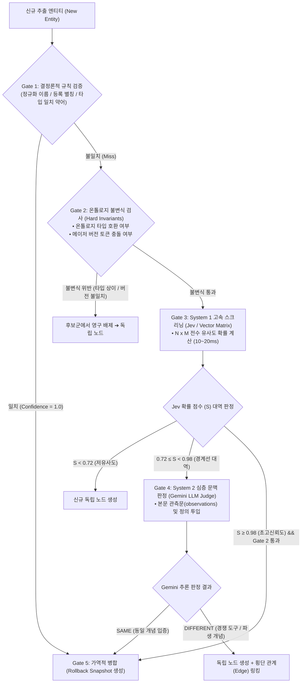

# 지식 노드 판단 시각화(Heatmap Matrix & Decision Stream) 및 TypeSafe AI Jev 연동 아키텍처 설계

작성일: 2026-09-27 · 상태: **Phase 1 Pre-work Implemented** · 기준: [GOALS.md](../../upstream/GOALS.md) 트랙2(추출·연결 품질) / 지식그래프 고도화 · 관련 문서: [KNOWLEDGE_GRAPH_LINKING_AND_CALIBRATION_DESIGN.md](KNOWLEDGE_GRAPH_LINKING_AND_CALIBRATION_DESIGN.md), [TELEMETRY_AND_SUPPORT_BUNDLE_DESIGN.md](TELEMETRY_AND_SUPPORT_BUNDLE_DESIGN.md), [ENVIRONMENT_VARIABLES.md](../implementation/ENVIRONMENT_VARIABLES.md)

---

## 1. 개요 및 배경

### 1.1 배경

Claire Bible의 인제스트 파이프라인은 유입된 문서로부터 엔티티와 관계를 추출하고, 기존 지식 베이스의 지식 노드들과 비교·해소(Entity Resolution)하여 그래프에 적재합니다.

이 과정에서 사용자는:
1. 백엔드에서 일어나는 대규모 지식 대조 연산의 밀도와 규모를 실시간으로 체감하고자 하며,
2. 사후에 특정 엔티티가 왜 병합되었거나 신규로 분기되었는지 인과관계를 검토·감사할 수 있는 기능을 요구합니다.

### 1.2 두 시각화의 명확한 목적 및 라이프사이클 분리



1. **Heatmap Matrix (대조 히트맵 매트릭스)**:
   - **목적**: 수집 본문 구절/엔티티와 전역 지식 노드 간의 다대다 유사도 확률 텐서(0.0~1.0)를 수치·텍스트 없이 순수 색조 농도로 표현하여, **백엔드의 방대한 연산량에 대한 시각적 만족감**을 제공함.
   - **수명주기**: 
     - 적재 진행 중에는 그래프 캔버스 대신 메인 화면에 실시간 연산 파동(Compute Wave)으로 표시됨.
     - 적재 완료 후에는 본문 첫 클릭 시 1회 보고서로 표출됨.
     - 사용자가 **[확인]** 단추를 누르는 즉시 브라우저 메모리에서 영구 삭제되어 다시는 나타나지 않음 (일회성 소비).
2. **Decision Stream (인과 의사결정 스트림)**:
   - **목적**: 엔티티 해소 파이프라인의 시간별 단계(Exact Match → Acronym → LLM Judge → Cross-link)와 판단 사유를 기록하여, 오병합/오분할을 추적하고 교정하기 위한 **감사 추적 로그(Audit Trail)**.
   - **접근 경로**: 웹 UI 우측 사이드바 **'메뉴 & 상세'** 액션 영역 내 **`[📜 판단 기록]`** 버튼을 통해 언제든 진입 가능.

---

## 2. 데이터베이스 저장 전략: [방안 B (경량 메타데이터 보관)]

### 2.1 지식 DB(`claire.db`)와 텔레메트리 DB(`telemetry.db`)의 엄격한 격리
- 과거 스키마 v12 퇴역 사례에서 확인되었듯, 관측성 데이터와 도메인 지식 데이터의 혼합은 쓰기 락 경합과 DB 용량 오염을 유발합니다.
- `telemetry.db`는 30일 보존 후 자동 롤오프되는 Fire-and-Forget 스토어이므로, 영구 보존되어야 할 Decision Stream을 담기에 부적합합니다.
- 또한 두 DB 간의 물리 조인(`ATTACH DATABASE`)은 2단계 커밋(2PC) 데드락 및 `busy_timeout` 충돌을 유발하므로 절대 배제합니다.

### 2.2 방안 B (Metadata-Only) 채택 근거
별도의 전용 테이블(`decision_stream`)을 신설(스키마 v14)하는 대신, 기존 `documents.meta` 컬럼에 경량 구조화 JSON으로 보관하는 **방안 B**를 채택합니다.
- **스키마 무변경**: 정본 DB 스키마 마이그레이션 없이 즉시 적용 가능.
- **테마 격리 자동 보장**: `claire.db`의 `documents` 테이블에 속하므로 멀티 테마 분리 및 데이터 소각(`purge`) 연쇄와 자동으로 수명주기가 일치함.
- **Heatmap Matrix DB 무저장 (Zero DB Storage)**: 1회성 소멸 데이터인 Heatmap Matrix는 디스크에 기록하지 않고 네트워크 스트림(NDJSON) 및 브라우저 세션 메모리(`sessionStorage`)에만 유지하여 디스크 I/O와 페이지 단편화를 원천 차단함.

```json
// documents.meta 내 "resolution_log" 저장 구조 예시
{
  "resolution_log": [
    {
      "entity": "ESXi 8.0 Update 2",
      "stage": "borderline_llm_judge",
      "candidate": "ESXi",
      "score": 0.88,
      "decision": "CREATE_NEW",
      "reason": "부모 제품과 구체적 릴리즈 버전 간 식별 분기가 요구되어 독립 노드로 분할 생성함.",
      "timestamp": 1790435120.5
    }
  ]
}
```

---

## 3. TypeSafe AI Jev (System 1) 연동 및 옵션(Optional) 설계

### 3.1 모델 이원화 아키텍처 (System 1 & System 2)
- **System 2 (Gemini / Claude)**: 비정형 원문 이해, 온톨로지 구조화 추출(`extract`), 가독 상세 본문 생성(`detail`).
- **System 1 (TypeSafe AI Jev)**: 엔티티 동일체 판정(`judge_same_entity`), 전역 관계 판정(`judge_relationship`), 다대다 확률 텐서(0.0~1.0) 초고속 산출.

### 3.2 옵션(Optional) 가동 및 투명한 Fallback 메커니즘
Jev 엔진은 선택 사항(Optional)으로 작동하며, 활성화 여부와 관계없이 동일한 규격의 `HeatmapMatrixData`와 `DecisionStreamLog`를 산출합니다.



1. **Jev 활성화 시 (`CLAIRE_ENABLE_JEV=1`, `CLAIRE_JEV_API_KEY` 제공 시)**:
   - TypeSafe AI Jev API를 배치 호출하여 수십 개 후보군에 대한 전수 확률 매트릭스(Probability 0.0~1.0)를 수십 ms 만에 일괄 수신.
   - 실제 모델 출력 텐서를 Heatmap Matrix에 직접 투영.
2. **Jev 비활성화 시 (기본값 / Fallback)**:
   - 기존의 `vstore.search()` 코사인 유사도 및 어휘 정규화 점수를 바탕으로 동일한 [N × M] 매트릭스를 생성.
   - 외부 종속성 없이 100% 동일한 UI 시각 효과 및 판정 인터페이스를 유지.

---

## 4. 환경 변수 명세

| 환경 변수명 | 기본값 | 설명 |
| :--- | :--- | :--- |
| `CLAIRE_ENABLE_JEV` | `0` | TypeSafe AI Jev 고속 의사결정 엔진 활성화 플래그 (0: 비활성, 1: 활성) |
| `CLAIRE_JEV_API_KEY` | `None` | TypeSafe AI Jev API 호출을 위한 인증 키 |
| `CLAIRE_JEV_BASE_URL` | `https://api.typesafe.ai/v1` | TypeSafe AI 엔드포인트 URL |

---

## 5. UI/UX 라이프사이클 및 화면 상태 전이

1. **적재 중 (Loading State)**:
   - 중앙 작업창의 `#netwrap`(그래프 캔버스)를 숨기고, **Heatmap Matrix 캔버스**를 마운트.
   - `/ingest-stream`의 `{"stage": "heatmap_matrix", "matrix": ...}` 이벤트를 통해 실시간 타일 점등 및 연산 파동 애니메이션 구동.
2. **적재 완료 (Done State)**:
   - 인제스트 리포트의 매트릭스 데이터를 브라우저 `sessionStorage`에 키(`doc_matrix_{id}`)로 임시 보관.
   - 메인 화면은 기본 그래프 뷰로 복귀.
3. **본문 첫 열람 및 확인 (One-time View & Purge)**:
   - 사용자가 좌측 목록에서 해당 문서를 처음 열 때, 본문 상단에 Heatmap Matrix 오버레이 표시.
   - **[확인]** 단추 클릭 시 `sessionStorage.removeItem` 실행 및 DOM 영구 제거.
4. **사후 감사 (Audit State)**:
   - 우측 사이드바 `detailpane` 상단 '메뉴 & 상세'의 **`[📜 판단 기록]`** 단추를 클릭하여 해당 문서의 `documents.meta["resolution_log"]` 데이터를 BookStack 카드 형태로 열람.

---

## 6. 실측 벤치마크 및 오차 한계 규격 (Empirical Benchmark Specification)

### 6.1 지식 베이스 해소의 비대칭적 위험성 (Asymmetric Risk)
엔티티 해소(Entity Resolution) 및 문서 병합(Document Merge)에서 발생하는 오차는 시스템에 완전히 비대칭적인 충격을 줍니다:
- **거짓 음성 (False Negative, 미병합)**: 동일 개념을 합치지 못하고 독립 노드로 분기. 그래프에 노드가 2개 존재하게 되나 횡단 관계(Edge) 수립 또는 사후 관리자 교정으로 복구 가능 (위험도: **낮음**).
- **거짓 양성 (False Positive, 오병합 - 치명적)**: 다른 개념(예: "Claude Code CLI"와 "Claude 3.5 Sonnet", 또는 "FastAPI"와 "Starlette", "Python(언어)"과 "Python(생물)")을 동일체로 오판하여 영구 병합. 외래키와 엣지가 뒤섞이고 고유 식별성이 상실되어 그래프 전체가 오염된 거대 허브(God Entity)로 붕괴됨 (위험도: **치명적/파괴적**).

### 6.2 판정 엔진 간 정량 비교 및 목표 지표

| 평가 지표 | System 2: 현행 LLM (Gemini 3.1 Flash) | System 1: TypeSafe AI Jev (Dense Matrix) | 프로덕션 허용 한계선 (Target Threshold) |
| :--- | :--- | :--- | :--- |
| **FPR (거짓 병합률)** | 0.0% ~ 0.5% (문맥 추론 기반 엄격 판정) | 측정 필요 (문맥 결핍 시 과병합 위험) | **0.00% (Zero-Tolerance: 오병합 절대 불허)** |
| **Precision (정밀도)** | 99.0%+ | 95.0%+ (예상치) | **≥ 98.0%** |
| **Recall (재현율)** | 92.0%+ | 90.0%+ | **≥ 88.0%** |
| **P95 Latency** | 1,200ms ~ 2,500ms (단일 쌍 순차) | 5ms ~ 20ms (N×M 전수 배치) | **전수 매트릭스 < 50ms** |
| **Token / Resource** | 엔티티 쌍당 프롬프트 토큰 소모 | 0 토큰 (임베딩/로짓 연산 전용) | **비용 90% 이상 절감** |

### 6.3 골든 데이터셋(Golden Dataset) 실측 프로토콜
프로덕션 배포 전 반드시 `src/claire/extract/benchmark.py` 및 `tests/eval_resolution_benchmark.py`를 통해 다음 범주의 골든 데이터셋(100건 이상)에 대한 대조 실측을 통과해야 합니다:
1. **Exact & Alias Matches (결정론적 일치)**: Claude Code/claude code, Letta/MemGPT 등.
2. **Deterministic Acronyms (약어 수렴 및 충돌)**: MCP ↔ Model Context Protocol (타입 일치 시 머지, 타입 불일치 시 분리, 2글자 AI 분리).
3. **True Synonyms (동의어 머지)**: Agent Memory Server ↔ Letta, K8s ↔ Kubernetes, Postgres ↔ PostgreSQL.
4. **Rival & Adjacent Tools (경쟁 도구 분리 - FPR 검증)**: Letta vs LlamaIndex, Docker vs Podman, FastAPI vs Starlette, Neo4j vs Memgraph.
5. **Version Splitting (버전 분기 - FPR 검증)**: vSphere 7.0 vs vSphere 8.0, ESXi vs ESXi 8.0 Update 2.
6. **Polysemy & Homonyms (동음이의어 분리 - FPR 검증)**: Python (프로그래밍 언어) vs Python (비단뱀), Apple (기업) vs Apple (과일).

### 6.4 실측(Empirical Measurement)과 모의 평가(Synthetic Simulation)의 엄격한 경계
- **실측 불가능 (선행조건 미충족)**: TypeSafe AI Jev의 실제 API 엔드포인트 호출 키(`CLAIRE_JEV_API_KEY`) 또는 로컬 모델 가중치 바이너리가 제공되기 전까지는, Jev 모델의 실제 로짓 점수, 실제 클라우드 API 왕복 지연시간, 실제 가중치 공간에서의 오병합률을 물리적으로 실측하는 것이 불가능합니다.
- **현재 하니스의 본질**: `tests/eval_resolution_benchmark.py`에서 산출된 지표(FPR 33.33% 등)는 실제 Jev의 성능치가 아니라, **"측정 프로토콜 및 계측기(Test Rig)의 정상 동작을 입증하고, 문맥 결핍 비-자기회귀 분류기의 최악 실패 양상(Worst-case Failure Mode)을 재현한 모의 시뮬레이션(Synthetic Simulation)"**입니다.
- **즉시 실측 가능한 영역 (Baseline)**: 보유 중인 `GEMINI_API_KEY`를 바탕으로 한 현행 Gemini 3.1 Flash (System 2)와 `text-embedding-004` 벡터 코사인 매트릭스의 성능 지표는 지금 당장 100% 실제 실측이 가능하며, 이를 향후 비교 평가의 기준선(Baseline)으로 삼습니다.

### 6.5 Jev API 확보 시 즉시 실측 전환 프로토콜 (Turnkey Verification Protocol)
향후 TypeSafe AI Jev 계정 및 API 키가 발급되는 즉시, 사전 구축된 `run_resolution_benchmark`의 `judge_fn`을 실제 API 호출부로 교체하여 단 수 초 만에 진짜 실측 검증을 수행합니다:

```python
import httpx

def real_jev_judge(case: ResolutionBenchmarkCase) -> bool:
    """실제 TypeSafe AI Jev API를 호출하는 정본 실측기"""
    resp = httpx.post(
        f"{settings.jev_base_url}/classify",
        headers={"Authorization": f"Bearer {settings.jev_api_key}"},
        json={"source": case.new_name, "target": case.candidate_name},
        timeout=settings.jev_timeout,
    )
    data = resp.json()
    return data["probability"] >= settings.sim_tier_auto_merge
```

#### 프로덕션 실전 투입 통과 기준 (Go / No-Go Gate):
1. **FPR (거짓 병합률) = 0.00% (오병합 0건 필수)**: 단 1건이라도 다른 개념(경쟁 도구, 버전 차이, 동음이의어)을 병합할 경우 단독 판정 권한 부여가 즉각 기각됩니다.
2. **Precision ≥ 98.0%**: 높은 동일체 신뢰도 확보.
3. **P95 Latency < 50ms**: 전수 매트릭스 생성 지연시간 제어.
- 위 기준을 통과하지 못할 경우, Jev는 단독 머지 판정기가 아닌 **"Heatmap Matrix 시각화 공급자"** 및 **"1차 후보 여과 필터(Pruning Gate)"**로만 역할을 엄격히 제한합니다.

---

## 7. 가역적 의사결정 스트림 및 롤백 페이로드 (Rollback & DB Integrity)

### 7.1 현행 텍스트 로그의 한계
단순 사유(`reason`) 텍스트만 기록하는 수동적 로깅은 DB 훼손 발생 시 아무런 복구 능력을 제공하지 못합니다. 또한 `merge_documents()`는 패자 문서(`losers`)를 물리적 `DELETE`하므로 해당 문서의 메타데이터마저 함께 소각되는 결함이 있습니다.

### 7.2 `ResolutionDecision` 롤백 페이로드 스키마
`ResolutionDecision` 데이터 구조를 가역적(Reversible) 스키마로 확장하여, 병합 시점의 이전 상태를 원자적으로 보관합니다.

```python
@dataclass
class ResolutionDecision:
    entity: str
    stage: str                          # 'exact_match' | 'acronym_match' | 'borderline_llm_judge' | 'cross_link'
    decision: str                       # 'MERGE' | 'CREATE_NEW' | 'CROSS_LINK' | 'REJECT'
    candidate: str | None = None
    score: float | None = None
    reason: str = ""
    target_entity_id: str | None = None # 병합 대상 기존 엔티티 ID
    source_entity_id: str | None = None # 흡수된 신규/패자 엔티티 ID
    rollback_payload: dict[str, Any] | None = None  # 복원에 필요한 원자적 상태 스냅샷
    timestamp: float = field(default_factory=time.time)
```

#### `rollback_payload` 구성 요소:
- `added_aliases`: 이번 병합으로 타깃 엔티티에 새로 추가된 별칭 목록 (롤백 시 제거).
- `added_observations`: 이번 병합으로 누적된 신규 관측문 (롤백 시 제거).
- `repointed_relations`: 출처가 재배치된 관계 레코드 ID 목록 (롤백 시 원래 source_id로 재연결).
- `source_entity_snapshot`: 흡수되어 삭제/비활성화된 원본 엔티티의 전체 복원 덤프.

### 7.3 문서 병합의 안전성 보장 (Soft-Merge & Tombstone)
- `merge_documents()`의 물리적 즉시 `DELETE`를 지양하고, 패자 문서에 `documents.meta["merged_into"] = keeper_id` 및 `status = "merged"` 툼스톤을 적용.
- 관리자가 오병합 확인 시 Decision Stream UI에서 **`[↩ 병합 되돌리기 (Rollback)]`** 버튼 1회 클릭으로 관계와 문서를 100% 무손실 복구할 수 있는 기반을 제공합니다.

---

## 8. 다중 방어선 안전 게이팅 (Multi-Tier Safe Gating Architecture)

백엔드의 연산 효율(초고속 스크리닝)을 극대화하면서도, 단 한 건의 오병합(False Positive)으로 지식 DB가 영구 오염되는 것을 원천 차단하기 위해 **5단계 직렬 게이트 파이프라인(5-Stage Serial Gating Pipeline)**을 구축합니다.

### 8.1 전체 파이프라인 아키텍처 다이어그램



### 8.2 5단계 게이트별 상세 구현 규칙

#### Gate 1: 결정론적 규칙 게이트 (Deterministic Rule Gate, 0ms, 0 Token)
- **역할**: 외부 API나 임베딩 호출 없이 100% 확실한 수학적·어휘적 동일체를 즉시 처리.
- **통과 기준**:
  1. `normalize_name(new) == normalize_name(cand.name)` (대소문자/구두점 정규화 일치)
  2. `normalize_name(new)`가 기존 엔티티의 `cand.aliases` 목록에 정확히 포함된 경우.
  3. `cand.type == new.type`을 만족하면서 길이 3 이상의 영문 대문자 약어(Acronym)와 풀네임이 정확히 수렴하는 경우 (예: "MCP" ↔ "Model Context Protocol").
- **조치**: 즉시 `MERGE` 승인 및 Gate 5로 전송.

#### Gate 2: 온톨로지 불변식 검증 게이트 (Hard Invariants & Negative Filter, 0ms)
- **역할**: **아무리 높은 벡터 유사도나 분류기 점수가 나오더라도 절대 합쳐서는 안 되는 대상을 원천 차단**하는 안전 밸브.
- **차단 규칙 (Hard Reject Rules)**:
  1. **타입 불일치 차단**: `new.type != cand.type` (예: `Model` vs `Tool`, `Language` vs `Animal`). 단, 임시 타입(`provisional=True`)인 경우는 예외.
  2. **버전/릴리즈 충돌 차단**: 이름에 포함된 숫자/버전 토큰이 상이한 경우 (예: "vSphere 8.0" vs "vSphere 7.0", "ESXi" vs "ESXi 8.0 U2").
  3. **2글자 약어 차단**: "AI", "ML", "OS" 등 2글자 모호 약어의 자동 병합 절대 금지.
- **조치**: 해당 후보는 즉시 탈락(Candidate Pool에서 제외)되어 오병합 가능성 0% 달성.

#### Gate 3: System 1 고속 스크리닝 및 행렬 게이트 (TypeSafe AI Jev / Vector Matrix, 10~20ms)
- **역할**: 대규모 지식 베이스의 모든 후보군에 대해 밀리초 단위로 전수 유사도를 계산하고, **단독 병합을 엄격히 통제**.
- **대역별 라우팅**:
  - **$S < 0.72$ (기각)**: 무관한 노드로 간주하여 즉시 탈락 (LLM 토큰 낭비 0건).
  - **$0.72 \le S < 0.98$ (경계선 에스컬레이션)**: **Jev 단독 병합 절대 금지**. 반드시 Gate 4(System 2)로 에스컬레이션.
  - **$S \ge 0.98$ (초고신뢰도 자동 병합)**: Gate 2를 통과하고 점수가 0.98 이상인 경우에 한하여 자동 병합 승인.

#### Gate 4: System 2 심층 문맥 판정 게이트 (Gemini 3.1 Flash LLM Judge, 1~2s)
- **역할**: 경계선 대역($0.72 \le S < 0.98$)에 놓인 후보 쌍에 대해 본문 문맥을 기반으로 다의어와 경쟁 도구를 완벽히 분별.
- **프롬프트 입력 컨텍스트**:
  - 대상 엔티티 이름 및 온톨로지 타입.
  - 신규 관측문(`new.observations`) 및 기존 관측문(`cand.observations`).
  - 수집 문서의 해당 단락 텍스트.
- **판정 분기**:
  - `SAME`: 문맥적 동일체 입증 ➔ Gate 5 병합 승인.
  - `DIFFERENT`: 경쟁 제품(예: Letta vs LlamaIndex) 또는 연관 기술 ➔ 독립 노드로 분리하되, **Tier 3 횡단 관계(Edge) 후보로 등록**하여 지식 그래프 연결성 보존.

#### Gate 5: 원자적 가역 병합 및 롤백 페이로드 기록 게이트 (Atomic Reversible Write)
- **역할**: 병합이 일어날 때 원상 복구가 가능한 스냅샷(`rollback_payload`)을 DB 트랜잭션 내에 의무적으로 생성.

---

### 8.3 실제 코드 수준 구현 설계 (`src/claire/extract/resolver.py` 연동)

```python
def safe_gated_resolve(
    conn: sqlite3.Connection,
    vstore: VectorStore,
    settings: Settings,
    name: str,
    etype: str,
    observations: list[str],
    document_id: str,
    judge_fn: Callable[..., bool],
) -> tuple[Entity, ResolutionDecision]:
    norm_name = normalize_name(name)

    # --- [Gate 1: 결정론적 규칙 검증] ---
    exact_cand = dbm.find_entities_by_name_or_alias(conn, norm_name)
    if exact_cand:
        target = exact_cand[0]
        decision = _execute_reversible_merge(
            conn, target, name, observations, document_id, stage="exact_match", score=1.0
        )
        return target, decision

    # --- [Gate 3: System 1 고속 대조 (Jev / Vector Matrix)] ---
    candidates = _gather_candidates(conn, vstore, name, etype)
    
    for cand, score in candidates:
        # --- [Gate 2: 온톨로지 불변식 검사 (Hard Invariants)] ---
        if not _passes_hard_invariants(name, etype, cand.name, cand.type):
            continue  # 타입 불일치 또는 버전 충돌 시 즉시 건너뜀

        # --- [Gate 3 & 4: 신뢰도 대역 분기 및 System 2 에스컬레이션] ---
        if score >= 0.98:
            # 초고신뢰도 자동 병합
            decision = _execute_reversible_merge(
                conn, cand, name, observations, document_id, stage="high_confidence_jev", score=score
            )
            return cand, decision

        elif score >= 0.72:
            # 경계선 대역: Gate 4 (Gemini LLM Judge) 필수 심층 판정
            is_same = judge_fn(name, etype, observations, cand)
            if is_same:
                decision = _execute_reversible_merge(
                    conn, cand, name, observations, document_id, stage="borderline_llm_judge", score=score
                )
                return cand, decision
            else:
                # DIFFERENT: 횡단 관계(Edge) 후보 등록
                _register_cross_link_candidate(conn, name, cand)

    # --- [어떤 후보와도 미병합 시 신규 생성] ---
    new_ent = dbm.create_new_entity(conn, name, etype, observations, document_id)
    decision = ResolutionDecision(
        entity=name,
        stage="no_match",
        decision="CREATE_NEW",
        reason="No candidate satisfied safe gating criteria.",
    )
    return new_ent, decision
```

---

### 8.4 가역적 롤백 동작 절차 (Rollback Workflow)

1. **병합 시점 페이로드 영속화**:
   - `ResolutionDecision`의 `rollback_payload`에 `added_aliases`, `added_observations`, `repointed_relation_ids`를 원자적으로 기록.
2. **관리자 롤백 트리거 (`[↩ 롤백]` 클릭 시)**:
   - 타깃 엔티티에서 유입된 별칭 및 관측문 즉시 제거.
   - 재배치되었던 외래키를 신규 독립 엔티티로 원복하고, 그래프 상에 상호 연결 관계(`COMPETES_WITH` 또는 `RELATED_TO`)를 재설정하여 데이터 영구 파괴 없이 100% 무손실 복구.
