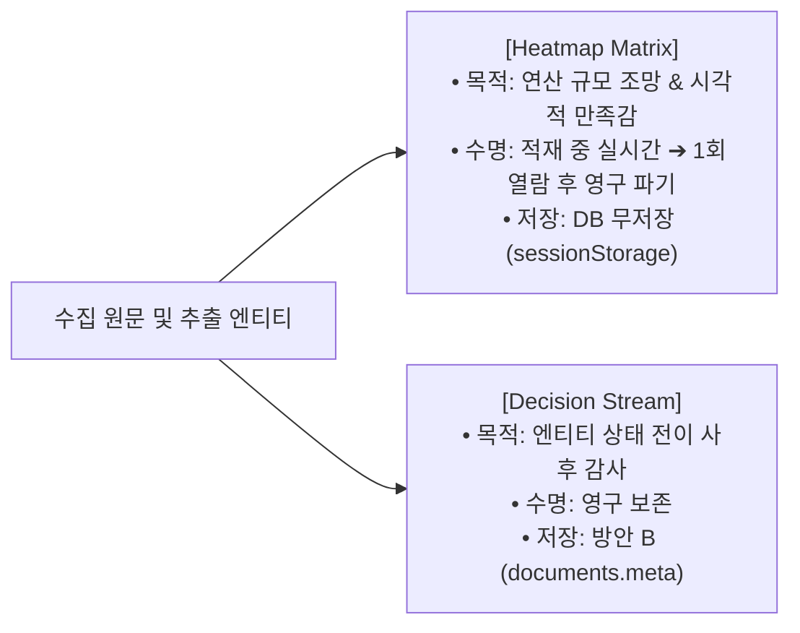
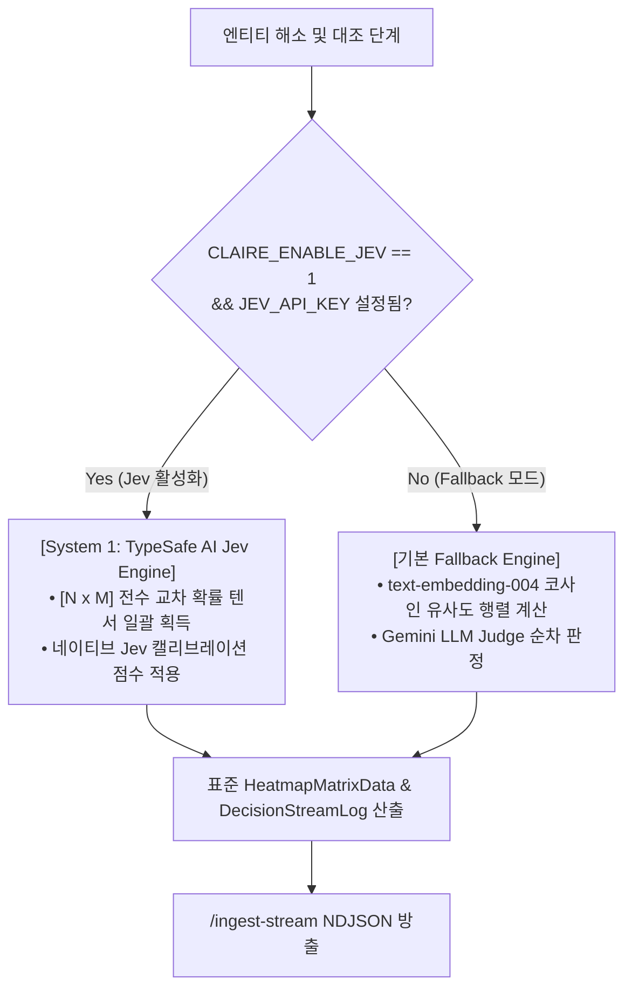

# 지식 노드 판단 시각화(Heatmap Matrix & Decision Stream) 및 TypeSafe AI Jev 연동 아키텍처 설계

작성일: 2026-09-27 · 상태: **Phase 1 Pre-work Implemented** · 기준: [GOALS.md](../../upstream/GOALS.md) 트랙2(추출·연결 품질) / 지식그래프 고도화 · 관련 문서: [KNOWLEDGE_GRAPH_LINKING_AND_CALIBRATION_DESIGN.md](KNOWLEDGE_GRAPH_LINKING_AND_CALIBRATION_DESIGN.md), [TELEMETRY_AND_SUPPORT_BUNDLE_DESIGN.md](TELEMETRY_AND_SUPPORT_BUNDLE_DESIGN.md), [ENVIRONMENT_VARIABLES.md](../implementation/ENVIRONMENT_VARIABLES.md)

---

## 1. 개요 및 배경

### 1.1 배경
Claire Bible의 인제스트 파이프라인은 유입된 문서로부터 엔티티와 관계를 추출하고, 기존 지식 베이스의 지식 노드들과 비교·해소(Entity Resolution)하여 그래프에 적재합니다.
이 과정에서 사용자는:
1. 백엔드에서 일어나는 대규모 지식 대조 연산의 밀도와 규모를 실시간으로 체감하고자 하며,
2. 사후에 특정 엔티티가 왜 병합되었거나 신규로 분기되었는지 인과관계를 검토·감사할 수 있는 기능을 요구합니다.

### 1.2 두 시각화의 명확한 목적 및 라이프사이클 분리



1. **Heatmap Matrix (대조 히트맵 매트릭스)**:
   - **목적**: 수집 본문 구절/엔티티와 전역 지식 노드 간의 다대다 유사도 확률 텐서(0.0~1.0)를 수치·텍스트 없이 순수 색조 농도로 표현하여, **백엔드의 방대한 연산량에 대한 시각적 만족감**을 제공함.
   - **수명주기**: 
     - 적재 진행 중에는 그래프 캔버스 대신 메인 화면에 실시간 연산 파동(Compute Wave)으로 표시됨.
     - 적재 완료 후에는 본문 첫 클릭 시 1회 보고서로 표출됨.
     - 사용자가 **[확인]** 단추를 누르는 즉시 브라우저 메모리에서 영구 삭제되어 다시는 나타나지 않음 (일회성 소비).
2. **Decision Stream (인과 의사결정 스트림)**:
   - **목적**: 엔티티 해소 파이프라인의 시간별 단계(Exact Match → Acronym → LLM Judge → Cross-link)와 판단 사유를 기록하여, 오병합/오분할을 추적하고 교정하기 위한 **감사 추적 로그(Audit Trail)**.
   - **접근 경로**: 웹 UI 우측 사이드바 **'메뉴 & 상세'** 액션 영역 내 **`[📜 판단 기록]`** 버튼을 통해 언제든 진입 가능.

---

## 2. 데이터베이스 저장 전략: [방안 B (경량 메타데이터 보관)]

### 2.1 지식 DB(`claire.db`)와 텔레메트리 DB(`telemetry.db`)의 엄격한 격리
- 과거 스키마 v12 퇴역 사례에서 확인되었듯, 관측성 데이터와 도메인 지식 데이터의 혼합은 쓰기 락 경합과 DB 용량 오염을 유발합니다.
- `telemetry.db`는 30일 보존 후 자동 롤오프되는 Fire-and-Forget 스토어이므로, 영구 보존되어야 할 Decision Stream을 담기에 부적합합니다.
- 또한 두 DB 간의 물리 조인(`ATTACH DATABASE`)은 2단계 커밋(2PC) 데드락 및 `busy_timeout` 충돌을 유발하므로 절대 배제합니다.

### 2.2 방안 B (Metadata-Only) 채택 근거
별도의 전용 테이블(`decision_stream`)을 신설(스키마 v14)하는 대신, 기존 `documents.meta` 컬럼에 경량 구조화 JSON으로 보관하는 **방안 B**를 채택합니다.
- **스키마 무변경**: 정본 DB 스키마 마이그레이션 없이 즉시 적용 가능.
- **테마 격리 자동 보장**: `claire.db`의 `documents` 테이블에 속하므로 멀티 테마 분리 및 데이터 소각(`purge`) 연쇄와 자동으로 수명주기가 일치함.
- **Heatmap Matrix DB 무저장 (Zero DB Storage)**: 1회성 소멸 데이터인 Heatmap Matrix는 디스크에 기록하지 않고 네트워크 스트림(NDJSON) 및 브라우저 세션 메모리(`sessionStorage`)에만 유지하여 디스크 I/O와 페이지 단편화를 원천 차단함.

```json
// documents.meta 내 "resolution_log" 저장 구조 예시
{
  "resolution_log": [
    {
      "entity": "ESXi 8.0 Update 2",
      "stage": "borderline_llm_judge",
      "candidate": "ESXi",
      "score": 0.88,
      "decision": "CREATE_NEW",
      "reason": "부모 제품과 구체적 릴리즈 버전 간 식별 분기가 요구되어 독립 노드로 분할 생성함.",
      "timestamp": 1790435120.5
    }
  ]
}
```

---

## 3. TypeSafe AI Jev (System 1) 연동 및 옵션(Optional) 설계

### 3.1 모델 이원화 아키텍처 (System 1 & System 2)
- **System 2 (Gemini / Claude)**: 비정형 원문 이해, 온톨로지 구조화 추출(`extract`), 가독 상세 본문 생성(`detail`).
- **System 1 (TypeSafe AI Jev)**: 엔티티 동일체 판정(`judge_same_entity`), 전역 관계 판정(`judge_relationship`), 다대다 확률 텐서(0.0~1.0) 초고속 산출.

### 3.2 옵션(Optional) 가동 및 투명한 Fallback 메커니즘
Jev 엔진은 선택 사항(Optional)으로 작동하며, 활성화 여부와 관계없이 동일한 규격의 `HeatmapMatrixData`와 `DecisionStreamLog`를 산출합니다.



1. **Jev 활성화 시 (`CLAIRE_ENABLE_JEV=1`, `CLAIRE_JEV_API_KEY` 제공 시)**:
   - TypeSafe AI Jev API를 배치 호출하여 수십 개 후보군에 대한 전수 확률 매트릭스(Probability 0.0~1.0)를 수십 ms 만에 일괄 수신.
   - 실제 모델 출력 텐서를 Heatmap Matrix에 직접 투영.
2. **Jev 비활성화 시 (기본값 / Fallback)**:
   - 기존의 `vstore.search()` 코사인 유사도 및 어휘 정규화 점수를 바탕으로 동일한 [N × M] 매트릭스를 생성.
   - 외부 종속성 없이 100% 동일한 UI 시각 효과 및 판정 인터페이스를 유지.

---

## 4. 환경 변수 명세

| 환경 변수명 | 기본값 | 설명 |
| :--- | :--- | :--- |
| `CLAIRE_ENABLE_JEV` | `0` | TypeSafe AI Jev 고속 의사결정 엔진 활성화 플래그 (0: 비활성, 1: 활성) |
| `CLAIRE_JEV_API_KEY` | `None` | TypeSafe AI Jev API 호출을 위한 인증 키 |
| `CLAIRE_JEV_BASE_URL` | `https://api.typesafe.ai/v1` | TypeSafe AI 엔드포인트 URL |

---

## 5. UI/UX 라이프사이클 및 화면 상태 전이

1. **적재 중 (Loading State)**:
   - 중앙 작업창의 `#netwrap`(그래프 캔버스)를 숨기고, **Heatmap Matrix 캔버스**를 마운트.
   - `/ingest-stream`의 `{"stage": "heatmap_matrix", "matrix": ...}` 이벤트를 통해 실시간 타일 점등 및 연산 파동 애니메이션 구동.
2. **적재 완료 (Done State)**:
   - 인제스트 리포트의 매트릭스 데이터를 브라우저 `sessionStorage`에 키(`doc_matrix_{id}`)로 임시 보관.
   - 메인 화면은 기본 그래프 뷰로 복귀.
3. **본문 첫 열람 및 확인 (One-time View & Purge)**:
   - 사용자가 좌측 목록에서 해당 문서를 처음 열 때, 본문 상단에 Heatmap Matrix 오버레이 표시.
   - **[확인]** 단추 클릭 시 `sessionStorage.removeItem` 실행 및 DOM 영구 제거.
4. **사후 감사 (Audit State)**:
   - 우측 사이드바 `detailpane` 상단 '메뉴 & 상세'의 **`[📜 판단 기록]`** 단추를 클릭하여 해당 문서의 `documents.meta["resolution_log"]` 데이터를 BookStack 카드 형태로 열람.
