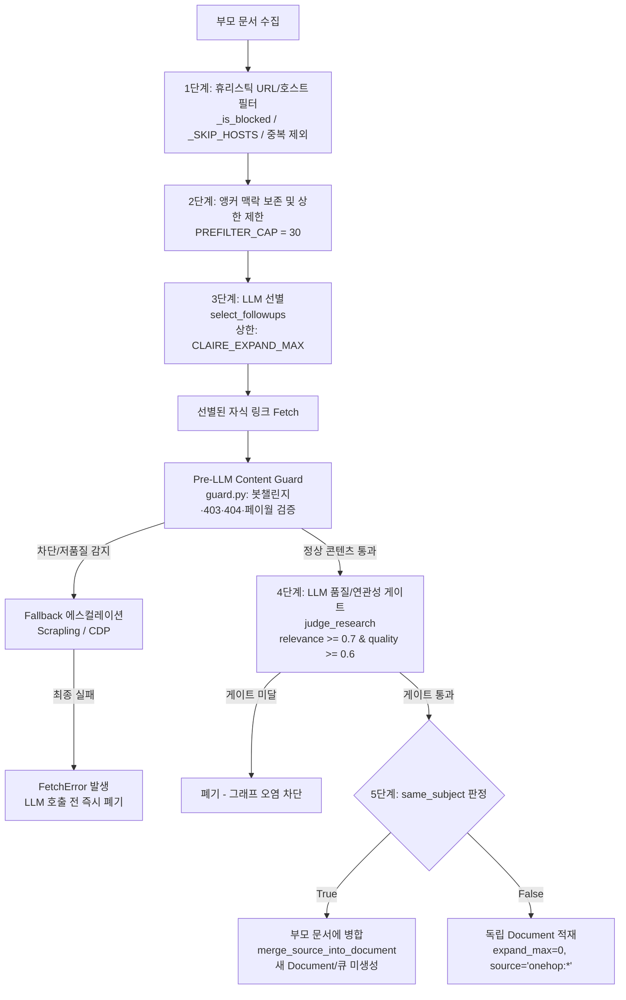

# 1홉 확장(EXPAND)의 깊이 및 연관성 필터링 설계

작성일: 2026-08-19 · 상태: **설계 검토 기반 시험 적용 (Trial / Continuous Evaluation)** · 기준: [GOALS.md](../../../GOALS.md) 트랙2(추출·연결 품질) /
관련: [ONEHOP_MERGE_DESIGN.md](ONEHOP_MERGE_DESIGN.md)(1홉 확장 중복 완화 및 동일 주제 병합)

> [!NOTE]
> **검토 기반 시험 적용 안내 (2026-08-19)**:
> 본 문서는 현재 리포 및 업스트림의 EXPAND 관련 설정(`CLAIRE_EXPAND_MAX`, `CLAIRE_AUTO_EXPAND`, `CLAIRE_WATCH_INTERVAL_DAYS`)과 깊이·연관성 제어 흐름을 종합 조사·검토한 결과를 토대로 작성되었습니다.
> 특히 이번에 도출되어 구현된 **'HTTP 본문 수준의 저품질/차단 페이지 사전 필터 (Pre-LLM Content Guard)'**는 검토를 토대로 한 **시험 적용(Trial)** 단계이며, 실데이터 수집 및 크롤링 품질 관측을 거쳐 운영 안정성을 지속 검증합니다.

---

## 1. 개요 및 배경

Claire의 자동 확장(EXPAND)은 사용자가 문서를 수집했을 때 그 문서 내의 외부 링크를 탐색해 관련 지식을 지식그래프에 자동으로 축적하는 핵심 기능이다.

그러나 통제되지 않은 확장은 다음과 같은 심각한 문제를 초래할 수 있다:
1. **깊이 폭발 (Depth/Recursion Explosion)**: 자식 문서가 또 다른 자식 문서를 무한히 파고들어 그래프와 시스템 부하가 폭증하는 문제
2. **연관성 부족 및 다의어/잡음 오염 (Topic Drift & Semantic Noise)**: 동음이의어, 광고, 약관, SNS 링크 등으로 인해 엉뚱한 노드가 생성되어 검색 및 종합 품질을 저해하는 문제
3. **문서 목록 뻥튀기 (Document Bloat)**: 소개 기사와 1차 저장소(GitHub 등)가 별도 문서로 분리되어 목록이 2~4배 중복 생성되는 문제
4. **차단/저품질 페이지로 인한 LLM 비용 낭비**: Cloudflare 챌린지, 404 페이지, 권한 없음(403), 로그인 게이트 등으로 인해 불필요한 LLM 호출이 발생하는 문제

이를 방지하기 위해 구축된 **깊이 제어 및 5단계 깔때기형(Funnel) 필터링 아키텍처**와 향후 개선 포인트를 정의한다.

---

## 2. EXPAND의 깊이(Depth) 및 연관성(Relevance) 필터링 현황

### 2.1 깊이(Depth) 제어 기제
- **엄격한 1-Hop 고정 (`depth = 1`)**:
  - 자식 문서를 독립 적재할 때 항상 `source=f"onehop:{parent_id}"`와 `expand_max=0`을 강제한다 (`service.py:153`).
  - `service.py:50-51`에서 `source.startswith(("onehop", "recover", "replay", "refresh"))`인 경우 `auto_expand` 큐 등록을 원천 차단한다.
  - 부모에 병합(`same_subject=True`)되는 경우 새 문서 행이나 큐 항목 자체가 생기지 않아 재귀가 물리적으로 차단된다.

### 2.2 연관성 및 잡음 필터링 5단계 파이프라인
1. **1단계 - 휴리스틱 URL/호스트 필터 (`onehop.py:20-61`)**:
   - SNS(`x.com`, `twitter.com`), 미디어(`youtube.com`, `linkedin.com`), 메타 리졸버(`doi.org`), 운영기관 푸터(`cornell.edu`, `info.arxiv.org` 등) 차단.
   - Boilerplate 경로(`/about`, `/terms`, `/login`, `/privacy`, `/feed` 등) 차단.
   - 이미 적재되었거나 부모 문서에 병합 출처로 흡수된 URL(`_already_ingested`) 제외.
2. **2단계 - 앵커 텍스트 보존 및 후보 수 제한 (`follow.py:29-64`)**:
   - 웹 크롤러가 수집한 `<a href="...">`의 앵커 텍스트(`link_anchors`)를 유지하여 LLM에 의미적 신호 제공 (최대 `PREFILTER_CAP=30`).
3. **3단계 - LLM 선별 (`prompts.py:235-254`)**:
   - `select_followups`: 부모 맥락 대비 "같은 주제를 더 깊이 알기 위해 따라갈 가치가 있는 링크"만 번호로 선별 (규칙: *"애매하면 넣지 마라, 가치 없으면 빈 목록 반환"*).
   - 선택된 후보 중 `CLAIRE_EXPAND_MAX`(기본 5개)까지만 실제 fetch 수행.
4. **4단계 - Pre-LLM Content Guard (`guard.py`, `web.py`)**:
   - Fetch 직후 본문이 봇 챌린지, 403, 404, 페이월인지 검증하여 다음 fallback(Scrapling, CDP)으로 에스컬레이션하고, 최종 미달 시 `FetchError`를 발생시켜 LLM 호출을 건너뜀.
5. **5단계 - LLM 게이트 및 동일 주제 병합 (`follow.py`, `pipeline.py`)**:
   - `judge_research`: 자식 본문 미리보기를 읽고 부모 맥락과 대조 채점 (`relevance >= 0.7` 및 `quality >= 0.6`).
   - `same_subject=True`인 경우 새 문서를 만들지 않고 부모 문서에 섹션으로 병합 (`merge_source_into_document`).

---

## 3. 구현 완료 내역 (`[x]`)

- [x] **엄격한 1홉 깊이 고정 및 재귀 가드**: `expand_max=0`, `source="onehop:*"` 게이트 적용
- [x] **URL/호스트 휴리스틱 필터링**: SNS, 미디어, 플랫폼 boilerplate 경로 차단 및 기적재/병합 URL dedup
- [x] **앵커 텍스트 보존 및 사전 필터 상한 (`PREFILTER_CAP=30`)**: 토큰 절약 및 LLM 선별 신호 강화
- [x] **LLM 기반 후보 선별 (`select_followups`) 및 최대 확장 상한 (`CLAIRE_EXPAND_MAX`)**: 보수적 큐레이션
- [x] **LLM 품질/연관성 게이트 (`judge_research`)**: relevance $\ge 0.7$, quality $\ge 0.6$ fail-closed 필터링
- [x] **동일 주제 병합 (`same_subject`, `merge_source_into_document`)**: GeekNews-GitHub 등 동일 주제 문서 뻥튀기 해소
- [x] **HTTP 본문 수준의 저품질/차단 페이지 사전 필터 (Pre-LLM Content Guard, `guard.py` — 2026-08-19 시험 적용)**:
  - Cloudflare / 봇 챌린지 감지 (`blocked: bot_challenge`)
  - Soft 403 / 권한 없음 감지 (`blocked: access_denied`)
  - Soft 404 / 존재하지 않는 페이지 감지 (`low_quality: not_found`)
  - 로그인 / 페이월 게이트 감지 (`low_quality: paywall_or_login`)
  - 저밀도 잡음 텍스트 감지 (`low_quality: low_alphanumeric_density`)
  - Web fetcher의 fallback 체인(static $\to$ discourse $\to$ scrapling $\to$ cdp)과 연동하여 자동 에스컬레이션 및 사전 차단

---

## 4. 추가 설계 고려사항 및 향후 개선 포인트 (`[ ]`)

### 1) 도메인/주제 스코프 필터링 (Topic Scope Guard)
- **현황**: 현재는 일반적인 SNS나 boilerplate 페이지만 블랙리스트로 거르고 있어, 지식베이스의 핵심 관심사(예: AI, 소프트웨어 엔지니어링, 인프라 등)와 무관한 일반 상업/뉴스 링크가 LLM 선별 단계까지 진입할 수 있음.
- **개선안**:
  - `[ ]` 사용자 관심사 키워드 또는 도메인 허용/우선순위 목록을 기반으로 한 0차 스코프 필터 도입 검토.

### 2) 앵커 텍스트 누락 보완 (Context Window Extraction)
- **현황**: HTML `<a>` 태그가 아닌 일반 텍스트/마크다운에서 정규식으로 추출된 URL은 앵커 텍스트가 비어 있어 LLM 선별 정확도가 떨어질 수 있음.
- **개선안**:
  - `[ ]` 정규식 URL 추출 시 링크 앞뒤 $N$글자(예: 100자)의 문맥을 캡처하여 `link_anchors`의 대체 텍스트로 공급.

### 3) 큐 부하 및 중요도 기반 적응형 상한 제어 (Adaptive Capping)
- **현황**: 고정값 `CLAIRE_EXPAND_MAX=5`를 사용하므로, 부모 문서 1건당 최대 15회 이상의 LLM 호출이 발생할 수 있음.
- **개선안**:
  - `[ ]` 부모 문서의 분량/품질 점수 또는 `expand_queue`의 대기열 크기에 따라 `expand_max`를 1~3개로 동적 조절하는 적응형 스케줄링.

### 4) 다단계(Multi-hop, 2홉 이상) 확장 고려 시 아키텍처 요건
- **요건**:
  - 만약 향후 2홉 이상 확장을 검토할 경우:
    1. `documents` 테이블에 `depth: int` 컬럼 추가 및 계층 추적
    2. 홉 깊이에 따른 지수 감쇠(Decay) 임계값 적용 (1홉 0.7 $\to$ 2홉 0.85)
    3. 트리 단위 글로벌 토큰/문서 상한 예산(Budgeting)
    4. 그래프 기반 URL 순환/사이클 감지(Cycle Detection)
