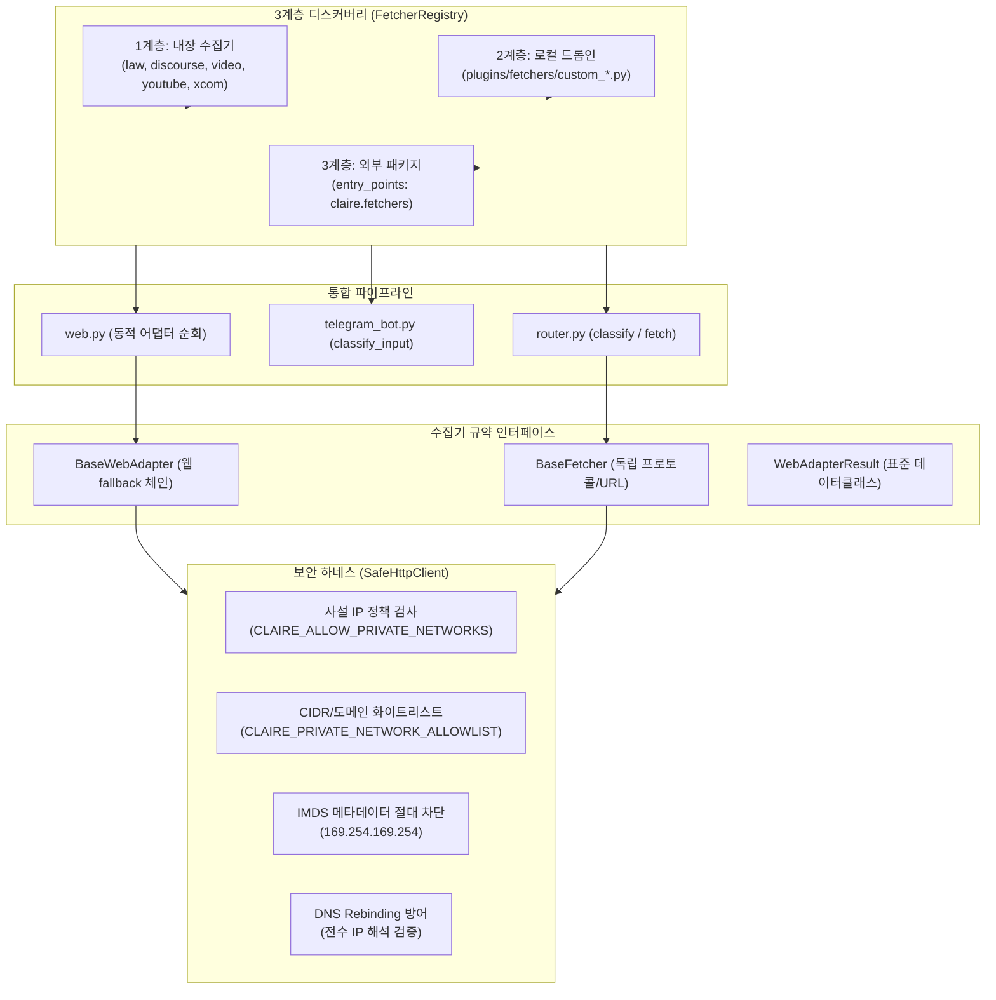

# 수집기(Fetcher) 기여 아키텍처 및 온프레미스 사설망 보안 설계

작성일: 2026-09-15 · 상태: **Implemented** · 기준: [GOALS.md](../../upstream/GOALS.md) 트랙1(안정성) / 트랙2(추출·연결 품질) · 관련: [INGESTION_INTEGRITY_AND_POLLUTION_CONTROL_RESEARCH.md](INGESTION_INTEGRITY_AND_POLLUTION_CONTROL_RESEARCH.md), [ENVIRONMENT_VARIABLES.md](../implementation/ENVIRONMENT_VARIABLES.md)

---

## 1. 배경 및 문제 정의

### 1.1 배경
Claire Bible은 웹 문서, 학술 논문, YouTube 영상, X(구 Twitter), 법령 정보 등 다양한 소스로부터 원문을 수집하여 지식 그래프를 구축합니다. 프로젝트를 클론하거나 포크하여 사용하는 다양한 조직과 개인 연구자들은 다음과 같은 요구사항을 가지고 있습니다:
1. **사내망/폐쇄망 지식 수집**: 사내 위키(Confluence), 사내 코드 저장소(GitLab), 내부 티켓 시스템 등 온프레미스 사설 IP 대역(10.x, 192.168.x 등) 서비스로부터 지식 수집.
2. **도메인 특화 수집기 확장**: 특정 사내 포털이나 전문 커뮤니티를 위한 맞춤형 수집기를 개발하여 시스템에 플러그인 형태로 연결.
3. **업스트림 동기화 무충돌 (Zero Git Merge Conflict)**: 포크 이용자가 사설 수집기를 작성하더라도 원작(업스트림)의 변경 사항을 `git pull` / `git rebase`할 때 코드 충돌이 전혀 발생하지 않는 구조적 격리 보장.

### 1.2 기존 구조의 한계점
1. **하드코딩된 라우팅 및 결합도 분산**:
   - URL 분류 로직이 `src/claire/ingest/router.py`와 `src/claire/telegram_bot.py`에 이중 if-elif로 파편화되어 있었음.
   - 도메인 특화 어댑터(`law.go.kr`, `discourse`)가 `src/claire/ingest/fetchers/web.py` 내에 조건문으로 하드코딩되어 신규 어댑터 추가 시 코어 파일 수정이 강제됨.
2. **반환 타입의 불투명성**:
   - 어댑터별로 `tuple[str, str, ...]` 형태의 불투명한 튜플을 반환하여 필드 순서나 누락에 따른 런타임 오류 위험이 상존함.
3. **SSRF 보안과 사설망 접근 간의 딜레마**:
   - 공인 인터넷 스크래핑을 위해 사설망 IP를 일괄 차단할 경우 사내 온프레미스 인트라넷 수집이 전면 불가능해짐.
   - 반대로 사설망 차단을 무조건 해제할 경우 클라우드 환경(AWS/GCP/Azure)에서 인스턴스 메타데이터(IMDS: `169.254.169.254`) 탈취 취약점에 노출됨.

---

## 2. 아키텍처 개요

Claire Bible의 수집기 기여 아키텍처는 **2계층 규약 인터페이스**, **3계층 디스커버리 체계**, **SSOT(단일 진실 공급원) 라우팅**, **온프레미스 SSRF 보안 하네스**로 구성됩니다.



---

## 3. 세부 설계 사양

### 3.1 2계층 인터페이스 규약 (`src/claire/ingest/fetchers/base.py`)

수집기는 처리 대상과 파이프라인 개입 단계에 따라 두 계층으로 명확히 구분됩니다.

#### A. 독립 수집기 (`BaseFetcher`)
특정 URL 패턴, 프로토콜, 또는 독립 파이프라인을 완전히 담당하는 최상위 수집기입니다.
- **메서드 계약**:
  - `can_handle(url: str) -> bool`: 해당 URL을 이 수집기가 처리할 수 있는지 판별.
  - `fetch(url: str, **kwargs) -> FetchResult`: 문서를 수집하여 표준 `FetchResult` 반환.
  - `name: str`: 수집기 고유 식별자 (`youtube`, `video`, `xcom` 등).
  - `priority: int`: 라우팅 우선순위 (기본값: `100`, 높을수록 먼저 매칭).

#### B. 웹 폴백 도메인 어댑터 (`BaseWebAdapter`)
일반 웹 스크래핑(`fetch_web`)의 파이프라인 내부에서 특정 도메인의 HTML 구조나 API를 전담 처리하는 어댑터입니다.
- **메서드 계약**:
  - `can_handle(url: str) -> bool`: 도메인 및 경로 매칭 여부.
  - `try_fetch(url: str, **kwargs) -> WebAdapterResult | None`: 해당 도메인 전용 추출 로직 수행. 실패 시 `None`을 반환하여 상위 fallback으로 제어 이양.
  - `name: str`: 어댑터 식별자 (`law`, `discourse` 등).
  - `priority: int`: 어댑터 간 평가 우선순위.

#### C. 표준 어댑터 결과 데이터클래스 (`WebAdapterResult`)
과거의 불투명한 튜플 반환을 대체하며, 하위 호환성을 위해 튜플 언패킹(`__iter__`, `__getitem__`)을 완벽히 지원합니다.
```python
@dataclass
class WebAdapterResult:
    title: str
    text: str
    links: list[str] = field(default_factory=list)
    anchors: dict[str, str] = field(default_factory=dict)
    images: list[dict[str, Any]] = field(default_factory=list)
    doc_type: str = "web"
    meta: dict[str, Any] = field(default_factory=dict)
```

---

### 3.2 3계층 디스커버리 및 레지스트리 (`src/claire/ingest/registry.py`)

중앙 싱글톤 `FetcherRegistry`가 모든 수집기와 어댑터의 생명주기와 라우팅 순위를 총괄합니다.

1. **1계층 (내장 수집기)**:
   - 시스템 기동 시 `law`, `discourse`, `video`, `youtube`, `xcom` 모듈을 기본 등록.
2. **2계층 (로컬 드롭인 `plugins/fetchers/`)**:
   - `plugins/fetchers/` 디렉터리 내의 `custom_*.py` 스크립트를 런타임에 동적 import.
   - [`.gitignore`](../../../.gitignore)에 `plugins/`가 등록되어 있어 사설 수집기를 개발하더라도 Git 작업 트리가 오염되지 않으며, 업스트림 코드 병합 시 충돌 확률 0% 달성.
3. **3계층 (외부 패키지 `entry_points`)**:
   - `pip` 또는 `uv`로 설치된 타 패키지의 `entry_points(group="claire.fetchers")`를 스캔하여 등록.

#### 등록 데코레이터 예시
```python
from claire.ingest.fetchers.base import BaseWebAdapter, WebAdapterResult
from claire.ingest.registry import register_web_adapter

@register_web_adapter
class MyWikiAdapter(BaseWebAdapter):
    name = "internal_wiki"
    priority = 200

    def can_handle(self, url: str) -> bool:
        return "wiki.mycompany.internal" in url

    def try_fetch(self, url: str, **kwargs) -> WebAdapterResult | None:
        # 사내 위키 전용 본문 추출 로직
        ...
```

---

### 3.3 라우팅 단일 진실 공급원(SSOT) 통합

- 과거 `router.py`와 `telegram_bot.py`에 중복 존재하던 URL 정규식 검사 로직을 제거하고 `FetcherRegistry.classify(url)`로 일원화하였습니다.
- 텔레그램 봇의 진행 메시지 라벨링과 실제 인제스트 파이프라인의 수집 라우터가 완벽히 동일한 분류기를 공유하므로 불일치 위험이 근본적으로 해소되었습니다.

---

### 3.4 온프레미스 사설망(Private Network) 보안 정책 및 SSRF 방어

온프레미스 환경에서 사내 인트라넷을 수집할 수 있도록 지원하면서도, 악의적이거나 잘못된 URL로 인한 보안 사고를 방어하기 위한 다층 보안 체계를 구현하였습니다.

#### A. 위험 대역 절대 차단 (Strictly Prohibited Networks)
`CLAIRE_ALLOW_PRIVATE_NETWORKS=true` 설정 여부와 **무관하게**, 아래 대역은 어떠한 경우에도 접근이 즉시 차단됩니다:
- **클라우드 인스턴스 메타데이터 서비스(IMDS)**: `169.254.169.254`, `169.254.0.0/16` (AWS, GCP, Azure, OpenStack의 IAM 크레덴셜 탈취 시도 방어)
- **멀티캐스트 및 브로드캐스트**: `224.0.0.0/4`, `255.255.255.255/32`, `ff00::/8`
- **IPv6 링크 로컬 및 미지정 주소**: `fe80::/10`, `::/128`

#### B. 사설망 허용 제어 (`CLAIRE_ALLOW_PRIVATE_NETWORKS`)
- 기본값: `0` (`false`) - 일반적인 RFC 1918 사설망(`10.0.0.0/8`, `172.16.0.0/12`, `192.168.0.0/16`) 및 Loopback(`127.0.0.1`, `::1`)을 차단.
- `1` (`true`) 설정 시: 온프레미스 사내망 IP에 대한 HTTP 요청을 전면 허용.

#### C. 정밀 화이트리스트 (`CLAIRE_PRIVATE_NETWORK_ALLOWLIST`)
- 특정 서브넷이나 도메인만 선별적으로 수집을 허용할 때 사용.
- CIDR 표기법(예: `10.20.0.0/16`, `192.168.1.50`) 및 와일드카드 도메인 패턴(예: `*.corp.internal`, `wiki.local`)을 쉼표로 구분하여 지정.

#### D. DNS Rebinding 방어
- URL의 호스트명에 대해 `socket.getaddrinfo()`를 수행하여 반환된 **모든 IP 주소에 대해 SSRF 안전성을 전수 검증**한 후 요청을 진행합니다.

#### E. 자원 고갈 방어
- 50MB 응답 크기 상한(`max_size`) 및 30초 타임아웃 기본 적용으로 리소스 고갈 공격 차단.

---

## 4. 환경변수 사양

| 환경변수명 | 기본값 | 허용 값 | 설명 |
| :--- | :--- | :--- | :--- |
| `CLAIRE_ALLOW_PRIVATE_NETWORKS` | `0` (`false`) | `0`, `1`, `true`, `false` | 온프레미스 사설망(10.x, 172.16-31.x, 192.168.x, 127.x) 스크래핑 허용 플래그. IMDS(`169.254.169.254`)는 무조건 차단 유지. |
| `CLAIRE_PRIVATE_NETWORK_ALLOWLIST` | `""` | 쉼표 구분 CIDR / 도메인 | 사설망 중 특정 대역만 선별 허용하는 화이트리스트 (예: `10.0.0.0/8,*.corp.internal`). |

---

## 5. 검증 및 테스트 결과

1. **보안 및 SSRF 격리 단위 테스트** ([`tests/test_http_security.py`](../../../tests/test_http_security.py)):
   - 기본 설정 시 사설망 및 로컬호스트 차단 검증.
   - 온프레미스 플래그 활성화 시 사설망 접근 허용 검증.
   - 온프레미스 활성화 상태에서도 IMDS(`169.254.169.254`) 절대 차단 검증.
   - CIDR 및 와일드카드 도메인 allowlist 동작 검증. (8개 테스트 전원 통과)
2. **레지스트리 및 디스커버리 테스트** ([`tests/test_registry.py`](../../../tests/test_registry.py)):
   - 어댑터 등록, 우선순위 정렬, 도메인 매칭, `plugins/fetchers/` 동적 로드 검증. (5개 테스트 전원 통과)
3. **수집기 규약 적합성(Conformance) 테스트** ([`tests/test_fetcher_conformance.py`](../../../tests/test_fetcher_conformance.py)):
   - 시스템에 등록된 모든 수집기 및 어댑터의 인터페이스 계약 적합성 검증. (2개 테스트 전원 통과)
4. **전체 단위/통합 테스트**: `uv run pytest` -> 1,143개 테스트 전원 통과.
5. **Playwright E2E 브라우저 테스트**: `npm test` -> 11개 브라우저 시나리오 전원 통과.
