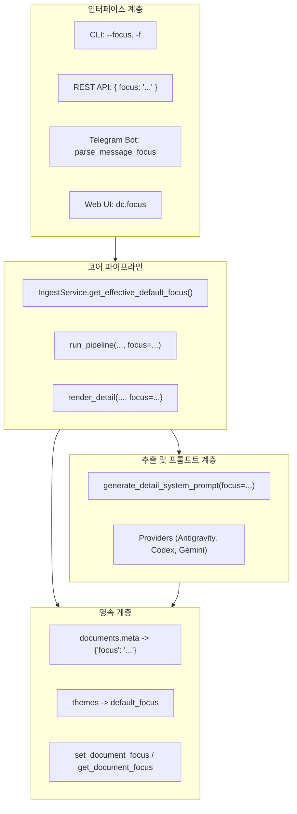

# 초점(Focus) 단일 표준화 및 레거시(Directive) 완전 소각 아키텍처 설계

- **문서 식별자**: `CLAIRE-DESIGN-0026`
- **상태**: 승인 및 확정 (Approved / Definitive Architecture Specification)
- **최초 작성일**: 2026-09-17
- **관련 표준 및 계약**: [GLOSSARY.md](../../contracts/GLOSSARY.md), [openapi.yaml](../../contracts/openapi.yaml), [MULTI_THEME_ARCHITECTURE_DESIGN.md](./MULTI_THEME_ARCHITECTURE_DESIGN.md), [DATA_LIFECYCLE_AND_PURGE_DESIGN.md](./DATA_LIFECYCLE_AND_PURGE_DESIGN.md)

---

## 1. 설계 배경 및 엔지니어링 철학

### A. 문제 진단: 용어 파편화와 하위 호환성 타협의 폐해
Claire Bible 지식 적재 파이프라인에서 원시 문서를 지식 그래프로 변환하고 가독 상세 본문(Detail Markdown)을 렌더링할 때, 사용자가 모델에 부여하는 맥락적 관심사(Contextual Orientation)를 지칭하는 용어가 다음과 같이 파편화되어 시스템 전반에 심각한 엔지니어링 부채를 누적시켰습니다:
1. `directive` (초기 레거시 지시문 명칭)
2. `orientation` (과도기적 지향성 명칭)
3. `focus` (최종 표준 초점 명칭)

이 세 가지 용어가 CLI 옵션(`--focus`, `--orientation`, `--directive`), API 요청 본문(`focus`, `directive`, `default_directive`, `default_focus`), DB 메타데이터(`meta["directive"]`), 파이프라인 매개변수(`directive`), 프론트엔드 클래스(`directive-tag`), 테스트 슈트에 난립해 있었습니다.

과거 어시스턴트 및 개발 과정에서 "하위 호환성(Backward Compatibility)"을 핑계로 레거시 키를 남겨둔 채 `body.get("focus") or body.get("orientation") or body.get("directive")`와 같은 묵인적 fallback 코드를 양산한 결과:
- 시스템의 단일 진실 공급원(Single Source of Truth, SSOT) 원칙이 훼손되었습니다.
- 개발자와 AI 에이전트 간의 소통에서 모호함이 증폭되었습니다.
- OpenAPI 스펙과 실제 구현 간의 불일치가 지속되었습니다.

### B. 엔지니어링 철학: 단일 정본화(Canonicity)와 완전 소각(Purge)
본 설계는 하위 호환성을 명분으로 타협하지 않습니다.
1. **역사적 정본화(Historical Canonicity)**: "이 시스템에는 창시 이래 오직 `focus(초점)`만 존재했다"는 원칙을 정립합니다.
2. **완전 소각(Total Purge)**: `directive`라는 단어 및 파생 개념을 DB, 소스 코드, 프롬프트, 인터페이스(CLI/API/Bot/UI), 테스트, 문서에서 100% 제거합니다.
3. **단일 표준 채택(Strict Single Standard)**: 별칭(Alias)이나 유예 기간(Deprecation Period) 없이 원자적으로 전환합니다.

*(단, Nginx 설정의 `ssl_* directives`와 같은 시스템 인프라 및 서드파티 고유 명사는 도메인과 무관하므로 본 소각 대상에서 제외합니다.)*

---

## 2. 전역 시스템 정본 용어 규격 (Canonical Terminology)

| 도메인 영역 | 레거시 (소각 대상) | 정본 표준 (Canonical Standard) | 비고 |
| :--- | :--- | :--- | :--- |
| **개념 정의** | 지시문, 방향성, Directive, Orientation | **초점 (Focus)** | 문서 적재 및 가독 상세 렌더링 시 LLM이 우선적으로 집중해야 할 핵심 관점 |
| **DB 컬럼/메타** | `doc.meta["directive"]` | `doc.meta["focus"]` | SQLite `documents.meta` JSON 키 표준화 |
| **DB 헬퍼 함수** | `set_document_directive`, `get_document_directive` | `set_document_focus`, `get_document_focus` | `claire.store.db` 내 CRUD 함수 리네이밍 |
| **테마 스키마** | `default_directive`, `theme.directive` | `default_focus`, `theme.default_focus` | 테마 기본 초점 단일 표준 |
| **파이프라인 매개변수** | `run_pipeline(directive=...)`, `render_detail(directive=...)` | `run_pipeline(focus=...)`, `render_detail(focus=...)` | `claire.ingest.pipeline` 전역 |
| **프롬프트 매개변수** | `directive: str \| None` | `focus: str \| None` | `claire.extract.prompts` 및 LLM 프롬프트 본문 |
| **추출 프로바이더** | `provider.extract_detail(directive=...)` | `provider.extract_detail(focus=...)` | `ExtractionProvider` 및 하위 구현체 일체 |
| **CLI 플래그** | `--directive`, `--orientation` | `--focus <focus>` (약칭: `-f <focus>`) | `claire ingest`, `claire regenerate` 등 |
| **REST API** | `POST /ingest { "directive": "..." }` | `POST /ingest { "focus": "..." }` | OpenAPI 3.1 스펙 반영 |
| **Telegram Bot** | `parse_message_directive`, `[방향: ...]` | `parse_message_focus`, `[초점: ...]` | 봇 유입 파서 및 라벨 단일화 |
| **Web UI & CSS** | `dc.directive`, `.directive-tag` | `dc.focus`, `.focus-tag` | 웹 리더, 공유 뷰 템플릿 |
| **테스트 슈트** | `test_orientation_directive.py`, `test_telegram_directive_flags.py` | `test_focus_standardization.py`, `test_telegram_focus_flags.py` | 테스트 파일 및 테스트 케이스 전면 리팩토링 |

---

## 3. 영역별 상세 엔지니어링 규격



### A. DB 스키마 및 영속 계층 (`src/claire/store/db.py`)

#### 1. `documents.meta` JSON 구조 변경
- 기존 `documents.meta` 내부의 `"directive"` 키를 `"focus"` 키로 마이그레이션합니다.
- 향후 신규 적재 시 오직 `{"focus": "..."}` 형태로만 직렬화됩니다.

#### 2. 원자적 SQLite 마이그레이션 쿼리
시스템 부팅 시(`init_db` 또는 마이그레이션 루틴) 기존 데이터베이스에 존재하는 모든 레거시 `directive` 메타 키를 `focus`로 자동 변환합니다.

```sql
-- SQLite JSON 마이그레이션: directive 키를 focus 키로 복사 후 directive 키 제거
UPDATE documents
SET meta = json_set(
    json_remove(meta, '$.directive'),
    '$.focus',
    json_extract(meta, '$.directive')
)
WHERE json_extract(meta, '$.directive') IS NOT NULL
  AND json_extract(meta, '$.focus') IS NULL;

-- 잔여 directive 키 완전 소각
UPDATE documents
SET meta = json_remove(meta, '$.directive')
WHERE json_extract(meta, '$.directive') IS NOT NULL;
```

#### 3. DB 함수 리팩토링
`src/claire/store/db.py` 내의 CRUD 인터페이스를 단일 표준으로 교체합니다:

```python
def set_document_focus(conn: sqlite3.Connection, doc_id: str, focus: str | None) -> None:
    """문서 meta에 가독 렌더링 작성 초점(focus)을 기록/갱신(다른 meta 키 보존)."""
    row = conn.execute("SELECT meta FROM documents WHERE id=?", (doc_id,)).fetchone()
    if row is None:
        return
    meta = json.loads(row["meta"] or "{}")
    if focus and focus.strip():
        meta["focus"] = focus.strip()
    else:
        meta.pop("focus", None)
    # 잔여 directive 키가 남아있을 경우 함께 영구 소각
    meta.pop("directive", None)
    conn.execute("UPDATE documents SET meta=? WHERE id=?", (json.dumps(meta, ensure_ascii=False), doc_id))
    conn.commit()


def get_document_focus(conn: sqlite3.Connection, doc_id: str) -> str | None:
    """문서 meta에서 가독 렌더링 작성 초점(focus) 조회."""
    row = conn.execute("SELECT meta FROM documents WHERE id=?", (doc_id,)).fetchone()
    if row is None:
        return None
    meta = json.loads(row["meta"] or "{}")
    return meta.get("focus")
```

---

### B. 적재 및 가독 본문 파이프라인 (`src/claire/ingest/`)

#### 1. `IngestReport` 데이터 모델 (`pipeline.py`)
```python
@dataclass
class IngestReport:
    # ...
    focus: str | None = None  # 기존 directive 필드 전면 교체
```

#### 2. 파이프라인 진입점 시그니처 정제
- `run_pipeline`:
  ```python
  def run_pipeline(
      conn: sqlite3.Connection,
      provider: ExtractionProvider,
      vstore: Any,
      payload: str,
      # ...
      focus: str | None = None,   # directive 제거
      effort: str | None = None,
      full_content: bool = False,
  ) -> IngestReport:
  ```
- 메타데이터 보존 로직:
  ```python
  if focus and focus.strip():
      doc.meta["focus"] = focus.strip()
      set_document_focus(conn, doc.id, focus.strip())
  ```
- `render_detail` 및 `regenerate_detail`:
  ```python
  def render_detail(
      conn: sqlite3.Connection,
      provider: ExtractionProvider,
      doc: Document,
      format: str = "adoc",
      focus: str | None = None,   # directive 제거
      effort: str | None = None,
      full_content: bool = False,
  ) -> str:
      focus_val = focus if focus is not None else (doc.meta or {}).get("focus")
      # ...
  ```

#### 3. 인제스트 서비스 (`src/claire/ingest/service.py`)
- `IngestService.get_effective_default_focus()`가 반환한 값을 항상 `focus` 키워드 인자로만 파이프라인에 주입합니다.

---

### C. 프롬프트 및 추출 프로바이더 (`src/claire/extract/`)

#### 1. 프롬프트 생성 엔진 (`prompts.py`)
함수 인자명과 내부 시스템 프롬프트 본문에서 `directive` 단어를 완전히 소각합니다.

```python
def generate_detail_system_prompt(
    scale: int = 1,
    format: str = "adoc",
    focus: str | None = None,  # directive 제거
    effort: str = "default",
    truncated: bool = False,
) -> str:
    # ...
    focus_guideline = (
        f"- 사용자가 요청한 다음 핵심 초점(Focus) 및 구성 요소를 최우선으로 하여 본문 전체를 재구성하라: **{focus.strip()}**\n"
        if focus and focus.strip()
        else ""
    )
    # 시스템 프롬프트 템플릿 내 주입
```

#### 2. 프로바이더 인터페이스 (`provider.py`)
`ExtractionProvider` 추상 클래스의 시그니처 표준화:
```python
class ExtractionProvider(ABC):
    @abstractmethod
    def extract_detail(
        self,
        doc: Document,
        format: str = "adoc",
        focus: str | None = None,  # directive 제거
        effort: str | None = None,
        full_content: bool = False,
    ) -> str:
        pass
```

#### 3. 프로바이더 구현체 (`antigravity_provider.py`, `codex_provider.py`, `gemini_provider.py`)
- 모든 프로바이더 구현체의 매개변수를 `focus`로 리팩토링합니다.
- `(doc.meta or {}).get("focus")`를 표준 메타데이터 조회 방식으로 통일합니다.

---

### D. 사용자 인터페이스 및 외부 계약 계층

#### 1. CLI (`src/claire/cli.py`)
- 레거시 플래그 `--directive`, `--orientation`을 파서(`argparse`)에서 완전 삭제합니다.
- 오직 단일 정본 플래그 `--focus` (약칭 `-f` 지원 가능)만 제공합니다.
- 도움말 문자열 수정:
  ```python
  pi.add_argument(
      "-f", "--focus",
      dest="focus",
      default=None,
      help="가독 상세 작성을 위한 집중 초점 (content focus for detail rendering)"
  )
  ```
- `claire regenerate`, `claire ingest-bundle`, `claire ingest` 명령에서 `args.focus`로 직접 접근합니다.
- 테마 명령(`claire theme-add`, `claire theme-update`)에서도 `--focus`, `--default-focus`로 일관성을 유지합니다.

#### 2. REST API 서버 (`src/claire/api/server.py`)
- `POST /ingest`, `POST /extract/detail` 엔드포인트:
  ```python
  # Request Body 파싱
  focus = str(body.get("focus") or "").strip() or None
  if not focus:
      payload, parsed_focus = parse_message_focus(payload)
      if parsed_focus:
          focus = parsed_focus
      elif not theme.is_default and theme.id > 0 and getattr(theme, "default_focus", None):
          focus = theme.default_focus.strip() or None

  if focus is not None:
      ingest_kwargs["focus"] = focus
  ```
- 테마 생성/수정 API: `default_directive` 수신 코드를 영구 제거하고 오직 `default_focus`만 처리합니다.
- `GET /documents/{id}` 및 검색 응답 모델: `doc.meta`의 `focus` 필드를 클라이언트에 정규 반환합니다.

#### 3. OpenAPI 계약 (`docs/contracts/openapi.yaml`, `src/claire/static/docs/openapi.yaml`)
- `directive`, `default_directive` 속성을 스키마에서 영구 삭제합니다.
- `focus`:
  ```yaml
  focus:
    type: string
    nullable: true
    description: Optional extraction and rendering focus (e.g. core architecture, security, biblical cross-references).
    example: "핵심 아키텍처 및 데이터 흐름 중심"
  ```
- `default_focus`:
  ```yaml
  default_focus:
    type: string
    description: Default extraction and rendering focus for documents ingested under this theme.
    example: "시스템 설계 및 API 명세 중심"
  ```

#### 4. Telegram Bot (`src/claire/telegram_bot.py`)
- 함수명 변경:
  - `parse_message_directive` -> `parse_message_focus`
  - `parse_caption_directive` -> `parse_caption_focus`
- 접두사 및 플래그 정규식 정제:
  - 군더더기 키워드(`directive`, `orientation`, `지침`, `방향성`)를 패턴에서 소각하고, 명료한 정본 키워드로 수렴합니다:
  ```python
  RE_FOCUS_FLAG = re.compile(
      r"(?:\s+|^)(?:[-–—―]{1,2}focus|[-–—―]f)\s+([^\n]+)",
      re.IGNORECASE
  )
  RE_FOCUS_PREFIX = re.compile(
      r"^(?:\[(?:초점|focus)\]|#(?:초점|focus)|(?:초점|focus)\s*[:：])\s*(.+)$",
      re.IGNORECASE
  )
  ```
- 사용자 피드백 메시지 단일화:
  - `[방향: ...]` -> `[초점: ...]`
  - `dir_msg` 변수명 -> `focus_msg`

#### 5. 프론트엔드 Web UI 및 Reader (`static/js/app.js`, `reader.js`, `reader.css`, `share.html`)
- 자바스크립트 객체 접근: `dc.directive` -> `dc.focus`
- 태그 클래스 및 렌더링:
  ```javascript
  const focus = (dc.focus || (dc.meta && dc.meta.focus) || '').trim();
  if (focus) {
      tags.push('<span class="focus-tag">🎯 ' + esc(focus) + '</span>');
  }
  ```
- CSS 클래스 리네이밍: `.directive-tag` -> `.focus-tag` (스타일 시트 `reader.css`, `workspace.css`)
- 공유 페이지 템플릿(`share.html`) 내 메타 태그 렌더링 일치화.

---

### E. 테스트 슈트 전면 쇄신 (Test Suite Refactoring)

1. **테스트 파일 리네이밍 및 교체**:
   - `tests/test_orientation_directive.py` -> `tests/test_focus_standardization.py`
   - `tests/test_telegram_directive_flags.py` -> `tests/test_telegram_focus_flags.py`
2. **기존 단위 테스트 내 인자 전수 교정**:
   - `directive="아키텍처 중심"` -> `focus="아키텍처 중심"`
   - `assert doc.meta["directive"] == ...` -> `assert doc.meta["focus"] == ...`
   - `assert "directive" not in doc.meta` 검증 추가.
3. **무결성 회귀 테스트 추가**:
   - CLI에 `--directive` 또는 `--orientation` 전달 시 인식되지 않거나 `--focus` 단일 플래그만 정상 작동함을 보증하는 테스트 케이스.
   - DB 마이그레이션 로직이 기존 레거시 DB의 `directive` 메타 키를 100% `focus`로 자동 승격하고 레거시 키를 남기지 않음을 증명하는 테스트.

---

## 4. 5단계 무결성 마이그레이션 프로토콜

```text
[Phase 1: DB & 영속 계층 마이그레이션]
  ├── SQLite meta JSON 자동 변환 로직 탑재 (init_db)
  └── db.py 함수 교체 (set_document_focus / get_document_focus)

[Phase 2: 코어 파이프라인 및 LLM 추출 계층 리팩토링]
  ├── IngestReport / run_pipeline / render_detail 시그니처 전환 (focus)
  ├── ExtractionProvider / Prompts 인자 및 프롬프트 텍스트 단일화
  └── IngestService 기본 초점 주입부 표준화

[Phase 3: 인터페이스 계층 및 외부 계약 쇄신]
  ├── CLI: argparse 옵션 정리 (--focus 단일화, 레거시 제거)
  ├── API: server.py 요청/응답 스키마 정제
  ├── Telegram Bot: parse_message_focus 교체 및 라벨 통일
  ├── Web UI: app.js, reader.js, CSS 클래스(.focus-tag) 치환
  └── OpenAPI 계약 파일 갱신 (contracts/openapi.yaml)

[Phase 4: 테스트 슈트 리네이밍 및 전수 검증]
  ├── 테스트 파일명 및 테스트 케이스 내 레거시 용어 치환
  └── pytest tests/ 전수 실행 (100% Pass 달성)

[Phase 5: 잔재 전수 검사 (Zero-Residual Purge Verification)]
  ├── Git 소스 코드 grep 전수 검사 (외부 지시어 제외 잔재 0건 확인)
  └── SQLite DB 메타데이터 전수 검사 (legacy directive count = 0)
```

---

## 5. 잔재 검증 프로토콜 (Zero-Residual Audit Specification)

마이그레이션 완료 후, 시스템 감사관은 다음 두 가지 수학적/물리적 검증을 통과해야만 배포를 승인합니다.

### A. SQLite 데이터베이스 메타데이터 전수 검사
```bash
sqlite3 data/claire.db "
SELECT COUNT(*) AS legacy_directive_count
FROM documents
WHERE json_extract(meta, '$.directive') IS NOT NULL;
"
# 결과값이 반드시 0이어야 함.
```

### B. 소스 코드 정적 분석 전수 검사
외부 라이브러리 및 Nginx 지시문(`ssl_* directives`)을 제외한 프로젝트 소스 전체에서 `directive` 단어 검색:
```bash
# Python, JavaScript, CSS, HTML, YAML, Markdown 검사
git grep -in "directive" -- \
  ':!docs/origin/implementation/EXTERNAL_ACCESS.md' \
  ':!src/claire/static/docs/scalar.standalone.js' \
  ':!docs/origin/design/FOCUS_STANDARDIZATION_AND_PURGE_DESIGN.md'
# 결과 출력이 정확히 0행이어야 함.
```

---

## 6. 결론 및 향후 보증

본 아키텍처 설계를 통해 Claire Bible 시스템은 임시방편적인 유연성(Pliable Aliases)을 철폐하고, 엄격한 도메인 정본성(Domain Canonicity)을 회복합니다. 어떠한 하위 호환성 타협이나 모호한 레거시 키도 허용되지 않으며, `focus(초점)`는 시스템의 영구적인 1급 시민(First-Class Citizen) 엔지니어링 규격으로 안착됩니다.
