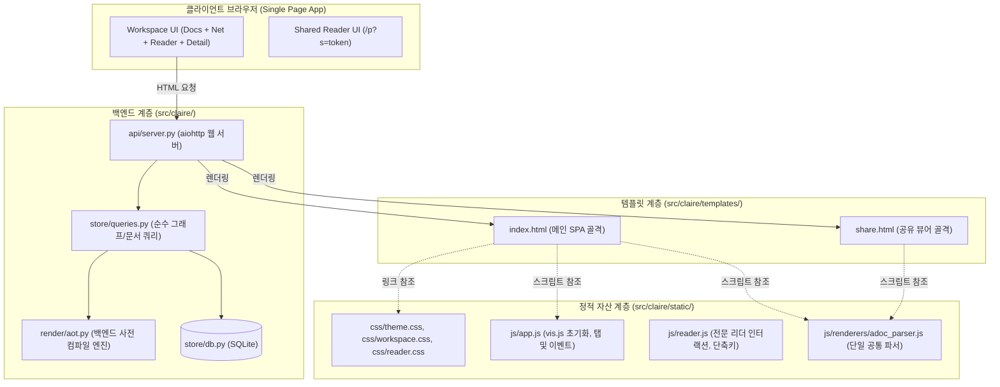

# graphview.py 모듈화 및 정적 자산 분리 설계 명세서

작성일: 2026-09-04 · 상태: **설계 확정 및 로드맵 수립 (Planned)** · 기준: [GOALS.md](../../../GOALS.md) 트랙 3(검색·UX·웹 UI)  
관련 문서: [`DUAL_FORMAT_ADOC_DESIGN.md`](DUAL_FORMAT_ADOC_DESIGN.md), [`MCP_SUPPORT.md`](MCP_SUPPORT.md), [`RIGHT_MENU_COMPACT_DESIGN.md`](RIGHT_MENU_COMPACT_DESIGN.md)

---

## 1. 배경 및 문제 정의

### 1.1 현황 및 배경
Claire Bible의 웹 인터페이스는 지식 베이스의 두 가지 핵심 축인 **"스크랩 문서(Document)"**와 **"온톨로지 그래프(Entity/Relation)"** 간의 **양방향 탐색(Bilateral Exploration)**을 지원합니다.
초기 업스트림([`blackan/claire_bible`](https://github.com/blackan/claire_bible))은 80줄의 가벼운 그래프 뷰어(`src/claire/graphview.py`)로 출발하였으나, 사용자 피드백에 따라 문서 목록 필터, 전문 리더, STT 전사 뷰어, 다중 노드 종합(Synthesis), 공유 뷰어(`_SHARED_HTML`) 등이 차례로 추가되었습니다.

특히 오리진 저장소([`fofwisdom/claire-bible`](https://github.com/fofwisdom/claire-bible))에서 AsciiDoc 듀얼 포맷, 수식(KaTeX), 헤딩 레일, GA4 연동, 워크스페이스 탭 전환 등의 고도화 기능이 결합되면서, 현재 `graphview.py`는 **단일 파이썬 파일 7,097줄(약 330KB)**에 달하는 거대 모노리스가 되었습니다.

```
[업스트림 upstream/master]  총 2,382줄
├── Python 함수부: ~230줄
├── GRAPH_HTML: 2,069줄 (CSS 388줄 + JS 1,591줄)
└── _SHARED_HTML: 62줄 (공유용 초경량 뷰어)

[현재 오리진 HEAD]          총 7,097줄 (+4,715줄 폭증)
├── Python 함수부: ~340줄
├── GRAPH_HTML: 4,988줄 (CSS 679줄 + JS 4,067줄)
└── _SHARED_HTML: 1,650줄 (26배 폭증, 극단적 코드 중복)
```

### 1.2 핵심 문제점 (기술 부채)
1. **단일 책임 원칙(SRP) 위반**: DB 쿼리, LLM 종합 컨텍스트 조합, 메인 SPA 프론트엔드, 공유 뷰어, 정규식 마크업 파서가 단 하나의 파이썬 파일에 뒤엉켜 있음.
2. **극단적인 코드 복제 및 3중 유지보수 부담**:
   - 공유 페이지(`_SHARED_HTML`)를 독립적으로 유지하기 위해 `GRAPH_HTML`의 JS 파서 코드 1,500여 줄을 그대로 복사-붙여넣기함.
   - 마크업/수식/앵커 버그 수정 시 **(1) `claire.render.aot`, (2) `GRAPH_HTML`, (3) `_SHARED_HTML` 3곳을 매번 동시에 수정**해야 함.
3. **데이터 계층과 화면 계층의 강결합 (업스트림 MCP 교훈)**:
   - `node_detail`과 `document_detail`이 브라우저 렌더링 편의를 위해 설계되어 있어, MCP 도구 등 외부 에이전트 인터페이스 호출 시 토큰 폭탄 및 부작용(안읽음 상태 자동 해제) 위험 상존.
4. **개발자 경험(DX) 및 린팅 부재**:
   - 파이썬 멀티라인 스트링(`"""..."""`) 내부에 JS/CSS가 갇혀 있어 IDE 구문 강조, 포매팅, 타입 검사가 불가.
   - JS 구문 오류를 잡기 위해 파이썬 테스트에서 정규식으로 스크립트를 추출해 Node.js 서브프로세스로 돌리는 96KB 하네스(`test_graphview_runtime.py`)를 운영 중.

---

## 2. 핵심 설계 원칙 (Non-Negotiable Principles)

> [!IMPORTANT]
> **원칙 1: Zero-Build / No-Bundler 철학 유지**  
> Node.js, npm, Vite, Webpack 등 프론트엔드 번들러 환경을 일체 도입하지 않습니다. 순수 Python + 브라우저 네이티브 웹 표준(Vanilla JS / CSS)만으로 가볍고 독립적인 컨테이너 배포성을 유지합니다.

> [!IMPORTANT]
> **원칙 2: 단일 SPA 내 "문서 $\leftrightarrow$ 그래프" 양방향 탐색 UX 100% 보존**  
> 그래프와 리더를 별도 URL이나 페이지로 쪼개지 않습니다. 문서 선택 시 노드가 하이라이트되고, 노드 클릭 시 문서 전문으로 즉시 전환되는 단일 인터페이스의 연속성을 보존합니다.

> [!IMPORTANT]
> **원칙 3: 배포 및 보안 모델의 완전한 하위 호환성**  
> `deploy.sh`의 rsync 배포, Docker 컨테이너 환경, aiohttp 기반 `gate` 미들웨어(무토큰 404 존재 은폐, 쿠키/`X-Session` 토큰 인가)와 100% 호환되어야 합니다.

---

## 3. 목표 시스템 아키텍처



---

## 4. 디렉터리 구조 명세

```text
src/claire/
├── api/
│   ├── server.py              # 정적 파일 서빙 라우트 및 API 엔드포인트
│   └── mcp_tools.py           # 순수 store.queries 재사용
├── store/
│   ├── db.py                  # 저수준 SQLite 연산
│   └── queries.py             # [신설] 화면 무관 순수 도메인/그래프/문서 질의
├── render/
│   ├── aot.py                 # 백엔드 사전 컴파일러 (정본)
│   └── ...
├── templates/                 # [신설] 진입점 HTML 템플릿
│   ├── index.html             # 메인 워크스페이스 SPA 템플릿
│   └── share.html             # 공개 공유 문서 뷰어 템플릿
├── static/                    # [신설] No-Build 순수 정적 자산
│   ├── css/
│   │   ├── theme.css          # 라이트/다크 테마 변수, 폰트, 리셋
│   │   ├── workspace.css      # 헤더, 좌측 문서 목록, 우측 상세 패널
│   │   └── reader.css         # 리더 시트, 콜아웃, 코드, 테이블, 수식 스타일
│   └── js/
│       ├── app.js             # vis.js 그래프 라이프사이클, 탭/뷰 전환
│       ├── reader.js          # 리더 모달, 폰트 크기, 레일 스크롤, 단축키
│       └── renderers/
│           ├── markdown.js    # marked.js 래퍼
│           └── adoc_parser.js # AsciiDoc 브라우저 렌더러 (단일 공통 소스)
└── graphview.py               # [축소] 하위 호환 래퍼 또는 점진적 deprecation
```

---

## 5. 단계별 실행 로드맵 (Phased Roadmap)

### Phase 1: 순수 데이터 접근 계층 분리 (`src/claire/store/queries.py`)
- **목표**: `graphview.py` 상단의 Python 데이터 조회 함수를 순수 질의 모듈로 분리.
- **작업 내용**:
  1. `src/claire/store/queries.py` 신설.
  2. `graph_json`, `documents_list`, `node_detail`, `document_detail`, `dedup_clusters`, `synthesis_context`, `synthesize` 이전.
  3. 화면용 사이드 이펙트(`set_document_seen`)를 완전히 배제하고 순수 직렬화 dict 반환 보장.
  4. `src/claire/api/server.py` 및 `src/claire/api/mcp_tools.py`의 import 경로를 `store.queries`로 변경.
  5. `graphview.py`에는 하위 호환성을 위해 `from .store.queries import ...` re-export 유지.
- **검증**: `pytest tests/test_graphview.py tests/test_api.py tests/test_mcp_tools.py` 전건 통과.

### Phase 2: 정적 파일 디렉터리 및 aiohttp 서빙 파이프라인 구축
- **목표**: Node.js 의존성 없는 정적 파일 서빙 체계 가동.
- **작업 내용**:
  1. `src/claire/static/` 및 `src/claire/templates/` 디렉터리 구조 생성.
  2. `src/claire/api/server.py`에 정적 자산 라우트 추가:
     ```python
     static_dir = Path(__file__).parent.parent / "static"
     app.router.add_static("/static/", path=str(static_dir), name="static")
     ```
  3. 보안 게이트(`gate` 미들웨어)의 `PUBLIC_PATHS` 또는 `READONLY_PATHS`에 `/static/` 등록.
  4. 테스트용 더미 자산 호출 및 인증/인가 경계 검증.

### Phase 3: 프론트엔드 자산 추출 및 렌더러 단일화
- **목표**: 7,000줄 문자열 해체 및 `_SHARED_HTML`의 1,500줄 중복 제거.
- **작업 내용**:
  1. `GRAPH_HTML`에서 CSS를 추출하여 `theme.css`, `workspace.css`, `reader.css`로 분리.
  2. 공통 AsciiDoc/마크다운 파서를 `src/claire/static/js/renderers/adoc_parser.js`로 단일화.
  3. `_SHARED_HTML`을 `src/claire/templates/share.html`로 이전하고, 인라인 파서 코드를 전면 제거 후 `<script src="/static/js/renderers/adoc_parser.js"></script>` 참조로 전환.
  4. 메인 SPA HTML을 `src/claire/templates/index.html`로 이전.
  5. `render_graph_html()` 및 `shared_html()` 헬퍼가 템플릿 파일을 읽어 플레이스홀더(`__TITLE__`, `__DATA__`, `__GA_TAG__`)만 치환하여 반환하도록 단순화.
- **검증**:
  - `_SHARED_HTML` 크기 1,650줄 → 약 80줄로 95% 이상 축소.
  - `graphview.py` 전체 크기 7,097줄 → 약 200줄 미만으로 대폭 경량화.
  - `tests/test_graphview_runtime.py` 및 Playwright e2e 테스트 정상 통과.

### Phase 4: 백엔드 AOT 렌더링 우선 서빙 및 하드닝
- **목표**: 클라이언트 파싱 부하 최소화 및 Zero-eval 완전 정착.
- **작업 내용**:
  1. `document_detail` API 응답 시 DB에 사전 컴파일된 `detail_html` 우선 전송.
  2. 클라이언트는 `detail_html`이 존재하면 파서를 실행하지 않고 `DOMPurify.sanitize()` 후 직접 렌더링(Zero-latency).
  3. 클라이언트 JS 파서는 실시간 미리보기나 동적 메모/종합 결과 렌더링용 폴백으로만 유지.
  4. 패키징 및 배포 스크립트(`deploy.sh`, `pyproject.toml` package-data)에 `static/` 및 `templates/` 포함 확인.

---

## 6. 검증 계획 (Verification Strategy)

| 검증 영역 | 대상 테스트 | 합격 기준 |
| :--- | :--- | :--- |
| **순수 쿼리 계층** | `pytest tests/test_graphview.py` | 기존 12개+ 쿼리 assert 100% 통과 |
| **API & MCP 도구** | `pytest tests/test_api.py tests/test_mcp_tools.py` | 엔드포인트 응답 스키마 및 권한 격리 유지 |
| **AOT 렌더러** | `pytest tests/test_adoc_render.py` | AsciiDoc/MD 시맨틱 HTML 컴파일 무왜곡 |
| **JS 런타임 구문** | `pytest tests/test_graphview_runtime.py` | Node.js 기반 구문 에러, TDZ, 로딩 상태 전이 검증 통과 |
| **E2E 워크스페이스** | `npm run test:e2e` (Playwright) | 탭 전환, 노드-문서 상호작용, 리더 모달, 다크모드 완벽 동작 |
| **배포 패키징** | `./deploy.sh` Dry-run / CI 게이트 | Docker 이미지 빌드 및 정적 파일 누락 없음 |

---

## 7. 기대 효과

1. **유지보수 위험 원천 차단**: 렌더러 버그 수정 시 3중 수정(`aot.py` + `GRAPH_HTML` + `_SHARED_HTML`)이 사라지고 백엔드 AOT와 공통 JS 파서 단 2곳으로 단일화.
2. **DX(개발자 생산성) 혁신**: 순수 `.js`, `.css`, `.html` 파일로 분리되어 VS Code/WebStorm 등에서 문법 강조, 린팅, 자동 완성 완전 지원.
3. **업스트림 병합 용이성**: `graphview.py`의 거대 문자열 충돌이 사라지고, 순수 쿼리와 뷰가 분리되어 향후 업스트림 변경 사항 rebase/merge 비용이 대폭 감소.
4. **일관된 보안 및 무결성**: No-Build 철학을 유지하면서도 Zero-eval CSP와 정적 파일 캐싱 최적화를 온전히 달성.
