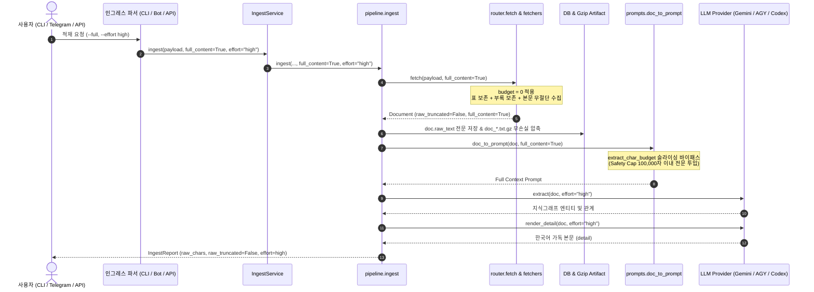

# 첫 적재 시 무절단 수집(Lossless Ingestion) 및 추론 레벨(Reasoning Effort) 지정 지원 설계

> **문서 상태**: 설계 완료 (Designed / Ready for Implementation)  
> **관련 문서**: [INGESTION_INTEGRITY_AND_POLLUTION_CONTROL_RESEARCH.md](INGESTION_INTEGRITY_AND_POLLUTION_CONTROL_RESEARCH.md), [PDF_INGESTION_AND_ADAPTIVE_EFFORT_DESIGN.md](PDF_INGESTION_AND_ADAPTIVE_EFFORT_DESIGN.md), [TARGET_IDENTIFIERS_AND_CLI_STANDARD.md](TARGET_IDENTIFIERS_AND_CLI_STANDARD.md)

---

## 1. 검토 결과 요약 (Review Summary)

### 1.1 결론: **현재 상태로는 첫 적재 시 지시 불가 (Currently NOT Supported)**
현재 Claire Bible 시스템을 전수 검토한 결과, **첫 적재(Initial Ingestion) 시점에 원문을 절단하지 않고(`full-content`) LLM 추론 레벨(`effort`)을 높여 적재하도록 사용자가 지시하는 것은 불가능**합니다.

현재 시스템은 이미 적재된 기존 문서를 사후에 재생성할 때(`regenerate --refetch-full --effort high` 또는 텔레그램 인라인 버튼 액션)에 한해서만 원문 전체 재수집 및 effort 재정의를 지원하고 있습니다.

### 1.2 불가능 원인 분석 (Root Causes)

```text
┌───────────────────────────────────────────────────────────────────────────────────┐
│                      현재 첫 적재 파이프라인의 3대 단절 구간                      │
├──────────────────────────┬──────────────────────────┬─────────────────────────────┤
│ 1. 인터페이스 파라미터 단절│ 2. 파이프라인 매개변수 단절│ 3. 프롬프트 엔진의 2차 절단  │
├──────────────────────────┼──────────────────────────┼─────────────────────────────┤
│ • CLI (claire ingest):   │ • IngestService.ingest() │ • prompts.doc_to_prompt():  │
│   --full, --effort 없음  │   full_content 매개변수  │   수집기가 전문을 가져와도   │
│ • 텔레그램 첫 적재:       │   시그니처 자체 부재     │   extract_char_budget       │
│   플래그가 신규적재에 미전달│ • pipeline.ingest():     │   (20,000자)로 프롬프트     │
│ • Web API (/ingest):     │   fetch_fn 호출 시       │   주입 시 강제 2차 절단    │
│   full_content/effort    │   full_content 미전달    │                             │
│   필드 미처리            │                          │                             │
└──────────────────────────┴──────────────────────────┴─────────────────────────────┘
```

1. **인터페이스 계층의 옵션 미제공 및 단절**:
   - **CLI (`claire ingest <payload>`)**: `--full` (또는 `--no-truncate`) 및 `--effort` 플래그가 존재하지 않으며, `cmd_ingest`는 내부 `ingest()` 호출 시 두 값을 전달하지 않습니다.
   - **텔레그램 봇 (`telegram_bot.py`)**: `parse_regenerate_flags`가 `--refetch-full`, `--effort`를 파싱하지만, 이는 이미 DB에 존재하는 문서의 공유 링크(`/p?s=...`)나 `doc_...` ID를 보낼 때의 **재생성(`regenerate_components`)에만 배타적으로 연결**되어 있습니다. 새로운 외부 URL이나 텍스트를 전송하거나 `/ingest` 명령어로 처음 적재할 때는 이 플래그들이 `svc.ingest()`로 전달되지 않고 무시됩니다.
   - **HTTP API (`POST /ingest`, `POST /ingest-stream`)**: 요청 JSON 바디에서 `full_content`와 `effort` 필드를 수신하여 서비스 계층으로 넘겨주는 로직이 구현되어 있지 않습니다.
2. **서비스 및 파이프라인 계층의 매개변수 단절**:
   - `fetch_web`, `fetch_file`, `router.fetch` 등 개별 수집기는 이미 `full_content: bool = False` 매개변수를 갖추고 있어 `budget = 0`으로 무절단 수집이 가능하도록 구현되어 있습니다.
   - 그러나 상위 오케스트레이터인 `IngestService.ingest()` 및 `pipeline.ingest()` 함수 시그니처에 `full_content` 매개변수가 누락되어 있어, 첫 적재 시 `fetch_fn(payload)`로 `full_content=True`를 주입할 방법이 없습니다.
3. **프롬프트 엔진의 정적 2차 절단 (LLM Context Truncation)**:
   - `prompts.doc_to_prompt(doc)` 함수는 PDF 문서를 제외한 모든 일반 웹/텍스트 문서에 대해 `settings.extract_char_budget`(기본 20,000자)으로 `slice_text()`를 수행합니다.
   - 설령 수집기에서 35,000자의 법령이나 기술 문서를 무절단 수집하여 `raw_text`로 온전히 저장했더라도, 구조화 추출 및 가독 본문 생성을 위한 LLM 프롬프트 생성 시점에서 다시 20,000자로 강제 슬라이싱됩니다.

---

## 2. 해결 목표 및 설계 원칙

1. **첫 적재 시 단일 호출로 무손실 수집 + 고추론 적재 보장 (Single-Shot Lossless & High-Effort Ingestion)**:
   - 사후 재생성을 거치지 않고, 첫 인입 시점부터 원문 전체(`full_content`) 수집과 지정된 추론 강도(`effort="high"`)를 즉각 적용합니다.
2. **모든 인그레스 채널의 직교적 옵션 표준화 (Orthogonal Interface Standardization)**:
   - CLI, Telegram 봇, HTTP API 전반에 걸쳐 일관된 플래그 및 파라미터 표준(`--full`, `--effort`)을 제공합니다.
3. **원천 저장(Layer 1/2)과 프롬프트 뷰(LLM Tier)의 무절단 동기화**:
   - `doc.raw_text` 및 gzip 아티팩트(`data/raw/artifacts/*.txt.gz`) 무절단 저장뿐 아니라, LLM 프롬프트 투입 시에도 절단 없이 전문 컨텍스트를 투입합니다 (모델 컨텍스트 윈도우 보호를 위한 가드 레일 포함).
4. **명시적 관측성 및 메타데이터 기록 (Observable Metadata)**:
   - `doc.meta`에 무절단 여부(`full_content: true`), 원문 길이, 적용된 추론 레벨(`applied_effort`)을 기록하고 Web UI 및 텔레그램 완료 메시지에 투명하게 노출합니다.
5. **절단 적재 시 내용 유실 섹션 상세 작성 배제 (Exclusion of Truncated Sections in Detail)**:
   - 무절단 모드가 아닌 일반 절단 수집(`full_content=False`) 상태에서 가독 상세(`render_detail`)를 작성할 경우, 절단으로 인해 내용이 유실된 섹션은 상세를 작성하지 않고 온전히 보존된 섹션까지만 상세를 작성합니다.

---

## 3. 핵심 아키텍처 및 데이터 흐름



---

## 4. 계층별 상세 설계 사양

### 4.1 CLI 계층 (`src/claire/cli.py`)

#### A. 인자 파서 (`pi = sub.add_parser("ingest")`) 확장
```python
pi = sub.add_parser("ingest", help="ingest a single payload")
pi.add_argument("payload", help="url / text / file path")
pi.add_argument(
    "--full",
    "--full-content",
    "--no-truncate",
    action="store_true",
    dest="full_content",
    help="원문 글자 수 상한(budget) 없이 전문을 온전히 수집 및 LLM에 투입 (lossless ingestion)",
)
pi.add_argument(
    "--effort",
    "-e",
    choices=["none", "minimal", "low", "medium", "high", "max"],
    default=None,
    help="LLM 사고/추론 레벨 (reasoning effort) 명시 지정 (기본값: 프로바이더/환경변수 기본값)",
)
```

#### B. 실행 핸들러 (`cmd_ingest`) 수정
```python
def cmd_ingest(args) -> int:
    ...
    full_content = getattr(args, "full_content", False)
    effort = getattr(args, "effort", None)
    directive = getattr(args, "focus", None) or getattr(args, "orientation", None) or getattr(args, "directive", None)
    
    report = ingest(
        args.payload,
        conn=conn,
        provider=provider,
        vstore=vstore,
        vault_dir=s.vault_dir,
        data_dir=s.data_dir,
        source="cli",
        expand_max=(0 if args.no_expand else s.expand_max),
        format=getattr(args, "format", None),
        directive=directive,
        effort=effort,
        full_content=full_content,
    )
    ...
```

---

### 4.2 텔레그램 봇 계층 (`src/claire/telegram_bot.py`)

#### A. 플래그 파싱 및 정제 확장
신규 인입 메시지, `/ingest` 커맨드, 첨부 문서 캡션에서 `--full`, `-R`, `--effort <level>`, `-e <level>`을 공통으로 인식하도록 확장합니다.

```python
_FULL_FLAG_RE = re.compile(
    r"(?:\s+|^)(?:[-–—―]{1,2}(?i:full[-_]content|full|no[-_]truncate|refetch[-_]full)|-R)(?:\s+|$)",
)
_EFFORT_FLAG_RE = re.compile(
    r"(?:\s+|^)(?:[-–—―]{1,2}(?i:effort|reasoning)|-[eE])\s+([a-zA-Z0-9_-]+)",
)
```

#### B. 신규 메시지 적재(`on_message`) 및 `/ingest` 핸들러(`on_ingest`) 연동
1. 사용자가 `https://example.com/article --full --effort high | 아키텍처 중심` 과 같이 입력했을 때:
   - `payload_clean`: `https://example.com/article`
   - `directive`: `아키텍처 중심`
   - `full_content`: `True`
   - `effort`: `"high"`
2. 이를 분리 추출한 후 `svc.ingest()`로 정확히 바인딩합니다:
   ```python
   report = await _run_with_ticker(
       status,
       label,
       lambda: svc.ingest(
           payload_clean,
           source="telegram",
           user_id=uid,
           chat_id=cid,
           directive=directive,
           effort=effort,
           full_content=full_content,
       ),
   )
   ```
3. 파일 첨부(`on_document`) 시에도 캡션에서 `--full` 및 `--effort`를 동일하게 파싱하여 적용합니다.

---

### 4.3 HTTP API 계층 (`src/claire/api/server.py`)

#### `POST /ingest` 및 `POST /ingest-stream` JSON 바디 스키마 지원
```json
{
  "payload": "https://example.com/law_or_paper",
  "full_content": true,
  "effort": "high",
  "format": "adoc",
  "directive": "핵심 조문 및 벌칙 규정 중심"
}
```

- `do_ingest` 및 `ingest_stream_route`에서:
  ```python
  full_content = bool(body.get("full_content") or body.get("no_truncate") or False)
  effort = str(body.get("effort") or "").strip() or None
  
  ingest_kwargs["full_content"] = full_content
  if effort is not None:
      ingest_kwargs["effort"] = effort
  ```

---

### 4.4 파이프라인 및 서비스 계층 (`pipeline.py`, `service.py`)

#### A. `IngestService.ingest`
```python
def ingest(
    self,
    payload: str,
    *,
    source: str,
    expand_max: int | None = None,
    user_id: int | None = None,
    chat_id: int | None = None,
    inbox_kind: str | None = None,
    file_ref: str | None = None,
    file_name: str | None = None,
    inbox_id: int | None = None,
    prefetched: Document | None = None,
    format: str | None = None,
    directive: str | None = None,
    effort: str | None = None,
    full_content: bool = False,
) -> IngestReport:
```

#### B. `pipeline.ingest`
```python
def ingest(
    payload: str,
    *,
    conn: sqlite3.Connection,
    provider: Provider,
    vstore: VectorStore,
    ...,
    effort: str | None = None,
    full_content: bool = False,
) -> IngestReport:
    ...
    # fetch_fn 호출 시 full_content 전달 (duck-typing 및 TypeError 대비)
    if prefetched is None:
        emit_progress("원문 가져오는 중…")
        try:
            doc = fetch_fn(payload, full_content=full_content)
        except TypeError:
            doc = fetch_fn(payload)
    else:
        doc = prefetched

    if full_content:
        if doc.meta is None:
            doc.meta = {}
        doc.meta["full_content"] = True

    ...
    ok, err = extract_resolve_store(
        conn, provider, vstore, doc, report,
        vault_dir=vault_dir, format=format,
        directive=directive, effort=effort,
        full_content=full_content,
    )
```

---

### 4.5 프롬프트 엔진 및 LLM Tier 계층 (`prompts.py`)

#### `doc_to_prompt`의 동적 예산 확장 (Bypass Truncation on Full Content)

```python
def doc_to_prompt(doc: Document, *, full_content: bool = False) -> str:
    """Document -> LLM 프롬프트 본문.
    
    full_content=True 또는 doc.meta['full_content']=True 인 경우:
    일반 extract_char_budget(20,000자)으로 절단하지 않고 원문 전체를 프롬프트에 투입.
    단, 과도한 토큰 폭주 방지를 위한 Safety Cap(100,000자)은 유지.
    """
    head = []
    if doc.title:
        head.append(f"TITLE: {doc.title}")
    if doc.url:
        head.append(f"URL: {doc.url}")
    head.append(f"SOURCE_TYPE: {doc.source_type}")
    
    settings = get_settings()
    is_full = full_content or bool((doc.meta or {}).get("full_content"))
    
    if is_full:
        # 무절단 지시 시: Safety Cap (기본 100,000자) 적용
        limit = max(100000, settings.pdf_max_extract_chars * 2)
    elif (doc.meta or {}).get("extra_sources"):
        limit = settings.effective_merged_extract_char_budget
    elif doc.source_type == "pdf":
        limit = settings.pdf_max_extract_chars
    else:
        limit = settings.extract_char_budget
        
    content_body = slice_text(doc.raw_text or "", limit, strategy=settings.slicing_strategy)
    return "\n".join(head) + "\n\nCONTENT:\n" + content_body
```

---

### 4.6 관측성 및 사용자 피드백 (Observability & UI Feedback)

1. **메타데이터 기록**:
   - `doc.meta["full_content"] = True`
   - `doc.meta["applied_effort"] = eff`
   - `doc.meta["raw_truncated"] = False`
2. **IngestReport & Telegram 피드백**:
   - 텔레그램 결과 메시지 및 CLI 출력에 뱃지 노출:
     - `🌐 원문 전체 무절단 적재 (35,603자)`
     - `🧠 추론 레벨: high`
3. **Web UI (문서 상세 상단 뱃지)**:
   - 기존 `✂️ 원문 일부 절단` 뱃지 대신, `🌐 원문 100% 무절단 보존` 및 `🧠 추론: HIGH` 뱃지 렌더링.

---

## 5. 명령어 사용 레퍼런스 (Usage Reference)

### 5.1 CLI 예시
```bash
# 1. 35,000자 법령 또는 초장문 기술 문서를 첫 적재부터 무절단 + high effort로 적재
claire ingest "https://www.law.go.kr/LSW/lsInfoP.do?lsiSeq=268421" --full --effort high

# 2. AsciiDoc 포맷 및 특정 아키텍처 초점과 함께 무절단 적재
claire ingest "https://arxiv.org/abs/2401.12345" --full --effort high --format adoc --focus "분산 합의 알고리즘 중심"

# 3. 로컬 텍스트/마크다운 파일 무절단 적재
claire ingest "./specs/rfc-draft.md" --full --effort medium
```

### 5.2 텔레그램 봇 예시
```text
# 1. URL 뒤에 플래그 및 초점을 파이프로 결합
https://example.com/complex-spec --full --effort high | 시스템 확장성 관점

# 2. /ingest 명령어 사용
/ingest https://example.com/deep-report --full -e high | 벤치마크 분석

# 3. 파일 전송 시 캡션에 작성
[첨부파일: nber_paper.pdf]
캡션: --full --effort high | 실증 분석 방법론 중심 해설
```

### 5.3 REST API 예시
```bash
curl -X POST http://127.0.0.1:8765/ingest \
  -H "Authorization: Bearer $CLAIRE_INJECT_TOKEN" \
  -H "Content-Type: application/json" \
  -d '{
    "payload": "https://example.com/long-doc",
    "full_content": true,
    "effort": "high",
    "directive": "데이터 파이프라인 아키텍처 중심"
  }'
```

---

## 6. 검증 계획 (Verification Plan)

### 6.1 단위 테스트 (Unit Tests)
- `tests/test_cli_ingest_flags.py`: `claire ingest --full --effort high` CLI 파싱 및 `ingest()` 호출 매개변수 정합성 검증.
- `tests/test_telegram_directive_flags.py`: `parse_regenerate_flags` 및 `parse_message_directive`가 신규 적재 URL 뒤의 `--full`, `--effort high`를 올바르게 페이로드와 분리해 추출하는지 검증.
- `tests/test_prompts_full_content.py`: `doc_to_prompt`에 `full_content=True` 전달 시 20,000자 초과 본문이 슬라이싱되지 않고 그대로 유지되는지 검증.

### 6.2 통합 파이프라인 테스트 (Integration Tests)
- Mock Provider 기반으로 30,000자 이상의 가상 웹/파일 문서 인입 시:
  1. `doc.raw_text` 길이가 30,000자 온전히 유지되는지 확인.
  2. `doc.meta["raw_truncated"]`가 `False`인지 확인.
  3. LLM `extract` 및 `render_detail` 호출에 `effort="high"`가 정확히 주입되는지 확인.
