# 프로젝트 국제화(i18n) 및 형태소 분석 기반 다국어 지원 설계 명세서

작성일: 2026-09-17 · 상태: **Draft (설계 초안)** · 기준: [GOALS.md](../../upstream/GOALS.md) 트랙1(시스템 무결성) / 트랙2(추출·검색 품질) / 트랙3(가독성·소비 품질) · 관련: [PREFERRED_LANGUAGES_DESIGN.md](PREFERRED_LANGUAGES_DESIGN.md), [ENVIRONMENT_VARIABLES.md](../implementation/ENVIRONMENT_VARIABLES.md)

---

## 1. 배경 및 문제 정의

### 1.1 배경
Claire Bible은 웹 문서, 학술 논문 PDF, 미디어 자막, 소셜 피드 등 다국어 지식 자산을 수집하고 구조화된 온톨로지 그래프(SQLite + Obsidian Vault)로 적재하는 지식베이스 플랫폼입니다. 기존 [PREFERRED_LANGUAGES_DESIGN.md](PREFERRED_LANGUAGES_DESIGN.md)를 통해 수집 파이프라인(Fetcher 다국어 자막/언어 선별) 및 LLM 온톨로지 추출 프롬프트에 광역 선호 언어(`CLAIRE_PREFERRED_LANGUAGES`)를 공급하는 체계가 수립되었습니다.

### 1.2 기존 구조의 기술적 한계 및 결함 분석
1. **인터페이스 텍스트의 정적 하드코딩 (I18n Decoupling 결여)**:
   - CLI 진단/실행 로그(`cli.py`), WebUI 렌더링 템플릿(`templates/`, `static/`), 텔레그램 봇 응답(`telegram_bot.py`) 전반에 걸쳐 한국어 및 영문 안내 메시지가 소스 코드 내 문자열 리터럴로 파편화되어 있음.
   - 단일 런타임에서 사용자의 로케일(Locale) 선호도를 동적으로 주입하거나 전환할 수 있는 추상화 계층(I18n Runtime Layer)이 전무함.
2. **글로벌 번역 기여(Crowdsourced Translation) 파이프라인 부재**:
   - 외부 기여자가 코드베이스 수정 없이 번역에 참여할 수 있는 표준 자원 형식(Resource Format) 및 동기화 도구가 없음.
   - 플랫폼 국제화 표준인 Crowdin 연동 사양(`crowdin.yml`)과 GitHub Actions 자동화 워크플로우가 정의되지 않아 수동 번역 파일 병합 시 충돌 및 누락 위험 상존.
3. **FTS5 토크나이저의 교착어(Korean) 형태소 분석 결함**:
   - `src/claire/store/db.py` 내 키워드 검색 인덱스는 단순 정규식 `_FTS_TOKEN = re.compile(r"[0-9A-Za-z가-힣]+")`에 기반함.
   - 한국어는 어근에 조사·어미가 결합하는 교착어이므로, '사과를', '사과가', '사과에'가 서로 다른 FTS 토큰으로 분리 색인됨. 이로 인해 단일 명사 '사과' 검색 시 본문의 굴절어/결합어가 검색 결과에서 원천 누락(Recall 저하)되거나 불필요한 단어가 매칭(Precision 저하)되는 구조적 결함 보유.
   - 복합명사('인공지능모델' $\rightarrow$ '인공지능', '모델') 분해 및 용언 어간/어미 정규화(Lemmatization/Stemming)를 수행하는 언어별 형태소 분석 파이프라인 부재.

---

## 2. 핵심 설계 원칙 및 불변식 (Invariants)

1. **결정론적 다단계 로케일 해석 (Deterministic Locale Resolution)**:
   - 각 진입점(CLI, WebUI, Telegram Bot)은 정의된 우선순위 체인(Priority Chain)을 엄격히 준수하여 1순위 일치값을 취하며, 어떤 예외 상황에서도 시스템 기본값(`en` 또는 `ko`)으로 수렴해야 한다.
2. **단일 진실 공급원 번역 원천 (Single Source of Truth Catalog)**:
   - 백엔드 및 소스 추출 템플릿은 산업 표준인 **GNU gettext PO/POT** 형식을 SSOT로 채택한다.
   - WebUI 클라이언트 런타임은 백엔드에서 사전 컴파일되거나 빌드 타임에 변환된 JSON 프로젝션을 소비하여, 다중 포맷 간 문자열 불일치를 원천 차단한다.
3. **색인-질의 간 분석 파이프라인 대칭성 (Index-Query Pipeline Symmetry)**:
   - FTS 색인 생성(`entities_fts` INSERT)과 사용자 검색 쿼리 변환(`_fts_query`)은 **동일한 형태소 분석기 인스턴스와 정규화 규칙**을 공유해야 한다.
4. **점진적 성능 저하 및 안전망 (Graceful Degradation)**:
   - `kiwipiepy` 등 C 확장을 포함하는 형태소 분석 라이브러리는 선택적 의존성(`[project.optional-dependencies]`)으로 격리한다. 모듈 미설치 또는 런타임 초기화 실패 시 시스템은 크래시 없이 기본 정규식 분석기(`RegexMorphAnalyzer`)로 즉시 폴백하고 운영 로그를 기록한다.

---

## 3. 인터페이스별 선호 언어 해석 체계 (Language Preference Resolution)

시스템은 인터페이스 유형에 따라 컨텍스트에 가장 적합한 로케일을 결정론적으로 해석합니다.

```mermaid
flowchart TD
    subgraph CLI ["1. CLI Resolution Chain"]
        C_OPT["CLI 옵션 (--lang / -l)"] -->|존재시 즉시 확정| C_END
        C_OPT -->|미지정| C_ENV["환경변수 CLAIRE_LANG"]
        C_ENV -->|존재시| C_END
        C_ENV -->|미지정| C_SYS["시스템 로케일 (LC_ALL, LC_MESSAGES, LANG)"]
        C_SYS -->|유효값| C_END
        C_SYS -->|미지정/무효| C_PREF["CLAIRE_PREFERRED_LANGUAGES (1순위)"]
        C_PREF -->|존재시| C_END
        C_PREF -->|미지정| C_DEF["Fallback: 'ko'"]
        C_DEF --> C_END["CLI 로케일 확정"]
    end

    subgraph WebUI ["2. WebUI Resolution Chain"]
        W_REQ["HTTP Request 수신"] --> W_COOKIE["쿠키/헤더 'claire_locale'"]
        W_COOKIE -->|명시값 존재| W_END
        W_COOKIE -->|미지정| W_HEADER["Accept-Language 헤더 (q-factor 파싱)"]
        W_HEADER -->|지원 로케일 매칭| W_END
        W_HEADER -->|불일치| W_ENV["서버 환경변수 CLAIRE_LANG"]
        W_ENV -->|존재시| W_END
        W_ENV -->|미지정| W_PREF["CLAIRE_PREFERRED_LANGUAGES (1순위)"]
        W_PREF -->|존재시| W_END
        W_PREF -->|미지정| W_DEF["Fallback: 'en'"]
        W_DEF --> W_END["WebUI 요청 로케일 확정"]
    end

    subgraph Bot ["3. Telegram Bot Resolution Chain"]
        T_REQ["Telegram Update 수신"] --> T_USER["User profile language_code"]
        T_USER -->|지원 로케일| T_END
        T_USER -->|미지원/None| T_ENV["봇 환경변수 CLAIRE_LANG"]
        T_ENV -->|존재시| T_END
        T_ENV -->|미지정| T_PREF["CLAIRE_PREFERRED_LANGUAGES (1순위)"]
        T_PREF -->|존재시| T_END
        T_PREF -->|미지정| T_DEF["Fallback: 'ko'"]
        T_DEF --> T_END["Bot 로케일 확정"]
    end
```



### 3.1 비동기 동시성 격리 및 컨텍스트 계약
웹 및 봇의 비동기 요청 처리 중 로케일 오염(Cross-request race condition)을 방지하기 위해 Python `contextvars`를 사용합니다.

```python
# src/claire/i18n/context.py
from __future__ import annotations
import contextvars
from typing import Final

DEFAULT_LOCALE: Final[str] = "ko"
_current_locale: contextvars.ContextVar[str] = contextvars.ContextVar(
    "current_locale", default=DEFAULT_LOCALE
)

def get_current_locale() -> str:
    """현재 실행 태스크/스레드의 활성 로케일 반환."""
    return _current_locale.get()

def set_current_locale(locale: str) -> None:
    """현재 실행 태스크/스레드의 로케일 설정 (정규화된 2자리 소문자 코드)."""
    norm = (locale or "").strip().lower().split("_")[0].split("-")[0]
    _current_locale.set(norm or DEFAULT_LOCALE)
```

### 3.2 WebUI 미들웨어 통합 사양
ASGI/Starlette 파이프라인에서 요청 수신 즉시 로케일을 결정하고 응답 헤더(`Content-Language`)에 바인딩합니다.

```python
# src/claire/api/middleware/i18n.py
from starlette.middleware.base import BaseHTTPMiddleware, RequestResponseEndpoint
from starlette.requests import Request
from starlette.responses import Response
from claire.i18n.context import set_current_locale
from claire.i18n.resolver import resolve_web_locale

class I18nMiddleware(BaseHTTPMiddleware):
    async def dispatch(self, request: Request, call_next: RequestResponseEndpoint) -> Response:
        locale = resolve_web_locale(
            cookie_locale=request.cookies.get("claire_locale"),
            accept_language=request.headers.get("accept-language"),
        )
        set_current_locale(locale)
        response = await call_next(request)
        response.headers["Content-Language"] = locale
        return response
```

---

## 4. 번역 자원 체계 및 Crowdin CI/CD 아키텍처

### 4.1 리소스 포맷 엔지니어링 비교
| 속성 (Dimension) | GNU gettext (`.po` / `.pot`) | 계층형 JSON (`.json`) |
| :--- | :--- | :--- |
| **Crowdin 엔진 지원** | **1등급 (Native parsing, 복수형/주석/맥락 완전 지원)** | 2등급 (Key-Value/i18next 파서 매핑 필요) |
| **복수형 연산 (Plurals)** | **`Plural-Forms` 수식 내장 (언어별 n 값에 따른 자동 분기)** | 수동 조건문 및 별도 접미사(`_plural`) 구현 필요 |
| **번역 맥락 분기 (Context)** | **`msgctxt` 네이티브 지원 (동음이의어 분리 가능)** | 네임스페이스 키 분리(`buttons.save`, `titles.save`) 강제 |
| **파이썬 런타임 오버헤드** | **내장 `gettext` 모듈 및 컴파일 바이너리(`.mo`)로 $O(1)$ 해시 조회** | 런타임 JSON 파싱 메모리 및 별도 조회 딕셔너리 관리 |
| **클라이언트 이식성** | 컴파일 타임 JSON 변환 파이프라인 필요 | 프론트엔드 직접 fetch 가능 |
| **엔지니어링 판정** | **채택 (SSOT 원천 자원)** | **채택 (WebUI 배포용 빌드 프로젝션 자산)** |

### 4.2 자원 디렉터리 레이아웃
```text
claire-bible/
├── crowdin.yml                      # Crowdin CLI 및 VCS 동기화 설정
├── locales/                         # [SSOT] 번역 자원 원천
│   ├── claire.pot                   # 소스 코드 문자열 추출 템플릿
│   ├── ko/
│   │   └── LC_MESSAGES/
│   │       ├── claire.po            # 한국어 번역 소스
│   │       └── claire.mo            # 컴파일된 런타임 바이너리 (Git 추적 제외)
│   ├── en/
│   │   └── LC_MESSAGES/
│   │       └── claire.po            # 영문 번역 소스
│   └── ja/
│       └── LC_MESSAGES/
│           └── claire.po            # 일본어 번역 소스
└── src/claire/
    ├── i18n/                        # i18n 핵심 서브시스템
    │   ├── __init__.py              # get_text, _, ngettext 표준 인터페이스
    │   ├── catalog.py               # gettext.GNUTranslations 풀 및 캐시
    │   ├── context.py               # ContextVar 컨텍스트 관리자
    │   └── resolver.py              # 다단계 로케일 우선순위 결정기
    └── static/
        └── locales/                 # WebUI 클라이언트 배포용 JSON 빌드 결과물
            ├── ko.json
            ├── en.json
            └── ja.json
```

### 4.3 Crowdin 동기화 설정 명세 (`crowdin.yml`)
```yaml
# crowdin.yml
project_id: "claire-bible"
api_token_env: "CROWDIN_PERSONAL_TOKEN"
base_path: "."
base_url: "https://api.crowdin.com"

preserve_hierarchy: true

files:
  - source: "/locales/claire.pot"
    translation: "/locales/%two_letters_code%/LC_MESSAGES/claire.po"
    languages_mapping:
      two_letters_code:
        ko: "ko"
        en: "en"
        ja: "ja"
        zh-CN: "zh"
```

### 4.4 CI/CD 자동화 파이프라인 계약
1. **문자열 추출 및 템플릿 갱신 (`xgettext`)**:
   - `scripts/i18n_extract.py` 실행: `src/claire/**/*.py`, `templates/**/*.html` 내 `_("...")` 문자열을 스캔하여 `locales/claire.pot` 자동 갱신.
2. **Crowdin 동기화 액션 (`.github/workflows/crowdin.yml`)**:
   - `main` 브랜치 푸시 시 최신 `claire.pot`를 Crowdin 프로젝트로 자동 업로드.
   - 번역 완료율 임계치(예: 80%) 달성 시 Crowdin이 번역된 `claire.po`를 포함하는 PR 자동 발행.
3. **바이너리 컴파일 및 JSON 프로젝션 (`msgfmt` & `po2json`)**:
   - 패키지 빌드 시(`hatch build`) `.po` 파일을 컴파일하여 `claire.mo` 생성 및 WebUI용 `src/claire/static/locales/{locale}.json` 정적 자산 자동 산출.

---

## 5. 형태소 분석기(NLP) 플러그인 아키텍처 및 한국어(Kiwipiepy) 연동

### 5.1 문제 분석: 단순 정규식 토크나이징의 정합성 한계
현재 SQLite FTS5 키워드 색인 대상인 `entities_fts`는 다음 정규식으로 토큰을 분리합니다: $$\text{Token} \in \text{Matches}(\text{pattern} = \texttt{[0-9A-Za-z가-힣]+})$$

* **조사 결합 오류**: `엔티티_A는` $\neq$ `엔티티_A`. 사용자가 '엔티티_A'로 질의 시 완전 일치 실패.
* **어미 변화 누락**: `분석하다`, `분석하는`, `분석된` $\rightarrow$ 어근 `분석`으로 수렴되지 않음.
* **복합명사 미분해**: `인공지능파이프라인` $\rightarrow$ `인공지능`, `파이프라인` 개별 키워드로 매칭 불가.

### 5.2 한국어 형태소 분석 엔진 선정: `kiwipiepy`
* **성능 지표**: C++ 기반 아키텍처로 순수 Python 형태소 분석기 대비 10~20배 빠른 처리 속도 (문서당 수 밀리초 이내).
* **사전 확장성**: 사용자 정의 고유명사/전문 용어 사전 동적 추가 지원.
* **토큰 정밀도**: 결합형태소 분리 및 실질형태소(체언/용언 어근) 필터링 제공.

### 5.3 형태소 분석기 인터페이스 규약 (Protocol)
모든 언어별 형태소 분석기는 다음 인터페이스 계약을 엄격히 구현해야 합니다.

```python
# src/claire/nlp/base.py
from __future__ import annotations
from typing import Protocol, runtime_checkable

@runtime_checkable
class MorphAnalyzer(Protocol):
    """FTS 색인 및 검색어 정규화를 담당하는 언어별 분석기 인터페이스."""

    def tokenize(self, text: str) -> list[str]:
        """문서 본문에서 FTS5 색인에 삽입할 정규화된 형태소 토큰 목록 추출.
        
        Invariant: 반환된 토큰은 소문자화 및 공백/특수문자가 제거된 단일 형태소 형태여야 함.
        """
        ...

    def query_tokens(self, query: str) -> list[str]:
        """사용자 검색 질의에서 FTS5 MATCH 식을 구성할 키워드 토큰 목록 추출.
        
        색인과 동일한 정규화 규칙을 적용해야 함.
        """
        ...
```

### 5.4 한국어 Kiwipiepy 바인딩 명세

```python
# src/claire/nlp/korean.py
from __future__ import annotations
import logging
from typing import Final
from .base import MorphAnalyzer

logger = logging.getLogger(__name__)

# FTS 색인 및 검색 유효 품사군: 체언(명사류), 용언 어근, 어근
_INDEX_POS_TAGS: Final[frozenset[str]] = frozenset({
    "NNG",  # 일반 명사
    "NNP",  # 고유 명사
    "NNB",  # 의존 명사
    "NR",   # 수사
    "VV",   # 동사 어근
    "VA",   # 형용사 어근
    "XR",   # 어근
    "SL",   # 외국어 (알파벳)
    "SN",   # 숫자
})

class KiwiMorphAnalyzer(MorphAnalyzer):
    """kiwipiepy 기반 고성능 한국어 형태소 분석기."""

    def __init__(self) -> None:
        try:
            from kiwipiepy import Kiwi
            # sbg: 속도와 메모리 최적화 모델 로드
            self._kiwi = Kiwi(model_type="sbg")
        except ImportError as err:
            raise RuntimeError(
                "kiwipiepy is not installed. Install via `pip install 'claire[nlp-ko]'`."
            ) from err

    def tokenize(self, text: str) -> list[str]:
        if not text:
            return []
        tokens: list[str] = []
        try:
            results = self._kiwi.tokenize(text, match_options=0)
            for token in results:
                if token.tag in _INDEX_POS_TAGS:
                    tokens.append(token.form.lower())
        except Exception as e:
            logger.error("Kiwi tokenization failed on input: %s", e)
            return []
        return tokens

    def query_tokens(self, query: str) -> list[str]:
        return self.tokenize(query)
```

### 5.5 팩토리 및 점진적 저하(Graceful Degradation) 엔진

```python
# src/claire/nlp/factory.py
from __future__ import annotations
import logging
from .base import MorphAnalyzer
from .regex import RegexMorphAnalyzer

logger = logging.getLogger(__name__)

class MorphAnalyzerFactory:
    """언어 코드에 대응하는 형태소 분석기 싱글톤 풀."""
    _instances: dict[str, MorphAnalyzer] = {}

    @classmethod
    def get_analyzer(cls, lang: str) -> MorphAnalyzer:
        norm_lang = (lang or "").strip().lower().split("_")[0].split("-")[0]
        if norm_lang in cls._instances:
            return cls._instances[norm_lang]

        analyzer: MorphAnalyzer
        if norm_lang == "ko":
            try:
                from .korean import KiwiMorphAnalyzer
                analyzer = KiwiMorphAnalyzer()
                logger.info("Initialized KiwiMorphAnalyzer for Korean (ko)")
            except Exception as exc:
                logger.warning(
                    "Cannot initialize KiwiMorphAnalyzer (%s). "
                    "Falling back to RegexMorphAnalyzer.",
                    exc,
                )
                analyzer = RegexMorphAnalyzer()
        else:
            analyzer = RegexMorphAnalyzer()

        cls._instances[norm_lang] = analyzer
        return analyzer
```

---

## 6. FTS5 색인 및 검색 파이프라인 결합 계약

### 6.1 색인 시점 (Indexing Phase)
`src/claire/store/db.py`의 엔티티 저장(`save_entity`) 및 일괄 저장 시점에 FTS5 테이블을 채우는 명세입니다.

```python
def save_entity(conn: sqlite3.Connection, ent: Entity, *, analyzer: MorphAnalyzer) -> None:
    # 1. 엔티티 기본 메타데이터 저장
    ...
    # 2. 형태소 분석 기반 FTS5 토큰열 산출
    raw_corpus = f"{ent.name} {' '.join(ent.observations)}"
    tokens = analyzer.tokenize(raw_corpus)
    tokenized_text = " ".join(tokens)

    # 3. FTS 테이블 동기화
    conn.execute("DELETE FROM entities_fts WHERE entity_id = ?", (ent.id,))
    conn.execute(
        "INSERT INTO entities_fts(entity_id, name, body) VALUES (?, ?, ?)",
        (ent.id, ent.name, tokenized_text),
    )
```

### 6.2 질의 시점 (Query Phase)
`_fts_query`는 자유 텍스트를 파싱하여 FTS5 연산자 충돌을 방지하고 구문 매칭 쿼리를 생성합니다.

```python
def _fts_query(query: str, analyzer: MorphAnalyzer) -> str:
    """형태소 분석기를 경유하여 안전한 FTS5 MATCH 표현식 생성."""
    tokens = analyzer.query_tokens(query or "")
    if not tokens:
        return ""
    # 특수문자 탈출 및 개별 토큰 인용
    escaped_tokens = [f'"{t.replace(chr(34), "")}"' for t in tokens if t.strip()]
    return " ".join(escaped_tokens)
```

### 6.3 인덱스 재구축 도구 계약 (`claire heal --reindex-fts`)
형태소 분석기가 변경되거나 활성화 언어가 교체될 경우 기존 색인과의 불일치를 해결하기 위한 결정론적 수리 커맨드를 제공합니다:

```bash
claire heal --reindex-fts
```
* **동작 명세**:
  1. `entities_fts` 가상 테이블의 기존 데이터를 일괄 삭제(`DELETE FROM entities_fts`).
  2. 활성 분석기(`MorphAnalyzerFactory.get_analyzer(active_lang)`)를 획득.
  3. `entities` 테이블의 전수 엔티티를 순회하며 토큰열을 재생성하고 `entities_fts`에 재삽입.
  4. 복구된 엔티티 건수를 반환 및 검증 로그 출력.

---

## 7. 환경변수 및 Pydantic 설정 명세

### 7.1 Pydantic 설정 필드 선언 (`src/claire/config.py`)

```python
# --- internationalization & morphological analysis ---
lang: str = Field(
    default="ko",
    alias="CLAIRE_LANG",
    description="UI/CLI 기본 출력 언어 코드 (ISO 639-1)",
)

morph_analyzer_lang: str | None = Field(
    default=None,
    alias="CLAIRE_MORPH_ANALYZER_LANG",
    description="FTS 키워드 검색 형태소 분석 언어 (미설정 시 lang 또는 preferred_languages 1순위 사용)",
)

@property
def effective_morph_lang(self) -> str:
    """FTS 형태소 분석에 최종 적용되는 결정론적 언어 코드."""
    if self.morph_analyzer_lang:
        return self.morph_analyzer_lang.strip().lower()
    if self.lang:
        return self.lang.strip().lower()
    return self.effective_preferred_languages[0]
```

### 7.2 `.env.example` 배포 템플릿

```bash
# ==============================================================================
# Internationalization (i18n) & NLP Configuration
# ==============================================================================
# UI/CLI 출력 기본 언어 (ko, en, ja). 기본값: ko
CLAIRE_LANG=ko

# 프로젝트 광역 선호 콘텐츠 언어 (수집/자막/요약). 영어(en)는 항상 폴백으로 포함됨
CLAIRE_PREFERRED_LANGUAGES=ko,en

# FTS 키워드 검색 형태소 분석기 언어 (ko, en 등).
# 미지정 시 CLAIRE_LANG 또는 CLAIRE_PREFERRED_LANGUAGES 1순위 언어를 상속.
# ko 설정 시 kiwipiepy 설치 여부에 따라 고성능 Kiwi 분석기가 활성화됩니다.
CLAIRE_MORPH_ANALYZER_LANG=ko
```

---

## 8. 의존성 격리 및 패키지 사양 (`pyproject.toml`)

코어 패키지의 경량성을 유지하고 C 컴파일러가 없는 최소 환경에서도 설치가 가능하도록 선택적 의존성으로 선언합니다.

```toml
[project.optional-dependencies]
# 한국어 형태소 분석 가속 (Kiwi C++ 바인딩)
nlp-ko = ["kiwipiepy>=0.20.0"]

# 다국어 NLP 통합 번들 (향후 확장)
nlp = [
    "kiwipiepy>=0.20.0",
]
```

---

## 9. 단계별 검증 및 테스트 계획 (Verification Plan)

### 9.1 단위 및 통합 테스트 (`tests/`)
1. **로케일 리졸버 결정론성 검증 (`tests/test_i18n_resolver.py`)**:
   - CLI 옵션 $\rightarrow$ 환경변수 $\rightarrow$ 시스템 로케일 $\rightarrow$ 기본값 우선순위 전이 테스트.
   - HTTP `Accept-Language` 헤더의 q-factor 파싱(`ko-KR,ko;q=0.9,en-US;q=0.8`) 정확도 검증.
2. **Kiwipiepy 형태소 분석기 정합성 검증 (`tests/test_morph_analyzer.py`)**:
   - 체언 및 조사 결합 문장("인공지능 모델을 개발하여 배포하였다")의 토큰화 결과 검증: `['인공지능', '모델', '개발', '배포']` 추출 확인.
   - `kiwipiepy` 미설치 모의(Mock) 환경에서 `RegexMorphAnalyzer`로의 무중단 폴백 동작 검증.
3. **FTS5 검색 대칭성 및 재현율 검증 (`tests/test_fts_morph_search.py`)**:
   - 조사/어미가 포함된 엔티티 삽입 후, 단독 명사 쿼리로 검색 성공 여부 검증 (기존 단순 정규식 대비 검색 적중률 비교).
4. **FTS 재색인 커맨드 검증 (`tests/test_cli_heal_fts.py`)**:
   - `claire heal --reindex-fts` 실행 후 `entities` 행 수와 `entities_fts` 행 수의 완전 일치(0 desync) 검증.
