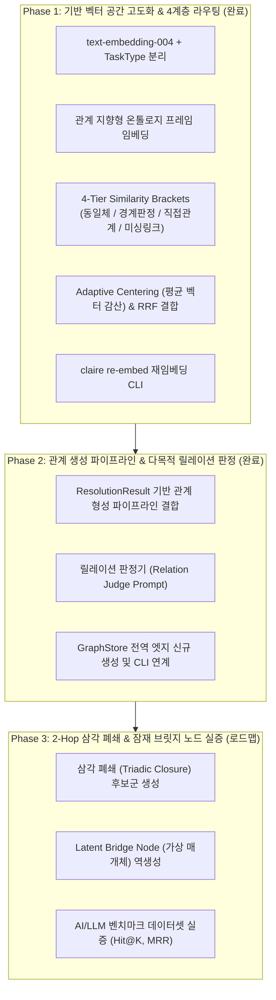
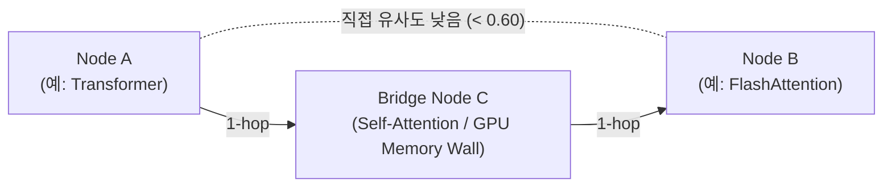

# 지식 그래프 링킹 캘리브레이션 및 잠재 연결(미싱링크) 발굴 아키텍처 설계

작성일: 2026-09-16 · 상태: **Phase 1-2 Implemented / Phase 3 Roadmap** · 기준: [GOALS.md](../../upstream/GOALS.md) 트랙2(추출·연결 품질) / 지식그래프 고도화 · 관련 문서: [CLAIRE_ARCHITECTURE_ROADMAP.md](../CLAIRE_ARCHITECTURE_ROADMAP.md), [ENVIRONMENT_VARIABLES.md](../implementation/ENVIRONMENT_VARIABLES.md), [COMMANDS.md](../implementation/COMMANDS.md)

---

## 1. 배경 및 문제 정의

### 1.1 배경
Claire Bible은 유입되는 다양한 기술 문서, 학술 논문, 비디오 미디어 등으로부터 엔티티와 관계를 추출하여 지식 그래프(Knowledge Graph)를 구축합니다. 지식 그래프의 핵심 가치는 **단편적인 문서들의 요약에 머무르지 않고, 기존 지식과 신규 지식이 유기적으로 결합되어 새로운 통찰(Insight)을 도출하는 연결망**을 형성하는 데 있습니다.

### 1.2 기존 엔티티 해소(Entity Resolution) 구조의 한계점
1. **극단적으로 좁고 경직된 2분법 임계값**:
   - 기존 `resolver.py`는 `AUTO_MERGE_SIMILARITY = 0.93`, `CANDIDATE_FLOOR = 0.72`라는 단 두 개의 임계값만을 사용했습니다.
   - 유사도 `0.93` 이상은 무조건 동일체로 병합하고, `0.72 ~ 0.93` 구간의 소수 후보만 LLM에게 동일체 여부를 질문했습니다.
   - 코사인 유사도 `0.72` 미만의 모든 노드는 **즉시 버려져(Discarded)**, 두 개념이 깊은 의미적 연관성을 가지거나 한두 다리 건너 연결되는 관계임에도 불구하고 그래프 상에서 영구히 단절되는 문제가 발생했습니다.
2. **단편적 키워드 임베딩으로 인한 의미 손실**:
   - 엔티티를 벡터화할 때 `f"{ee.canonical_name} ({ee.entity_type})"` 형태의 단순 명칭과 타입만을 벡터화했습니다.
   - 엔티티가 지닌 상세 관찰 사실(Observations), 역할, 도메인 슬롯 정보가 벡터 공간에 전혀 반영되지 않아, 표면적인 단어 일치가 없으면 유사도가 급격히 하락했습니다.
3. **구형 임베딩 모델 및 허브니스(Hubness) 편향**:
   - 레거시 모델(`gemini-embedding-001`)은 표현 차원과 미세 의미 분별력이 부족하여, 특정 일반 명사가 벡터 공간의 중심에 위치하며 불필요하게 모든 노드와 높은 유사도를 기록하는 허브니스 현상이 발생했습니다.
   - 또한 질의(Retrieval Query), 문서 색인(Retrieval Document), 의미 유사도(Semantic Similarity) 간의 태스크 목적 분리가 지원되지 않았습니다.
4. **프롬프트 중심 접근의 구조적 맹점**:
   - 그래프 연결을 개선하기 위해 LLM 프롬프트만을 수정하려는 시도는, 프롬프트에 주입되는 후보군 데이터 자체가 이미 좁은 임계값(`0.72`)에 의해 잘려나간 상태에서는 무용지물이었습니다 (Garbage In, Empty Out).
   - 따라서 **기반 벡터 공간의 표현력 향상, 다계층 유사도 라우팅, 결합도 보정이 선행**되어야만 실질적인 지식 연결을 복원할 수 있습니다.

---

## 2. 아키텍처 개요 및 3단계 로드맵

Claire Bible의 지식 링킹 고도화는 다음의 3단계 실행 로드맵으로 전개됩니다.



---

## 3. Phase 1 구현 상세 규격

### 3.1 4계층 유사도 브래킷 (4-Tier Similarity Brackets)
엔티티 해소기(`resolver.py`)는 단일 결정을 내리는 대신 유사도 점수 대역에 따라 지식 후보군을 정밀하게 분류하는 4계층 라우팅 체계를 적용합니다.

| 티어 (Tier) | 기본 유사도 구간 | 판정 성격 | 시스템 동작 | 반환 대상 |
| :--- | :--- | :--- | :--- | :--- |
| **Tier 1 (Auto Merge)** | `[0.93, 1.00]` | 완전 동일체 (Identity) | LLM 호출 없이 기존 엔티티로 즉시 병합 (별칭/관찰 누적) | `(existing_entity, False)` |
| **Tier 2 (Borderline Judge)** | `[0.72, 0.93)` | 동일체 경계선 (Ambiguous) | LLM 동일체 판정기(`judge_same_entity`)에 질의하여 병합 여부 결정 | 동일체면 병합, 다르면 Tier 3 후보로 전환 |
| **Tier 3 (Relational Candidate)** | `[0.70, 0.72)` | 직접적 관계 (Direct Relational) | 독립 엔티티로 신규 생성하되, 직접 엣지 연결 후보로 격리 보존 | `res.relational_candidates` |
| **Tier 4 (Multi-Hop Candidate)** | `[0.55, 0.70)` | 간접/잠재적 관계 (Missing Link) | 잠재적 브릿지 개념 및 다단계 추론 후보군으로 보존 | `res.multihop_candidates` |

#### `ResolutionResult` 하위 호환성 보장
기존 코드베이스는 `ent, created = resolve_or_create(...)` 형태의 언패킹 튜플을 기대합니다. 이를 100% 무중단 하위 호환하면서 신규 메타데이터를 제공하기 위해 `tuple[Entity, bool]`을 상속하는 `ResolutionResult` 데이터 구조를 정의했습니다.

```python
class ResolutionResult(tuple):
    entity: Entity
    created: bool
    relational_candidates: list[tuple[Entity, float]]
    multihop_candidates: list[tuple[Entity, float]]
    decision: str  # "exact", "alias", "vector_auto", "llm_same", "created_with_candidates"
```

### 3.2 고도화된 벡터화 모델 및 Task Type 분리
Google Gemini 최신 임베딩 모델인 `text-embedding-004`를 기본값으로 채택하고, 사용 목적에 따라 `EmbedContentConfig`의 `task_type`을 명시적으로 분리합니다.

```
[Task Type 분리 체계]
- RETRIEVAL_DOCUMENT : 문서 본문, 온톨로지 엔티티 프레임 색인 및 저장 시 적용
- RETRIEVAL_QUERY    : 사용자 질의, 의미 검색 수행 시 적용
- SEMANTIC_SIMILARITY: 엔티티 간 1:1 유사도 비교 및 클러스터링 판정 시 적용
```

- 프로바이더 계층(`GeminiProvider`, `AntigravityProvider`, `CodexProvider`, `MockProvider`) 전반에 `task_type`과 `title` 파라미터를 지원하는 공통 인터페이스를 확립했습니다.

### 3.3 관계 지향형 온톨로지 프레임 임베딩 (`format_entity_frame`)
단순 명칭 임베딩의 표현력 한계를 극복하기 위해 `src/claire/extract/frame.py`에 온톨로지 구조화 프레임을 도입했습니다.

```
[생성되는 프레임 형식 예시]
Entity: FlashAttention (Technique)
Known aliases: FA2, FlashAttention-2
Key observations:
- Hardware-aware exact attention algorithm reducing memory I/O
- Optimizes GPU SRAM and HBM memory transactions
- Scales sequence length linearly with negligible overhead
```
- 엔티티 타입, 주요 별칭, 그리고 최대 5건의 핵심 관찰 사실(Observations)을 결합하여 임베딩함으로써, 모델이 해당 기술/개념의 구조적 의미와 응용 도메인을 함께 인지하도록 보정합니다.

### 3.4 벡터 공간 캘리브레이션 (Calibration & Fusion)
`src/claire/store/vectors.py`에 코사인 유사도 왜곡을 방지하기 위한 통계적 캘리브레이션 알고리즘을 구현했습니다.

1. **Adaptive Centering (평균 벡터 감산)**:
   - 전체 노드 임베딩의 중심 벡터(Centroid $\vec{\mu}$)를 계산하고, 모든 벡터에서 이를 감산한 뒤 $L_2$ 재정규화를 수행합니다.
   $$\vec{v}_{\text{calibrated}} = \frac{\vec{v} - \vec{\mu}}{\|\vec{v} - \vec{\mu}\|_2}$$
   - 이를 통해 공통 도메인 단어로 인해 발생하는 인공적인 높은 유사도(Hubness)를 제거하고 고유한 의미적 차이를 극대화합니다.
2. **상호 순위 융합 (Reciprocal Rank Fusion; RRF)**:
   - 밀집 벡터(Dense Cosine) 검색과 어휘/키워드(Sparse Lexical) 검색의 순위를 파라미터 튜닝 없이 안정적으로 합성할 수 있는 RRF 헬퍼(`reciprocal_rank_fusion`)를 내장했습니다 ($k=60$).

### 3.5 재임베딩 CLI (`claire re-embed`)
기존에 `gemini-embedding-001` 및 단순 키워드로 임베딩되어 저장된 모든 노드 벡터를 신규 프레임 형식과 모델로 일괄 소급 갱신할 수 있는 운영 명령을 제공합니다.
```bash
./cb-manuscript app re-embed                    # 드라이런 (재임베딩 대상 진단)
./cb-manuscript app re-embed --apply            # 실제 DB 벡터 일괄 갱신
./cb-manuscript app re-embed --apply --limit 50 # 상위 50개 노드만 부분 갱신
```

---

## 4. Phase 2 구현 상세 규격 & Phase 3 확장 계획

### 4.1 Phase 2: 지식 그래프 관계(Edge) 자동 형성 파이프라인 (구현 완료)
Phase 1에서 확보된 `ResolutionResult.relational_candidates`를 소비하여 실제 그래프 상에 관계를 수립하고 문서 경계를 초월한 전역 지식망을 형성합니다.

#### 1) 다목적 릴레이션 판정기 (`judge_relationship`)
- **입력 스키마 (`RelationCandidate`)**: 두 엔티티의 명칭, 타입, 별칭, 핵심 관찰 사실(Observations), 코사인 유사도, 그리고 문서 맥락 요약을 포함합니다.
- **판정 결과 (`RelationJudgement`)**:
  - `has_relation: bool`: 유의미한 온톨로지 관계 성립 여부 (보수적 고정밀 판정, 근거 없는 추측 차단).
  - `relation_type: str | None`: 온톨로지 표준 관계 (`uses`, `improves`, `derived_from`, `competes_with`, `alternative_to`, `implements`, `part_of`, `integrates_with`, `authored_by`, `cites` 등).
  - `direction: str`: 관계 방향성 (`forward`: A -> B, `backward`: B -> A, `bidirectional`: 대칭 관계).
  - `reason: str`: 한국어 문어체(~한다/~이다) 근거 서술.
  - `confidence: float`: 판정 확신도.

#### 2) 영속 그래프 저장소 추상화 (`GraphStore`)
- `src/claire/store/graph.py`에 전역 지식 그래프 엣지 관리자 `GraphStore` 구축:
  - `add_edge(source_id, target_id, rel_type, ...)`: 자기 자신 루프 거부, 온톨로지 도메인/레인지 검증, 기존 엣지 출처(sources) 및 confidence 멱등적 병합 지원.
  - `has_edge(...)`: 양방향/단방향 엣지 존재 여부 고속 조회.
  - `dbm.add_edge` 및 `dbm.has_relation_between` 편의 인터페이스 연동.

#### 3) 인제스트 파이프라인 및 Vault 동기화 결합
- `pipeline.py`의 `extract_resolve_store` 단계에서 `ResolutionResult`들의 `relational_candidates`를 집계.
- **비용 최적화 가드레일**:
  - 엔티티당 최대 3쌍(`CLAIRE_MAX_RELATION_JUDGES_PER_ENTITY`), 문서당 최대 10쌍(`CLAIRE_MAX_RELATION_JUDGES_PER_DOC`) 상한 적용.
  - 이미 그래프 상에 존재하는 엣지는 사전 검사(`has_edge`)로 LLM 호출 비용을 0으로 억제.
- 성립된 횡단 엣지의 상대 엔티티도 `touched_entities`에 편입시켜 Obsidian Vault 마크다운 위키링크가 즉시 갱신되도록 보장.
- `IngestReport` 및 텔레그램 알림에 `cross_relations_added` 및 연결 명세를 실시간 리포팅.

#### 4) 전역 횡단 링킹 CLI (`claire link-relations`)
기존에 축적된 지식베이스 전체를 대상으로 유사도 기반 횡단 관계를 일괄 발굴·수립하는 명령을 제공합니다.
```bash
./cb-manuscript app link-relations --dry-run             # 횡단 관계 발굴 시뮬레이션
./cb-manuscript app link-relations                       # 실제 지식 그래프 엣지 일괄 수립
./cb-manuscript app link-relations --limit 20 --min-score 0.75
```

---

### 4.2 Phase 3: 미싱링크(2-Hop Missing Link) 발굴 및 실증 방법론 (로드맵)
서로 직접적인 코사인 유사도가 낮은(예: `< 0.60`) 두 노드 $A$와 $B$ 사이에 존재하는 숨겨진 연결 고리를 탐색하고 실증합니다.



#### 핵심 가설 (Hypotheses)
1. **삼각 폐쇄 가설 (Triadic Closure Hypothesis)**:
   - 두 노드 $A$와 $B$가 공통으로 높은 유사도를 갖거나 기존 엣지로 연결된 매개 노드 $C$(Bridge Node)가 존재할 경우, $A-B$ 간의 잠재적 관계 성립 확률은 기저 확률보다 유의미하게 높다.
2. **잠재 브릿지 노드 역생성 (Latent Bridge Node Hypothesis)**:
   - Tier 4(`[0.55, 0.70)`) 후보군 쌍에 대해 LLM에게 두 개념의 기술적 교집합(Missing Link)을 유추하게 하면, 지식베이스에 아직 수집되지 않은 새로운 핵심 연구/개념 $C$를 역으로 도출하여 능동적 수집(Active Ingestion) 대상으로 지정할 수 있다.

#### 실증(Empirical Verification) 벤치마크 설계
- **검증 데이터셋**:
  - 이미 학술적으로 정립된 2-hop 기술 관계 체계 (예: `LoRA` $\rightarrow$ `PEFT` $\rightarrow$ `QLoRA`, `DDPM` $\rightarrow$ `Score-based SDE` $\rightarrow$ `Classifier-Free Guidance`).
- **평가 지표**:
  1. **Link Prediction Hit@K & MRR**: 의도적으로 1개 중간 엣지를 가렸을 때, 미싱링크 탐색 알고리즘이 해당 엣지를 상위 $K$개 내에 복원하는 비율.
  2. **그래프 고립 컴포넌트(Isolated Component) 감소율**: 단절되어 있던 서브그래프들이 유효한 관계를 통해 메인 클러스터로 편입되는 비율.
  3. **거짓 양성 노이즈(False Positive) 비율**: 전문가 평가 또는 온톨로지 유효성 검증을 통과하지 못한 무의미한 엣지의 비율 (목표: < 5%).

---

## 5. 환경 설정 및 운영 참조

신규 추가된 환경 변수 및 기본값 목록입니다 ([ENVIRONMENT_VARIABLES.md](../implementation/ENVIRONMENT_VARIABLES.md) 동기화).

| 환경 변수명 | 기본값 | 허용 타입 | 설명 |
| :--- | :--- | :--- | :--- |
| `CLAIRE_GEMINI_EMBED_MODEL` | `text-embedding-004` | 문자열 | 고성능 지식 그래프 벡터 임베딩 모델. |
| `CLAIRE_EMBED_TASK_TYPE` | `RETRIEVAL_DOCUMENT` | 문자열 | 기본 벡터 생성 태스크 타입 (`RETRIEVAL_DOCUMENT`, `SEMANTIC_SIMILARITY` 등). |
| `CLAIRE_SIM_TIER_AUTO_MERGE` | `0.93` | 부동소수점 | Tier 1: 동일체 무조건 자동 병합 임계값. |
| `CLAIRE_SIM_TIER_BORDERLINE` | `0.72` | 부동소수점 | Tier 2: 동일체 판정기 질의 하한선. |
| `CLAIRE_SIM_TIER_RELATIONAL` | `0.70` | 부동소수점 | Tier 3: 직접 관계(Direct Relational) 후보군 수집 하한선. |
| `CLAIRE_SIM_TIER_MULTIHOP` | `0.55` | 부동소수점 | Tier 4: 다단계 미싱링크(Multi-hop) 후보군 수집 하한선. |
| `CLAIRE_VECTOR_ADAPTIVE_CENTERING`| `true` | 불리언 | 평균 벡터 감산을 통한 허브니스 억제 활성화 여부. |
| `CLAIRE_ENABLE_RELATION_LINKING` | `true` | 불리언 | Phase 2: 인제스트 파이프라인 내 전역 횡단 관계 자동 수립 활성화 여부. |
| `CLAIRE_MAX_RELATION_JUDGES_PER_ENTITY` | `3` | 정수 | 엔티티당 평가할 최대 관계 후보군 상한. |
| `CLAIRE_MAX_RELATION_JUDGES_PER_DOC` | `10` | 정수 | 문서 1건당 평가할 최대 관계 판정 호출 수 상한. |
