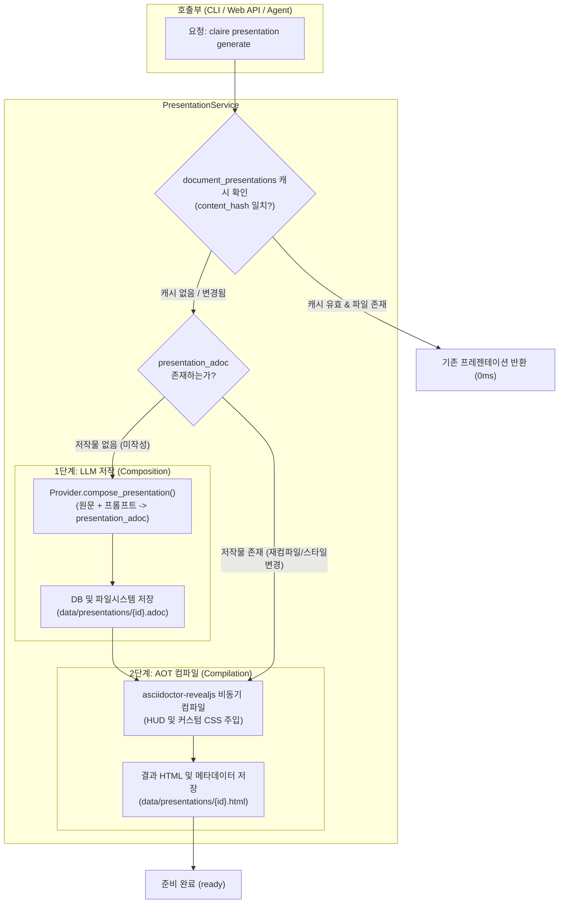

# LLM 기반 프레젠테이션 저작 및 구성 아키텍처 설계 명세서
(LLM-Driven Presentation Authoring & Composition Architecture Specification)

작성일: 2026-10-01 · 상태: **설계 완료 (Ready for Review & Implementation)** · 책임: 시스템 및 프레젠테이션 아키텍트

---

## 1. 문제 정의 및 패러다임 전환 (Paradigm Shift)

### 1.1 기존 구현의 근본적 결함 (The Fatal Flaw of Mechanical Splitting)
기존의 1차 구현 방식은 SQLite에 적재된 상세 본문(`documents.detail`, AsciiDoc)을 정규식(`re.split`)으로 헤딩(`==`, `===`) 단위로 기계적으로 분할하고 긴 문단을 단순 절단(`<<<`)하여 reveal.js 슬라이드로 매핑하는 방식이었다.

이러한 기계적 분할(Mechanical Splitting)은 프레젠테이션 관점에서 다음과 같은 치명적인 한계를 드러냈다:
1. **장문 본문과 발표 장표의 성격 불일치 (Article vs. Presentation Mismatch)**:
   - 본문(`detail`)은 혼자 조용히 읽는 완결형 기술 해설서(서술체 문장: `~한다`, `~이다`)이다.
   - 이를 그대로 슬라이드에 담으면 한 화면에 빽빽한 텍스트 덩어리(Wall of Text)가 가득 차 청중의 가독성과 집중력을 완전히 파괴한다.
2. **슬라이드 저작(Authoring & Curation)의 부재**:
   - 진정한 프레젠테이션은 **정보의 압축, 스토리텔링 내러티브, 시각적 계층화, 발표자 대본(Speaker Notes)**이 유기적으로 결합된 독립적인 저작물이다.
   - 본문의 긴 설명을 3~5개의 핵심 불릿(Bullet Points)으로 요약하고, 핵심 개념을 강조하며, 슬라이드 간 논리적 흐름(도입 → 배경 → 아키텍처 → 심층 분석 → 벤치마크/비교 → 결론)을 새로 구성해야 한다.
3. **발표자 노트(`[.notes]`)의 미활용**:
   - reveal.js는 `S` 키를 누르면 발표자 전용 2화면 뷰(경과 시간, 다음 장표 미리보기, 발표자 노트)를 제공한다.
   - 본문의 방대한 배경 지식과 세부 설명은 슬라이드 본문에 빼곡히 넣는 것이 아니라, **발표자 노트(`[.notes]`)**로 승화시켜 발표자가 스크린을 보며 유려하게 브리핑할 수 있도록 설계되어야 한다.

```
[ 기존 기계적 슬라이드 분할 방식 (Mechanical Splitter) — 폐기 ]
+-------------------+      Regex Heading Split      +-----------------------+
|  documents.detail | ----------------------------> | reveal.js Slide Deck  |
|  (A4 2~3장 줄글)   |  (==, ===, <<< 단순 분할)     | (텍스트 오버플로 장표)    |
+-------------------+                               +-----------------------+

[ 신규 LLM 저작 파이프라인 (LLM Authoring & Composition) — 채택 ]
+-------------------+      LLM Presentation Authoring      +---------------------------+
|  documents.detail | ===================================> | presentation_adoc (독립저작) |
|  (기술 본문 원본)   |   Storytelling, Curation, 2D Grid,   | - 간결한 핵심 불릿 장표     |
+-------------------+   [.notes] Speaker Script Injection  | - 슬라이드별 풍부한 대본    |
                                                           +---------------------------+
                                                                         |
                                                            Asciidoctor  | Instant Compile
                                                             reveal.js   | (~150ms)
                                                                         v
                                                           +---------------------------+
                                                           | Production reveal.js HTML |
                                                           | (HUD + Presenter Mode S)  |
                                                           +---------------------------+
```

### 1.2 핵심 설계 원칙 (Core Architectural Principles)
1. **저작(Composition)과 컴파일(Compilation)의 완전한 분리**:
   - **저작(LLM Composition)**: 원문 지식을 바탕으로 프레젠테이션용 전용 AsciiDoc(`presentation_adoc`)을 새로 집필하는 창작 단계.
   - **컴파일(Deterministic AOT Compilation)**: 집필된 `presentation_adoc`을 `asciidoctor-revealjs`를 통해 초고속(~150ms)으로 HTML로 빌드하는 단계.
   - 테마, 폰트, CSS 변경 시 비용이 큰 LLM을 다시 호출하지 않고 즉시 재컴파일 가능.
2. **독립된 프레젠테이션 소스 자산 관리 (`presentation_adoc`)**:
   - 프레젠테이션은 단순 캐시가 아니라 사용자와 에이전트가 직접 확인(`show-adoc`), 수정(`edit-adoc`), 재생성(`compose`)할 수 있는 독립 자산으로 데이터베이스 및 파일시스템에 저장.
3. **발표자 중심의 2화면 지능형 브리핑 시스템**:
   - 청중에게는 여백과 시각적 강조가 살아있는 세련된 장표를 제공하고, 발표자에게는 원문의 깊이 있는 기술적 맥락이 담긴 발표자 대본(`[.notes]`)을 제공.
4. **2D 그리드 레이아웃의 능동적 기획**:
   - 수평(`==`): 핵심 아젠다 및 챕터 전환.
   - 수직(`===`): 동일 아젠다 내의 상세 아키텍처 다이어그램, 코드 스니펫, 비교 매트릭스.
5. **에이전트-퍼스트 CLI 및 일관된 계약**:
   - `claire presentation compose`, `compile`, `generate`, `show-adoc` 등 직관적인 하위 명령 체계와 엄격한 `--json` 규격 준수.

---

## 2. 데이터 모델 및 스토리지 아키텍처 (Data Model & Schema)

### 2.1 SQLite 스키마 확장 (`document_presentations`)
기존의 단순 AOT 캐시 테이블을 프레젠테이션 소스 코드(`presentation_adoc`)와 저작 메타데이터를 보존하는 테이블로 확장한다.

```sql
-- v14: 프레젠테이션 저작(Composition) 및 컴파일 메타데이터 테이블
CREATE TABLE IF NOT EXISTS document_presentations (
    document_id TEXT PRIMARY KEY,
    
    -- [1] 저작 소스 및 LLM 프로비넌스 (Composition Layer)
    presentation_adoc TEXT,                 -- LLM이 순수 작성한 reveal.js용 AsciiDoc 원문
    authoring_provider TEXT,                -- 저작에 사용된 LLM Provider (예: gemini, antigravity, codex)
    authoring_model TEXT,                   -- 저작에 사용된 모델 식별자 (예: gemini-2.5-flash)
    prompt_version TEXT DEFAULT 'pres-v1',  -- 저작 프롬프트 버전
    content_hash TEXT NOT NULL,             -- 저작 당시 원문(documents.detail)의 SHA-256
    adoc_hash TEXT,                         -- presentation_adoc의 SHA-256 (수동 편집/버전 감지)
    
    -- [2] 렌더링 및 스타일 속성
    theme TEXT DEFAULT 'night',             -- reveal.js 테마 (night, black, white, league 등)
    transition TEXT DEFAULT 'slide',        -- 슬라이드 전환 효과 (slide, fade, convex, zoom)
    slide_count INTEGER DEFAULT 0,          -- 총 슬라이드 수 (수평 + 수직)
    cache_key TEXT NOT NULL,                -- adoc_hash + theme + transition 기반 컴파일 캐시 키
    
    -- [3] 컴파일 결과 자산 (Compilation Layer)
    file_path TEXT NOT NULL,                -- 컴파일된 HTML 파일 경로 (data/presentations/{doc_id}.html)
    file_size INTEGER DEFAULT 0,            -- 생성된 HTML 파일 크기 (bytes)
    
    -- [4] 라이프사이클 및 성능 지표
    status TEXT DEFAULT 'ready',            -- not_authored | composing | compiling | ready | stale | failed
    error_message TEXT,                     -- 오류 메시지 (저작 또는 컴파일 실패 시)
    compose_duration_ms INTEGER DEFAULT 0,  -- LLM 저작 소요 시간 (ms)
    compile_duration_ms INTEGER DEFAULT 0,  -- asciidoctor 컴파일 소요 시간 (ms)
    created_at REAL NOT NULL,               -- 최초 저작 시각
    updated_at REAL NOT NULL,               -- 최근 갱신 시각
    
    FOREIGN KEY(document_id) REFERENCES documents(id) ON DELETE CASCADE
);

CREATE INDEX IF NOT EXISTS idx_doc_pres_status ON document_presentations(status);
CREATE INDEX IF NOT EXISTS idx_doc_pres_key ON document_presentations(cache_key);
CREATE INDEX IF NOT EXISTS idx_doc_pres_content_hash ON document_presentations(content_hash);
```

### 2.2 파일시스템 자산 구조
`data/presentations/` 디렉터리에 문서 ID 기반으로 컴파일된 HTML과 함께 저작된 AsciiDoc 원문을 함께 영구 보존한다.
```
data/
└── presentations/
    ├── {doc_id}.adoc   # LLM이 저작한 프레젠테이션 AsciiDoc 소스 (텍스트 에디터로 수정 가능)
    ├── {doc_id}.html   # asciidoctor-revealjs로 컴파일된 독립 실행형 슬라이드 웹페이지
    └── {doc_id}.pdf    # (옵션) DeckTape/Puppeteer 기반 내보내기 PDF
```

---

## 3. 프레젠테이션 저작 프롬프트 엔지니어링 (Presentation Authoring Prompt)

### 3.1 중앙 프롬프트 엔진 (`src/claire/extract/prompts.py`)
`compose_presentation_prompt_adoc`은 원문의 지식을 단순 나열하는 것이 아니라, 테크니컬 스피커가 청중 앞에서 발표할 슬라이드 덱과 발표 대본을 직접 작성하도록 강제한다.

```python
# 프레젠테이션 저작 프롬프트 버전
PRESENTATION_PROMPT_VERSION = "pres-v1"

def compose_presentation_prompt_adoc(
    title: str,
    detail: str,
    summary: str | None = None,
    *,
    focus: str | None = None,
    slide_budget: int = 10,
    theme: str = "night",
    transition: str = "slide",
) -> str:
    """원문 기술 지식을 바탕으로 전문 테크니컬 발표 슬라이드와 발표자 노트를 집필하는 프롬프트."""
    focus_section = (
        f"\n[★ 최우선 중점 발표 초점(Focus)]\n"
        f"- 이번 발표에서는 다음 주제 및 관점을 가장 비중 있게 다루어라: **{focus.strip()}**\n"
        f"- 해당 주제에 대해 원문의 기술적 세부사항과 작동 원리를 심도 있게 풀어내라.\n\n"
        if focus and focus.strip()
        else ""
    )

    return f"""당신은 세계 최고의 기술 컨퍼런스(QCon, Strange Loop, AWS re:Invent)의 수석 테크니컬 스피커이자 프레젠테이션 디자이너다.
제공된 기술 문서(AsciiDoc)의 핵심 통찰을 바탕으로, 청중을 사로잡을 **Asciidoctor reveal.js 전용 프레젠테이션 슬라이드 덱**을 집필하라.

[원문 정보]
- 문서 제목: {title}
- 핵심 요약: {summary or '(없음)'}

{focus_section}

[★ 프레젠테이션 저작 핵심 규칙]

1. [단순 본문 복사 절대 금지 / 슬라이드 전용 언어로의 재구성]
   - 원문의 긴 줄글 문단을 그대로 슬라이드에 옮겨 적지 마라.
   - 한 슬라이드당 3~5개의 핵심 불릿 포인트(`* `)로 압축하라.
   - 각 불릿은 1~2줄 이내로 간결하고 임팩트 있게 작성하며, 핵심 용어는 `*굵게*` 강조하라.
   - 한 슬라이드에 너무 많은 내용을 욱여넣지 마라.

2. [2D 그리드 내러티브 구조 설계]
   - 총 슬라이드 분량은 대략 {slide_budget - 2} ~ {slide_budget + 3}장 내외로 구성하라.
   - 대주제/아젠다 전환은 수평 슬라이드(`== `)를 사용하라:
     * 슬라이드 1: 타이틀 (문서 제목 및 핵심 부제)
     * 슬라이드 2: 아젠다 및 발표의 핵심 문제의식(Motivation)
     * 중간 섹션: 핵심 기술 아키텍처 및 상세 메커니즘
     * 후반 섹션: 성능 지표, 비교 분석, 한계점 및 고려사항
     * 마지막 섹션: 핵심 테이크어웨이(Takeaways) 및 Q&A
   - 동일 대주제 내에서의 세부 기술 분석, 아키텍처 다이어그램, 코드 해설, 비교 표는 수직 슬라이드(`=== `)로 배치하라.

3. [★ 필수 요구사항: 모든 슬라이드에 발표자 노트([.notes]) 작성]
   - reveal.js의 발표자 모드(단축키 'S')에서 발표자가 직접 읽고 설명할 수 있는 **구체적인 구어체 발표 대본**을 모든 슬라이드 하단에 반드시 작성하라.
   - 슬라이드 본문에는 핵심 키워드와 불릿만 간결히 표기하고, 원문의 깊이 있는 맥락, 수치, 인과관계, 비유적 설명은 반드시 `[.notes]` 블록 안에 2~4문장의 생생한 발표 스크립트로 서술하라.
   - 발표자 노트 문법:
     ```asciidoc
     [.notes]
     --
     * (발표 도입): "이 장표에서 청중에게 전달해야 할 핵심 메시지는 ..."
     * (기술 해설): 슬라이드에 표기된 기술 용어의 배경과 작동 원리를 상세히 설명.
     * (전환 멘트): "그렇다면 다음 단계에서 시스템은 어떻게 동작할까요?"
     --
     ```

4. [시각적 요소 및 AsciiDoc 컴포넌트 적극 활용]
   - 인용구: 원문의 핵심 선언이나 문제 제기는 `[quote, 핵심 인물 또는 원문]` 블록으로 장표 중앙에 배치하라.
   - 주의/팁: 핵심 전제 조건이나 트레이드오프는 `[NOTE]` 또는 `[IMPORTANT]` 블록을 1~2곳에 배치하라.
   - 비교 표: 여러 옵션이나 성능 수치는 `[cols="...", options="header"] |===` 테이블로 정돈하라.
   - 코드 스니펫: 코드가 필요한 경우 `[source,언어]`와 함께 콜아웃(`// <1>`, `<1> 설명`)을 결합하여 가독성을 높여라.

5. [엄격한 AsciiDoc 표준 및 reveal.js 속성 준수]
   - 마크다운 문법(`---`, `**`, `#`, `>`)은 일체 사용하지 마라.
   - 반드시 문서 시작부에 다음 reveal.js 헤더 속성을 포함하라:
     ```asciidoc
     = {title}
     :revealjs_theme: {theme}
     :revealjs_transition: {transition}
     :revealjs_slideNumber: c/t
     :revealjs_history: true
     :revealjs_hash: true
     :revealjs_controls: true
     :revealjs_progress: true
     :revealjs_center: true
     :source-highlighter: highlight.js
     :icons: font
     ```

[원문 본문(AsciiDoc)]:
{detail}

위 원문을 바탕으로 발표용 순수 AsciiDoc 슬라이드 덱을 작성하라. 다른 인사말이나 설명 없이 오직 '= 제목'으로 시작하는 AsciiDoc 코드만을 출력하라:
"""
```

---

## 4. LLM Provider 통합 및 인터페이스 확장

### 4.1 `ExtractionProvider` 프로토콜 확장 (`src/claire/extract/provider.py`)
기존의 `render_detail`과 대등한 최우선 저작 메서드로 `compose_presentation`을 추가한다.

```python
class Provider(Protocol):
    name: str

    def extract(self, doc: Document, ontology_block: str) -> ExtractionResult: ...
    def render_detail(self, doc: Document, format: str = "md", focus: str | None = None) -> str: ...
    
    # 신규: 프레젠테이션 저작 인터페이스
    def compose_presentation(
        self,
        doc: Document,
        *,
        summary: str | None = None,
        focus: str | None = None,
        slide_budget: int = 10,
        theme: str = "night",
        transition: str = "slide",
    ) -> str: ...
```

### 4.2 프로바이더별 구현 명세
1. **GeminiProvider (`src/claire/extract/gemini_provider.py`)**:
   - `gemini-2.5-flash` (기본) 또는 `gemini-2.5-pro`를 활용하여 원문의 구조를 완벽히 파악한 후, reveal.js용 AsciiDoc 덱을 단일 스트림으로 생성.
   - 마크다운 코드 펜스(````asciidoc ... ````)를 안전하게 스트립하여 순수 AsciiDoc 소스를 추출.
2. **AntigravityProvider (`src/claire/extract/antigravity_provider.py`)**:
   - AGY CLI 런타임을 통해 로컬 또는 프라이빗 LLM을 호출하여 저작 수행.
   - 시스템 프롬프트에 슬라이드 전용 구조 가이드라인 주입.
3. **CodexProvider (`src/claire/extract/codex_provider.py`)**:
   - Ollama 또는 로컬 모델 런타임 연동.
4. **MockProvider (`src/claire/extract/provider.py`)**:
   - 단위 테스트 및 오프라인 검증용 결정론적 스텁.
   - 제목, 요약, 핵심 주장, 엔티티 정보를 바탕으로 5장의 완성형 슬라이드(타이틀, 아젠다, 본문, 비교 표, 테이크어웨이 및 `[.notes]` 블록)를 즉시 반환.

---

## 5. 프레젠테이션 서비스 파이프라인 (Presentation Service Pipeline)

`src/claire/presentation/service.py`는 **저작(Compose)**과 **컴파일(Compile)**을 명확하게 분리된 메서드로 오케스트레이션한다.



### 5.1 PresentationService 핵심 메서드 시그니처
```python
class PresentationService:
    # 1. 저작 단계: 원문 -> LLM -> presentation_adoc
    async def compose_presentation(
        self,
        conn: sqlite3.Connection,
        doc_id: str,
        *,
        provider: str | None = None,
        focus: str | None = None,
        slide_budget: int = 10,
        theme: str = "night",
        transition: str = "slide",
    ) -> str:
        """원문을 기반으로 LLM을 호출하여 presentation_adoc을 작성하고 저장."""
        ...

    # 2. 컴파일 단계: presentation_adoc -> asciidoctor -> HTML
    async def compile_presentation(
        self,
        conn: sqlite3.Connection,
        doc_id: str,
        *,
        theme: str | None = None,
        transition: str | None = None,
        force: bool = False,
    ) -> dict:
        """저작된 presentation_adoc을 컴파일하여 reveal.js HTML 생성."""
        ...

    # 3. 통합 오케스트레이션: 필요 시 저작 후 컴파일
    async def get_or_create_presentation(
        self,
        conn: sqlite3.Connection,
        doc_id: str,
        *,
        force_compose: bool = False,
        force_compile: bool = False,
        focus: str | None = None,
        theme: str = "night",
        transition: str = "slide",
    ) -> dict:
        """저작물이 없으면 저작 후 컴파일, 저작물이 있으면 컴파일 수행."""
        ...
```

---

## 6. CLI 및 에이전트 인터페이스 명세 (`claire presentation`)

모든 명령은 사용자 친화적인 서식화된 텍스트 출력과 함께, 에이전트 자동화를 위한 엄격한 `--json` 계약을 지원한다.

### 6.1 하위 명령 체계

| 명령 | 기능 설명 | 옵션 플래그 |
| :--- | :--- | :--- |
| `claire presentation generate <target>` | 프레젠테이션 생성 (미저작 시 저작+컴파일, 저작물 존재 시 컴파일) | `--force`, `--theme`, `--transition`, `--focus`, `--json` |
| `claire presentation compose <target>` | LLM을 호출하여 프레젠테이션 AsciiDoc(`presentation_adoc`) 새로 저작 | `--provider`, `--model`, `--focus`, `--slide-budget`, `--no-compile`, `--json` |
| `claire presentation compile <target>` | 이미 저작된 `presentation_adoc`을 HTML로 즉시 재컴파일 (LLM 미호출) | `--theme`, `--transition`, `--force`, `--json` |
| `claire presentation show-adoc <target>` | 저작된 프레젠테이션 AsciiDoc 소스 코드 열람 (터미널 출력) | `--json` |
| `claire presentation edit-adoc <target>` | 저작된 `presentation_adoc`을 파일/표준입력으로 직접 갱신 | `--file <path>`, `--recompile` |
| `claire presentation status <target>` | 프레젠테이션 저작 및 컴파일 상태, 메타데이터 상세 조회 | `--json` |
| `claire presentation doctor` | Asciidoctor reveal.js 툴체인 및 LLM 저작 엔진 상태 진단 | `--json` |

### 6.2 에이전트 JSON 계약 예시
`claire presentation generate --json "kv-cache"` 실행 결과:
```json
{
  "status": "ready",
  "document_id": "01K9B8C5D3E2F1G0H4J5K6L7M8",
  "title": "vLLM PagedAttention과 KV 캐시 압축 아키텍처",
  "authoring": {
    "provider": "gemini",
    "model": "gemini-2.5-flash",
    "prompt_version": "pres-v1",
    "slide_count": 12,
    "compose_duration_ms": 2840
  },
  "compilation": {
    "theme": "night",
    "transition": "slide",
    "file_path": "data/presentations/01K9B8C5D3E2F1G0H4J5K6L7M8.html",
    "file_size": 48210,
    "compile_duration_ms": 142
  },
  "presentation_url": "http://localhost:8000/p/presentation?id=01K9B8C5D3E2F1G0H4J5K6L7M8"
}
```

---

## 7. Web API 및 UI/UX 인터랙션 설계

### 7.1 엔드포인트 명세 (`src/claire/api/server.py`)

1. `POST /api/docs/{doc_id}/presentation/compose`:
   - 요청 바디: `{"focus": "...", "slide_budget": 10, "provider": "gemini"}`
   - 기능: 백그라운드 작업으로 LLM 저작 실행.
2. `POST /api/docs/{doc_id}/presentation/compile`:
   - 요청 바디: `{"theme": "night", "transition": "slide"}`
   - 기능: 기존 저작물을 새 스타일로 즉시 재컴파일 (~150ms).
3. `GET /api/docs/{doc_id}/presentation/adoc`:
   - 기능: 저작된 순수 AsciiDoc 소스 반환 (`text/plain` 또는 JSON).
4. `PUT /api/docs/{doc_id}/presentation/adoc`:
   - 요청 바디: `{"adoc": "= 새로운 슬라이드 소스...", "recompile": true}`
   - 기능: 사용자가 수정한 슬라이드 소스를 저장하고 즉시 재컴파일.
5. `GET /p/presentation?id={doc_id}`:
   - 기능: 완성된 reveal.js 프레젠테이션 페이지 렌더링 (글래스모피즘 HUD 포함).

### 7.2 리더기 및 뷰어 UI/UX 연동
1. **문서 리더기 (`index.html`)**:
   - 상단 도구 모음에 `[📽️ 프레젠테이션]` 버튼 배치.
   - 클릭 시 상태 확인:
     - 이미 준비된 경우: 프레젠테이션 뷰어로 즉시 이동.
     - 미저작 상태인 경우: 모달을 띄워 **"발표 장표 저작 (Compose)"** 안내 (초점 주제 입력 옵션 제공).
2. **프레젠테이션 뷰어 (HUD & 발표자 모드)**:
   - 슬라이드 상단 HUD 안내: `[S] 발표자 노트 열기 (Speaker View)` 뱃지 노출.
   - 발표자가 `S`를 누르면 분할 윈도우가 열리며, LLM이 공들여 집필한 슬라이드별 해설과 스크립트가 타임라인과 함께 실시간 브리핑 화면으로 표시됨.

---

## 8. 단계별 구현 로드맵 (Implementation Roadmap)

### Phase 1: 스키마 및 프롬프트 엔진 구축 (Foundations)
- [ ] SQLite `document_presentations` 테이블 스키마 확장 (`presentation_adoc`, 저작 메타데이터 컬럼 추가).
- [ ] `src/claire/extract/prompts.py`에 `compose_presentation_prompt_adoc` 프롬프트 구현.
- [ ] `ExtractionProvider` 및 `MockProvider`에 `compose_presentation` 메서드 구현 및 단위 테스트 작성.

### Phase 2: 멀티 프로바이더 구현 (LLM Providers)
- [ ] `GeminiProvider.compose_presentation` 구현 (코드 펜스 정제, AsciiDoc 무결성 보장).
- [ ] `AntigravityProvider.compose_presentation` 구현.
- [ ] `CodexProvider.compose_presentation` 구현.

### Phase 3: PresentationService 파이프라인 개편 (Service Refactor)
- [ ] `PresentationService.compose_presentation` (저작 단계) 및 `compile_presentation` (컴파일 단계) 분리 구현.
- [ ] 디스크에 `data/presentations/{doc_id}.adoc` 파일 보존 로직 추가.
- [ ] 기존 정규식 기반 단순 분할기(`preprocessor.py`)를 저작된 AsciiDoc의 reveal.js 속성 보정 및 유효성 검사기로 리팩토링.

### Phase 4: CLI 및 API 확장 (Interfaces)
- [ ] `src/claire/cli.py` 내 `presentation compose`, `compile`, `show-adoc`, `generate` 명령 구현.
- [ ] `src/claire/api/server.py`에 REST 엔드포인트 연동.
- [ ] E2E 통합 테스트 수행 (원문 적재 → LLM 저작 → asciidoctor 컴파일 → reveal.js 발표자 모드 노트 검증).

---

## 9. 결론 및 기대 효과 (Conclusion & Impact)

이번 설계를 통해 Claire Bible의 프레젠테이션 기능은 **"적재된 글을 기계적으로 쪼개 보여주는 뷰어"**에서 **"적재된 방대한 기술 지식을 청중용 고품질 장표와 발표자용 브리핑 대본으로 재창조하는 지능형 프레젠테이션 저작 스튜디오"**로 완전히 진화한다.

사용자는 복잡한 AI 논문이나 아키텍처 문서를 Claire Bible에 적재한 뒤, 명령어 하나(`claire presentation generate`)로 컨퍼런스 발표 수준의 슬라이드와 스크립트를 즉시 확보하여 발표를 진행할 수 있게 된다.
