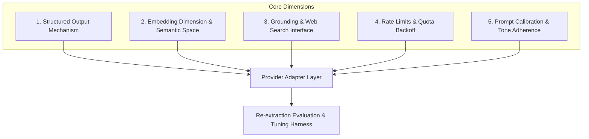

# Multi-Provider & Hyperscaler Calibration Architecture Design

> **문서 상태**: 설계 및 현재 구현 기록 (Codex CLI 포함)
> **관련 문서**: [SYNTHESIS_REDESIGN.md](../../upstream/SYNTHESIS_REDESIGN.md), [ONEHOP_MERGE_DESIGN.md](../../upstream/ONEHOP_MERGE_DESIGN.md)

---

## 1. 배경 및 문제 정의

Claire Bible은 지식그래프 구조화 추출, 상세 렌더링, 검색 종합, 맥락 웹 리서치 등에 LLM을 활용합니다. 현재는 `GeminiProvider`, `AntigravityProvider`(`agy` CLI), 네이티브 전용 `CodexProvider`(`codex` CLI)가 존재한다. 향후 OpenAI API, Anthropic Claude, Local/Ollama, AWS Bedrock 등의 모델을 직접 추가할 때 다음과 같은 구조적 한계와 차이점에 직면한다.

### 1.1 현재 아키텍처의 한계
1. **프롬프트 템플릿의 결합**: 시스템 프롬프트(`_SYS`), `PROMPT_VERSION`, 렌더링 지침이 `gemini_provider.py`에 모듈 변수로 묶여 있거나 개별 프로바이더 파일에 중복 복사되어 있음.
2. **하이퍼스케일러별 이질성**: 모델마다 구조화 출력(JSON Schema), 그라운딩(Search), 벡터 임베딩 규격, 에러/쿼터 백오프 방식이 완전히 다름.
3. **재적재(Re-extraction) 시험 및 튜닝 체계 부재**: 프로바이더나 하이퍼스케일러를 교체/추가할 때, 기존 그래프 데이터를 파괴하지 않고 모델별 추출 품질을 사전 검증(Dry-run/A-B 비교)할 수 있는 평가 하네스가 없음.

---

## 2. 하이퍼스케일러별 핵심 차이점과 설계 구분점

새 프로바이더 도입 시 모델의 고유 특성으로 인해 동작이 달라지므로, 아키텍처 상에 다음과 같은 **5대 구분점**을 설계에 반영해야 합니다.



### (1) 구조화 출력(Structured Output) 방식의 차이
* **Google Gemini**: `response_format={"type": "text", "mime_type": "application/json", "schema": ...}`
* **Codex CLI**: `codex exec --output-schema <schema.json> --output-last-message <output.json> -`로 stdin 프롬프트와 JSON Schema 기반 최종 출력을 사용한다.[^codex-cli-reference]
* **OpenAI (Structured Outputs)**: `response_format={"type": "json_schema", "json_schema": {"strict": True, ...}}` (모든 키 `required` 필수, `additionalProperties: False` 엄격 강제).
* **Anthropic Claude**: `tool_choice={"type": "tool", "name": "extract_knowledge"}` 형태의 도구 호출을 통한 강제.
* **Local/Ollama (vLLM/llama.cpp)**: GBNF 문법(Grammar) 샘플링 또는 JSON 블록 파싱 + 방어적 정규화(`_coerce`).
* 👉 **구분점**: 프로바이더 드라이버가 모델에 맞는 `SchemaEnforcementStrategy`를 선택하고, 공통 Pydantic 모델을 각 플랫폼의 스키마 규격으로 변환/폴백 처리해야 함.

### (2) 벡터 임베딩 차원 및 의미 공간의 비호환성
* Gemini `gemini-embedding-001` (768/3072차원), OpenAI `text-embedding-3-small` (1536차원), Voyage AI, 로컬 BGE/E5 (384/768차원) 등 **하이퍼스케일러 간 임베딩 벡터는 차원과 공간이 달라 상호 유사도 비교가 불가능**.
* 👉 **구분점**:
  * `VectorStore`에 프로바이더/임베딩 모델 메타데이터(`embed_provider`, `embed_model`, `embed_dim`)를 명시.
  * 프로바이더 교체 시 **지식그래프 텍스트 추출(Extractions)**과 **벡터 임베딩(Vector Embeddings)**의 재구축 단계를 독립적으로 분리.
  * Codex CLI에는 embedding 호출을 위임하지 않는다. `GEMINI_API_KEY`가 있으면 기존 Gemini embedding을 사용하고, 없으면 새 벡터를 생성하지 않은 채 FTS 전용 후보 회수로 축소한다.

### (3) 웹 검색(Grounding) 연동 메커니즘
* **Gemini**: 모델 내장 `google_search` 툴 지원.
* **Antigravity CLI**: `agy` 에이전트 내장 검색 도구 실행.
* **Codex CLI**: 일반 추출·렌더링·판정에서는 도구를 비활성화하고 `research()`에서만 네이티브 웹 검색을 허용한다.
* **네이티브 검색 미지원 프로바이더**: Claire 내부 Search Engine(SerpAPI, Tavily, Brave, DuckDuckGo 등)을 호출하는 Tool Calling 루프가 필요.
* 👉 **구분점**: `research()` 및 `judge_research()` 구현 시 Native Grounding 지원 여부에 따라 `GroundingDriver`를 플러그인 형태로 조립.

### (4) 레이트 리밋(Rate Limit) 및 쿼터 관리
* 하이퍼스케일러마다 반환하는 HTTP 상태 코드 및 헤더가 상이함:
  * Gemini: `RESOURCE_EXHAUSTED` (429), 메시지 내 `retryDelay: Xs`.
  * OpenAI / Anthropic: `RateLimitError` (429), `retry-after` 헤더.
  * Codex CLI: subprocess timeout·비정상 종료를 공통 오류로 정규화하고 프로세스 내 semaphore로 동시 실행 수를 제한.
  * Local: Concurrency Semaphore 기반 자체 병렬 제어.
* 👉 **구분점**: 공통 `RateLimiter` 및 `RetryPolicy`를 정의하되 플랫폼별 에러 파서를 어댑터로 분리.

### (5) 프롬프트 캘리브레이션 및 한국어 문어체 준수도
* 모델 크기 및 학습 데이터에 따라 한국어 문어체(`~한다`, `~이다`), 고유명사 원문 보존, JSON 준수 강도가 다름.
* 👉 **구분점**: 기본 템플릿(Base Prompt)을 공유하되, 모델별로 프롬프트 수식어(Modifier / System Role 위치 / 예시 퓨샷)를 보정할 수 있는 캘리브레이션 슬롯 제공.

---

## 3. 상세 아키텍처 설계

```
src/claire/extract/
├── prompts/                      # [신규] 중앙 프롬프트 엔진
│   ├── base.py                   # 공통 템플릿, PROMPT_VERSION, 시스템 룰 정의
│   ├── render.py                 # render_detail, _images_block 템플릿
│   ├── research.py               # research, judge_research 템플릿
│   └── calibration.py            # 모델/하이퍼스케일러별 프롬프트 보정 슬롯
├── drivers/                      # [신규] 하이퍼스케일러 전송 드라이버
│   ├── base.py                   # BaseLLMDriver (인터페이스 및 공통 재시도)
│   ├── gemini.py                 # Gemini GenAI Interactions 드라이버
│   ├── antigravity.py            # Antigravity CLI (agy) 드라이버
│   ├── openai_like.py            # OpenAI / Azure / Ollama 호환 드라이버
│   └── anthropic.py              # Anthropic Claude 드라이버
├── eval/                         # [신규] 재적재 시험 및 튜닝 하네스
│   ├── runner.py                 # Dry-run / Shadow 재추출 실행기
│   ├── comparator.py             # 기존 extraction vs 신규 extraction diff 분석기
│   └── metrics.py                # 엔티티 수, 문어체 통과율, 스키마 유효성 평가
├── codex_provider.py             # [현재] 네이티브 Codex CLI 어댑터
├── provider.py                   # Provider 상위 조율 및 팩토리
├── resolver.py                   # 엔티티 해소/머지 로직
└── types.py                      # ExtractionResult 등 계약 Pydantic 모델
```

### 3.1 프롬프트 엔진 (`prompts/`)
* 모든 프롬프트 문자열을 단일 모듈로 집약하여 중복을 제거합니다.
* `PROMPT_VERSION`을 중앙에서 통제하고, 문어체 규칙(`LANGUAGE & STYLE`)이 모든 파이프라인(추출, 가독 렌더링, 요약, 리서치, 판정)에 일관되게 주입되도록 보장합니다.

### 3.2 드라이버 계층 (`drivers/`)
* **`BaseLLMDriver`**:
  * `generate_text(prompt, system_instruction, temperature, ...) -> str`
  * `generate_structured(prompt, schema, system_instruction, ...) -> dict`
  * `embed(text) -> list[float]`
  * `grounded_search(query, context) -> dict`
* 각 드라이버는 네트워크 호출, SDK 인터페이스, 인증, 에러 핸들링만 전담하여 비즈니스 로직과 프롬프트 로직으로부터 분리됩니다.

### 3.3 Codex CLI 어댑터(현재 구현)

`CodexProvider`는 공통 `prompts.py`와 Pydantic 계약을 사용하여 `extract`,
`render_detail`, `summarize_search`, `classify_paper`, `classify_watch`, `research`,
`judge_research`, `select_followups`, `judge_same_entity`, `embed` 인터페이스를 구현한다.
구조화 호출은 해당 결과 모델의 JSON Schema를 `codex exec --output-schema`에 전달하고,
최종 메시지를 임시 파일로 받은 뒤 Pydantic으로 다시 검증한다. 텍스트 호출도 최종
메시지 파일만 읽으며 빈 출력, JSON 검증 실패, timeout, 비정상 종료는 `RuntimeError`로
정규화한다.

#### 공개 설정

| 설정 | 기본값 | 동작 |
|:---|:---|:---|
| `CLAIRE_PROVIDER` | `mock` | `codex` 선택. `codex-cli`도 같은 프로바이더 별칭으로 허용 |
| `CLAIRE_CODEX_BIN` | `codex` | 명시 경로 또는 `PATH`에서 찾을 실행 파일 |
| `CLAIRE_CODEX_MODEL` | 빈 값 | 빈 값이면 인증 계정 기본 모델을 사용하고 계보에는 `codex-cli-default` 기록 |
| `CLAIRE_CODEX_EFFORT` | `medium` | 기본 `model_reasoning_effort`; PDF 파이프라인의 호출별 effort가 있으면 재정의 |
| `CLAIRE_CODEX_TIMEOUT` | `300` | 호출별 최대 대기 시간(초) |
| `CLAIRE_CODEX_MAX_CONCURRENCY` | `1` | 프로세스 내 최대 동시 Codex 호출 수 |

Codex 프로바이더는 호스트에 설치·인증된 CLI를 사용하는 **네이티브 전용 기능**이다.
Docker 이미지와 Compose에는 CLI나 인증 정보를 포함하지 않으며, Docker profile에서
`codex` 또는 `codex-cli`를 선택하면 `cb-manuscript preflight`가 중단한다. 네이티브
환경에서는 `codex login status`로 인증 상태를 확인한 뒤 `uv run claire preflight`,
`uv run claire status`, `uv run claire doctor`로 바이너리·버전·로그인 상태·모델·effort와
`embedding=gemini` 또는 `search=fts-only` 상태를 확인한다.[^codex-auth]

#### 실행 격리

각 호출은 프롬프트를 argv가 아닌 stdin으로 전달하고 호출별 빈 임시 작업 디렉터리에서
신규 세션으로 실행한다. 기본 실행은 `--ephemeral`, `--ignore-user-config`,
`--ignore-rules`, `--skip-git-repo-check`, `--sandbox read-only`, 승인 정책 `never`,
색상 비활성화를 강제한다. Codex CLI 레퍼런스는 이 비대화형 실행 옵션과 stdin 입력,
ephemeral session, 사용자 config·rules 무시, sandbox 선택을 지원한다.[^codex-cli-reference]

Claire의 추가 방어선은 다음과 같다.

* `shell_tool`, `apply_patch`, plugins, apps, memories, multi-agent, tool discovery를 비활성화한다.
* 네이티브 웹 검색은 `research()` 호출에서만 활성화한다.
* 자식 환경은 실행·Codex 인증·인증서·프록시에 필요한 값만 allowlist로 전달하며
  `CLAIRE_*`, Telegram 토큰, 관계없는 API 토큰과 `GEMINI_API_KEY`를 전달하지 않는다.
* stderr는 길이를 제한하고 알려진 비밀을 마스킹한 뒤 오류에 포함한다.
* schema와 최종 출력 파일은 호출별 임시 디렉터리 제거와 함께 폐기한다.

#### 임베딩과 사용량

`GEMINI_API_KEY`가 있으면 기존 Gemini embedding 모델과 입력 예산을 재사용한다. 키가
없으면 해시나 임의 차원의 벡터를 만들지 않고 embedding 호출을 실패 처리한다. 기존
ingestion/search 예외 경계가 새 벡터 저장을 생략하여 FTS 전용 후보 회수로 동작하며,
Codex의 검색 결과 종합은 유지한다. 추출·렌더링·분류·종합·리서치 호출은 인증 계정의
사용량과 한도에 의존하므로 운영자는 계정 사용량과 Claire의 상태·오류 큐를 함께
관찰한다.[^codex-usage]

### 3.4 재적재 시험 및 튜닝 하네스 (`eval/`)
새 하이퍼스케일러나 새 모델을 도입할 때 전체 그래프를 덮어쓰기 전, 튜닝 및 회귀 검증을 수행하는 프레임워크를 제공합니다.

#### 동작 흐름:
1. **Sample Selection**: 기존 `documents`에서 대표 문서 $N$개(URL, PDF, YouTube, 짧은 메모 등)를 추출.
2. **Shadow Execution**: 타겟 프로바이더(`--test-provider openai --model gpt-4o`)로 비파괴적 추출 수행.
3. **Automated Metrics & Diff Reporting**:
   * **Schema Validity**: JSON Schema 유효성 및 Coerce 필요 여부.
   * **Style Adherence**: 종결어미 검사(문어체 `~한다/~이다` vs 경어체 `~합니다/~해요` 비율).
   * **Entity/Relation Yield**: 기존 Gemini 추출 대비 엔티티/관계 검출 수 및 오탐/누락 비교.
   * **Latency & Cost**: 호출 시간 및 추정 비용 측정.
4. **Tuning Feedback**: 결과에 따라 `calibration.py`에서 온도(`temperature`), 프롬프트 힌트, 스키마 전략 조정.

```bash
# 예시: 신규 프로바이더 튜닝 및 비교 CLI 명령
./cb-manuscript eval --provider openai --model gpt-4o --sample-size 20 --compare-with current
```

---

## 4. 데이터베이스 및 계보(Lineage) 관리

`extractions` 테이블 및 메타데이터를 보강하여 여러 하이퍼스케일러의 실행 이력을 추적합니다:

```sql
-- extractions 테이블 메타데이터 보강
ALTER TABLE extractions ADD COLUMN provider_kind TEXT; -- 'gemini' | 'openai' | 'anthropic' | 'agy' | 'local'
ALTER TABLE extractions ADD COLUMN latency_ms REAL;
ALTER TABLE extractions ADD COLUMN schema_valid INTEGER DEFAULT 1;
```

* **비파괴적 백필(Non-destructive Backfill)**:
  * 프롬프트나 프로바이더 교체 시 `extractions`에 새 레코드가 쌓이고, `documents.detail` 또는 지식그래프 그래프 엔티티는 검증이 완료된 시점에 승격(Promote)하는 방식을 지원합니다.

---

## 5. 단계적 구현 마일스톤 (Milestones)

> **현재 단계 범위**: OpenAI API 및 Anthropic 직접 연동은 향후 마일스톤으로 보류한다. 현재 단계에서는 **프롬프트 엔진 분리(P1)**, **Gemini / Antigravity 공통 아키텍처 적용(P2)**과 **네이티브 Codex CLI 어댑터(P2-C)**를 구현한다. Codex CLI 어댑터는 OpenAI API 프로바이더와 별개이다.

| 단계 | 마일스톤 | 대상 | 작업 내용 | 진행 상태 |
|:---|:---|:---|:---|:---|
| **P1** | **중앙 프롬프트 엔진 구축** | 공통 | `prompts/` 모듈로 `_SYS`, 문어체 룰, 렌더링/요약/리서치 템플릿 집약 | **현재 구현** |
| **P2** | **Gemini & Antigravity 구조 적용** | Gemini, agy | 두 프로바이더가 공통 프롬프트 엔진을 사용하도록 리팩토링 및 중복 제거 | **현재 구현** |
| **P2-C** | **Codex CLI 어댑터** | Codex CLI | 전체 provider 계약, 구조화 출력, 격리 실행, Gemini embedding/FTS fallback, 네이티브 진단 | **현재 구현** |
| **P3** | **시험/튜닝 하네스 구축** | 검증용 | `eval/` 모듈 및 표본 문서 비교 CLI (`cb-manuscript eval`) 구현 | 향후 마일스톤 |
| **P4** | **외부 하이퍼스케일러 확장** | OpenAI API, Claude | OpenAI / Anthropic 호환 드라이버 추가 및 캘리브레이션 슬롯 활성화 | 향후 마일스톤 |

---

## 6. 각주

[^codex-auth]: OpenAI의 Codex 인증 문서는 `codex login status`로 현재 인증 방식을 확인할 수 있다고 설명하며, CLI 레퍼런스는 인증 정보가 있으면 이 명령이 종료 코드 0을 반환한다고 명시한다.
[^codex-cli-reference]: OpenAI Codex CLI 레퍼런스의 `codex exec` 옵션을 기준으로 한다. 도구 비활성화, 환경변수 allowlist와 Docker 거부는 Claire가 추가한 보안 경계이다.
[^codex-usage]: Codex의 사용량은 인증한 계정·플랜, 선택한 모델, 입력·출력 및 도구 사용에 따라 달라질 수 있다. 정확한 잔여 사용량은 계정 사용량 화면에서 확인한다.

## 7. 참고문헌

1. OpenAI, [Authentication](https://developers.openai.com/codex/auth), 2026-09-01 확인.
2. OpenAI, [Codex CLI reference](https://developers.openai.com/codex/cli/reference), 2026-09-01 확인.
3. OpenAI, [ChatGPT and Codex pricing](https://learn.chatgpt.com/docs/pricing), 2026-09-01 확인.
