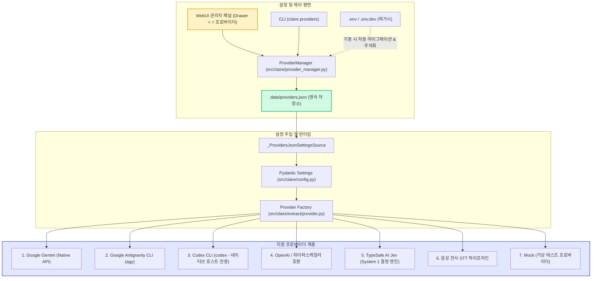

# 멀티 프로바이더 및 하이퍼스케일러 통합 아키텍처 매뉴얼 (`MULTI_PROVIDER_DESIGN.md`)

> **문서 상태**: 설계 및 구현 완료 (Specification & Operational Reference)  
> **관련 문서**: [ENVIRONMENT_VARIABLES.md](../implementation/ENVIRONMENT_VARIABLES.md), [COMMANDS.md](../implementation/COMMANDS.md), [ANTIGRAVITY_EXECUTION_AND_LATENCY_OPTIMIZATION_DESIGN.md](ANTIGRAVITY_EXECUTION_AND_LATENCY_OPTIMIZATION_DESIGN.md), [KNOWLEDGE_GRAPH_LINKING_AND_CALIBRATION_DESIGN.md](KNOWLEDGE_GRAPH_LINKING_AND_CALIBRATION_DESIGN.md), [VIDEO_AUDIO_TRANSCRIPTION_AND_INGESTION_DESIGN.md](VIDEO_AUDIO_TRANSCRIPTION_AND_INGESTION_DESIGN.md), [DECISION_STREAM_AND_HEATMAP_MATRIX_DESIGN.md](DECISION_STREAM_AND_HEATMAP_MATRIX_DESIGN.md)

---

## 1. 아키텍처 개요 및 통합 관리 체계 (Unified Management)

Claire Bible은 지식 그래프 온톨로지 추출, 가독 상세 렌더링, FTS/시맨틱 하이브리드 검색 인용 종합, 실시간 맥락 리서치, 엔티티 동일체 및 전역 관계 판정에 다양한 LLM 및 하이퍼스케일러 프로바이더를 유연하게 활용합니다.

지원하는 모든 프로바이더는 **WebUI 통합 관리 패널**, **영속화 파일(`data/providers.json`)**, **기존 `.env` 자동 마이그레이션 체계**, 그리고 **CLI 명령(`claire providers`)**을 통해 중앙 집중 제어됩니다.


```mermaid
graph TD
    subgraph Control_Planes [설정 및 제어 평면]
        WebUI["WebUI 관리자 패널 (Drawer > ⚡ 프로바이더)"] --> ProvMgr["ProviderManager (src/claire/provider_manager.py)"]
        CLI["CLI (claire providers)"] --> ProvMgr
        EnvFile[".env / .env.dev (레거시)"] -.->|기동 시 자동 마이그레이션 & 주석화| ProvMgr
        ProvMgr --> Storage["data/providers.json (영속 저장소)"]
    end

    subgraph Runtime_Resolution [설정 주입 및 런타임]
        Storage --> PydanticSource["_ProvidersJsonSettingsSource"]
        PydanticSource --> Settings["Pydantic Settings (src/claire/config.py)"]
        Settings --> Factory["Provider Factory (src/claire/extract/provider.py)"]
    end

    subgraph Supported_Providers [지원 프로바이더 계층]
        Factory --> P_Gemini["1. Google Gemini (Native API)"]
        Factory --> P_AGY["2. Google Antigravity CLI (agy)"]
        Factory --> P_Codex["3. Codex CLI (codex - 네이티브 호스트 전용)"]
        Factory --> P_OpenAI["4. OpenAI / 하이퍼스케일러 호환"]
        Factory --> P_Jev["5. TypeSafe AI Jev (System 1 결정 엔진)"]
        Factory --> P_STT["6. 음성 전사 STT 파이프라인"]
        Factory --> P_Mock["7. Mock (가상 테스트 프로바이더)"]
    end

    style Storage fill:#d1fae5,stroke:#10b981,stroke-width:2px
    style WebUI fill:#fef3c7,stroke:#f59e0b,stroke-width:2px
    style Supported_Providers fill:#e0e7ff,stroke:#6366f1,stroke-width:2px
```

### 1.1 WebUI 기반 통합 관리 (`data/providers.json`)
* **관리 위치**: 우측 더보기(Drawer) 메뉴 > **⚙️ 프로바이더 설정** (소유자 `owner` 권한 인증 시에만 노출).
* **영속 저장소**: `data/providers.json`에 원자적(Atomic write)으로 저장되며, 소유자 토큰으로만 조회(`GET /providers`) 및 수정(`PATCH /providers`)이 가능합니다.
* **보안 및 시크릿 보호**:
  - API 키는 조회 시 `••••••••`로 마스킹되며, 모델명이나 옵션만 변경하고 저장할 때 기존 키가 소실되지 않도록 서버 측에서 보존 처리합니다.
  - 소유자가 명시적으로 삭제 체크박스를 누르거나 빈 값으로 초기화할 때만 안전하게 삭제됩니다.
* **실시간 사전 진단**:
  - WebUI 내 각 프로바이더 카드마다 **연결 테스트(Test)** 버튼(`POST /providers/test`)을 제공하여 API 키 유효성, 네트워크 도달성, CLI 바이너리 설치 상태를 저장 전에 즉시 검증합니다.

### 1.2 환경변수 자동 마이그레이션 (`.env` 안전 주석화)
* 하이퍼스케일러 지원량이 증가함에 따라 수십 개의 환경변수를 `.env`에서 관리하는 복잡성을 해소하기 위해, 애플리케이션 시작 시 기존 `.env` 및 `.env.dev`의 프로바이더 설정(`MIGRATED_ENV_VARS`)을 자동으로 `data/providers.json`으로 이전합니다.
* 마이그레이션이 완료된 변수 라인은 파일 원본의 주석과 서식을 온전히 보존한 채 `# VAR=val` 형태로 주석 처리되어 충돌을 방지합니다.

### 1.3 설정 우선순위 계층
Pydantic Settings 소스 체인은 다음과 같은 우선순위를 엄격히 적용합니다:
1. `init_settings` (단위 테스트 명시적 인수 주입 — 최우선)
2. `providers_json` (`data/providers.json` 설정 — 프로덕션/런타임 기본)
3. `env_settings` (운영체제 프로세스 환경변수)
4. `strict_dotenv` (`.env` 파일 설정)
5. `file_secret_settings` (도커 시크릿 등)

---

## 2. Google Gemini (`gemini`)

Google AI Studio 및 Gemini SDK 기반의 주력 프로바이더로, 고품질 지식 추출, 초장문 맥락 처리, 의미론적 벡터 임베딩, 오디오 음성 전사를 일체형으로 제공합니다.

### 2.1 주요 기능 및 특성
* **기본 모델**: `gemini-3.1-flash-lite`, `gemini-2.5-flash`, `gemini-2.5-pro`, `gemini-3.7-flash`
* **구조화 출력**: Gemini Native JSON Schema (`response_format={"type": "text", "mime_type": "application/json", "schema": ...}`)를 사용하여 스키마 위반율 0% 보장.
* **네이티브 웹 검색 그라운딩**: `research()` 및 맥락 조사 시 모델 내장 `google_search` 툴을 직접 활성화하여 실시간 웹 팩트체크 수행.
* **통합 벡터 임베딩**: `text-embedding-004` (768차원) 및 `gemini-embedding-001` (768/3072차원) 모델 지원. `RETRIEVAL_DOCUMENT` 및 `RETRIEVAL_QUERY` task_type에 최적화된 고밀도 시맨틱 벡터 생성.

### 2.2 설정 파라미터 레퍼런스
| 항목 | 필드명 (providers.json) | 환경변수 (레거시) | 기본값 | 설명 |
|:---|:---|:---|:---|:---|
| **API 키** | `providers.gemini.api_key` | `GEMINI_API_KEY` | `""` | Google AI Studio 발급 API 키. 누락 시 `mock` 프로바이더로 안전 폴백. |
| **추론 모델** | `providers.gemini.model` | `CLAIRE_GEMINI_MODEL` | `gemini-3.1-flash-lite` | 지식 추출, 요약, 판정에 사용할 메인 LLM 모델. |
| **사고 레벨** | `providers.gemini.effort` | `CLAIRE_GEMINI_EFFORT` | `medium` | 모델 추론 사고 레벨 (`low`, `medium`, `high`). |
| **임베딩 모델** | `providers.gemini.embed_model` | `CLAIRE_GEMINI_EMBED_MODEL` | `text-embedding-004` | 텍스트 벡터 임베딩 생성용 모델. |
| **호출 최소 간격** | `providers.gemini.min_interval` | `CLAIRE_GEMINI_MIN_INTERVAL` | `4.0` | API 호출 간 최소 대기 시간(초). 무료 티어 TPM/RPM Rate Limit 보호. |
| **최대 재시도** | `providers.gemini.max_retries` | `CLAIRE_GEMINI_MAX_RETRIES` | `5` | 429 Resource Exhausted 및 5xx 에러 발생 시 지수 백오프 최대 횟수. |

---

## 3. Google Antigravity CLI (`antigravity`)

호스트에 설치된 공식 Antigravity CLI(`agy`) 바이너리를 비대화형 서브프로세스로 구동하여 Gemini 3.7 등 최상위 추론 모델을 활용하는 프로바이더입니다.

### 3.1 실행 격리 아키텍처 (Execution Isolation)
`agy`는 파일 읽기/수정, 셸 실행, 백그라운드 태스크 관리 도구가 탑재된 자율 코딩 에이전트이므로, 순수 지식 추출 및 판정 작업 시 에이전트 루프로 오동작(도구 오염)하지 않도록 다음과 같은 4중 격리 하네스를 강제합니다:
1. **순수 추론 모드 (`allow_tools=False`)**: `research()`를 제외한 모든 호출(`extract`, `render_detail`, `judge_*`, `classify_*`)에서 외부 도구 호출을 정책상 차단하고 단일 턴 생성 지침을 강제합니다.
2. **청정 작업 디렉터리 (`/tmp/claire_agy_clean`)**: 호스트 애플리케이션 루트(`/app`)의 수천 개 파일과 `.git` 트리를 인덱싱하는 오버헤드를 방지하기 위해 격리된 빈 디렉터리에서 프로세스를 기동합니다.
3. **적응형 추론 강도 분화**: 단순 판정(`judge_same_entity`, `judge_relationship`)은 `effort=low`로 자동 하향하여 대기 시간을 대폭 단축하고, 본문 추출은 `effort=medium`을 적용합니다.
4. **프로세스 세마포어 동시성 제어**: `max_concurrency`(기본 2) 제한을 통해 호스트 자원 고갈을 방지합니다.

### 3.2 설정 파라미터 레퍼런스
| 항목 | 필드명 (providers.json) | 환경변수 (레거시) | 기본값 | 설명 |
|:---|:---|:---|:---|:---|
| **바이너리 경로** | `providers.antigravity.bin` | `CLAIRE_AGY_BIN` | `agy` | 실행 바이너리 명칭 또는 절대 경로 (호스트 `PATH` 또는 `~/.local/bin/agy`). |
| **CLI 모델** | `providers.antigravity.model` | `CLAIRE_AGY_MODEL` | `gemini-3.7-flash` | `agy` CLI에 전달할 기본 모델명. |
| **추론 사고 레벨**| `providers.antigravity.effort` | `CLAIRE_AGY_EFFORT` | `medium` | CLI 기본 reasoning effort (`low`, `medium`, `high`). |
| **타임아웃** | `providers.antigravity.timeout` | `CLAIRE_AGY_TIMEOUT` | `120.0` | 단일 CLI 호출당 최대 대기 시간(초). 초과 시 프로세스 강제 종료. |
| **최대 동시성** | `providers.antigravity.max_concurrency` | `CLAIRE_AGY_MAX_CONCURRENCY` | `2` | 프로세스 내 최대 동시 실행 CLI 수. |

---

## 4. Codex CLI (`codex` / `codex-cli`)

호스트에 설치·인증된 OpenAI Codex CLI(`codex exec`)를 비대화형으로 호출하는 **네이티브 호스트 전용** 프로바이더입니다.

### 4.1 네이티브 호스트 전용 제약 (Docker 거부 정책)
* Codex CLI 및 세션 인증 토큰은 컨테이너 이미지나 볼륨에 포함되지 않습니다.
* `CLAIRE_PROVIDER=codex` 또는 `codex-cli`가 설정된 상태로 Docker/Compose 환경을 기동하려 할 경우, `cb-manuscript preflight` 검사에서 즉시 기동이 거부됩니다.
* 호스트 환경에서 `codex login status`로 인증을 완료한 후 네이티브 앱(`uv run claire`)으로 실행해야 합니다.

### 4.2 실행 격리 및 샌드박스
* **비대화형 강제**: 프롬프트는 argv가 아닌 `stdin`으로 주입하며, 호출별 빈 임시 디렉터리에서 `--ephemeral` 모드로 신규 세션을 실행합니다.
* **플랫폼 정책 강제**: `--sandbox read-only`, `--skip-git-repo-check`, `--ignore-user-config`, `--ignore-rules`, 승인 정책 `never`를 강제 적용합니다.
* **도구 제어**: `shell_tool`, `apply_patch`, 플러그인, 멀티에이전트를 비활성화하며, 네이티브 웹 검색은 `research()` 호출에서만 선별적으로 허용합니다.
* **출력 계약**: `--output-schema <schema.json>` 및 `--output-last-message <output.json>`을 통해 JSON Schema 기반으로 최종 메시지를 엄격 검증합니다.
* **임베딩 및 회수 축소**: `GEMINI_API_KEY`가 있으면 Gemini 임베딩 모델을 활용하고, 키가 없으면 임의 벡터를 생성하지 않고 FTS 전용 검색 후보 회수로 축소 동작합니다.

### 4.3 설정 파라미터 레퍼런스
| 항목 | 필드명 (providers.json) | 환경변수 (레거시) | 기본값 | 설명 |
|:---|:---|:---|:---|:---|
| **바이너리 경로** | `providers.codex.bin` | `CLAIRE_CODEX_BIN` | `codex` | Codex CLI 실행 파일명 또는 경로. |
| **모델명** | `providers.codex.model` | `CLAIRE_CODEX_MODEL` | `""` | 사용할 모델명. 빈 문자열 시 인증 계정의 기본 모델 자동 선택. |
| **추론 레벨** | `providers.codex.effort` | `CLAIRE_CODEX_EFFORT` | `medium` | 추론 레벨 (`low`, `medium`, `high`). |
| **타임아웃** | `providers.codex.timeout` | `CLAIRE_CODEX_TIMEOUT` | `300.0` | CLI 호출별 최대 대기 시간(초). |
| **동시성** | `providers.codex.max_concurrency` | `CLAIRE_CODEX_MAX_CONCURRENCY` | `1` | 프로세스 내 최대 동시 실행 수. |

---

## 5. OpenAI / 하이퍼스케일러 호환 엔드포인트 (`openai`)

공식 OpenAI API뿐만 아니라 Azure OpenAI, Ollama, Local vLLM, AWS Bedrock, Cloudflare Workers AI 등 OpenAI 표준 REST 규격을 준수하는 엔드포인트를 포괄 연동할 수 있는 확장 어댑터입니다.

### 5.1 주요 기능 및 특성
* **호환 엔드포인트 지정**: `base_url`을 설정하여 사내 자체 구축 LLM 서버(예: `http://vllm.corp.internal:8000/v1`) 또는 상용 API 프록시로 라우팅.
* **Strict Structured Outputs**: OpenAI 규격의 `response_format={"type": "json_schema", "json_schema": {"strict": True, ...}}` 스키마 변환을 지원하여 Pydantic 모델과 100% 호환.
* **이종 임베딩 차원 관리**: 임베딩 모델(`embed_model`) 지정 시 반환 차원 메타데이터를 저장하여 벡터 유사도 비교 공간을 일관되게 관리.

### 5.2 설정 파라미터 레퍼런스
| 항목 | 필드명 (providers.json) | 기본값 | 설명 |
|:---|:---|:---|:---|
| **API 키** | `providers.openai.api_key` | `""` | 엔드포인트 인증에 사용할 Bearer Token / API Key. |
| **기본 URL** | `providers.openai.base_url` | `https://api.openai.com/v1` | OpenAI 호환 API 엔드포인트 URL. |
| **추론 모델** | `providers.openai.model` | `gpt-4o-mini` | 지식 추출 및 요약에 사용할 텍스트/채팅 완성 모델. |
| **임베딩 모델** | `providers.openai.embed_model` | `text-embedding-3-small` | 벡터 생성에 사용할 임베딩 모델명. |

---

## 6. TypeSafe AI Jev (`jev`)

지식 노드 간 엔티티 해소(Entity Resolution) 및 관계 판정 시 비-자기회귀(Non-autoregressive) 방식으로 밀리초 단위 초고속 의사결정을 수행하는 선택형 **System 1 엔진**입니다.

### 6.1 동작 구조 및 안전 폴백
* **초고속 결정 매트릭스**: 복잡한 자기회귀 LLM 질의 루프를 타지 않고 고정된 판정 스트림으로 동일체/관계 여부를 즉각 분류합니다.
* **투명 폴백 (Zero-breakage Fallback)**: 본 기능이 비활성화(`enabled=false`)되어 있거나 API 키가 유효하지 않은 경우, 파이프라인 중단 없이 Claire Bible 내장 코사인 유사도 티어링 및 규칙 기반 매트릭스(`fallback_vector`)로 투명하게 전환됩니다.

### 6.2 설정 파라미터 레퍼런스
| 항목 | 필드명 (providers.json) | 환경변수 (레거시) | 기본값 | 설명 |
|:---|:---|:---|:---|:---|
| **활성화 플래그**| `providers.jev.enabled` | `CLAIRE_ENABLE_JEV` | `false` (`0`) | TypeSafe AI Jev 의사결정 엔진 사용 여부. |
| **API 키** | `providers.jev.api_key` | `CLAIRE_JEV_API_KEY` | `""` | TypeSafe AI 플랫폼 API 키 (`null`/빈 값 시 Fallback). |
| **기본 URL** | `providers.jev.base_url` | `CLAIRE_JEV_BASE_URL` | `https://api.typesafe.ai/v1` | Jev 서비스 엔드포인트 URL. |
| **타임아웃** | `providers.jev.timeout` | `CLAIRE_JEV_TIMEOUT` | `15.0` | 판정 질의 타임아웃 제한 시간(초). 초과 시 즉각 Fallback. |

---

## 7. 음성 전사 STT 파이프라인 (`stt`)

자막(Closed Caption)이 제공되지 않는 비디오 및 오디오 웹 문서 적재 시 `ffmpeg`/`yt-dlp` 스트림 분할 및 AI 음성 텍스트 변환(STT)을 수행하는 파이프라인입니다.

### 7.1 주요 특성 및 보호 하네스
* **발행자 CC 최우선**: 비디오 상세 페이지 적재 시 항상 선호 언어의 공식 발행자 자막을 먼저 탐색하며, 유효한 자막이 전무할 때만 STT 파이프라인으로 폴백합니다.
* **오디오 분할 및 TPM 한도 보호**: 긴 영상의 경우 `gemini-3.5-transcribe`의 10K TPM 한도를 초과하지 않도록 오디오를 240초(약 4분, 6,000 토큰) 단위 청크로 분할하여 전사합니다.
* **로컬 오디오 캐싱**: 스트림 처리 실패 시 로컬 캐시(`data/video_cache/`)에 오디오를 3일(259,200초)간 보존하여 중복 원격 다운로드를 방지합니다.

### 7.2 설정 파라미터 레퍼런스
| 항목 | 필드명 (providers.json) | 환경변수 (레거시) | 기본값 | 설명 |
|:---|:---|:---|:---|:---|
| **활성화 플래그**| `providers.stt.enabled` | `CLAIRE_ENABLE_VIDEO_TRANSCRIPTION` | `true` (`1`) | 비디오/오디오 웹 문서 음성 전사 파이프라인 활성화 여부. |
| **STT 프로바이더**| `providers.stt.provider` | `CLAIRE_STT_PROVIDER` | `gemini` | 음성 전사에 사용할 엔진 (`gemini`, `mock`). *주의: Antigravity CLI는 STT 미지원.* |
| **인식 대상 언어**| `providers.stt.language` | `CLAIRE_STT_LANGUAGE` | `ko` | 음성 인식 기본 언어 코드 (ISO 639-1). |

---

## 8. Mock 프로바이더 (`mock`)

외부 API 호출, 네트워크 통신 및 과금 지출이 일체 발생하지 않는 개발 및 테스트 전용 가상 프로바이더입니다.

### 8.1 주요 특성
* **결정론적 가상 지식 생성**: 본문 키워드를 기반으로 재현 가능한 모의 엔티티, 관계, 가독 상세 문서, 요약문을 즉각 반환합니다.
* **0-비용 오프라인 개발**: 인터넷 연결이 없거나 API 토큰이 발급되지 않은 로컬 개발 환경, CI 파이프라인 및 단위 테스트(`pytest`)에서 기본 프로바이더로 동작합니다.

---

## 9. 프롬프트 엔진 및 하이퍼스케일러 캘리브레이션 (Engine & Calibration)

### 9.1 중앙 집중식 프롬프트 엔진 (`src/claire/extract/prompts/`)
모든 프로바이더는 중앙 프롬프트 엔진에서 정의된 템플릿과 스타일 가이드라인을 공유합니다:
* **`PROMPT_VERSION` 관리**: 프롬프트 변경 이력을 단일 상수로 통제하여 추출 계보(Lineage) 추적.
* **한국어 문어체(`~한다`, `~이다`) 절대 준수**: 모든 파이프라인에서 구어체(`~해요`, `~습니다`) 종결을 배제하고 백과사전식 학술 문어체 출력 강제.

### 9.2 재적재 시험 및 튜닝 하네스 (`eval/`)
신규 하이퍼스케일러 도입 시 기존 지식 그래프를 훼손하지 않고 추출 품질을 사전 비교(A-B 테스팅)할 수 있는 회귀 평가 하네스를 지원합니다:
1. **표본 추출 (Sample Selection)**: 기존 DB에서 도메인별 대표 문서(URL, PDF, 미디어 등) 선별.
2. **Shadow Execution**: 타겟 프로바이더로 비파괴적 추출 수행.
3. **지표 비교 (Diff Reporting)**:
   - JSON 스키마 유효성 및 필드 누락률
   - 한국어 문어체 준수율
   - 엔티티 및 관계 검출 밀도(Yield)
   - 호출 지연 시간(Latency) 및 토큰 소모량 측정

---

## 10. CLI 명령어 레퍼런스

```bash
# 1. 프로바이더 목록 및 현재 활성 상태 조회
uv run claire providers

# 2. 프로바이더 실시간 연결 및 바이너리 검증 테스트
uv run claire providers test              # 전체 프로바이더 테스트
uv run claire providers test gemini       # 특정 프로바이더 테스트
uv run claire providers test antigravity  # CLI 바이너리 존재 확인

# 3. .env 및 .env.dev 환경변수 수동 마이그레이션 실행
uv run claire providers migrate
```
