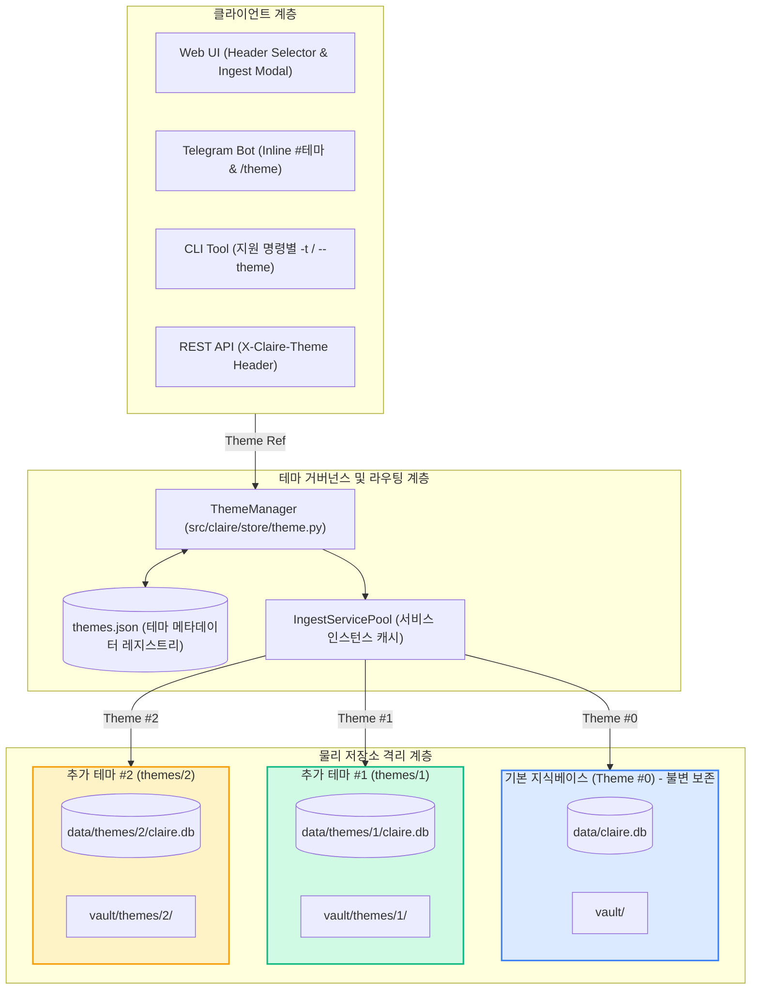
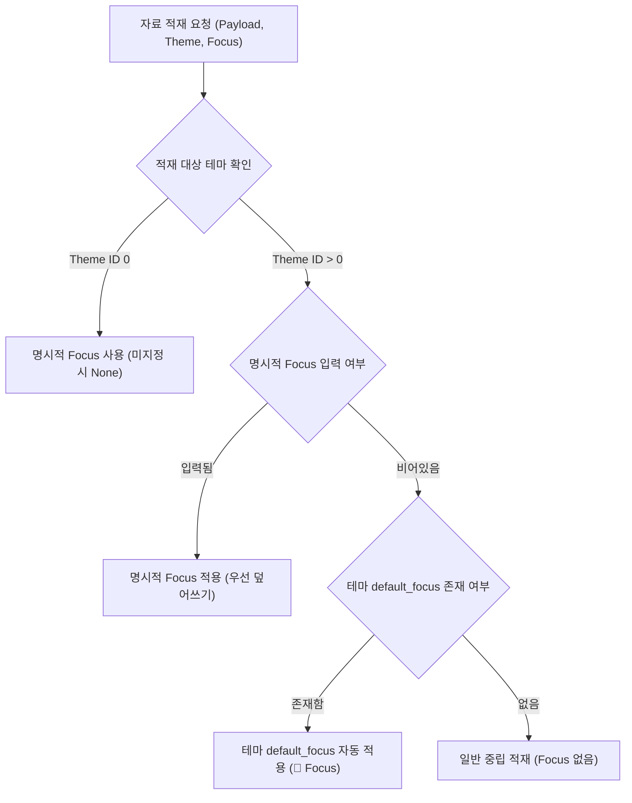

# 일련번호 기반 멀티 테마(다중 DB 격리) 아키텍처 설계 명세서 (`MULTI_THEME_ARCHITECTURE_DESIGN.md`)

**문서 번호:** DESIGN-THEME-20260910-01  
**작성 주체:** Claire Bible Architecture Team  
**상태:** **핵심 라우팅 및 P0 운영 data-plane 구현, 잔여 표면 추적 중**
**관련 문서:** [`docs/origin/CLAIRE_ARCHITECTURE_ROADMAP.md`](../CLAIRE_ARCHITECTURE_ROADMAP.md), [`docs/origin/implementation/ENVIRONMENT_VARIABLES.md`](../implementation/ENVIRONMENT_VARIABLES.md), [`docs/origin/implementation/COMMANDS.md`](../implementation/COMMANDS.md), [`docs/origin/implementation/EXTERNAL_ACCESS.md`](../implementation/EXTERNAL_ACCESS.md)

---

## 1. 설계 배경 및 변경 사유

### 1.1 문제 정의: 관심사 분리 및 지식베이스 오염 방지
기존 Claire Bible은 모든 수집 자료(일반 스크랩, 학술 논문, 업무 문서, 개인 메모 등)를 단일 SQLite 데이터베이스(`claire.db`)와 단일 Obsidian Vault에 적재하는 **단일 정본(Single Knowledge Base)** 구조였습니다.
그러나 지식의 범주와 목적이 상이한 자료들이 단일 공간에 혼재되면서 다음과 같은 구조적 한계가 발생했습니다:
1. **온톨로지 그래프 간섭 및 혼탁**: 서로 무관한 도메인(예: 기독교 성경 연구 vs 클라우드 분산 시스템 아키텍처)의 엔티티들이 동일한 이름(예: `Service`, `Grace`, `Node`)으로 인해 의도치 않게 그래프 상에서 결합되거나 잘못 연결되는 현상.
2. **검색 및 임베딩 품질 저하**: 하이브리드 검색 시 이종 도메인의 문서들이 랭킹 상위에 노출되어 RAG 요약의 정밀도 저하.
3. **접근 권한 및 공개 범위 제어의 불가**: 특정 주제는 외부에 공개(Public)하고, 특정 연구나 업무 지식은 비공개(Private) 또는 협력자(Collaborator)에게만 제한적으로 공유해야 하는 요구사항을 충족할 수 없음.

### 1.2 사용자 용어 정의: "데이터베이스 선택" $\rightarrow$ "테마(Theme) 선택"
일반 사용자나 협업자에게 '데이터베이스 전환'이라는 시스템 엔지니어링 용어는 높은 인지 부하를 줍니다. 따라서 시스템 인터페이스 및 사용자 경험(UX) 관점에서 이를 **"테마(Theme) 선택"**으로 정의하고 명명합니다.

### 1.3 핵심 거버넌스 원칙
1. **지식 관리자(Owner) 전용 정의 권한**:
   - 테마는 일반 사용자의 단순 자유 선택이 아니라, **쓰기 권한 최고 관리자(Owner)**만이 정의·생성·수정·삭제할 수 있습니다.
2. **폴더 이름의 일련번호(Sequence Number) 격리**:
   - 지식 관리자가 테마의 이름(레이블)이나 설명을 변경하더라도 물리 디스크 디렉터리 경로는 변경되지 않아야 파일 시스템 잠금 충돌이나 경로 깨짐이 발생하지 않습니다.
   - 따라서 추가 테마는 `themes/{seq}/` 형태의 **단조 증가 일련번호(Sequence)** 디렉터리로 물리 격리하고, 레이블(Label)과 메타데이터는 중앙 레지스트리(`themes.json`)에서 관리합니다.
3. **기본 지식베이스(Theme ID 0) 불변 및 안전 보호**:
   - 시스템 최초 기동 시의 기본 지식베이스는 영구히 보존되어야 하며, 어떠한 경우에도 삭제되거나 파기될 수 없습니다.
   - 기본 지식베이스는 범용 지식 수집의 중립성을 유지하기 위해 특정 '기본 초점(`default_focus`)'이 강제되지 않으며 항상 빈 문자열(`""`)로 유지됩니다.
4. **싱글/멀티 하이브리드 레이어 아키텍처 (Zero-RTT / Zero-CLS)**:
   - 환경변수 `CLAIRE_MULTI_THEME=0`(기본값) 상태에서는 기존 싱글 모드로 완전히 투명하게 작동하며, 불필요한 테마 선택기 렌더링이나 RTT 지연, 누적 레이아웃 이동(CLS)이 일체 발생하지 않습니다.
   - `CLAIRE_MULTI_THEME=1` 활성화 시에만 런타임 동적 테마 스위칭 및 다중 DB 라우팅이 동작합니다.

---

## 2. 시스템 아키텍처 및 물리 격리 메커니즘



### 2.1 디렉터리 및 데이터베이스 격리 구조
- **기본 지식베이스 (Theme ID `0`, Sequence `0`)**:
  - SQLite DB: `data/claire.db` (레거시 및 단일 테마 경로와 100% 동일)
  - Vault 경로: `vault/`
  - 특성: `is_default=True`, 삭제 불가, 협력자 쓰기 불가, 기본 초점 없음.
- **추가 테마 (Theme ID `N`, Sequence `N`, $N \ge 1$)**:
  - SQLite DB: `data/themes/{seq}/claire.db`
  - Vault 경로: `vault/themes/{seq}/`
  - 부속 아티팩트: `data/themes/{seq}/raw/`, `data/themes/{seq}/images/`
  - 각 테마는 완전 독립된 SQLite 인스턴스, FTS5 색인, 벡터 테이블, 그리고 Markdown/AsciiDoc 볼트를 소유하여 데이터베이스 레벨의 완전한 무경합·물리 격리를 달성합니다.

### 2.2 메타데이터 레지스트리 (`data/themes.json`)
테마의 상태와 속성은 `data/themes.json`에 원자적 파일 쓰기(atomic write)로 영속화됩니다:

```json
{
  "next_seq": 2,
  "themes": [
    {
      "id": 0,
      "seq": 0,
      "label": "기본 지식베이스",
      "description": "일반 수집 자료 및 기본 지식",
      "icon": "📚",
      "db_path": "data/claire.db",
      "vault_path": "vault",
      "is_default": true,
      "is_public": true,
      "is_collaborator_accessible": false,
      "default_focus": "",
      "created_at": 1757500000.0,
      "updated_at": 1757500000.0
    },
    {
      "id": 1,
      "seq": 1,
      "label": "AI 및 클라우드 시스템",
      "description": "분산 아키텍처 및 LLM 인프라 연구",
      "icon": "🤖",
      "db_path": "data/themes/1/claire.db",
      "vault_path": "vault/themes/1",
      "is_default": false,
      "is_public": true,
      "is_collaborator_accessible": true,
      "default_focus": "시스템 아키텍처 및 분산 처리 관점 중심",
      "created_at": 1757510000.0,
      "updated_at": 1757512000.0
    }
  ]
}
```

### 2.3 운영 data-plane의 활성 테마 열거

공통 활성 테마 열거는 싱글 모드에서 `themes.json`을 읽지 않고 기본 DB 설정 한 개만
반환한다. 멀티 테마 모드에서는 등록 테마를 ID 순서로 다시 읽고, 글로벌 provider·보안·
네트워크 설정을 유지한 채 `db_path`와 `vault_path`만 테마 값으로 교체한다. 존재하는
레지스트리의 JSON 또는 구조가 손상됐으면 기본 레지스트리로 덮어쓰거나 기본 테마만
반환하지 않고 호출자에게 오류를 전파한다.[^p0-data-plane]

배포 migration은 이 열거 결과의 DB를 모두 `init_db`와 현재 스키마 검증에 통과시킨다.
CLI health와 liveness도 같은 대상을 읽기 전용으로 열어 스키마 메타데이터를
검사한다. 공개 HTTP `/health` 응답은 기존 계약인 `{"ok": boolean}`만 유지한다.
Compose의 singleton `recover-loop`, `refresh-loop`, `expand-loop`는 매 cycle 레지스트리를
재조회하고, 전역 batch 상한 안에서 테마별 한 건씩 처리하며 시작 테마를 회전시킨다.
테마 하나의 오류는 해당 cycle의 다른 테마와 격리된다.[^p0-data-plane]
자동 확장 결과 알림은 처리 결과와 링크를 `theme#{id}`별로 묶어 DB 출처를 보존한다.[^p0-data-plane]

---

## 3. 역할 기반 접근 제어 (RBAC) 및 테마 가시성

Claire Bible은 4단계의 엄격한 역할 기반 접근 통제를 제공합니다:

| 역할 (Scope) | 발급 및 토큰 | 기본 테마 (ID 0) | 추가 테마 (공개) | 추가 테마 (비공개) | 테마 관리 (생성/수정/삭제) |
| :--- | :--- | :---: | :---: | :---: | :---: |
| **지식 관리자 (`owner`)** | `CLAIRE_INJECT_TOKEN` / 텔레그램 `/web` | 읽기 / 쓰기 | 읽기 / 쓰기 | 읽기 / 쓰기 | **전권 보유** |
| **협업자 (`collaborator`)** | `CLAIRE_COLLABORATOR_TOKEN` / 텔레그램 `/webco` | 접근 불가 (차단) | 읽기 / 쓰기 (`is_collaborator_accessible=True`) | 접근 불가 (차단) | 불가 |
| **읽기 전용 (`readonly`)** | `CLAIRE_READONLY_TOKEN` / 텔레그램 `/webro` | 읽기 전용 | 읽기 전용 | 읽기 전용 | 불가 |
| **익명 사용자 (`anonymous`)** | 무인증 Same-Origin | 읽기 전용 (`CLAIRE_ANONYMOUS_READONLY=1`) | 읽기 전용 (`is_public=True`) | **404 존재 은폐** | 불가 |

### 3.1 비공개 테마의 존재 은폐 (Fail-Closed 404)
- 익명 사용자에게 비공개 테마(`is_public=False`)는 `403 Forbidden`이 아닌 **`404 Not Found`**를 반환하여 테마의 존재 자체를 은폐합니다.
- `GET /themes` 목록 조회 시 익명 사용자 응답에서는 비공개 테마가 원천 필터링됩니다.

### 3.2 협업자(Collaborator) 기본 테마 쓰기 차단 및 격리
- 협업자는 최고 관리자의 기본 지식베이스(ID 0)를 열람하거나 오염시킬 수 없습니다.
- 협업자는 지식 관리자가 명시적으로 협업을 허용한(`is_collaborator_accessible=True`) 추가 테마에만 접근 및 적재할 수 있습니다.

---

## 4. 적재 시 기본 초점(Default Focus) 자동 적용

### 4.1 개념 및 필요성
추가 테마를 생성하는 주된 목적은 특정 도메인(예: "보안 취약점", "거시경제", "API 레퍼런스")에 특화된 지식을 집중 축적하는 것입니다.
매번 적재할 때마다 긴 프롬프트 지침(초점)을 타이핑하는 번거로움을 해소하기 위해 **테마별 기본 초점(`default_focus`)** 메커니즘을 도입했습니다.

### 4.2 계층별 우선순위 및 폴백 규칙
적재 파이프라인(API `POST /ingest`, CLI `claire ingest`, 텔레그램 봇, 웹 UI)에서 초점(`directive`) 결정 규칙:
1. **명시적 초점 우선 (`Explicit Focus Override`)**:
   - 사용자가 요청 본문, CLI 옵션(`--focus`), 또는 텔레그램 메시지(`| 초점`)로 명시적인 지침을 입력한 경우, 해당 초점이 최우선 적용됩니다.
2. **테마 기본 초점 자동 채택 (`Theme Default Fallback`)**:
   - 사용자가 초점을 비워둔 경우, 대상 테마가 추가 테마(ID > 0)이고 `default_focus`가 등록되어 있다면 이를 추출 프롬프트의 최우선 지침으로 자동 주입합니다.
3. **기본 지식베이스 불변성 (`Theme 0 Neutrality`)**:
   - 기본 테마(ID 0)는 `default_focus`가 항상 빈 문자열로 유지되므로, 명시적 초점이 없을 때 일반 중립 추출을 수행합니다.



---

## 5. 테마 수명주기 관리 (삭제 및 소각)

### 5.1 기본 지식베이스 삭제 방어 (Zero Exception)
기본 지식베이스(ID 0)에 대한 삭제 요청은 API, CLI, 웹 UI, 저장소 계층 모두에서 원천 차단되며 `ValueError: 기본 지식베이스(기본 테마)는 삭제할 수 없습니다.`를 발생시킵니다.

### 5.2 추가 테마 삭제 및 소각 프로토콜
추가 테마 삭제는 두 가지 모드를 지원합니다:
1. **레지스트리 제거 (Registry Deregistration)**:
   - `themes.json`에서 해당 테마 메타데이터만 제거합니다.
   - 물리 DB 파일은 디스크에 보존되어 필요 시 수동 복구할 수 있습니다.
2. **영구 소각 (`purge=True`)**:
   - `themes.json` 메타데이터 제거.
   - `data/themes/{seq}/` 및 `vault/themes/{seq}/` 디렉터리 내 물리 파일 영구 삭제 (`shutil.rmtree`).
   - `IngestServicePool` 및 DB 커넥션 캐시 원자적 해제.

---

## 6. 클라이언트 및 프로토콜 연동 인터페이스

### 6.1 REST API 라우팅
- **테마 지정 헤더**: `X-Claire-Theme: <theme_id_or_label>`
- **쿼리 파라미터 / JSON 필드**: `?theme=<id>` 또는 `{"theme": <id>}`
- **테마 관리 엔드포인트**:
  - `GET /themes`: 접근 가능한 테마 목록 및 각 테마의 통계(문서/엔티티/관계 수), 가시성, 기본 초점 조회.
  - `POST /themes`: 새 테마 정의 (Owner 전용).
  - `PATCH /themes`: 테마 메타데이터 수정 (Owner 전용, `label`, `description`, `icon`, `is_public`, `is_collaborator_accessible`, `default_focus`).
  - `DELETE /themes`: 추가 테마 삭제 (Owner 전용, `purge` 옵션 지원).

### 6.2 CLI 명령어
```bash
# 1. 테마 목록 및 통계 조회
claire theme list [--json]

# 2. 새 테마 정의 (일련번호 자동 부여)
claire theme define --label "경제 및 금융" --icon "📈" --focus "거시경제 지표 및 시장 영향 중심" --public

# 3. 테마 메타데이터 및 기본 초점 수정 (ID 또는 레이블로 대상 지정 가능)
claire theme update 1 --label "금융 및 가상자산" --focus "블록체인 토큰 이코노미 및 온체인 데이터 중심"

# 4. 추가 테마 삭제
claire theme delete 1 --purge --yes

# 5. 특정 테마에 자료 적재 (미지정 시 테마 기본 초점 자동 적용)
claire ingest "https://example.com/article" -t 1
claire ingest "https://example.com/article" -t "금융 및 가상자산"

# 6. 특정 테마 통계 및 진단
claire stats -t 1
```

`-t/--theme`은 모든 CLI의 전역 옵션이 아니다. 현재 `doctor`, `stats`, `ingest`,
`search`에서만 선택할 수 있다. `migrate`와 세 상주 큐 루프는 개별 `--theme` 대신 활성
테마 전체를 운영 대상으로 삼는다. 재생성·정리·소각 계열 CLI의 테마 선택 확장은 이번
P0 운영 data-plane 구현 범위에 포함되지 않는다.[^p0-data-plane]

### 6.3 텔레그램 봇
- **인라인 해시태그 라우팅**:
  - 메시지 끝에 `#테마명` 또는 `#1`을 붙여 즉시 해당 테마로 라우팅 (예: `https://example.com/article #경제`).
- **세션 활성 테마 전환 (`/theme`)**:
  - 대화형 인라인 키보드로 현재 작업 테마 전환.
- **협력자 세션 발급 (`/webco`)**:
  - 협력자 권한의 웹 UI 세션 링크 원클릭 생성.

### 6.4 Support Bundle(RCA) 연동
다중 테마 환경에서도 `claire support-bundle` 생성 시 모든 활성 테마의 DB 무결성, 인박스 실패 내역, 공유 링크 인덱스를 누락 없이 전수 진단 및 패키징합니다.
특정 문서 추적(`target`) 시에도 등록된 전체 테마 데이터베이스를 스캔하여 정확한 테마 DB로부터 라이프사이클 데이터를 추출합니다.

---

## 7. 검증 및 테스트 결과

| 테스트 스위트 | 주요 검증 항목 | 결과 |
| :--- | :--- | :---: |
| `tests/test_theme_manager.py` | 일련번호 격리, 기본 테마 삭제 불가, 가시성 격리, `default_focus` 영속성 | **통과 (9/9)** |
| `tests/test_theme_api.py` | REST API 엔드포인트 보안, 익명 404 차단, `POST /ingest` 기본 초점 적용/오버라이드 | **통과 (8/8)** |
| `tests/test_theme_collaborator.py` | Collaborator 세션 토큰 인증, 기본 테마 쓰기 차단, 추가 테마 협업 허용 | **통과 (8/8)** |
| `tests/test_cli_theme.py` | `claire theme define/update/delete/list`, 지원 명령의 `-t`, CLI 기본 초점 | **통과 (7/7)** |
| `tests/test_theme_web.py` | Zero-CLS 인라인 렌더링, 테마 관리자 UI, 기본 초점 입력 및 동적 힌트 | **통과 (7/7)** |
| `tests/test_support_bundle_multi_theme.py` | 멀티 테마 환경에서의 Support Bundle 전수 진단 및 특정 문서 역추적 | **통과 (4/4)** |
| `tests/test_bot.py` | 텔레그램 `/theme` 전환, `#테마` 해시태그 파싱, `/webco` 협력자 링크 발급 | **통과 (23/23)** |
| `tests/test_theme_manager.py`, `tests/test_health.py`, `tests/test_migrate.py`, `tests/test_multi_theme_workers.py` | 활성 테마 열거, 레지스트리 fail-closed, 전수 migration/health, 전역 batch·공정 순회·오류 격리·캐시 갱신·테마별 알림 | **집중 시험 통과 (37/37, 2026-09-11)** |

위 표의 기존 클라이언트별 통과 수는 각 기능 도입 시점의 기록이다.
2026-09-11 P0 변경에서는 명시된 37개 집중 시험을 WSL 격리 클론에서 실행했으며 전체
회귀 시험을 새로 완료한 것으로 해석하지 않는다.[^p0-data-plane]

### 7.1 현재 범위 경계

이번 P0 배치는 migration, health/liveness, resident queue worker만 운영 data-plane의
전체 테마 대상으로 전환했다. REST의 research/image, MCP 도구, Telegram 후속 callback,
파괴적·재생성 CLI의 테마 선택 여부는 별도 후속 감사·구현 대상이며, 이 문서의 클라이언트
연동 설명은 그 표면 전체가 검증됐다는 뜻이 아니다.[^p0-data-plane]

## 8. 참고문헌

[^p0-data-plane]: Claire Bible 구현 근거: [`src/claire/store/theme.py`](../../../src/claire/store/theme.py), [`src/claire/health.py`](../../../src/claire/health.py), [`src/claire/cli.py`](../../../src/claire/cli.py), [`tests/test_theme_manager.py`](../../../tests/test_theme_manager.py), [`tests/test_health.py`](../../../tests/test_health.py), [`tests/test_migrate.py`](../../../tests/test_migrate.py), [`tests/test_multi_theme_workers.py`](../../../tests/test_multi_theme_workers.py) (2026-09-11 확인).
