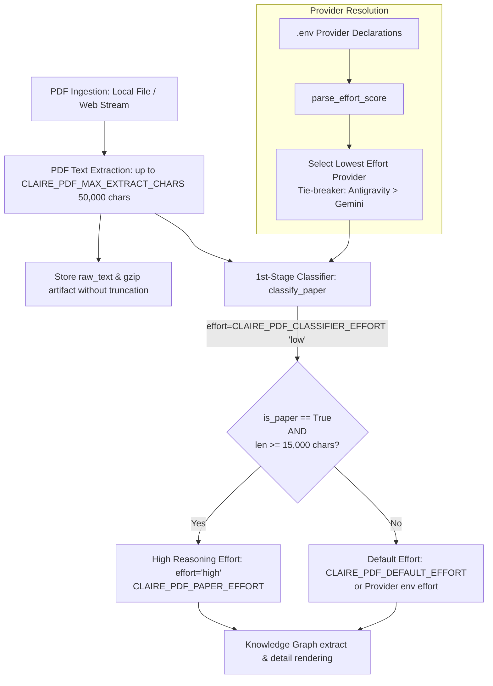

# PDF Extraction Budget & Adaptive Reasoning Effort Design

> **문서 상태**: 구현 및 검증 완료 (Implemented)  
> **관련 문서**: [MULTI_PROVIDER_DESIGN.md](MULTI_PROVIDER_DESIGN.md), [TABLE_INGESTION_DESIGN.md](TABLE_INGESTION_DESIGN.md)

---

## 1. 배경 및 목적

학술 논문(NBER Working Paper, arXiv, IEEE/ACM 등)이나 심층 기술 보고서와 같은 PDF 문서는 방대한 텍스트와 고밀도의 개념적 관계를 포함하고 있습니다.
기존 시스템에서는 다음과 같은 병목 및 자원 배분 문제가 존재했습니다:

1. **PDF 본문 슬라이싱 병목**: PDF 파서(`extract_pdf_bytes`)가 50,000자(`CLAIRE_PDF_MAX_EXTRACT_CHARS`)를 추출하더라도, 상위 수집기 및 프롬프트 생성기에서 일반 웹 문서 기준 예산(`CLAIRE_RAW_CHAR_BUDGET: 20000`, `CLAIRE_EXTRACT_CHAR_BUDGET: 20000`)으로 절단되어 원문 유실 및 오프라인 재추출 시 손실이 발생함.
2. **고비용 추론(Reasoning Effort)의 획일적 적용 한계**: 모든 문서에 높은 추론 레벨(`effort="high"`)을 적용하면 일반 짧은 메모나 단순 안내서에 불필요한 연산 비용과 지연이 발생하고, 반대로 일괄 `medium` 이하로 적용하면 15,000자 이상의 복잡한 학술 논문에서 지식그래프 엔티티 및 상세 렌더링 품질이 저하됨.

이를 해결하기 위해 **PDF 50,000자 온전 보존**과 **최저 Effort 프로바이더 기반 1차 논문 판별 및 동적 Effort 적재** 메커니즘을 설계·구현하였습니다.

---

## 2. 핵심 아키텍처

---

## 3. 세부 설계 및 동작 기제

### 3.1 PDF 본문 예산 일치화 및 보존
- **I/O 수집기 ([`fetchers/textfile.py`](file:///home/fow/Projects/claire-bible/src/claire/ingest/fetchers/textfile.py), [`fetchers/web.py`](file:///home/fow/Projects/claire-bible/src/claire/ingest/fetchers/web.py))**:
  - `source_type == "pdf"`인 경우 일반 웹 예산(`CLAIRE_RAW_CHAR_BUDGET`) 대신 `CLAIRE_PDF_MAX_EXTRACT_CHARS`를 적용하여 원문을 온전히 수집.
  - DB `documents.raw_text` 및 `data/raw/artifacts/doc_{id}.txt.gz`에 최대 50,000자까지 원본 텍스트를 보존하여 오프라인 재추출(`reextract_all`) 지원.
- **프롬프트 생성기 ([`prompts.py`](file:///home/fow/Projects/claire-bible/src/claire/extract/prompts.py))**:
  - `doc.source_type == "pdf"` 시 `pdf_max_extract_chars` 한도로 전문을 프롬프트 컨텍스트에 투입.
- **절단 진단기 ([`db.py`](file:///home/fow/Projects/claire-bible/src/claire/store/db.py))**:
  - `scan_truncation_status` 및 `backfill_truncation_metadata`에서 PDF 문서는 `pdf_max_extract_chars`를 기준으로 절단 여부를 진단.

---

### 3.2 선택형 PDF 파서 아키텍처 (`pypdf` / `docling`) 및 런타임 실패 보고 체계
PDF 문서는 2단(Two-Column) 레이아웃, 복잡한 데이터 표, 수식 등 다양한 형태를 가집니다. 이를 위해 플러그형 선택 파서 구조를 제공합니다:
- **`pypdf` (기본값)**: 순수 파이썬 기반으로 초경량, 초고속 텍스트 및 메타데이터 추출. 리소스 제약이 있는 서버 환경에서 디스크/메모리 부하 없이 즉시 안정적으로 작동.
- **`docling` (고급 레이아웃 분석)**: 딥러닝 기반 레이아웃 파서를 통해 2단 칼럼의 텍스트 뒤섞임(interleaving)을 방지하고 올바른 읽기 순서로 복원하며, 데이터 표를 마크다운 테이블로 구조화.
- **컨테이너 운영 시 리소스 고려사항**:
  - `docling` 의존성은 기본적으로 PyTorch 및 대용량 신경망/CUDA 라이브러리(~3.5GB~4.5GB 비압축 용량)를 포함합니다.
  - `docker compose build`를 통해 여러 서비스(`api`, `bot`, `expand`, `refresh`, `recover`)를 병렬 빌드할 경우, Docker BuildKit이 각 서비스 타겟별로 스냅샷 레이어를 동시에 언패킹하면서 순간적인 피크 디스크 사용량(약 20GB+)이 발생할 수 있습니다.
  - **운영 서버 권장 빌드 방식**:
    1. 단일 기본 이미지를 1회 선행 빌드: `docker build -t claire-bible:local .` 실행 후 `cb-manuscript update` 수행 (디스크 피크를 4.5GB로 최소화).
    2. 또는 CPU 전용 휠 선설치(`--index-url https://download.pytorch.org/whl/cpu torch torchvision`)를 통해 이미지 레이어 크기를 95% 이상 절감.
    3. 모델 캐시 영구화: `HF_HOME=/app/data/cache/huggingface`를 설정하여 컨테이너 재빌드 시 모델 가중치 재다운로드 방지.
- **Graceful Fallback & 전방위 경과 보고 체계**:
  - `CLAIRE_PDF_PARSER=docling` 설정 상태에서 모델 다운로드 실패, 컨테이너 메모리 부족(OOM), CPU 타임아웃, 런타임 변환 오류 등으로 docling이 실패할 경우, 경고 로깅 후 `pypdf`로 자동 폴백하여 무중단 수집을 보장합니다.
  - 이때 단순 무음 폴백에 그치지 않고 실패 원인을 정밀 분류하여 **전방위 보고 채널**로 경과를 통지합니다:
    1. **문서 메타데이터 (`doc.meta`)**: `pdf_parser_requested`, `pdf_parser_used`, `pdf_parser_fallback`, `pdf_parser_fallback_reason` 명시 저장.
    2. **GraphView 웹 UI**: 문서 상세 메타 영역에 주황색 배지 `⚠️ Docling 폴백 (PyPDF)` 노출 및 툴팁으로 실제 실패 사유 안내.
    3. **CLI 적재 리포트 및 텔레그램 완료 알림**: `IngestReport.telegram_summary`에 `⚠️ PDF 파서 대체 적재 (Docling 실패 → PyPDF)` 및 구체적 원인 명시.
    4. **안정성 우선 정책**: 프로덕션 기본 파서는 `CLAIRE_PDF_PARSER=pypdf`로 유지하여 예측 가능하고 신속한 적재를 보장하며, 다단 분석이 필수적인 경우에 한해 선택적으로 활성화.

---

### 3.3 부록(Appendix) 및 참고문헌(References) 제외 정책
학술 논문은 본문 후반부에 대량의 참고문헌(References/Bibliography)과 부록(Appendix/Supplementary Material)을 포함하여 핵심 본문 예산을 잠식합니다.
- **제외 옵션**: `CLAIRE_PDF_EXCLUDE_APPENDIX=true`, `CLAIRE_PDF_EXCLUDE_REFERENCES=true`
- **분리 기준**: 본문 뒤에서 가장 먼저 등장하는 헤더 위치(min split index)를 기준으로 본문만 추출하여 보존.
- **메타데이터 추적**:
  - `appendix_truncated`: 부록 섹션 제외 여부 (웹 UI 초록색 배지)
  - `references_truncated`: 참고문헌 섹션 제외 여부 (웹 UI 보라색 배지)
  - 둘 다 제외된 경우 UI에 `✂️ 부록·참고문헌 제외` 결합 태그 표시.

---

### 3.4 서지 메타데이터 추출 및 글자 수 한도 완전 제외 (Budget Exemption)
- **추출 항목**: 저자(Author), 발행일자(Published At), DOI, arXiv ID.
- **추출 경로**: PDF `/Author`, `/CreationDate` 메타데이터 및 본문 서두 정규식 탐지.
- **예산 면제 (Budget Exemption)**:
  - 추출된 서지 정보는 `Document.author`, `Document.published_at` 및 `doc.meta["biblio"]`에 정형 데이터로 저장됩니다.
  - LLM 프롬프트 투입 시(`doc_to_prompt`), 본문 50,000자 슬라이싱 한도(`limit`)에 합산되지 않고 **상단 헤더(`head`)에 직접 주입**되어 본문 글자 수를 전혀 잠식하지 않고 100% 무손실로 LLM에 전달됩니다.

---

### 3.5 최저 Effort 프로바이더 기반 1차 논문 판별 ([`classifier.py`](file:///home/fow/Projects/claire-bible/src/claire/extract/classifier.py))

`.env`에 여러 프로바이더가 동시에 선언되어 있는 경우(예: 로컬 `Antigravity CLI`와 원격 `Gemini API`), 비용 및 지연을 최소화하기 위해 **선언된 프로바이더 중 환경변수 effort 레벨이 가장 낮은 프로바이더**를 1차 분류기로 자동 선택합니다.

1. **Effort 정량 스코어링 (`parse_effort_score`)**:
   - `none`/`off`/`0` = `0.0`
   - `minimal` = `0.5`
   - `low` = `1.0`
   - `medium` = `2.0`
   - `high` = `3.0`
   - 토큰 버짓 숫자: $\le 2048 \rightarrow 1.0$, $\le 8192 \rightarrow 2.0$, 초과 $\rightarrow 3.0$
2. **프로바이더 탐색 및 정렬 (`get_lowest_effort_provider`)**:
   - 사용 가능한 프로바이더들의 score를 비교하여 최저점을 가진 프로바이더를 선택.
   - 점수가 동점일 경우 무료/로컬 CLI 어댑터인 `AntigravityProvider`를 우선 채택.
   - `CLAIRE_PROVIDER=mock`인 경우 `MockProvider` 즉시 반환.
3. **경량 논문 판정 (`classify_paper`)**:
   - 선택된 프로바이더를 통해 `CLAIRE_PDF_CLASSIFIER_EFFORT`(`"low"`) 수준으로 제목과 도입부(~3,000자)를 분석하여 `{ "is_paper": bool, "reason": str }` 반환.
   - 판정 결과와 본문 길이는 `doc.meta["paper_classification"]`에 보존.

---

### 3.6 동적 Effort 적용 규칙 ([`pipeline.py`](file:///home/fow/Projects/claire-bible/src/claire/ingest/pipeline.py))

문서 적재(`extract_resolve_store`) 및 가독 본문 생성(`ensure_document_detail`) 시 다음과 같이 조건부 effort를 적용합니다:

| 문서 유형 | 본문 길이 (chars) | 적용 Effort | 설명 |
| :--- | :--- | :--- | :--- |
| **학술 논문 (`is_paper=True`)** | $\ge 15,000$ (`CLAIRE_PDF_PAPER_THRESHOLD_CHARS`) | **`high`** (`CLAIRE_PDF_PAPER_EFFORT`) | 깊은 사고/추론을 통해 방대한 개념 구조와 정밀한 요약/상세 렌더링 생성 |
| **학술 논문 (`is_paper=True`)** | $< 15,000$ | `CLAIRE_PDF_DEFAULT_EFFORT` 또는 프로바이더 기본 env | 분량이 짧은 단문 논문/프리프린트의 과도한 자원 소모 방지 |
### 3.7 멀티 칼럼 레이아웃 분석 요소 도입 제언 (Multi-Column Layout Analysis Roadmap)

#### 1. 문제 상황 및 기술적 난제
학술 논문(IEEE, ACM, Nature, arXiv 등)은 대다수가 2단(Two-Column) 레이아웃으로 조판됩니다.
기존의 스트림 기반 단순 텍스트 추출기(`pypdf` 등)는 문자 객체의 Y좌표 순서대로 텍스트를 읽기 때문에, **좌측 칼럼의 1번째 줄과 우측 칼럼의 1번째 줄이 번갈아 뒤섞이는 현상(Interleaving)**이 발생할 위험이 있습니다. 이는 LLM의 문맥 이해도와 엔티티 관계 추출 정확도를 급격히 떨어뜨립니다.

#### 2. 주요 오픈소스 파서 기술 비교
| 파서 엔진 | 레이아웃 복원 원리 | 강점 | 한계 및 비용 | 적합한 사용 시나리오 |
| :--- | :--- | :--- | :--- | :--- |
| **`pypdf`** | 문자 스트림 순차 추출 | 무설치 수준의 초경량, CPU 메모리 극소화, 초고속 | 다단 칼럼 줄 뒤섞임 및 복잡한 표 구조 파괴 위험 | 단일 칼럼 문서, 단순 보고서, 빠른 인덱싱 |
| **`docling`** (IBM) | LayoutLMv3 + TableFormer 딥러닝 분석 | 다단 레이아웃을 정확한 읽기 순서로 복원, 마크다운 표/수식 완벽 변환, 풍부한 메타데이터 | 의존성 용량(~1.5GB+ 모델 다운로드), CPU 추론 시 수 초 소요 | 정밀한 학술 논문, 다단 보고서, 데이터 표가 많은 문서 (현재 optional 지원) |
| **`Marker`** (VikParuchuri) | Nougat + Surya OCR/Layout 파이프라인 | 최고 수준의 마크다운 렌더링 품질, 수식 LaTeX 변환 탁월 | PyTorch/CUDA 의존성, 고사양 리소스 필요 | GPU 서버 환경에서의 대규모 학술 논문 변환 파이프라인 |
| **`PyMuPDF (fitz)`** | 텍스트 Bounding Box 좌표 휴리스틱 클러스터링 | C 라이브러리 기반 초고속, 블록 좌표 기반 칼럼 분리 지원, 가벼운 의존성 | 비정형 다단이나 복잡한 표 셀 병합 복원에는 한계 | 딥러닝 없이 가볍게 80% 이상의 표준 2단 칼럼 순서를 교정할 때 |

#### 3. 3단계 채택 로드맵
1. **1단계 (현재 구현 완료)**:
   - `CLAIRE_PDF_PARSER` 환경변수를 통해 `pypdf`(기본)와 `docling`(선택형) 플러그인 아키텍처 구축.
   - `pip install 'claire[docling]'`을 통해 필요한 환경에서만 선택 설치 가능하며, 미설치 시 안전한 `pypdf` graceful fallback 제공.
2. **2단계 (중기 개선안 - 경량 좌표 휴리스틱 도입)**:
   - 무거운 딥러닝 모델 다운로드 없이도, `PyMuPDF` 또는 `pypdf`의 Bounding Box 좌표(x0, y0, x1, y1)를 분석하여 페이지 중앙 여백(gutter)을 기준으로 좌/우 칼럼 블록을 먼저 정렬한 후 읽는 경량 Bounding-Box 휴리스틱 도입.
3. **3단계 (장기 개선안 - VLM 기반 멀티모달 파이프라인)**:
   - 복잡한 수식과 다이어그램이 핵심인 최첨단 논문의 경우, 온디바이스 VLM(ColPali, Nougat) 또는 Gemini Multimodal PDF 직접 인라인 분석 파이프라인과의 연계 지원.

---

## 4. 환경 변수 레퍼런스

| 환경변수명 | 기본값 | 설명 |
| :--- | :--- | :--- |
| `CLAIRE_PDF_PARSER` | `pypdf` | PDF 추출 엔진 (`pypdf`: 기본 경량 파서, `docling`: 고급 다단/표 분석 파서) |
| `CLAIRE_PDF_EXCLUDE_APPENDIX` | `true` | PDF 논문 적재 시 부록(Appendix/Supplementary) 자동 제외 여부 |
| `CLAIRE_PDF_EXCLUDE_REFERENCES` | `true` | PDF 논문 적재 시 참고문헌(References/Bibliography) 자동 제외 여부 |
| `CLAIRE_PDF_MAX_EXTRACT_CHARS` | `50000` | PDF 스트림 텍스트 추출, DB/아티팩트 보존, LLM 프롬프트 투입 최대 글자 수 |
| `CLAIRE_PDF_PAPER_THRESHOLD_CHARS` | `15000` | 논문 PDF에 대해 `high` effort를 적용할 최소 글자 수 임계값 |
| `CLAIRE_PDF_PAPER_EFFORT` | `high` | 15,000자 이상 논문 PDF 적재 시 적용할 reasoning effort |
| `CLAIRE_PDF_DEFAULT_EFFORT` | `""` (빈값) | 비논문 또는 15,000자 미만 PDF 적재 시 적용할 effort (빈값이면 프로바이더 기본값 사용) |
| `CLAIRE_PDF_CLASSIFIER_EFFORT` | `low` | 1차 논문 분류 시 사용할 경량 reasoning effort |
