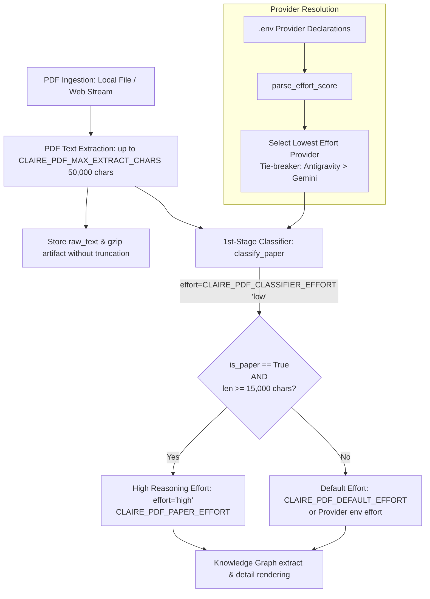

# PDF Extraction Budget & Adaptive Reasoning Effort Design

> **문서 상태**: 구현 및 검증 완료 (Implemented)  
> **관련 문서**: [MULTI_PROVIDER_DESIGN.md](MULTI_PROVIDER_DESIGN.md), [TABLE_INGESTION_DESIGN.md](TABLE_INGESTION_DESIGN.md)

---

## 1. 배경 및 목적

학술 논문(NBER Working Paper, arXiv, IEEE/ACM 등)이나 심층 기술 보고서와 같은 PDF 문서는 방대한 텍스트와 고밀도의 개념적 관계를 포함하고 있습니다.
기존 시스템에서는 다음과 같은 병목 및 자원 배분 문제가 존재했습니다:

1. **PDF 본문 슬라이싱 병목**: PDF 파서(`extract_pdf_bytes`)가 50,000자(`CLAIRE_PDF_MAX_EXTRACT_CHARS`)를 추출하더라도, 상위 수집기 및 프롬프트 생성기에서 일반 웹 문서 기준 예산(`CLAIRE_RAW_CHAR_BUDGET: 20000`, `CLAIRE_EXTRACT_CHAR_BUDGET: 20000`)으로 절단되어 원문 유실 및 오프라인 재추출 시 손실이 발생함.
2. **고비용 추론(Reasoning Effort)의 획일적 적용 한계**: 모든 문서에 높은 추론 레벨(`effort="high"`)을 적용하면 일반 짧은 메모나 단순 안내서에 불필요한 연산 비용과 지연이 발생하고, 반대로 일괄 `medium` 이하로 적용하면 15,000자 이상의 복잡한 학술 논문에서 지식그래프 엔티티 및 상세 렌더링 품질이 저하됨.

이를 해결하기 위해 **PDF 50,000자 온전 보존**과 **최저 Effort 프로바이더 기반 1차 논문 판별 및 동적 Effort 적재** 메커니즘을 설계·구현하였습니다.

---

## 2. 핵심 아키텍처

---

## 3. 세부 설계 및 동작 기제

### 3.1 PDF 본문 예산 일치화 및 보존
- **I/O 수집기 ([`fetchers/textfile.py`](file:///home/fow/Projects/claire-bible/src/claire/ingest/fetchers/textfile.py), [`fetchers/web.py`](file:///home/fow/Projects/claire-bible/src/claire/ingest/fetchers/web.py))**:
  - `source_type == "pdf"`인 경우 일반 웹 예산(`CLAIRE_RAW_CHAR_BUDGET`) 대신 `CLAIRE_PDF_MAX_EXTRACT_CHARS`를 적용하여 원문을 온전히 수집.
  - DB `documents.raw_text` 및 `data/raw/artifacts/doc_{id}.txt.gz`에 최대 50,000자까지 원본 텍스트를 보존하여 오프라인 재추출(`reextract_all`) 지원.
- **프롬프트 생성기 ([`prompts.py`](file:///home/fow/Projects/claire-bible/src/claire/extract/prompts.py))**:
  - `doc.source_type == "pdf"` 시 `pdf_max_extract_chars` 한도로 전문을 프롬프트 컨텍스트에 투입.
- **절단 진단기 ([`db.py`](file:///home/fow/Projects/claire-bible/src/claire/store/db.py))**:
  - `scan_truncation_status` 및 `backfill_truncation_metadata`에서 PDF 문서는 `pdf_max_extract_chars`를 기준으로 절단 여부를 진단.

---

### 3.2 최저 Effort 프로바이더 기반 1차 논문 판별 ([`classifier.py`](file:///home/fow/Projects/claire-bible/src/claire/extract/classifier.py))

`.env`에 여러 프로바이더가 동시에 선언되어 있는 경우(예: 로컬 `Antigravity CLI`와 원격 `Gemini API`), 비용 및 지연을 최소화하기 위해 **선언된 프로바이더 중 환경변수 effort 레벨이 가장 낮은 프로바이더**를 1차 분류기로 자동 선택합니다.

1. **Effort 정량 스코어링 (`parse_effort_score`)**:
   - `none`/`off`/`0` = `0.0`
   - `minimal` = `0.5`
   - `low` = `1.0`
   - `medium` = `2.0`
   - `high` = `3.0`
   - 토큰 버짓 숫자: $\le 2048 \rightarrow 1.0$, $\le 8192 \rightarrow 2.0$, 초과 $\rightarrow 3.0$
2. **프로바이더 탐색 및 정렬 (`get_lowest_effort_provider`)**:
   - 사용 가능한 프로바이더들의 score를 비교하여 최저점을 가진 프로바이더를 선택.
   - 점수가 동점일 경우 무료/로컬 CLI 어댑터인 `AntigravityProvider`를 우선 채택.
   - `CLAIRE_PROVIDER=mock`인 경우 `MockProvider` 즉시 반환.
3. **경량 논문 판정 (`classify_paper`)**:
   - 선택된 프로바이더를 통해 `CLAIRE_PDF_CLASSIFIER_EFFORT`(`"low"`) 수준으로 제목과 도입부(~3,000자)를 분석하여 `{ "is_paper": bool, "reason": str }` 반환.
   - 판정 결과와 본문 길이는 `doc.meta["paper_classification"]`에 보존.

---

### 3.3 동적 Effort 적용 규칙 ([`pipeline.py`](file:///home/fow/Projects/claire-bible/src/claire/ingest/pipeline.py))

문서 적재(`extract_resolve_store`) 및 가독 본문 생성(`ensure_document_detail`) 시 다음과 같이 조건부 effort를 적용합니다:

| 문서 유형 | 본문 길이 (chars) | 적용 Effort | 설명 |
| :--- | :--- | :--- | :--- |
| **학술 논문 (`is_paper=True`)** | $\ge 15,000$ (`CLAIRE_PDF_PAPER_THRESHOLD_CHARS`) | **`high`** (`CLAIRE_PDF_PAPER_EFFORT`) | 깊은 사고/추론을 통해 방대한 개념 구조와 정밀한 요약/상세 렌더링 생성 |
| **학술 논문 (`is_paper=True`)** | $< 15,000$ | `CLAIRE_PDF_DEFAULT_EFFORT` 또는 프로바이더 기본 env | 분량이 짧은 단문 논문/프리프린트의 과도한 자원 소모 방지 |
| **비논문 PDF (`is_paper=False`)** | 무관 | `CLAIRE_PDF_DEFAULT_EFFORT` 또는 프로바이더 기본 env | 매뉴얼, 보고서, 안내서 등 일반 문서는 기본 effort로 신속 적재 |

---

## 4. 환경 변수 레퍼런스

| 환경변수명 | 기본값 | 설명 |
| :--- | :--- | :--- |
| `CLAIRE_PDF_MAX_EXTRACT_CHARS` | `50000` | PDF 스트림 텍스트 추출, DB/아티팩트 보존, LLM 프롬프트 투입 최대 글자 수 |
| `CLAIRE_PDF_PAPER_THRESHOLD_CHARS` | `15000` | 논문 PDF에 대해 `high` effort를 적용할 최소 글자 수 임계값 |
| `CLAIRE_PDF_PAPER_EFFORT` | `high` | 15,000자 이상 논문 PDF 적재 시 적용할 reasoning effort |
| `CLAIRE_PDF_DEFAULT_EFFORT` | `""` (빈값) | 비논문 또는 15,000자 미만 PDF 적재 시 적용할 effort (빈값이면 프로바이더 기본값 사용) |
| `CLAIRE_PDF_CLASSIFIER_EFFORT` | `low` | 1차 논문 분류 시 사용할 경량 reasoning effort |
