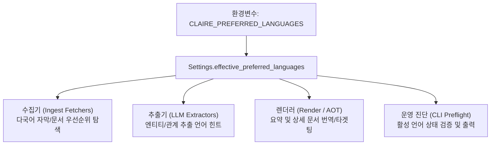

# 프로젝트 광역 선호 언어(Global Preferred Languages) 설계 명세서

작성일: 2026-09-02 · 상태: **설계 및 구현 완료** · 기준: [GOALS.md](../../../GOALS.md) 트랙1(수집·인제스트 무결성) / 관련: [INGESTION_INTEGRITY_AND_POLLUTION_CONTROL_RESEARCH.md](INGESTION_INTEGRITY_AND_POLLUTION_CONTROL_RESEARCH.md)

---

## 1. 배경 및 설계 목적

Claire Bible은 다국어 웹 문서, 미디어 자막, 논문 PDF, 소셜 미디어 포스트 등 다양한 언어로 작성된 지식 자산을 수집(Ingest)하고, LLM을 통해 지식그래프(엔티티·관계·요약)를 추출하며, 가독 렌더링 문서를 생성합니다.

기존 파이프라인에는 다국어 처리 시 다음과 같은 한계가 있었습니다:
1. **개별 기능별 하드코딩 및 파편화**: 특정 수집기나 기능 단위에 언어 우선순위가 분산되어 있거나 하드코딩되어 있어, 사용자의 언어 환경에 맞춘 유연한 설정이 불가능했음.
2. **글로벌 공통 언어(English)와의 조화 결여**: 사용자가 특정 언어(예: 한국어, 일본어 등)를 선호하더라도 글로벌 공통 표준 언어인 영어(`en`)가 항상 안전망(Fallback)으로 보장되지 않으면 데이터 누락이 발생할 수 있음.
3. **프로젝트 전반의 일관된 다국어 거버넌스 부재**: 향후 추가될 다국어 번역, 웹 수집 헤더(`Accept-Language`), 온톨로지 추출 프롬프트 언어 타겟팅, 하이브리드 검색 형태소 분석 등에서 공유할 단일화된 언어 선호도 기준이 필요함.

이를 해결하기 위해 프로젝트 전반에서 공유하고 활용하는 **프로젝트 광역 선호 언어(Project-wide Preferred Languages) 아키텍처**를 수립합니다.

---

## 2. 핵심 설계 원칙

1. **단일 중앙화 설정 (Single Source of Truth)**:
   - 다국어 우선순위는 개별 기능별 환경변수가 아닌 **프로젝트 광역 환경변수(`CLAIRE_PREFERRED_LANGUAGES`)**로 일원화하여 관리한다.
2. **글로벌 공통 언어 보장 (Deterministic English Fallback)**:
   - 사용자가 선호 언어로 무엇을 지정하든(또는 공백으로 비우든), 글로벌 표준 언어인 **영어(`en`)는 항상 선호 언어 목록의 최후방에 자동으로 포함**된다.
   - 이를 통해 사용자 선호 언어의 콘텐츠가 없을 때도 시스템이 임의로 중단되지 않고 영문 원문을 안전하게 수집·보존할 수 있다.
3. **무손실 정규화 및 견고성 (Robust Normalization)**:
   - 쉼표 구분 문자열(`"ko, ja"`, `"ES, fr "`)을 안전하게 파싱하여 대소문자 통일(소문자화), 앞뒤 공백 제거, 중복 제거, `en` 위치 보정 등을 자동으로 수행한다.
4. **전역 확장성 및 연동성 (Cross-Feature Reusability)**:
   - 수집 파이프라인(Fetcher 다국어 자막/언어 선별), 온톨로지 추출(Extraction 프롬프트 언어 힌트), 가독 렌더링(Rendering), CLI 진단(Preflight) 등 모든 서브시스템에서 `Settings.effective_preferred_languages`를 공통 인터페이스로 참조한다.

---

## 3. 세부 아키텍처 및 구현 명세

### 3.1 중앙 설정 모델 (`src/claire/config.py`)

#### 1) Pydantic 필드 선언
```python
# --- languages & localization ---
# 프로젝트 광역 선호 언어 목록 (쉼표 구분, 기본값 'ko'). 'en'은 항상 공통 폴백으로 포함됨.
preferred_languages: str = Field(
    default="ko", alias="CLAIRE_PREFERRED_LANGUAGES"
)
```

#### 2) 정규화 프로퍼티 (`effective_preferred_languages`)
```python
@property
def effective_preferred_languages(self) -> list[str]:
    """프로젝트 광역 선호 언어(기본 ko 등) + 항상 기본 포함되는 'en' 목록."""
    langs: list[str] = []
    for raw in self.preferred_languages.split(","):
        code = raw.strip().lower()
        if code and code not in langs and code != "en":
            langs.append(code)
    langs.append("en")
    return langs
```

#### 3) 동작 예시 매트릭스
| 입력값 (`CLAIRE_PREFERRED_LANGUAGES`) | `effective_preferred_languages` 결과 | 설명 |
|---|---|---|
| 미설정 (기본값) | `["ko", "en"]` | 한국어 최우선, 영문 폴백 |
| `"ja, es"` | `["ja", "es", "en"]` | 일본어 $\rightarrow$ 스페인어 $\rightarrow$ 영문 폴백 |
| `"ko, en, de"` | `["ko", "de", "en"]` | 중복/`en` 위치 정규화 후 `["ko", "de", "en"]` |
| `""` (빈 문자열) | `["en"]` | 영문 단독 사용 |

---

### 3.2 서브시스템별 연동 인터페이스



1. **수집기 계층 (Ingestion Fetchers)**:
   - 미디어 및 다국어 웹 수집기에서 사용 가능한 언어 트랙/자막 목록을 조회할 때 `settings.effective_preferred_languages` 순서대로 매칭을 시도한다.
2. **CLI 및 운영 진단 (`src/claire/cli.py`)**:
   - `claire preflight` 진단 명령 실행 시 시스템에 활성화된 선호 언어 목록을 명시적으로 표시하여 오설정 리스크를 방지한다.
   ```text
   claire preflight
   ========================================
   ...
   anonymous readonly: ENABLED (full knowledge base is public)
   preferred langs   : ko, en
   sqlite-vec probe  : OK
   ========================================
   ```

---

## 4. 환경설정 템플릿 표준

`.env.example` 및 `.env.dev.example`에 다음과 같이 공식 문서화하여 배포합니다:

```bash
# Project-wide preferred languages (comma-separated, e.g. ko, ja).
# English ('en') is always included as standard fallback across features. Default: ko
CLAIRE_PREFERRED_LANGUAGES=ko
```

---

## 5. 검증 및 테스트 명세

* `tests/test_config.py`:
  * 다국어 설정값(`"ko, ja, zh"`, `"en, fr"`, `""` 등)에 대한 정규화 및 `en` 자동 포함 규칙 단위 테스트 완료.
* `tests/test_youtube_fetcher.py`:
  * 광역 환경변수와 연동된 다국어 우선순위 탐색 및 자막 추출 통합 테스트 완료.
* 회귀 테스트: 전체 799개 테스트 통과 (**0 failed**).
