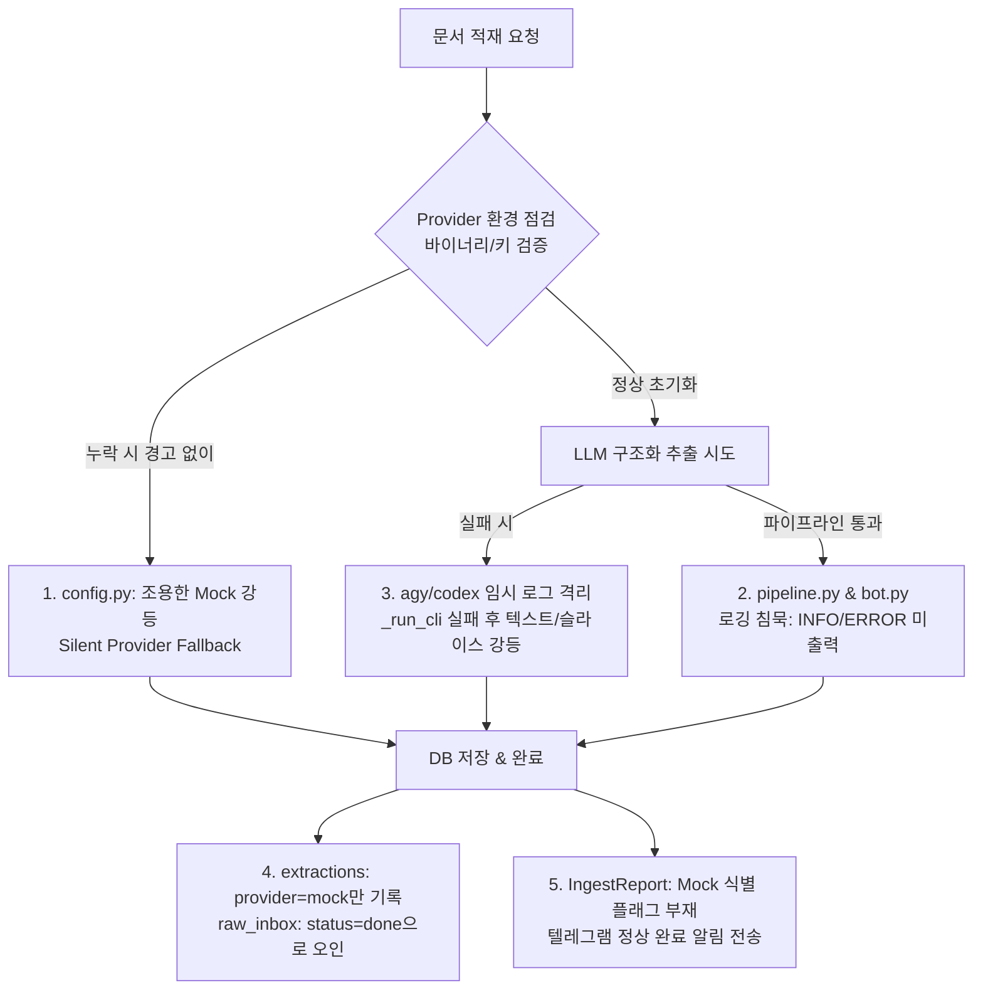
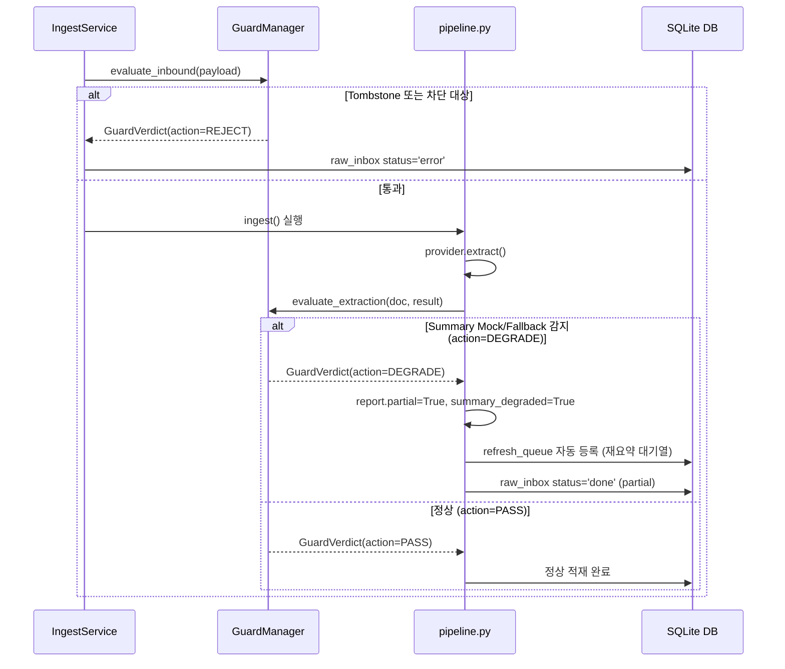

# Quality Verification Guardrails, Summary Integrity & Observability Design

> **문서 상태**: 설계 및 구현 규격 (Specification)  
> **관련 문서**: [INGESTION_INTEGRITY_AND_POLLUTION_CONTROL_RESEARCH.md](./INGESTION_INTEGRITY_AND_POLLUTION_CONTROL_RESEARCH.md), [PDF_PARSER_AND_VISION_GUARDRAILS_DESIGN.md](./PDF_PARSER_AND_VISION_GUARDRAILS_DESIGN.md), [MULTI_PROVIDER_DESIGN.md](./MULTI_PROVIDER_DESIGN.md), [CLAIRE_ARCHITECTURE_ROADMAP.md](../CLAIRE_ARCHITECTURE_ROADMAP.md)

---

## 1. 개요 및 배경 (Overview & Problem Statement)

### 1.1 문제 상황
클레어바이블(Claire-Bible) 운영 환경에서 문서를 적재(Ingest)하는 도중, **LLM 기반 요약(Summary) 생성이 누락되고 Mock 요약으로 조용히 대체(Silent Mock Fallback)되는 현상**이 빈번하게 관측되었습니다.
특히 프로덕션 서버 환경에서 이러한 현상이 발생했을 때, 서버 로그나 적재 리포트만으로는 그 정확한 인과(원인)를 규명하기 어려워 신속한 대응과 재발 방지가 저해되었습니다.

### 1.2 현재 프로덕션 서버 로그의 인과 추적 한계 분석 (5대 원인)
현재 코드베이스를 분석한 결과, 인과 관계가 소실되는 원인은 다음 5가지 구조적 한계에 기인합니다.



1. **`config.py`의 사일런트 폴백 (Silent Fallback)**:
   - [`effective_provider`](file:///home/fow/Projects/claire-bible/src/claire/config.py#L504-L518)는 `agy` 바이너리 누락, `codex` 바이너리 부재, `GEMINI_API_KEY` 미설정 시 어떠한 경고 로그(`logger.warning`)나 에러 발생 없이 **조용히 `"mock"` 문자열을 반환**합니다.
2. **파이프라인 및 봇 계층의 로깅 부재 (Logging Silence)**:
   - [`pipeline.py`](file:///home/fow/Projects/claire-bible/src/claire/ingest/pipeline.py) (955줄) 전반에 걸쳐 LLM 호출 전후의 진입/완료/소요시간을 기록하는 `logger.info`가 전무합니다.
   - [`telegram_bot.py`](file:///home/fow/Projects/claire-bible/src/claire/telegram_bot.py)는 `log = logging.getLogger("claire.telegram")` 선언만 있고 실제 로그 호출이 0건이며, 처리 예외 시 서버 로그에 스택트레이스를 남기지 않습니다.
   - [`cli.py`](file:///home/fow/Projects/claire-bible/src/claire/cli.py)에는 `logging.basicConfig()`가 없어 데몬 루프(`refresh-loop`, `recover-loop`)의 로그 레벨이 비표준으로 동작합니다.
3. **외부 CLI(`agy`/`codex`) 로그의 휘발성 및 격리**:
   - `AntigravityProvider._run_cli`는 `--log-file /tmp/agy.log`를 사용하므로 컨테이너 재시작 시 로그가 소멸합니다.
   - CLI 실패 시 fallback 프롬프트로 재시도하고, 이마저 실패하면 `_coerce`를 통해 본문 앞 200자나 엔티티 나열로 요약을 대체하여 원본 예외가 상위로 전파되지 않고 은폐됩니다.
4. **DB 저장 정보의 한계 (`raw_inbox`와 `extractions`)**:
   - `extractions` 테이블에는 `provider='mock', model='mock'`이라는 결과만 남을 뿐, "왜 mock이 동작했는가"의 이유가 남지 않습니다.
   - `raw_inbox`는 MockProvider가 예외 없이 동작하므로 `status='done', error=NULL`로 기록되어 `recover-loop`의 자동 복구 대상에서 누락됩니다.
5. **적재 리포트(`IngestReport`)의 Mock 미식별**:
   - 리포트에 요약 진위 여부를 나타내는 플래그가 없어, 사용자/관리자에게는 "✅ 적재 완료"로 정상 표시됩니다.

### 1.3 프로덕션 서버 긴급 단서 확인 요령 (현재 수준의 임시 진단)
현재 서버 접속 시 아래 4단계 명령을 통해 mock 강등 여부와 범위를 역추적할 수 있습니다:

```bash
# 1. DB 최신 추출 기록 확인 (결과 진단)
docker compose exec -T api python3 -c "
import sqlite3, json
conn = sqlite3.connect('data/claire.db')
c = conn.cursor()
for r in c.execute('SELECT id, document_id, provider, model, created_at, raw_response FROM extractions ORDER BY id DESC LIMIT 5'):
    summ = json.loads(r[5]).get('summary', '')[:80] if r[5] else 'None'
    print(f'[{r[0]}] Doc: {r[1]} | Provider: {r[2]} | Model: {r[3]} | Summary: {summ}')
"

# 2. 컨테이너 런타임 환경변수 및 바이너리 경로 확인
docker compose exec bot env | grep -E "CLAIRE_PROVIDER|GEMINI_API_KEY|CLAIRE_AGY_BIN|PATH"
docker compose exec bot which agy || echo "agy 바이너리 미발견"
docker compose exec bot ls -la /host-bin

# 3. CLI 임시 로그 잔존 여부 확인
docker compose exec bot tail -n 100 /tmp/agy.log

# 4. claire health 커맨드로 런타임 인식 프로바이더 확인
docker compose exec bot claire health
```

---

## 2. 인과 추적 및 무결성 확보 로드맵 (3-Step Roadmap)


### Step 1: 프로덕션 환경 Silent Fallback 차단 (Fail-Fast 전환)
* **목표**: 환경 이상 발생 시 조용히 mock으로 넘어가지 않고 즉시 가시화.
* **조치**:
  * `CLAIRE_ENVIRONMENT=production`인 경우, `CLAIRE_PROVIDER`가 `antigravity`인데 바이너리가 없거나 `gemini`인데 API 키가 없으면 `ProviderConfigurationError`를 발생시켜 인제스트를 즉시 중단.
  * `raw_inbox.status = 'error'`, `error = 'agy binary not found in PATH or /host-bin'`을 명시 기록하여 `recover-loop`와 관리자 알림을 트리거.

### Step 2: 로깅 체계 및 관측성(Observability) 강화
* **목표**: 인제스트 전 구간의 인과 관계를 추적 가능한 구조화 로그로 확보.
* **조치**:
  * `get_provider()` 실행 시 프로바이더 결정 사유를 `logger.info`로 명시 출력.
  * `pipeline.py`에 시작/추출완료/소요시간/모델/요약상태 로그 추가.
  * `telegram_bot.py`에 inbound 수신, 처리 단계, 예외 스택트레이스 로깅(`log.exception`) 복원.
  * `extractions` 및 `IngestReport`에 `extraction_mode` (`llm` | `fallback` | `mock`) 및 `error_reason` 기록.

### Step 3: 요약 품질 검증 가드레일 및 자동 복구 연계
* **목표**: 생성된 요약의 실체성을 검증하고, 불완전 요약 문서를 자동 복구 루프로 회수.
* **조치**:
  * 신규 `SummaryQualityGuard` 도입 (Mock 접두사 감지, 200자 본문 슬라이스 감지, 최소 길이 검증).
  * 검증 실패 시 `partial` 마킹 및 `refresh_queue`에 자동 등록하여 프로바이더 정상화 후 재요약 수행.

---

## 3. 기존 6대 품질 검증 가드레일 구현 현황 및 갭 분석 (Audit & Gap Analysis)

현재 Claire Bible에는 데이터 오염 및 무결성을 방어하는 6대 가드레일이 이미 구현되어 작동 중입니다.

| 번호 | 가드레일 명칭 | 주요 구현 위치 | 방어 대상 및 역할 | 판정 기제 |
|:---:|:---|:---|:---|:---|
| **1** | **웹 콘텐츠 사전 필터** | [`fetchers/guard.py`](file:///home/fow/Projects/claire-bible/src/claire/ingest/fetchers/guard.py)<br/>[`fetchers/web.py`](file:///home/fow/Projects/claire-bible/src/claire/ingest/fetchers/web.py) | Soft 404/403, Cloudflare/봇 챌린지, 페이월, SSL 오류, 본문 빈약(<300자), 알파뉴메릭 밀도(<30%) 차단 | 정규식 패턴 및 텍스트 밀도 휴리스틱 |
| **2** | **데이터 무결성 & Dedup** | [`ingest/pipeline.py`](file:///home/fow/Projects/claire-bible/src/claire/ingest/pipeline.py)<br/>[`store/db.py`](file:///home/fow/Projects/claire-bible/src/claire/store/db.py) | 소각(Purge) 툼스톤 재유입 차단, 3단계 중복 제거(`content_hash` 스킵, `canonical_url` 갱신, `MinHash` 근사중복), 필수 첨부 보존 | 해시 비교, MinHash LSH, 툼스톤 색인 |
| **3** | **표 보존 및 파싱 가드** | [`extract/table_budget.py`](file:///home/fow/Projects/claire-bible/src/claire/extract/table_budget.py)<br/>[`extract/classifier.py`](file:///home/fow/Projects/claire-bible/src/claire/extract/classifier.py) | 본문 상한 슬라이싱 시 표(Markdown/ADOC/HTML) 100% 무손실 보존, 학술 논문 1차 판정 후 15,000자 이상 논문 `high effort` 자동 강제, Docling 실패 시 PyPDF 대체 | 구문 태그 블록 파싱, 최저 비용 어댑터 분류기 |
| **4** | **온톨로지 관계 검증** | [`ontology/registry.py`](file:///home/fow/Projects/claire-bible/src/claire/ontology/registry.py)<br/>[`extract/resolver.py`](file:///home/fow/Projects/claire-bible/src/claire/extract/resolver.py) | 16개 표준 관계의 Domain/Range 엄격 검증(위반 시 거절), 미등록 타입 `provisional` 격리, 엔티티 동일체 판정 병합 | 온톨로지 스키마 테이블, LLM 판정기 |
| **5** | **1홉 확장/리서치 게이트** | [`expand/follow.py`](file:///home/fow/Projects/claire-bible/src/claire/expand/follow.py)<br/>[`expand/research.py`](file:///home/fow/Projects/claire-bible/src/claire/expand/research.py) | 부모 맥락 대비 관련성(`relevance >= 0.7`) 및 품질(`quality >= 0.6`) 채점, 다의어 방어 및 판정 실패 시 Fail-Closed(0점) 폐기 | 2단계 LLM 심사 게이트 (`passes_gate`) |
| **6** | **요약 문법 오염 검출** | [`extract/prompts.py`](file:///home/fow/Projects/claire-bible/src/claire/extract/prompts.py)<br/>[`store/db.py`](file:///home/fow/Projects/claire-bible/src/claire/store/db.py) | 요약문에 AsciiDoc/Markdown 문법(`==`, `[NOTE]`, `|===` 등) 잔존 감지, `claire stats` 경고 노출, `claire regenerate --corrupted` 복구 연계 | 정규식 패턴 (`is_corrupted_summary`) |

### 🔍 핵심 맹점 (Gap Analysis)
위 6대 가드레일은 **"외부 잡음 유입 방지"**, **"온톨로지 문법 무결성"**, **"문법 기호 오염 검출"**에 철저하게 집중되어 있습니다.
그러나 **"LLM이 생성한 요약문 내용 자체의 실체성(Content Existence & Non-Mockness)"**을 검증하는 가드레일이 결손되어 있었습니다:
1. **내용적 실체 검증 부재**: `ExtractionResult.summary`가 빈 문자열이거나, `[mock]...`이거나, 단순 본문 앞 200자 잘라내기여도 시스템은 이를 "정상 요약"으로 수용했습니다.
2. **과도하게 관대한 Fallback이 초래한 침묵**: 프로바이더 내부의 방어 코드(예: `antigravity_provider.py`의 `clean_plain_summary(fallback_txt[:200] + "…")`)가 예외를 상위로 전파하지 않고 가짜 요약을 채움으로써, 오히려 오류가 정상 완료로 둔갑하는 부작용을 낳았습니다.

---

## 4. 품질 검증 가드레일 런타임 컴포넌트화 설계 (New Architecture Design)

흩어져 있는 가드 로직들을 서비스 런타임이 통제하는 **단일 일급 컴포넌트 패키지(`src/claire/guards/`)**로 구조화합니다.

```text
src/claire/guards/
├── __init__.py          # GuardVerdict, GuardAction, GuardManager 공개 API
├── base.py              # GuardBase, GuardVerdict, GuardAction 추상 규격
├── manager.py           # GuardManager (런타임 오케스트레이터, 메트릭 집계)
├── inbound.py           # Phase 1: TombstoneGuard, DedupGuard, AttachmentGuard
├── content.py           # Phase 2: WebContentGuard, PdfStructureGuard, TableGuard
├── extraction.py        # Phase 3: SummaryQualityGuard (신규), SummarySyntaxGuard, RelationOntologyGuard
└── expansion.py         # Phase 4: ExpansionGateGuard, ResearchGateGuard
```

### 4.1 표준 판정 규격 (`GuardVerdict` & `GuardAction`)

```python
from dataclasses import dataclass, field
from enum import Enum
from typing import Any

class GuardAction(str, Enum):
    PASS = "pass"          # 검증 통과 (정상 진행)
    WARN = "warn"          # 통과하되 경고 로그 및 리포트에 주의 기록
    DEGRADE = "degrade"    # 부분 적재(partial) 처리 + 복구 큐(refresh) 등록
    REJECT = "reject"      # 즉시 거부 (인제스트 중단, raw_inbox=error)

@dataclass
class GuardVerdict:
    guard_name: str
    passed: bool
    action: GuardAction
    reason: str
    code: str              # 표준화된 코드 (예: "GUARD_MOCK_SUMMARY", "GUARD_BOT_CHALLENGE")
    details: dict[str, Any] = field(default_factory=dict)
```

### 4.2 신규 핵심 컴포넌트: `SummaryQualityGuard`
요약 생성 누락 및 Mock 동작을 정밀 탐지하는 검증기입니다.

```python
class SummaryQualityGuard:
    """요약의 실체성, 완성도, Mock 여부를 검증하는 일급 가드레일."""

    def __init__(self, strict: bool = False, min_chars: int = 40):
        self.strict = strict
        self.min_chars = min_chars

    def evaluate(
        self,
        summary: str | None,
        raw_text: str | None,
        provider_name: str,
    ) -> GuardVerdict:
        # 1. 완전 누락 검증
        if not summary or not summary.strip():
            return GuardVerdict(
                guard_name="SummaryQualityGuard",
                passed=False,
                action=GuardAction.REJECT if self.strict else GuardAction.DEGRADE,
                reason="요약 내용이 완전히 비어있음 (Empty summary)",
                code="GUARD_EMPTY_SUMMARY",
            )

        s = summary.strip()

        # 2. Mock 동작 감지 (접두사 또는 mock 프로바이더)
        if s.startswith("[mock]") or provider_name == "mock":
            return GuardVerdict(
                guard_name="SummaryQualityGuard",
                passed=False,
                action=GuardAction.REJECT if self.strict else GuardAction.DEGRADE,
                reason="Mock 프로바이더 동작 또는 mock 요약 접두사 감지",
                code="GUARD_MOCK_SUMMARY",
                details={"provider": provider_name, "preview": s[:50]},
            )

        # 3. 본문 앞부분 단순 슬라이스(200자 잘라내기 fallback) 감지
        if raw_text and len(raw_text) > 50:
            clean_s = s.rstrip("…").strip()
            clean_raw = raw_text.strip()
            if clean_raw.startswith(clean_s) and len(clean_s) <= 210:
                return GuardVerdict(
                    guard_name="SummaryQualityGuard",
                    passed=False,
                    action=GuardAction.DEGRADE,
                    reason="LLM 요약 부재로 인한 본문 앞부분 단순 절단 fallback 감지",
                    code="GUARD_FALLBACK_SLICE_SUMMARY",
                    details={"sliced_length": len(clean_s)},
                )

        # 4. 엔티티 나열형 단순 템플릿 요약 감지
        if s.endswith("등에 관한 자료이다.") and len(s) < 100:
            return GuardVerdict(
                guard_name="SummaryQualityGuard",
                passed=False,
                action=GuardAction.DEGRADE,
                reason="요약 실패로 인한 엔티티 나열형 템플릿 fallback 감지",
                code="GUARD_FALLBACK_TEMPLATE_SUMMARY",
            )

        # 5. 분량 빈약 경고
        if len(s) < self.min_chars:
            return GuardVerdict(
                guard_name="SummaryQualityGuard",
                passed=True,
                action=GuardAction.WARN,
                reason=f"요약 분량 극단적 빈약 ({len(s)}자 < {self.min_chars}자)",
                code="GUARD_THIN_SUMMARY",
            )

        return GuardVerdict(
            guard_name="SummaryQualityGuard",
            passed=True,
            action=GuardAction.PASS,
            reason="정상 LLM 요약 확인",
            code="GUARD_OK",
        )
```

### 4.3 서비스 런타임 연계: `GuardManager`
[`IngestService`](file:///home/fow/Projects/claire-bible/src/claire/ingest/service.py)가 생성 시점에 주입받아 보유하는 런타임 컴포넌트입니다.



### 4.4 시스템 헬스체크 및 관측성 연동 (`health.py`)
`claire health` 및 `claire doctor` 실행 시 가드레일의 동작 상태와 최근 차단 통계가 출력됩니다.

```json
{
  "ok": true,
  "provider": "antigravity",
  "guards": {
    "status": "active",
    "strict_mode": false,
    "summary_guard": "enabled",
    "recent_degraded_count": 2,
    "recent_rejected_count": 0,
    "last_violation": {
      "guard": "SummaryQualityGuard",
      "code": "GUARD_MOCK_SUMMARY",
      "time": 1773098120.5
    }
  }
}
```

---

## 5. 구현 사양 및 환경변수 정의 (Implementation Specification)

### 5.1 환경변수 추가 ([`ENVIRONMENT_VARIABLES.md`](../implementation/ENVIRONMENT_VARIABLES.md))

| 환경변수명 | 기본값 | 설명 |
|:---|:---:|:---|
| `CLAIRE_GUARDS_ENABLED` | `true` | 품질 검증 가드레일 서브시스템 전체 활성화 여부 |
| `CLAIRE_GUARDS_STRICT` | `false` | 엄격 모드. True 시 요약 Mock/누락 발생 시 degrade 대신 즉시 적재 거부(REJECT) |
| `CLAIRE_SUMMARY_MIN_CHARS` | `40` | 요약 최소 유효 글자 수 (이하일 경우 WARN/DEGRADE 판정) |

### 5.2 검증 및 테스트 계획 (Verification Plan)
1. **단위 테스트 (`tests/test_guards.py`)**:
   - `SummaryQualityGuard`: 빈 문자열, `[mock]`, 본문 200자 슬라이스, 템플릿 요약, 정상 요약별 판정 검증.
   - `WebContentGuard`: Soft 404, CAPTCHA, 봇 차단 화면 판정 검증.
2. **인제스트 통합 테스트 (`tests/test_pipeline_guards.py`)**:
   - `MockProvider` 동작 시 `strict=False` 환경에서 `partial=True` 마킹 및 `refresh_queue` 인큐 확인.
   - `strict=True` 환경에서 `raw_inbox.status='error'` 기록 및 즉시 예외 발생 확인.
3. **진단 커맨드 테스트**:
   - `claire health` 실행 시 guards 메타데이터 정상 출력 검증.
