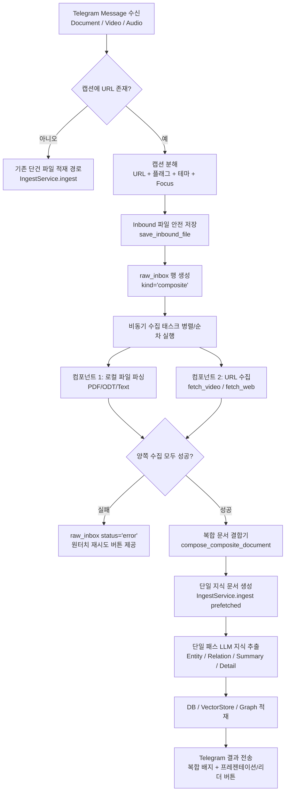

# 텔레그램 첨부 파일·하이퍼링크 복합 적재(Composite Ingestion) 설계

작성일: 2026-10-08 · 상태: **설계 확정, 구현 대기** · 기준: [GOALS.md](../../upstream/GOALS.md) 품질 원칙 · 관련: [TELEGRAM_VIDEO_PDF_BUNDLE_INGESTION_DESIGN.md](TELEGRAM_VIDEO_PDF_BUNDLE_INGESTION_DESIGN.md), [VIDEO_PRESENTATION_BUNDLE_INGESTION_DESIGN.md](VIDEO_PRESENTATION_BUNDLE_INGESTION_DESIGN.md), [FOCUS_STANDARDIZATION_AND_PURGE_DESIGN.md](FOCUS_STANDARDIZATION_AND_PURGE_DESIGN.md)

---

## 1. 배경 및 문제 정의

### 1.1 현재 상황
현재 Claire의 텔레그램 봇([`src/claire/telegram_bot.py`](../../src/claire/telegram_bot.py))은 입력 메시지를 엄격히 단일 모달리티로 라우팅한다:
1. **문서 첨부 전송 (`on_document`)**:
   - 파일을 다운로드하여 단일 `file` 소스로 적재한다.
   - 함께 입력된 캡션(Caption)은 오직 프롬프트 작성 지시어인 **초점(`focus`)**으로만 해석한다([`parse_caption_focus`](../../src/claire/telegram_bot.py#L485)).
   - 캡션에 웹 URL이 포함되어 있더라도 해당 링크를 웹 페처(web fetcher)로 수집(fetch)하지 않는다.
2. **텍스트 메시지 전송 (`on_message`)**:
   - 텍스트 본문에서 URL을 감지하여 웹/유튜브 등으로 라우팅한다.
   - 파일 첨부는 불가능하다.
3. **분리 전송 시**:
   - 사용자가 파일과 링크를 연속해서 2개의 메시지로 보내면, 각각 독립적인 `doc_xxx`, `doc_yyy` 2건의 지식 문서로 분리 적재된다.

### 1.2 핵심 사용자 요구
사용자가 가장 자연스럽게 복합 자료를 전달하는 실무 패턴은 **“파일 첨부 1개 + 캡션에 관련 웹/영상 하이퍼링크 1개”**를 **단일 텔레그램 메시지**로 전송하는 것이다.
* **대표 예시 A**: 학술대회/컨퍼런스 발표자료 PDF를 파일로 첨부하면서, 캡션에 YouTube/세션 영상 URL을 기재 (`https://youtube.com/watch?v=...`)
* **대표 예시 B**: 사내 회의록/보고서 PDF를 파일로 첨부하면서, 캡션에 참조 웹 문서/사양서 링크를 기재 (`https://docs.example.com/...`)
* **대표 예시 C**: 녹음 음성/MP4 파일을 파일로 첨부하면서, 캡션에 세션 소개 웹페이지 또는 관련 아티클 링크를 기재

이 입력은 분리된 두 문서가 아니라 **본질적으로 동일한 지식 사건(Knowledge Event)**을 서로 다른 매체(음성·영상 vs 슬라이드·문서)로 기록한 것이므로, **단 1회의 적재(Composite Ingestion)를 통해 하나의 지식 문서(Single Document)로 통합**되어야 한다.

---

## 2. 핵심 설계 원칙

1. **단일 메시지 자족성 (Zero Multi-message Speculation)**
   - 여러 메시지를 시간차를 두고 수신해 묶는 불확실한 타이밍 추론(debounce/coalescing) 대신, **단일 텔레그램 메시지 안에 파일과 하이퍼링크가 함께 포함된 경우**를 명확한 결합 트리거로 삼는다.
2. **원문과 출처의 우선 보존 (Raw First, No Information Loss)**
   - 첨부 파일과 원격 링크의 원문 데이터를 지식 추출(LLM) 전에 영구 보존한다.
   - 양쪽 출처를 투명하게 추적할 수 있도록 `doc.meta.extra_sources` 및 `content_components`에 기록한다.
3. **주 앵커와 보조 자료의 결정론적 역할 모델링 (Primary-Supporting Role Model)**
   - 시청각 미디어(영상/음성)가 포함된 경우, 타임라인과 발화 내용이 있는 미디어를 **Primary Anchor**로 삼고, PDF 슬라이드/문서를 **Supporting Component**로 바인딩한다.
   - 기존 VMware Explore에서 검증된 Presentation PDF 및 슬라이드 뷰어(Reveal.js / Presentation V2) 생태계와 100% 호환되도록 구성한다.
4. **원자적 실패 및 멱등 재생성 (Atomic Failure & Idempotent Replay)**
   - 링크 수집, STT 전사, 파일 파싱 중 하나라도 실패하면 절반만 잘린 불완전 문서를 남기지 않고 명확한 오류로 기록하며, `raw_inbox`를 통해 원터치 재시도가 가능해야 한다.
5. **하위 호환성 (Strict Backward Compatibility)**
   - 캡션에 링크가 없는 순수 파일 첨부는 기존과 100% 동일하게 `file` 단건 적재 + `focus` 해석 경로를 유지한다.
   - 기존의 테마 태그(`#테마`), 재생성/추론 플래그(`--full`, `--effort high`), 초점 파이프(`| 초점`) 문법을 캡션 내에서도 온전히 지원한다.

---

## 3. 텔레그램 메시지 파싱 및 캡션 분해 계약

텔레그램 Bot API에서 파일 메시지는 `update.message.document`, `update.message.video`, `update.message.audio`와 함께 `update.message.caption`, `update.message.caption_entities`를 제공한다.

### 3.1 캡션 분해 문법 (Grammar)

```text
[<하이퍼링크>] [<플래그/테마>] [| <초점>]
또는
<설명 텍스트> <하이퍼링크> [<플래그/테마>] [| <초점>]
```

#### 파싱 우선순위:
1. **하이퍼링크(URL) 감지**:
   - `caption_entities`의 `MessageEntity.type == "url"` 또는 `"text_link"`.
   - 엔티티가 없는 클라이언트 fallback: 정규식 `_URL_RE` (`https?://[^\s)\]\}<>\"']+`).
   - 캡션 내에서 **첫 번째로 발견된 유효한 URL**을 복합 적재 대상 링크(`composite_url`)로 채택한다.
2. **테마 분리**:
   - `parse_message_theme(clean_text)`를 호출하여 `#테마` 태그 추출 및 제거.
3. **플래그 분리**:
   - `parse_regenerate_flags(clean_text)`를 호출하여 `--full`, `--effort`, `-e`, `-R` 등 추출 및 제거.
4. **초점(Focus) 분리**:
   - URL 제거 후 남은 텍스트가 존재할 경우:
     - 파이프(`|`) 또는 명시적 접두어(`[초점]`, `초점:`)가 있으면 해당 부분을 `focus`로 추출.
     - 파이프가 없더라도 URL 앞/뒤에 붙은 설명 텍스트가 있으면 이를 작성 초점으로 채택.

### 3.2 파싱 예시

| 캡션 입력 형태 | 추출된 URL (`composite_url`) | 추출된 초점 (`focus`) | 플래그/테마 |
|---|---|---|---|
| `https://youtube.com/watch?v=abc` | `https://youtube.com/watch?v=abc` | `None` | 기본값 |
| `https://youtube.com/watch?v=abc \| 인프라 아키텍처 중심` | `https://youtube.com/watch?v=abc` | `인프라 아키텍처 중심` | 기본값 |
| `관련 세션 영상 https://youtube.com/watch?v=abc --effort high #기술` | `https://youtube.com/watch?v=abc` | `관련 세션 영상` | effort: high, theme: 기술 |
| `참고 기사 https://news.example.com/item/123` | `https://news.example.com/item/123` | `참고 기사` | 기본값 |
| `시스템 아키텍처 중심 (URL 없음)` | `None` (기존 단건 파일 적재로 분기) | `시스템 아키텍처 중심` | 기본값 |

---

## 4. 복합 적재 역할 모델 및 본문 결합 규칙

### 4.1 주 소스(Primary) vs 보조 소스(Supporting) 매트릭스

메시지에 포함된 **첨부 파일**과 **하이퍼링크**의 유형 조합에 따라 Primary와 Supporting을 결정한다:

| 첨부 파일 유형 | 하이퍼링크 유형 | Primary 역할 (문서 정체성) | Supporting 역할 (보조 구성요소) | 최종 source_type |
|---|---|---|---|---|
| PDF / 문서 | 영상 링크 (YouTube, NaverTV 등) | **영상 링크** (STT/자막 중심) | **첨부 PDF** (발표자료/슬라이드) | `video` / `youtube` |
| PDF / 문서 | 일반 웹 링크 (Web, Blog, ArXiv) | **웹 링크** (공개 URL 앵커) | **첨부 PDF** (상세 문서) | `web` (또는 `pdf`) |
| MP4 / Audio | 웹 링크 (ArXiv, Blog, PDF URL) | **첨부 미디어** (로컬 STT) | **웹 링크** (발표자료/원문) | `video` / `audio` |
| PDF / 문서 | PDF 다운로드 링크 | **첨부 파일** | **원격 PDF 링크** | `pdf` |

> [!IMPORTANT]
> **영상(미디어) + PDF 결합 시**:
> 영상이 포함되면 Claire의 표준 비디오 프레젠테이션 스키마([`VIDEO_PRESENTATION_BUNDLE_INGESTION_DESIGN.md`](VIDEO_PRESENTATION_BUNDLE_INGESTION_DESIGN.md))에 따라 `presentation_pdf` 메타데이터와 `content_components`가 구성되어, 웹 UI의 **프레젠테이션 슬라이드 뷰어(Reveal.js)**와 **타임스탬프 기반 리더**가 즉시 활성화된다.

### 4.2 본문 통합 구조 (Unified Text Composition)

통합 문서의 `raw_text`는 LLM이 출처의 경계를 명확히 인식할 수 있도록 표준 마커로 결합된다:

```markdown
[영상 음성 전사 (STT) / 주 본문: {Primary Title}]
출처: {Primary URL 또는 File}

{Primary Content Body}

---
[첨부 보조 자료 — {Supporting File Name / URL}]
출처: {Supporting Source Info}

{Supporting Content Body}
```

### 4.3 메타데이터 통합 계약 (`doc.meta`)

```json
{
  "composite_ingest": true,
  "composite_kind": "attachment_with_link",
  "has_transcript": true,
  "is_stt": true,
  "presentation_pdf": {
    "status": "available",
    "filename": "slides.pdf",
    "byte_length": 2451020,
    "raw_chars": 15400,
    "orig_chars": 15400,
    "parser_used": "Docling",
    "parser_fallback": false,
    "content_sha256": "..."
  },
  "content_components": [
    {
      "kind": "transcript",
      "start": 0,
      "end": 12500,
      "content_sha256": "..."
    },
    {
      "kind": "presentation_pdf",
      "start": 12530,
      "end": 27930,
      "content_sha256": "..."
    }
  ],
  "extra_sources": [
    {
      "url": "https://www.youtube.com/watch?v=...",
      "canonical_url": "https://www.youtube.com/watch?v=...",
      "source_type": "youtube",
      "title": "세션 영상"
    },
    {
      "url": "file://slides.pdf",
      "canonical_url": "file://slides.pdf",
      "source_type": "pdf",
      "title": "발표자료 PDF"
    }
  ]
}
```

---

## 5. 전체 아키텍처 및 제어 흐름



---

## 6. 핵심 모듈별 상세 구현 설계

### 6.1 `src/claire/telegram_bot.py` 변경점

1. **`parse_caption_composite(caption: str) -> tuple[str | None, str | None, bool, str | None]`**:
   - 반환값: `(target_url, clean_focus, has_refetch_full, has_effort)`
   - URL이 발견되면 `target_url`을 반환하고, 나머지 텍스트에서 focus와 flags를 정제.
2. **`on_document` / `on_video` 분기 확장**:
   - `target_url`이 존재할 경우 `_execute_composite_ingest(...)` 비동기 워커로 분기.
   - 상태 메시지: `⏳ 복합 적재 처리 중… (첨부: {name} + 링크: {target_url[:30]})`
   - 진행 Ticker 연동: STT, PDF 파싱, LLM 추출 단계를 사용자에게 실시간 보고.

### 6.2 `src/claire/ingest/composite.py` (신규 모듈)

복합 소스 수집 및 결합 전담 모듈:
* `fetch_composite_components(file_path: Path, file_name: str, url: str, settings: Settings, full_content: bool) -> tuple[Document, Document]`:
  - 첨부 파일 파싱(`fetch_file`)과 링크 수집(`router.fetch`)을 수행하고 예외를 안전하게 포장.
* `compose_composite_document(file_doc: Document, url_doc: Document, focus: str | None, settings: Settings) -> Document`:
  - 주 앵커와 보조 컴포넌트 우선순위 판정.
  - 마커 기반 본문 병합(`raw_text`).
  - `presentation_pdf`, `content_components`, `extra_sources` 메타데이터 통합.
  - 통합된 단일 `Document` 객체 반환.

### 6.3 `src/claire/ingest/service.py` 확장

* `IngestService.ingest_composite(...)`:
  - `raw_inbox`에 `kind="composite"`로 등록.
  - `compose_composite_document()` 실행 후, 기존 검증된 `self.ingest(..., prefetched=composite_doc)`로 전달.
  - 1회 호출로 엔티티 추출, 지식 그래프 연결, Vault 내보내기 완료.

---

## 7. 저장소 계약 및 장애 복구 (Storage & Fault Tolerance)

### 7.1 `raw_inbox` 기록 계약
복합 적재는 두 개의 원천을 가지므로 `raw_inbox`에 다음과 같이 기록되어 장애 시 완전 재생(Replay)이 가능해야 한다:

* `kind`: `"composite"`
* `file_name`: 첨부 파일 이름 (예: `session_slides.pdf`)
* `file_ref`: 저장된 로컬 원본 경로 (예: `data/raw/inbound/20261008_session_slides.pdf`)
* `payload`: JSON 직렬화 메타데이터
  ```json
  {
    "url": "https://www.youtube.com/watch?v=...",
    "attachment_name": "session_slides.pdf",
    "focus": "인프라 최적화 중심",
    "theme_id": 1,
    "effort": "high",
    "full_content": true
  }
  ```

### 7.2 실패 모드와 복구 동작

1. **원격 링크 수집 실패 (네트워크 타임아웃, 404, 접근 제한)**:
   - 동작: 문서를 반쪽짜리로 생성하지 않고, `report.error = f"링크 수집 실패: {url_err}"`로 중단.
   - 텔레그램: 👎 이모지 반응 및 에러 사유 알림, 로컬에 저장된 원본 파일을 보존한 채 원터치 재시도 버튼 제공.
2. **미디어 STT 실패**:
   - 동작: 영상의 자막/STT가 실패한 경우 기존 정책과 동일하게 부분 실패 처리 또는 재수집 버튼 노출.
3. **PDF 파싱 실패 (암호화, 스캔본)**:
   - 동작: Docling -> PyPDFium2 -> PyPDF fallback 체인을 실행하고, 모든 파서가 실패할 경우 명확한 파서 에러 보고.

---

## 8. 텔레그램 UX 및 결과 알림

### 8.1 진행 단계별 메시지 갱신
```text
⏳ 복합 적재 처리 중… (slides.pdf + YouTube) (5s)
• 원문 및 영상 자막 수집 중…
```
```text
⏳ 복합 적재 처리 중… (slides.pdf + YouTube) (15s)
• 통합 지식 추출 및 그래프 연결 중…
```

### 8.2 완료 알림 (`_settle_status`)
```text
✅ 복합 적재 완료: vLLM 분산 서빙 아키텍처 및 PagedAttention
🎥 영상: YouTube (CC 자막 14,200자)
📄 발표자료: slides.pdf (18장, 6,400자)
노드 신규 8 · 기존연결 5 · 관계 12 (횡단 2)
초점: 인프라 최적화 중심
```
* **인라인 버튼**:
  * `[📖 리더에서 읽기]`
  * `[📊 프레젠테이션 슬라이드 보기]` (PDF가 결합되었으므로 자동 노출)
  * `[🔗 관련 링크 N개 가져오기]` (1홉 확장 후보)

---

## 9. 구현 및 테스트 검증 계획

### 9.1 단위 테스트 (`tests/test_composite_ingest.py`)
1. **캡션 파서 검증**:
   - URL 단독, URL + 초점, URL + 플래그, 텍스트 중간 URL, URL 없는 일반 캡션 분해 정합성.
2. **결합기(Composer) 검증**:
   - 영상 URL + PDF 첨부 결합 시 `presentation_pdf` 및 `content_components` 정상 생성 여부.
   - 일반 웹 URL + PDF 첨부 결합 시 본문 마커 및 `extra_sources` 정합성.
3. **원자적 실패 검증**:
   - 한쪽 소스 실패 시 DB 롤백 및 에러 상태 기록 확인.

### 9.2 통합 테스트 (`tests/test_telegram_composite.py`)
1. PTB Mock Update를 사용하여 첨부 파일 + 캡션 링크 전송 시 단일 `doc_id`로 최종 생성되는 라이프사이클 E2E 검증.
2. Web UI Presentation API (`/presentation/{doc_id}`)에서 결합된 슬라이드가 정상 렌더링되는지 확인.
