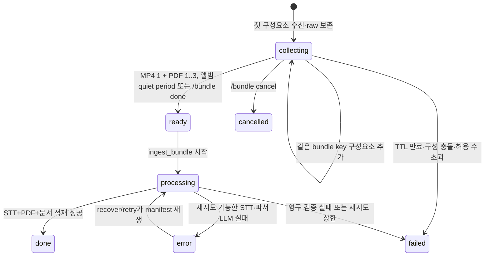

# 텔레그램 MP4·PDF 복합 적재 설계

작성일: 2026-09-15 · 상태: **설계 확정, 구현 전** · 기준: [GOALS.md](../../upstream/GOALS.md) 품질 원칙 · 관련: [VIDEO_AUDIO_TRANSCRIPTION_AND_INGESTION_DESIGN.md](VIDEO_AUDIO_TRANSCRIPTION_AND_INGESTION_DESIGN.md), [VIDEO_PRESENTATION_BUNDLE_INGESTION_DESIGN.md](VIDEO_PRESENTATION_BUNDLE_INGESTION_DESIGN.md), [PDF_INGESTION_AND_ADAPTIVE_EFFORT_DESIGN.md](PDF_INGESTION_AND_ADAPTIVE_EFFORT_DESIGN.md)

---

## 1. 목적과 범위

사용자가 텔레그램봇에 MP4 영상 1개와 관련 PDF 1~3개를 함께 제공하면 다음 자료를 **하나의 지식 문서**로 적재한다.

1. MP4 음성의 STT 전사와 타임스탬프
2. 함께 제공한 PDF의 검증된 추출 텍스트
3. MP4·PDF 원본 파일과 결합 관계를 재생할 수 있는 manifest

이 설계에서 “함께 제공”은 다음 둘 중 하나로 한정한다.

- 같은 Telegram `media_group_id`를 가진 문서 앨범
- 사용자가 `/bundle start`로 열고 `/bundle done`으로 확정한 명시적 수집 세션

단순히 같은 사용자가 짧은 시간 안에 연속 전송한 파일은 자동 결합하지 않는다. 시간 인접성만으로 자료의 의미 관계를 추정하면 서로 다른 문서를 잘못 합쳐 지식 그래프를 오염시킬 수 있기 때문이다.

---

## 2. 현재 구현 점검 결과

### 2.1 지원 여부

| 입력 시나리오 | 현재 상태 | 근거 |
|---|---|---|
| 텔레그램 PDF 1개 | 지원 | `on_document()`가 파일을 내려받아 `save_inbound_file()` 후 단건 `ingest()` 호출 |
| 비디오 URL의 CC/STT | 지원 | `fetch_video()`가 발행자 CC를 우선 사용하고 필요할 때 STT 수행 |
| VMware Explore URL의 CC/STT+Presentation PDF | 지원 | 사이트 전용 Presentation 발견·검증·결합 구현 |
| 텔레그램 native video 메시지 | 미지원 | `filters.VIDEO` 핸들러가 등록되어 있지 않음 |
| 텔레그램에 문서로 보낸 MP4 | 미지원 | 다운로드는 가능하지만 `fetch_file()`이 MP4를 지원하지 않아 실패 |
| 텔레그램 MP4+PDF 복합 작업 | 미지원 | `media_group_id` 수집기와 복수 파일 manifest가 없음 |
| 복합 작업 재시도·복구 | 미지원 | `raw_inbox`와 recover 경로가 단일 `file_ref`만 재생 |

현재 텔레그램 진입점은 `filters.Document.ALL`과 텍스트만 등록한다. `on_document()`는 각 Update를 즉시 독립 파일로 저장하고, 한 파일마다 별도의 `IngestService.ingest()`를 실행한다. 로컬 파일 fetcher는 PDF·ODT·텍스트 계열만 허용한다.[^current-telegram-path]

기존 `compose_video_presentations()`는 요구사항과 유사한 결합 텍스트·구성요소 예산·첨부 저장 계약을 제공하지만, 입력이 VMware Explore URL에서 자동 발견한 RainFocus PDF로 한정되어 있다. 따라서 텔레그램 수집 문제를 이 함수에 직접 덧붙이지 않고, 사이트 중립적인 결합 코어를 추출한 뒤 두 진입점이 공유해야 한다.[^current-presentation-boundary]

### 2.2 검증 범위

2026-09-15에 `tests/test_bot.py`, `tests/test_video_presentation.py`, `tests/test_video_fetcher.py`, `tests/test_gemini_stt.py`의 결정론적 회귀 테스트 74개가 통과했다. 이 결과는 기존 단건 텔레그램·비디오·Presentation·STT 코드의 정적 회귀 상태를 확인한 것이며, 실제 Telegram 파일 전달이나 실제 STT 프로바이더 호출을 검증한 결과는 아니다.[^verification-scope]

---

## 3. Telegram 전송 계약이 만드는 설계 제약

Telegram은 앨범에 속한 각 Message에 채팅 내부 고유 `media_group_id`를 제공한다. 그러나 document와 audio는 같은 종류끼리만 앨범으로 묶을 수 있다.[^telegram-media-group]

따라서 클라이언트가 MP4를 “파일로 보내기”로 선택하면 MP4와 PDF가 document 앨범 하나로 전달될 수 있지만, MP4를 native video로 보내고 PDF를 document로 보내면 하나의 혼합 앨범이 보장되지 않는다. 두 방식을 모두 수용하기 위해 자동 경로와 명시적 경로를 함께 제공한다.

| 사용자 전송 방식 | 결합 방법 |
|---|---|
| MP4와 PDF를 모두 파일로 선택해 한 앨범으로 전송 | 같은 `media_group_id` 기준 자동 수집·확정 |
| MP4는 동영상, PDF는 파일로 각각 전송 | `/bundle start` → 파일 전송 → `/bundle done` |
| MP4 또는 PDF만 전송 | 기존 단건 지원 형식은 기존 경로 유지, 불완전한 앨범은 결합 적재하지 않음 |

일반 Bot API 서버의 `getFile` 다운로드 상한은 현재 20 MB다. 큰 MP4를 운영 요구사항에 포함하려면 로컬 Bot API 서버를 선택 배포해야 하며, 로컬 서버는 무제한 다운로드와 최대 2,000 MB 업로드를 제공한다.[^telegram-file-limits] 이 인프라 선택은 본 설계의 애플리케이션 구현과 분리하되 preflight에서 명시적으로 진단한다.

---

## 4. 핵심 결정

| 항목 | 결정 |
|---|---|
| 문서 정체성 | MP4를 주 소스로 하는 `source_type=video` 문서 1개 |
| PDF 표현 | 독립 문서를 만들지 않고 `supporting_pdf` 구성요소로 결합 |
| 결합 단위 | MP4 정확히 1개 + PDF 1~3개 |
| 상관관계 키 | `media_group_id` 또는 명시적 `/bundle` 세션 ID만 사용 |
| 원문 보존 | STT/파싱 전에 MP4·PDF·manifest를 영구 raw 영역에 원자적으로 저장 |
| 모델 호출 | STT와 모든 PDF 추출 성공 후 결합 문서에 대해 KG/요약/상세 추출 1회 |
| 실패 정책 | 하나라도 필수 구성요소가 실패하면 일부 문서를 만들지 않고 복구 가능한 오류로 기록 |
| 재사용 | 기존 STT provider, PDF parser, 구성요소별 프롬프트 예산, 첨부 저장 계약 재사용 |
| DB 스키마 | 신규 SQL 테이블 없이 기존 `raw_inbox.kind/payload/file_ref`와 `documents.meta` 확장 |
| 호환성 | VMware 전용 공개 메타데이터는 유지하고 내부 결합 코어만 공통화 |

이 결정은 원문과 출처를 생성 결과보다 먼저 보존하고, 실패 입력을 재생 가능한 상태로 기록하며, 모든 진입점이 같은 적재 파이프라인을 사용한다는 프로젝트 품질 원칙을 따른다.[^project-principles]

---

## 5. 목표 아키텍처

```mermaid
flowchart TD
    A[Telegram Update] --> B{결합 식별자}
    B -->|media_group_id| C[자동 Album Collector]
    B -->|명시적 세션| D[/bundle Collector]
    B -->|없음| E[기존 단건 경로]

    C --> F[Persistent Bundle Manifest]
    D --> F
    F --> G{MP4 1 + PDF 1..3?}
    G -->|아니오| H[불완전 상태 유지 또는 failed]
    G -->|예| I[크기·매직·ffprobe 검증]
    I --> J[원본 파일 영구 보존]
    J --> K[Local MP4 STT]
    J --> L[PDF 추출]
    K --> M{전사 성공?}
    L --> N{모든 PDF 성공?}
    M & N -->|예| O[Generic Video×PDF Composer]
    M & N -->|아니오| P[raw_inbox error, 문서 쓰기 없음]
    O --> Q[IngestService.ingest prefetched]
    Q --> R[문서·그래프·요약·상세 1회 적재]
```

### 5.1 책임 분리

#### `src/claire/telegram_bundle.py`

- Telegram Message를 `BundlePart`로 정규화한다.
- 앨범 debounce, 명시적 세션, 사용자·채팅별 잠금을 관리한다.
- 다운로드 전 선언 크기와 다운로드 중 실제 누적 크기를 검사한다.
- raw bundle manifest를 원자적으로 갱신한다.
- 완성된 manifest만 `IngestService.ingest_bundle()`에 넘긴다.

#### `src/claire/ingest/fetchers/local_video.py`

- 로컬 MP4의 컨테이너와 audio/video stream을 검증한다.
- URL 해소와 `yt-dlp` 다운로드 없이 기존 transcript provider를 직접 호출한다.
- STT 텍스트·세그먼트·duration·절단 메타데이터를 기존 video Document 계약으로 정규화한다.

#### `src/claire/ingest/bundle.py`

- `compose_video_pdf_bundle(video_doc, pdf_components)`를 제공한다.
- 사이트나 전송 채널을 모르는 순수 결합 계층으로 둔다.
- 현재 `compose_video_presentations()`의 마커·구성요소 예산·해시·메타데이터 처리를 이 함수로 이동한다.
- VMware 경로는 호환 wrapper로 남겨 기존 `presentation_pdf`, `presentation_pdfs`, `extra_sources` 계약을 보존한다.

#### `src/claire/ingest/service.py`

- `ingest_bundle(manifest_ref, ..., inbox_id)`가 raw manifest를 검증하고 각 구성요소를 fetch한다.
- 결합 Document를 기존 `ingest(..., prefetched=doc)`에 전달한다.
- recover/replay가 `kind=bundle`이면 단일 파일 fetch 대신 같은 manifest를 재생한다.

---

## 6. 수집 상태 기계



### 6.1 자동 앨범

1. 키는 `(chat_id, user_id, media_group_id)`를 해시한 값으로 만든다.
2. 각 Update는 독립적으로 도착하므로 첫 파일을 즉시 처리하지 않고 manifest에 추가한다.
3. 마지막 수신 뒤 1.5초 quiet period를 적용하되 전체 수집 시간은 10초를 넘기지 않는다.
4. quiet period 종료 시 MP4 1개와 PDF 1~3개이면 자동 확정한다.
5. 불완전하면 LLM/STT를 호출하지 않고 사용법과 `/bundle start` 대안을 응답한다.

quiet period는 앨범 구성요소 도착 완료를 기다리는 debounce일 뿐, 서로 다른 `media_group_id`나 식별자 없는 메시지를 결합하는 추론 규칙이 아니다.

### 6.2 명시적 세션

```text
/bundle start [#테마] [--full] [--effort high] | 초점
<MP4 전송>
<PDF 1~3개 전송>
/bundle status
/bundle done
```

- 채팅·사용자 조합당 열린 세션은 하나만 허용한다.
- `/bundle done` 전에는 STT, PDF 파싱, LLM 추출을 시작하지 않는다.
- `/bundle cancel`은 세션을 `cancelled`로 표시한다. 이미 보존한 raw 파일의 즉시 물리 삭제는 append-only 기본 정책과 충돌하므로 수행하지 않는다.
- 10분 TTL이 만료되면 `failed: bundle_incomplete`로 고정하고 자동 재시도하지 않는다.
- 초점·테마·`--full`·`--effort`는 세션 시작 명령 또는 앨범의 유일한 비어 있지 않은 caption에서 한 번만 해소한다. 서로 충돌하는 caption은 확정 전에 오류로 보고한다.

---

## 7. Raw manifest와 재생 계약

저장 구조는 다음과 같다.

```text
data/raw/bundles/<bundle_id>/
├── manifest.json
├── source.mp4
├── support-01.pdf
└── support-02.pdf
```

`manifest.json` 예시는 다음과 같다.

```json
{
  "schema": "claire.telegram-bundle/v1",
  "bundle_id": "tgb_<random>",
  "state": "ready",
  "source": "telegram",
  "correlation": {
    "kind": "media_group",
    "key_sha256": "..."
  },
  "options": {
    "theme_id": 0,
    "full_content": false,
    "effort": null,
    "focus": null
  },
  "parts": [
    {
      "role": "video",
      "file_name": "session.mp4",
      "media_type": "video/mp4",
      "byte_length": 12345678,
      "content_sha256": "...",
      "relative_path": "source.mp4"
    },
    {
      "role": "supporting_pdf",
      "file_name": "slides.pdf",
      "media_type": "application/pdf",
      "byte_length": 2345678,
      "content_sha256": "...",
      "relative_path": "support-01.pdf"
    }
  ]
}
```

보안·재현성 계약은 다음과 같다.

- Bot token, Telegram 다운로드 URL, `file_id`, 절대 임시 경로를 manifest에 저장하지 않는다.
- `file_unique_id`가 필요하면 중복 진단용 해시만 저장한다.
- 원본 파일명은 표시 메타데이터로 보존하되 실제 저장 파일명에는 사용하지 않는다.
- `relative_path`는 고정 허용 이름만 쓰고 `..`, 절대 경로, 심볼릭 링크를 거부한다.
- 각 파일은 임시 이름으로 내려받아 크기와 SHA-256을 계산한 뒤 `fsync`와 원자적 rename으로 확정한다.
- manifest도 같은 방식으로 교체하며, 파일이 먼저 확정되고 manifest가 마지막에 해당 해시를 참조한다.
- `raw_inbox`에는 `kind=bundle`, `payload=<요약 JSON>`, `file_ref=<manifest path>`를 기록한다. 처리 실패 시 이 한 행이 전체 결합 작업의 재시도 단위가 된다.

신규 SQL 컬럼이나 공동 schema version 변경은 필요하지 않다. `raw_inbox.kind` 값과 manifest 포맷은 오리진 구현 계약으로 버전 관리한다.

---

## 8. 파일 검증과 자원 한도

Telegram/라이브러리가 제공하는 MIME과 확장자는 라우팅 힌트일 뿐 신뢰 경계가 아니다. python-telegram-bot도 document MIME·확장자 필터가 실제 파일 유효성을 검사하지 않으며 사용자가 값을 조작할 수 있다고 명시한다.[^ptb-filter-safety]

### 8.1 MP4

- 선언 MIME이 `video/mp4`이거나 파일명이 `.mp4`인 항목을 후보로 삼는다.
- 다운로드 후 ISO Base Media File Format의 `ftyp` box를 확인한다.
- `ffprobe`를 인수 배열로 실행하여 최소 1개 audio stream, 유효 duration, 허용 가능한 컨테이너인지 검증한다.
- audio stream이 없으면 `invalid_video_no_audio`로 실패한다.
- native `video`, document MP4를 모두 같은 검증기로 보낸다.
- animation, video note, 음성 메시지는 이번 범위에서 제외한다.

### 8.2 PDF

- 선언 MIME·확장자를 후보 판정에 사용하되, 다운로드 후 `%PDF-` magic을 필수 확인한다.
- 기존 `CLAIRE_PRESENTATION_PDF_MAX_BYTES`와 PDF parser를 재사용한다.
- 사용자가 직접 보조 자료로 선택한 원문이므로 기본 bundle 경로에서는 부록·참고문헌 자동 제외를 적용하지 않는다.
- 암호화·빈 본문·모든 parser 실패는 해당 bundle 전체의 `extract_failed`다.

### 8.3 제안 설정

아래 설정은 구현 단계에서 `.env.example`, `Settings`, 구현 문서를 함께 갱신한다. 설계만 존재하는 현재 시점에는 운영 설정으로 간주하지 않는다.

| 환경변수 | 제안 기본값 | 의미 |
|---|---:|---|
| `CLAIRE_TELEGRAM_BUNDLE_MAX_PDFS` | `3` | 한 bundle의 PDF 최대 수 |
| `CLAIRE_TELEGRAM_BUNDLE_VIDEO_MAX_BYTES` | `20000000` | 일반 Bot API 기준 MP4 다운로드 사전 한도 |
| `CLAIRE_TELEGRAM_BUNDLE_TOTAL_MAX_BYTES` | `83886080` | bundle 전체 원본 상한 |
| `CLAIRE_TELEGRAM_BUNDLE_QUIET_MS` | `1500` | 같은 앨범의 마지막 Update 대기 시간 |
| `CLAIRE_TELEGRAM_BUNDLE_SESSION_TTL_SEC` | `600` | 명시적 세션 수집 기한 |
| `CLAIRE_TELEGRAM_BOT_API_BASE_URL` | 빈값 | 비어 있으면 PTB 기본 API URL, 값이 있으면 검증된 로컬 Bot API base URL |
| `CLAIRE_TELEGRAM_BOT_API_FILE_BASE_URL` | 빈값 | 비어 있으면 PTB 기본 file URL, 값이 있으면 검증된 로컬 Bot API file base URL |
| `CLAIRE_TELEGRAM_LOCAL_MODE` | `false` | PTB local mode와 대용량 정책 게이트 |

`CLAIRE_TELEGRAM_LOCAL_MODE=false`에서는 MP4 한도를 일반 Bot API의 다운로드 상한보다 높게 설정해도 preflight가 거부한다. `true`이면 두 base URL이 모두 명시되어야 하며, 운영자가 로컬 Bot API 배포·저장공간·reverse proxy 한도를 확인한 뒤 별도 상한을 지정한다. python-telegram-bot은 `base_url`, `base_file_url`, `local_mode`를 각각 제공하므로 구현은 이 공개 설정점을 사용한다.[^ptb-local-api]

---

## 9. 결합 문서 계약

### 9.1 본문 순서

```text
[영상 음성 전사 (STT)]
...

---
[보조 PDF 1 — slides.pdf]
...

---
[보조 PDF 2 — handout.pdf]
...
```

MP4 전사를 먼저 두고 PDF는 Telegram 메시지 ID 오름차순으로 둔다. 파일명 정렬은 클라이언트가 부여한 전송 순서를 바꿀 수 있으므로 사용하지 않는다.

### 9.2 메타데이터

```json
{
  "has_transcript": true,
  "transcript_source": "stt",
  "bundle": {
    "schema": "claire.telegram-bundle/v1",
    "source": "telegram",
    "manifest_ref": "raw/bundles/tgb_.../manifest.json",
    "component_count": 3,
    "content_sha256": "..."
  },
  "content_components": [
    {"kind": "transcript", "content_sha256": "...", "raw_chars": 32100},
    {"kind": "supporting_pdf", "content_sha256": "...", "text_sha256": "...", "raw_chars": 9247},
    {"kind": "supporting_pdf", "content_sha256": "...", "text_sha256": "...", "raw_chars": 4100}
  ],
  "bundle_assets": [
    {"role": "video", "content_sha256": "...", "artifact_path": "raw/bundles/tgb_.../source.mp4"},
    {"role": "supporting_pdf", "content_sha256": "...", "artifact_path": "raw/bundles/tgb_.../support-01.pdf"}
  ]
}
```

- 공개 URL이 없는 업로드 파일을 `file://` URL이나 `extra_sources.url`로 위장하지 않는다.
- 문서 `content_hash`는 순서가 정규화된 구성요소의 역할·원본 해시·추출 텍스트 해시로 계산한다.
- 같은 MP4·같은 PDF 집합은 파일명이 달라도 중복으로 판정한다.
- PDF 하나가 바뀌면 새 결합 버전으로 갱신하고 이전 raw bundle은 보존한다.
- GraphView와 Telegram 요약은 사이트별 `presentation_pdfs`가 아니라 일반 `content_components`도 읽어 `🎙️⚡📄 STT×PDF`를 표시한다.

### 9.3 프롬프트 예산

기존 VMware 결합 경로의 구성요소 공정 배분을 일반화한다.

1. 전사와 각 PDF에 최소 몫을 먼저 배정한다.
2. 짧은 구성요소를 온전히 채운 뒤 남은 예산을 긴 구성요소에 재배정한다.
3. 표·코드 블록 경계 보호와 `--full` 안전 상한을 유지한다.
4. DB raw text와 raw 파일은 프롬프트 슬라이싱 결과가 아니라 수집 상한까지의 원문을 보존한다.

PDF 개수로 전사 몫이 사라지지 않도록 전사에는 총 예산의 최소 1/3을 보장하고, 나머지를 PDF 간에 공정 배분한다.

---

## 10. 원자성·오류·복구

| 조건 | 결과 |
|---|---|
| MP4 1 + PDF 1~3 검증 성공 | STT와 PDF 추출 시작 |
| MP4 없음 또는 2개 이상 | `bundle_invalid_cardinality`, 모델 호출 없음 |
| PDF 없음 또는 허용 수 초과 | `bundle_invalid_cardinality`, 모델 호출 없음 |
| MP4에 audio stream 없음 | `invalid_video_no_audio`, 문서 쓰기 없음 |
| STT 실패 또는 빈 전사 | `stt_failed`, raw 보존, 문서 쓰기 없음 |
| PDF 하나라도 실패 | `pdf_extract_failed`, raw 보존, 문서 쓰기 없음 |
| STT+PDF 성공, KG/상세 LLM 실패 | 기존 inbox error 계약 적용, manifest로 전체 재생 |
| 같은 bundle Update 재전달 | 메시지/파일 해시 기준 idempotent skip |
| 프로세스 재시작 | `collecting` manifest 재검색, TTL 안이면 수집 재개 |
| 명시적 취소 | `cancelled`, 자동 복구 제외, raw 보존 |

여기서 원자성은 “하나의 결합 Document가 STT와 제공된 모든 PDF를 함께 포함한다”는 입력·문서 경계다. 기존 지식 그래프 쓰기 트랜잭션 자체를 이 기능에서 별도로 재설계하지 않는다.

---

## 11. Telegram UX 계약

### 11.1 자동 앨범

```text
📦 묶음 수신 중: MP4 1개 · PDF 2개
🔎 원본 검증 완료
🎙️ MP4 음성 전사 중…
📄 PDF 1/2 추출 중…
🧠 STT×PDF 결합 문서 적재 중…
✅ 적재 완료: <제목>
🎙️⚡📄 STT×PDF 포함 (PDF 2개 · 13,347자)
```

### 11.2 불완전 또는 혼합 전송

```text
⚠️ MP4와 PDF가 하나의 문서 앨범으로 묶이지 않았습니다.
MP4를 '파일로 보내기'로 PDF와 함께 선택하거나,
/bundle start → 파일 전송 → /bundle done 순서로 보내세요.
```

사용자가 native video와 PDF를 따로 보냈다는 이유만으로 직전 메시지를 소급 병합하지 않는다. 이미 단건 처리된 문서를 자동 삭제·흡수하지도 않는다.

---

## 12. 구현 단계

### Phase 1 — 결정론적 코어

1. `BundleManifest`, `BundlePart` 모델과 원자적 raw 저장을 구현한다.
2. 로컬 MP4 검증·STT fetcher를 구현한다.
3. 사이트 중립 `compose_video_pdf_bundle()`을 추출하고 VMware wrapper 호환성을 유지한다.
4. `IngestService.ingest_bundle()`과 `kind=bundle` replay/recover를 연결한다.

### Phase 2 — Telegram 수집기

1. `filters.Document.ALL | filters.VIDEO` 단일 attachment handler로 중복 dispatch를 방지한다.
2. `media_group_id` collector와 key별 lock·debounce를 구현한다.
3. `/bundle start|status|done|cancel` 상태 기계를 구현한다.
4. 다중 테마 선택은 bundle 완성 뒤, STT/LLM 호출 전에 한 번만 수행한다.

### Phase 3 — 관측성·운영

1. Telegram 진행 메시지, GraphView 배지, Support Bundle 진단을 추가한다.
2. 제안 환경변수와 preflight를 구현한 뒤 `.env.example`, `ENVIRONMENT_VARIABLES.md`, `COMMANDS.md`를 갱신한다.
3. 로컬 Bot API는 별도 opt-in 배포 프로파일로 제공하고 기본 배포를 바꾸지 않는다.

운영 문서는 각 단계의 결정론적 테스트가 통과하기 전에는 기능을 “지원”으로 표기하지 않는다.

---

## 13. 테스트와 완료 조건

### 13.1 단위·통합 테스트

- document 앨범의 MP4+PDF Update 순서가 뒤바뀌어도 1회만 확정
- native video와 document MP4가 같은 로컬 video fetcher로 수렴
- 서로 다른 `media_group_id`, 사용자, 채팅은 절대 결합하지 않음
- 식별자 없는 인접 메시지는 절대 결합하지 않음
- explicit session의 start/status/done/cancel/TTL 상태 전이
- 중복 Update와 재시작 후 manifest 재개 idempotency
- MIME·확장자 위장, 잘못된 `%PDF-`, 잘못된 `ftyp` 차단
- 무음 MP4, 다중 MP4, PDF 0개/4개 차단
- 선언 크기 이하·실제 크기 초과 스트림 차단
- STT 실패, PDF 일부 실패 시 DB documents·graph 무변경
- 결합 성공 시 STT 1회, PDF별 parser 1회, KG 추출 1회
- `--full`, `--effort`, 초점, 테마 전달 및 caption 충돌 차단
- bundle replay/recover가 Telegram 재다운로드 없이 raw manifest 사용
- 기존 PDF 단건, URL video, VMware Presentation 테스트 무회귀

### 13.2 런타임 검증

완료 선언에는 다음 증거를 분리해 남긴다.

1. mock STT/provider 기반 결정론적 테스트
2. 일반 Bot API의 20 MB 이하 합성 MP4+PDF 실제 전송
3. document 앨범 자동 결합과 native video+명시적 세션 결합
4. 프로세스 재시작 중간의 수집 복구
5. 운영 승인된 경우에만 실제 STT provider를 사용한 1건의 제한적 검증
6. 대용량 범위를 채택할 경우 로컬 Bot API 프로파일의 별도 검증

정적 테스트 통과를 실제 Telegram 전달·대용량 다운로드·외부 STT 성공의 증거로 표현하지 않는다.

---

## 14. 제외 범위

- MP4 여러 개를 하나의 문서로 합치는 기능
- PDF 외 DOCX·PPTX·ZIP 보조 자료
- 영상 프레임 OCR·슬라이드 자동 정합
- 발화자 분리 품질 고도화
- 식별자 없는 연속 메시지의 자동 의미 추론
- 기존 독립 문서의 자동 삭제·흡수
- 로컬 Bot API 서버의 기본 강제 배포

---

## 참고문헌

1. Telegram, *Telegram Bot API*, Message `media_group_id`, `sendMediaGroup`, `getFile`, Local Bot API Server, 2026-09-15 확인.[^telegram-media-group][^telegram-file-limits]
2. python-telegram-bot, *filters Module* 및 *Bot*, document 필터의 신뢰 경계, `filters.VIDEO`, 로컬 Bot API 연결 설정, 2026-09-15 확인.[^ptb-filter-safety][^ptb-local-api]
3. Claire Bible, [GOALS.md](../../upstream/GOALS.md), 품질 원칙과 공통 적재 파이프라인, 2026-09-15 확인.[^project-principles]
4. Claire Bible, 텔레그램·파일·비디오·Presentation 현재 구현 및 회귀 테스트, 2026-09-15 확인.[^current-telegram-path][^current-presentation-boundary][^verification-scope]

[^current-telegram-path]: Claire Bible 구현 근거: [`src/claire/telegram_bot.py`](../../../src/claire/telegram_bot.py), [`src/claire/ingest/fetchers/textfile.py`](../../../src/claire/ingest/fetchers/textfile.py), [`src/claire/ingest/service.py`](../../../src/claire/ingest/service.py), [`src/claire/store/db.py`](../../../src/claire/store/db.py) (2026-09-15 확인).
[^current-presentation-boundary]: Claire Bible 구현 근거: [`src/claire/ingest/fetchers/video.py`](../../../src/claire/ingest/fetchers/video.py), [`src/claire/ingest/fetchers/presentation_vmware_explore.py`](../../../src/claire/ingest/fetchers/presentation_vmware_explore.py), [`src/claire/ingest/pipeline.py`](../../../src/claire/ingest/pipeline.py), [`src/claire/ontology/base.py`](../../../src/claire/ontology/base.py) (2026-09-15 확인).
[^verification-scope]: Claire Bible 검증 근거: [`tests/test_bot.py`](../../../tests/test_bot.py), [`tests/test_video_presentation.py`](../../../tests/test_video_presentation.py), [`tests/test_video_fetcher.py`](../../../tests/test_video_fetcher.py), [`tests/test_gemini_stt.py`](../../../tests/test_gemini_stt.py); `uv run pytest -q tests/test_bot.py tests/test_video_presentation.py tests/test_video_fetcher.py tests/test_gemini_stt.py` 실행 결과 74 passed, 1 warning (2026-09-15). 실제 Telegram 및 외부 STT 호출은 수행하지 않음.
[^telegram-media-group]: Telegram, [Telegram Bot API — Message](https://core.telegram.org/bots/api#message) (`media_group_id`) 및 [sendMediaGroup](https://core.telegram.org/bots/api#sendmediagroup) (2026-09-15 확인). 문서·오디오 앨범은 같은 유형끼리만 구성할 수 있다.
[^telegram-file-limits]: Telegram, [Telegram Bot API — getFile](https://core.telegram.org/bots/api#getfile) 및 [Using a Local Bot API Server](https://core.telegram.org/bots/api#using-a-local-bot-api-server) (2026-09-15 확인). 일반 Bot API의 bot 다운로드 상한은 20 MB이며 로컬 서버는 무제한 다운로드와 최대 2,000 MB 업로드를 제공한다.
[^ptb-filter-safety]: python-telegram-bot, [filters Module — Document](https://docs.python-telegram-bot.org/en/stable/telegram.ext.filters.html#telegram.ext.filters.Document) 및 [filters.VIDEO](https://docs.python-telegram-bot.org/en/stable/telegram.ext.filters.html#telegram.ext.filters.VIDEO) (2026-09-15 확인). MIME·확장자 필터는 파일 내용의 유효성을 검증하지 않는다.
[^ptb-local-api]: python-telegram-bot, [Bot](https://docs.python-telegram-bot.org/en/stable/telegram.bot.html#telegram.Bot) (`base_url`, `base_file_url`, `local_mode`) (2026-09-15 확인). 커스텀 base URL로 Local Bot API Server에 연결할 수 있다.
[^project-principles]: Claire Bible, [GOALS.md §2–3](../../upstream/GOALS.md): 텔레그램·CLI·로컬 API의 공통 적재 파이프라인, 원문·출처 보존, 실패 입력의 복구 가능 상태 기록, 결정론적 로직과 모델 의존 검증의 분리를 규정한다.
