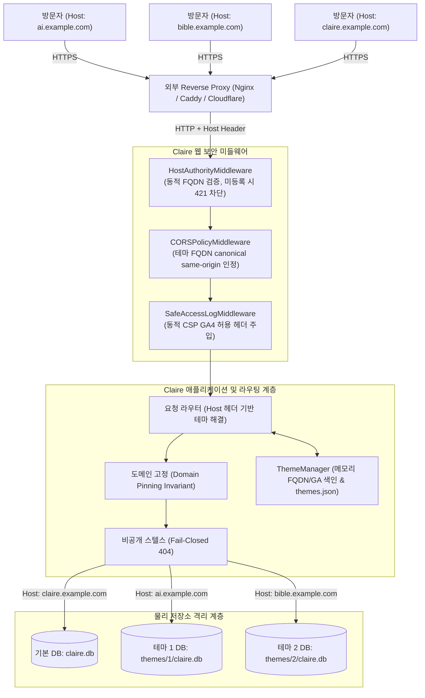

# 테마 지식베이스 FQDN 리버스 프록시 및 전용 GA4 추적 설계 명세서 (`THEME_FQDN_REVERSE_PROXY_DESIGN.md`)

**문서 번호:** DESIGN-THEME-FQDN-20260916-01 **작성 주체:** Claire Bible Architecture Team **상태:** **승인 및 구현 완료 (Approved & Implemented)** **관련 문서:** [`docs/origin/design/MULTI_THEME_ARCHITECTURE_DESIGN.md`](MULTI_THEME_ARCHITECTURE_DESIGN.md), [`docs/origin/implementation/EXTERNAL_ACCESS.md`](../implementation/EXTERNAL_ACCESS.md), [`docs/contracts/API_HTTP_CONTRACT.md`](../../contracts/API_HTTP_CONTRACT.md)

---

## 1. 설계 배경 및 개요

### 1.1 배경 및 목적
Claire Bible은 단일 시스템 인스턴스 위에서 여러 독립된 지식베이스를 물리적으로 격리하여 관리할 수 있는 멀티 테마(`CLAIRE_MULTI_THEME=1`) 아키텍처를 제공합니다. 기존에는 모든 테마가 기본 접속 주소(예: `claire.example.com/?theme=1`)를 통해서만 접근 가능했으나, 지식베이스의 성격에 따라 독립된 브랜딩과 서비스 도메인이 요구됩니다:
- **메인 지식 포털**: `claire.example.com` (기본 테마 및 통합 탐색)
- **AI/시스템 아키텍처 연구소**: `ai.example.com` (테마 #1 전용 도메인)
- **성경 및 신학 연구 지식베이스**: `bible.example.com` (테마 #2 전용 도메인)
- **금융 및 거시경제 지식베이스**: `finance.example.com` (테마 #3 전용 도메인)

본 설계는 **컨테이너나 백엔드 프로세스의 재시작 없이**, WebUI '테마 관리' 패널에서 지식 관리자(Owner)가 테마별 전용 도메인(FQDN)과 전용 Google Analytics 4(GA4) 측정 ID를 직접 설정하고, 외부 리버스 프록시(Nginx, Caddy, Cloudflare Tunnel 등)를 통해 즉시 라우팅 및 격리 서비스를 제공하는 것을 목적으로 합니다.

---

## 2. 핵심 아키텍처 및 원칙



### 2.1 Zero-Downtime 동적 인프라 보안 (Dynamic Security Invariants)
1. **동적 HostAuthority 검증**:
   - `HostAuthorityMiddleware`는 기동 시 설정된 고정 도메인(`CLAIRE_FQDN`, 레거시 `CLAIRE_PUBLIC_URL` 자동 변환)뿐만 아니라, `ThemeManager`에 실시간 등록된 모든 테마 FQDN을 인메모리 색인(`has_registered_fqdn`)을 통해 즉시 유효한 호스트로 수용합니다.
   - 임의의 미등록 호스트로 유입되는 요청은 즉시 **HTTP 421 Misdirected Request**로 차단됩니다.
2. **동적 Content-Security-Policy (CSP) 주입**:
   - `SafeAccessLogMiddleware`는 시스템 전역 GA 설정뿐만 아니라, 등록된 테마 중 하나라도 GA4 측정 ID를 활성화(`has_any_ga_enabled()`)하면 CSP `script-src` 및 `connect-src`에 Google Analytics 도메인(`https://*.googletagmanager.com`, `https://*.google-analytics.com`)을 즉시 반영합니다.
3. **CORS Same-Origin 정책 일치**:
   - `CORSPolicyMiddleware`는 등록된 테마 FQDN Origin을 정규 same-origin으로 취급하여, 해당 전용 도메인 내의 웹 애플리케이션 통신이 불필요한 CORS 거부를 겪지 않도록 보장합니다.

### 2.2 도메인 고정 불변식 (Domain Pinning Invariant)
- **전용 테마 FQDN(`theme_id > 0`) 접속 시**:
  - 요청의 `Host: ai.example.com` 헤더가 감지되면, URL 쿼리 파라미터(`?theme=2`)나 `X-Claire-Theme` 헤더로 다른 테마를 요청하더라도 **해당 호스트에 바인딩된 테마(Theme 1)로 강제 고정**됩니다.
  - 이를 통해 특정 도메인 서비스가 다른 지식베이스의 데이터를 노출하거나 브랜딩을 침범하는 행위를 원천 방지합니다.
- **기본 서비스 도메인(`claire.example.com` 또는 IP) 접속 시**:
  - 쿼리 파라미터 `?theme=...`를 통한 자유로운 테마 간 탐색과 전환이 완전히 허용됩니다.

### 2.3 비공개 테마 은닉 불변식 (Fail-Closed Stealth Invariant)
- 비공개 테마(`is_public: false`)에 전용 FQDN(예: `secret.example.com`)이 할당된 경우:
  - 비인가/익명 방문자가 해당 FQDN으로 루트(`/`) 또는 API에 접근하면, HTTP 403이나 리다이렉트가 아닌 **HTTP 404 Not Found**를 반환합니다.
  - HTML 응답 내에 테마의 이름, 레이블, 설명, GA 태그 등 어떠한 정보도 누출되지 않습니다.
  - 인증된 지식 관리자(Owner) 또는 권한이 부여된 협업자(Collaborator) 세션/토큰이 확인될 때만 지식베이스가 정상 렌더링됩니다.

### 2.4 Cloudflare 공식 공인 IP 대역 제한 (`CLAIRE_CLOUDFLARE_IPS_ONLY`)
- 프로덕션 상단 보호장치로 Cloudflare를 사용하는 환경에서, 외부 공격자가 FQDN을 거치지 않고 오리진 서버의 공인 IP로 직접 접속하는 행위를 방지합니다.
- `CLAIRE_CLOUDFLARE_IPS_ONLY=1` 설정 시:
  - Cloudflare의 공식 IPv4/IPv6 대역 목록에 속하지 않는 모든 공인 IP(`is_global == True`)의 요청을 **HTTP 403 Forbidden**으로 원천 차단합니다.
  - 사설 IP(LAN, 루프백, 도커 브릿지 네트워크 등)는 필터링 대상이 아니므로 안전하게 허용됩니다.

---

## 3. 데이터 모델 및 API 계약

### 3.1 `ThemeInfo` 메타데이터 확장
`themes.json`의 각 테마 항목에 다음 두 필드가 추가되었습니다:
```json
{
  "id": 1,
  "seq": 1,
  "label": "AI 연구",
  "description": "인공지능 및 딥러닝 핵심 아키텍처",
  "icon": "🤖",
  "db_path": "data/themes/1/claire.db",
  "vault_path": "vault/themes/1",
  "is_default": false,
  "is_public": true,
  "is_collaborator_accessible": true,
  "default_focus": "모델 가중치 및 추론 최적화 중심",
  "fqdn": "ai.example.com",
  "ga_measurement_id": "G-AI12345678",
  "created_at": 1773660000.0,
  "updated_at": 1773660000.0
}
```

### 3.2 검증 규칙 (Validation Rules)
1. **FQDN 규격 (`validate_fqdn`)**:
   - RFC 1123 DNS 호스트명 표준 준수 (소문자 영문, 숫자, 하이픈 `-`, 마침표 `.`).
   - 스킴(`http://`), 포트번호(`:8080`), 경로(`/`), 언더스코어(`_`) 포함 불가.
   - 최소 1개 이상의 마침표(`.`)를 포함하는 정규 FQDN 형식 필수.
   - 대소문자 자동 소문자 정규화.
   - 다른 테마와의 FQDN 중복 충돌 차단.
   - 시스템 기본 도메인(`CLAIRE_FQDN` / `CLAIRE_PUBLIC_URL`)과의 충돌 차단.
2. **GA4 측정 ID 규격 (`validate_ga_measurement_id`)**:
   - Google Analytics 4 및 Google Tag Manager 표준 ID 포맷 (`G-[A-Z0-9]+` 또는 `GTM-[A-Z0-9]+`).
   - Universal Analytics(`UA-XXXX-Y`) 등 레거시 포맷 차단.

### 3.3 REST API 엔드포인트
- **`POST /themes`**: 새 테마 생성 시 `fqdn`, `ga_measurement_id` 수기 지정 가능 (지식 관리자 전용).
- **`PATCH /themes`**: 기존 테마의 `fqdn`, `ga_measurement_id` 변경 및 해제(`""` 전송 시 해제).
- **`GET /themes`**: 활성화된 테마 목록 반환 시 `fqdn`, `ga_measurement_id` 포함.

---

## 4. Google Analytics 4 (GA4) 격리 및 세그먼트 추적

1. **테마별 독립 측정 ID**:
   - 테마에 `ga_measurement_id`가 지정되어 있으면, 해당 테마 전용 GA4 속성으로 이벤트가 전송됩니다.
   - 미지정 시 시스템 전역 `CLAIRE_GA_MEASUREMENT_ID`가 적용되거나 추적이 비활성화됩니다.
2. **커스텀 차원 자동 주입**:
   - `render_ga_tag`는 테마 컨텍스트가 존재할 경우 다음과 같은 파라미터를 gtag 설정에 자동 주입합니다:
     ```javascript
     gtag("config", "G-AI12345678", {
       page_location: window.location.origin + window.location.pathname,
       cookie_domain: window.location.hostname,
       cookie_flags: "SameSite=Lax;Secure",
       theme_id: 1,
       theme_label: "AI 연구"
     });
     ```
   - 단일 GA4 속성으로 여러 테마를 통합 관리하더라도 `theme_id`와 `theme_label`로 세그먼트 분리 분석이 가능합니다.

---

## 5. 리버스 프록시 연동 구성 가이드

### 5.1 Nginx 설정 예시
```nginx
# Nginx Virtual Host Configuration
server {
    server_name ai.example.com;
    listen 443 ssl http2;

    ssl_certificate     /etc/letsencrypt/live/ai.example.com/fullchain.pem;
    ssl_certificate_key /etc/letsencrypt/live/ai.example.com/privkey.pem;

    # 보안 및 성능 설정
    ssl_protocols TLSv1.2 TLSv1.3;
    ssl_ciphers HIGH:!aNULL:!MD5;

    location / {
        proxy_pass http://127.0.0.1:8765;
        
        # 필수 프록시 헤더 (Host 헤더 원본 유지가 가장 중요함)
        proxy_set_header Host $host;
        proxy_set_header X-Real-IP $remote_addr;
        proxy_set_header X-Forwarded-For $proxy_add_x_forwarded_for;
        proxy_set_header X-Forwarded-Proto $scheme;

        # SSE / 실시간 스트리밍 버퍼링 해제
        proxy_buffering off;
        proxy_read_timeout 600s;
    }
}
```

### 5.2 Caddy 설정 예시 (Caddyfile)
```caddy
ai.example.com {
    reverse_proxy 127.0.0.1:8765 {
        header_up Host {host}
        header_up X-Real-IP {remote_host}
    }
}
```

### 5.3 Cloudflare Tunnel (cloudflared)
`~/.cloudflared/config.yml`:
```yaml
tunnel: <TUNNEL_ID>
credentials-file: /etc/cloudflared/<TUNNEL_ID>.json

ingress:
  - hostname: ai.example.com
    service: http://127.0.0.1:8765
    originRequest:
      httpHostHeader: ai.example.com
  - hostname: bible.example.com
    service: http://127.0.0.1:8765
    originRequest:
      httpHostHeader: bible.example.com
  - service: http_status:404
```

---

## 6. WebUI '테마 관리' 인터페이스
 
WebUI 우측 메뉴의 '📁 테마 관리'에서 지식 관리자는 다음 기능을 직관적으로 이용할 수 있습니다:
1. **테마 카드 상단 배지 및 단축 링크**:
   - `🌐 ai.example.com`: 전용 도메인 등록 배지
   - `↗ 열기`: 새 창에서 전용 도메인으로 즉시 접속하는 링크
   - `📊 G-AI12345678`: 설정된 GA4 측정 ID 배지
2. **단순화된 FQDN 관리 및 상단 보호장치 연동**:
   - 불필요한 인앱 웹서버 가이드 팝업을 제거하고, FQDN 등록 및 즉시 확인에 집중
   - 프로덕션 환경의 Sophos Firewall Web Server Protection 또는 Cloudflare 등의 상단 보호장치와 FQDN 기반으로 유기적 연동
3. **수정 및 신규 생성 폼**:
   - 레이블, 설명, 아이콘, 공개 여부 외에 **전용 도메인 (FQDN)** 및 **GA4 측정 ID** 입력 필드 제공
   - 프론트엔드 실시간 클라이언트 URL 감지: 사용자가 브라우저 주소창에 `ai.example.com`을 입력하여 진입하면, WebUI는 테마 목록 중 해당 FQDN을 가진 테마를 자동 감지하여 활성 테마(`activeThemeId`)로 즉시 선택하고 테마 선택기에 `🌐 (전용 도메인)` 엠블럼을 표시합니다.
