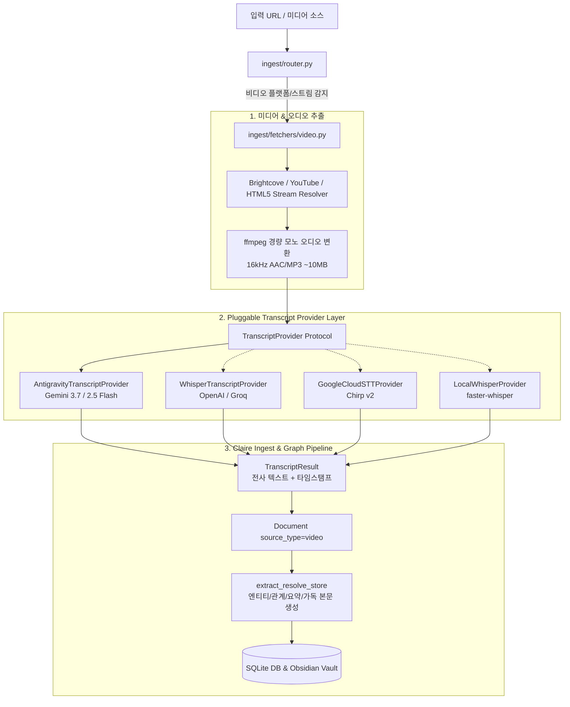

# 비디오 음성 자막(전사) 생성 및 지식 적재 파이프라인 설계 (`VIDEO_AUDIO_TRANSCRIPTION_AND_INGESTION_DESIGN.md`)

> **상태**: 검토 및 설계 완료 (Design Phase)  
> **대상 플랫폼 예시**: VMware Explore Video (`https://www.vmware.com/explore/video/6403821753112`)  
> **적용 모듈**: `claire.ingest.fetchers`, `claire.extract.transcript`, `claire.extract.provider`

---

## 1. 개요 및 배경

기존 Claire 인제스트 시스템은 텍스트 중심 웹페이지(`fetch_web`), PDF 문서(`fetch_pdf`), 그리고 공식 자막 API가 제공되는 YouTube(`fetch_youtube` via `youtube-transcript-api`)를 지원합니다.

그러나 기술 세미나, 컨퍼런스(예: VMware Explore, AWS re:Invent), 엔터프라이즈 미디어 포털 등의 웹 비디오 플랫폼은 다음과 같은 특성을 가집니다:
1. **HTML 본문 부재**: 웹페이지 내에 발표 본문 텍스트가 거의 없고, 세션 제목과 짧은 설명문만 존재합니다.
2. **내장 텍스트 자막 부재**: 플레이어 매니페스트에 썸네일 탐색용 VTT(`thumbnail.webvtt`)만 포함되어 있을 뿐, 실제 음성 전사(Closed Caption) 텍스트가 제공되지 않습니다.
3. **음성 트랙 기반 지식화 필수**: 영상의 오디오 스트림에서 음성을 추출하여 고품질 전사(STT)를 수행한 뒤 지식 그래프로 적재해야 합니다.

본 문서는 **웹 비디오의 오디오 추출 $\rightarrow$ 다중 프로바이더 기반 자막 생성 $\rightarrow$ Claire 지식 베이스 적재 파이프라인**을 설계하고, **Gemini / Antigravity 환경에서의 모델 자원 소모율을 정밀 예측**합니다.

---

## 2. 대상 영상 실측 분석 (`VMware Explore 6403821753112`)

* **URL**: `https://www.vmware.com/explore/video/6403821753112`
* **세션명**: *Introducing VMware AI Factory: The Software-Defined Foundation of VMware Private AI Cloud* (세션 코드: `CLOB1244LV`)
* **플랫폼 아키텍처**: Broadcom / Brightcove Video Cloud 기반
  * Account ID: `6164421911001`
  * Video ID: `6403821753112`
* **영상 재생 시간**: **2,609.152초 (43분 29.15초)**
* **기존 자막 상태**: `text_tracks`에 오직 썸네일 미리보기 트랙만 존재하며, **음성 텍스트 자막이 0건**임을 확인.
* **미디어 스트림**:
  * HLS 매니페스트: `https://manifest.prod.boltdns.net/manifest/v1/hls/...`
  * 서명된 MP4 스트림: `https://fastly-signed-us-east-1-prod.brightcovecdn.com/...`

---

## 3. 전체 아키텍처 설계

시스템은 **(1) 미디어 추출**, **(2) 플러그형 전사(STT) 프로바이더**, **(3) 지식 그래프 인제스트**의 3단계로 구성됩니다.



---

## 4. 컴포넌트별 상세 설계

### 4.1. 전사 프로바이더 추상 인터페이스 (`TranscriptProvider`)

전략 패턴(Strategy Pattern)을 적용하여 초기에는 Antigravity CLI를 사용하고, 이후 설정값(`CLAIRE_STT_PROVIDER`) 하나로 다양한 외부 프로바이더로 교체할 수 있도록 설계합니다.

```python
from __future__ import annotations
from pathlib import Path
from typing import Protocol
from pydantic import BaseModel, Field

class TranscriptSegment(BaseModel):
    start_sec: float
    end_sec: float
    text: str

class TranscriptResult(BaseModel):
    full_text: str
    segments: list[TranscriptSegment] = Field(default_factory=list)
    language: str = "en"
    duration_sec: float = 0.0
    provider: str = ""
    model: str = ""

class TranscriptProvider(Protocol):
    name: str

    def transcribe(
        self,
        audio_path: str | Path,
        *,
        language: str | None = None,
        timestamps: bool = True,
    ) -> TranscriptResult:
        """오디오 파일을 입력받아 전체 텍스트 및 타임스탬프 자막 세그먼트를 반환한다."""
        ...
```

### 4.2. 프로바이더 구현체 계획

1. **`AntigravityTranscriptProvider` (초기 기본 구현)**:
   * `agy` CLI 또는 Google GenAI SDK의 네이티브 오디오 멀티모달 기능을 활용합니다.
   * 프롬프트: 전문 IT 용어(VCF, vSAN, GPU, Kubernetes 등) 보존 지침 및 타임스탬프 포맷 강제.
   * 장점: 별도의 외부 STT 서비스 결제나 API 키 추가 없이 현재 계정 인프라에서 즉시 실행 가능.
2. **`WhisperTranscriptProvider` (확장 - OpenAI / Groq)**:
   * Groq Whisper v3 (분당 초고속 처리, 극저비용) 또는 OpenAI Whisper API 연동.
3. **`GoogleCloudSTTProvider` (확장 - Google Cloud Speech-to-Text v2)**:
   * 대규모 엔터프라이즈 배치 전사 및 실시간 스트리밍 지원.
4. **`LocalWhisperProvider` (확장 - 에어갭/로컬 처리)**:
   * `faster-whisper` 기반 CTranslate2 로컬 GPU/CPU 추론.

### 4.3. 미디어 오디오 스트림 추출 최적화

* 1080p 고화질 비디오(수백 MB ~ 수 GB)를 그대로 다운로드하지 않고, `ffmpeg` 스트림 파이프로 오디오 트랙만 선택 추출합니다:
  ```bash
  ffmpeg -i "<STREAM_URL>" -vn -ac 1 -ar 16000 -b:a 32k -f mp3 output.mp3
  ```
* 43.5분 영상 기준 오디오 파일 크기는 **약 10.4MB** 수준으로 압축되어 네트워크 대역폭 및 I/O 오버헤드를 최소화합니다.

---

## 5. 모델 사용량 및 계정 쿼터 소모율 예측

### 5.1. 대상 영상(43분 29초 / 2,609초) 기준 토큰 환산

| 항목 | 산출 공식 및 근거 | 예상 토큰 수 |
| :--- | :--- | :--- |
| **오디오 입력 (Audio Input)** | Gemini 오디오 인코딩: **초당 약 32 토큰** (분당 ~1,920 토큰)<br>$2,609.15\text{초} \times 32\text{ tokens/sec}$ | **약 83,500 토큰** |
| **전사 시스템 프롬프트** | 자막 구조화 및 기술 용어 보존 지시문 | **약 500 ~ 1,000 토큰** |
| **자막 출력 (Transcript Output)** | 43.5분 발화량 (분당 약 140단어 $\approx$ 6,100단어)<br>타임스탬프 포함 텍스트 생성 | **약 8,000 ~ 12,000 토큰** |
| **지식 그래프 적재 (KG Ingest)** | 요약 + 엔티티/관계 추출 + 가독 본문(detail) 렌더링 | **입력 ~10,000 / 출력 ~4,000 토큰** |
| **총계 (1회 적재 전체)** | **음성 전사 + 지식 그래프 변환** | **입력 약 94,000 / 출력 약 16,000 토큰** |

---

### 5.2. 계정 쿼터 소모율 분석 (Gemini 3.7 / 2.5 Flash 기준)

1. **컨텍스트 윈도우 점유율 (Context Window)**:
   * Gemini Flash 단일 호출 컨텍스트 용량: **1,000,000 토큰**
   * 43.5분 영상 입력: 약 84,000 토큰 $\rightarrow$ **용량의 약 8.4%만 점유**.
   * 영상을 10분 단위로 잘라서 처리(chunking)할 필요 없이 **단일 API 호출로 문맥 손실 없이 완벽 처리 가능**.
2. **분당 토큰 한도 소모율 (TPM - Tokens Per Minute)**:
   * Gemini Flash 표준 TPM 한도: **1,000,000 ~ 4,000,000 TPM**
   * 1회 작업 소모량: 약 95,000 토큰 $\rightarrow$ **1분 쿼터의 약 2.4% ~ 9.5% 소모**.
   * 단건 적재 시 Rate Limit(429) 위험이 없으며 안전 마진이 매우 높음.
3. **분당/일일 요청 수 (RPM / RPD)**:
   * 비디오 1건 적재 시 총 3회 LLM 호출(전사 1회 + KG 추출 1회 + 가독 본문 1회).
   * 계정 RPM 한도(15 ~ 1,000 RPM) 대비 **1% 미만** 소모.

---

### 5.3. 비용 예측 (종량제 기준)

| 구분 | Gemini Flash 단가 기준 | 43분 29초 영상 1편 기준 |
| :--- | :--- | :--- |
| **오디오 입력 (83.5k tokens)** | \$0.00002 / 초 (또는 \$0.075 / 1M tokens) | 약 **\$0.0063** (약 8.5원) |
| **자막 텍스트 출력 (10k tokens)** | \$0.30 / 1M tokens | 약 **\$0.0030** (약 4.0원) |
| **지식 그래프 추출 및 렌더링** | 입력 10k / 출력 4k tokens | 약 **\$0.0020** (약 2.7원) |
| **합계 (비디오 1편 전체)** | **자막 생성 + 지식 베이스 완결 적재** | **약 \$0.011 ~ \$0.015 (한화 약 15원 ~ 20원)** |

> *참고: Antigravity 구독/무료 환경에서 실행 시 별도의 API 비용 과금 없이 기본 세션 쿼터 내에서 \$0으로 처리됩니다.*

---

## 6. 구현 단계 및 권장 사항

1. **1단계: 의존성 및 미디어 리졸버 구축**
   * 시스템 환경 내 `ffmpeg` 도구 확보 및 Brightcove/HTML5 스트림 URL 파서 작성.
2. **2단계: `TranscriptProvider` 추상화 및 Antigravity 어댑터 구현**
   * `claire.extract.transcript` 패키지 신설 및 `AntigravityTranscriptProvider` 구현.
   * 타임스탬프가 포함된 `TranscriptResult` 스키마 고정.
3. **3단계: 라우터 및 인제스트 파이프라인 통합**
   * `ingest/fetchers/video.py`를 신설하여 `fetch_video` 구현.
   * 자막 생성 결과를 `Document(source_type="video", raw_text=...)`로 변환하여 기존 그래프 적재 파이프라인에 연결.
4. **4단계: 타임스탬프 앵커링 지원**
   * 가독 본문(AsciiDoc/Markdown) 및 지식 그래프 관찰(Observations)에 영상 타임스탬프 링크(예: `[12:34](url#t=754)`)를 보존하여 원본 재생 위치로 바로 이동할 수 있도록 UI 지원.
