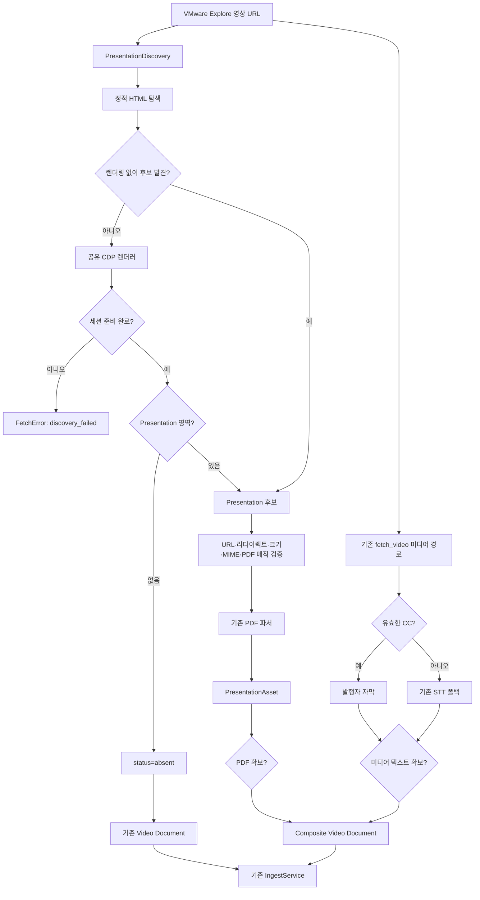

# VMware Explore 비디오·Presentation PDF 동시 적재 설계

작성일: 2026-09-04 · 상태: **구현·결정론적 테스트·실영상 획득 검증 완료** · 기준: [GOALS.md](../../../GOALS.md) 품질 원칙 · 관련: [VIDEO_AUDIO_TRANSCRIPTION_AND_INGESTION_DESIGN.md](VIDEO_AUDIO_TRANSCRIPTION_AND_INGESTION_DESIGN.md), [PDF_INGESTION_AND_ADAPTIVE_EFFORT_DESIGN.md](PDF_INGESTION_AND_ADAPTIVE_EFFORT_DESIGN.md)

---

## 1. 목적과 결정

VMware Explore 영상 상세 페이지가 `Presentation PDF`를 제공하면 다음 두 구성요소를 **하나의 세션 문서**로 함께 적재한다.

1. 발행자 CC 또는 CC 부재 시 생성한 STT 전사
2. Presentation PDF의 검증된 추출 텍스트와 원본 PDF 아티팩트

핵심 결정은 다음과 같다.

| 항목 | 결정 |
|---|---|
| 문서 정체성 | 영상 상세 URL을 `url`·`canonical_url`로 유지한 `source_type=video` 문서 1개 |
| PDF 표현 | 독립 문서를 기본 생성하지 않고 영상 문서의 `presentation_pdf` 구성요소와 `extra_sources`로 기록 |
| 결합 시점 | LLM 호출과 DB 쓰기 전에 CC/STT와 PDF 획득·검증을 완료 |
| 기존 계약 | `router.fetch() -> Document -> IngestService`와 기존 CLI·텔레그램 진입점 유지 |
| 저장 | 결합 텍스트는 기존 `raw_text`·gzip 아티팩트에, PDF 바이너리는 문서별 버전 아티팩트에 보존 |
| 실패 정책 | 광고된 PDF를 확보하지 못하면 STT/CC만 성공한 것으로 숨기지 않고 복구 가능한 오류로 종료 |
| DB 스키마 | 신규 SQL 테이블 없이 `documents.meta`, `extra_sources`, 문서별 파일 아티팩트를 확장 |

이 선택은 원문과 출처를 보존하고, 모든 입력 경로가 같은 적재 파이프라인을 공유한다는 프로젝트 원칙을 유지한다.[^project-boundaries]

---

## 2. VMware Explore 실측

### 2.1. Presentation PDF 제공 사례

`APPB1222LV` 영상 상세 페이지는 렌더링된 DOM에 `Presentation` 탭을 만들며, 이 탭을 선택한 뒤에만 `.presentation-details` 영역과 `Presentation PDF` 제목·`Download` 링크가 나타난다. 링크는 `https://static.rainfocus.com/.../presrevpdf/...pdf` 형태다.[^vmware-presentation-page]

초기 정적 HTML과 기본 `Details` 탭 DOM에는 해당 PDF URL이 없었다. 따라서 Brightcove 메타데이터 또는 정적 HTML만 조회하는 현재 비디오 경로로는 첨부 자료를 발견할 수 없으며, 렌더링 완료 후 `Presentation` 탭을 선택하는 DOM 상호작용이 필요하다.[^vmware-rendered-observation]

실측 PDF 응답과 현재 파서 결과는 다음과 같다.[^presentation-pdf-probe]

| 항목 | 결과 |
|---|---|
| 응답 | HTTP 200, `Content-Type: application/pdf` |
| 크기 | 2,626,638 bytes |
| 전달 | Amazon S3 원본, CloudFront 경유 |
| `pypdf` 추출 | 9,247자, 절단 없음 |
| PDF 내부 제목 | 발표자 이름으로 추출되어 세션 제목과 불일치 |

PDF 내부 제목을 영상 제목으로 덮어쓰지는 않는다. 구성요소 표시 제목은 `세션 제목 — Presentation PDF`로 정규화하고, PDF에서 추출한 제목은 `extracted_title`로 별도 보존한다.

### 2.2. Presentation PDF 부재 사례

`PLE1837LV` 영상은 렌더링 완료 후 세션 코드·제목·상세 정보가 표시되지만 `Presentation` 탭, `.presentation-details`, PDF 링크가 모두 없다.[^vmware-no-presentation]

따라서 다음 상태를 구분해야 한다.

- `absent`: 세션 렌더링 완료를 확인했고 Presentation 영역이 없음
- `discovery_failed`: 렌더링 완료 자체를 확인하지 못해 유무를 판정할 수 없음

`discovery_failed`를 `absent`로 바꾸어 적재하면 제공된 PDF를 누락할 수 있으므로 두 상태를 합치지 않는다.

---

## 3. 기존 설계 경계

현재 `fetch_video()`는 VMware URL을 Brightcove 플레이어 URL로 바꾸고 `yt-dlp`에서 메타데이터·CC·미디어를 수집한다. 원래 VMware 페이지의 렌더링된 DOM은 읽지 않는다. 반면 PDF URL은 기존 `fetch_web()`과 `extract_pdf_bytes()`를 통해 `source_type=pdf` 문서로 추출할 수 있다.[^current-fetchers]

기존 `merge_source_into_document()`는 같은 주제의 추가 출처를 `raw_text`와 `meta.extra_sources`에 결합한다. 다만 부모 문서를 먼저 저장한 뒤 실행되는 1홉·LLM 판정 경로이므로, 사이트가 명시적으로 제공한 Presentation을 결정론적·원자적으로 획득하는 경로로 직접 사용하지 않는다.[^current-merge]

이번 설계의 경계는 다음과 같다.

- VMware Explore의 숫자형 영상 상세 URL만 자동 Presentation 탐색 대상으로 한다.
- 영상 목록 전체를 순회하거나 Presentation PDF를 일괄 수집하지 않는다.
- 영상, PDF, 자막마다 독립 LLM 추출을 반복하지 않고 결합 문서에 대해 한 번 추출한다.
- 기존에 사용자가 독립 적재한 PDF 문서를 삭제하거나 강제 병합하지 않는다.
- `COMMANDS.md`, `ENVIRONMENT_VARIABLES.md`, 운영 UI는 결정론적 구현 검증이 끝난 뒤에만 실제 기능 상태로 갱신한다.

---

## 4. 목표 아키텍처



### 4.1. 신규 모듈 경계

`src/claire/ingest/fetchers/presentation_vmware_explore.py`를 추가하여 다음 책임을 비디오·PDF 구현에서 분리한다. 파일명은 탐색 DOM과 허용 호스트 정책이 VMware Explore/RainFocus에 특화되어 있음을 명시한다.

- `discover_presentations(video_url) -> PresentationDiscovery`
- `select_presentation_candidates(rendered_html) -> list[PresentationCandidate]`
- `download_presentation(candidate) -> SourceAttachment`
- `extract_presentation(attachment, settings) -> PresentationExtract`
- `compose_video_presentations(video_doc, presentations) -> Document`

페이지 렌더링 자체는 `web.py`의 CDP 기능을 공유 헬퍼로 분리한다. Presentation 모듈이 `web._fetch_cdp()` 같은 비공개 함수를 직접 호출하거나 웹 본문 fallback 체인 전체를 중복 구현하지 않는다. 공유 헬퍼의 실행 엔진은 기존 `stealth` extra에 포함된 Scrapling DynamicFetcher와 시스템 Chromium으로 통합한다. 이로써 정적 스텔스 요청과 동적 DOM 렌더링을 하나의 의존성 경계에 두고, 현재 배포판이 import되지 않는 `nodriver` 의존성은 제거한다.[^browser-engine-boundary]

### 4.2. 전송 전용 아티팩트 모델

`Document`에 기본 빈 목록인 `attachments`를 추가하되 DB 직렬화에서는 제외한다. 기존 생성자와 DB 스키마는 그대로 유지된다.

```python
class SourceAttachment(BaseModel):
    kind: Literal["presentation_pdf"]
    source_url: str
    canonical_url: str
    filename: str
    media_type: str
    byte_length: int
    content_sha256: str
    content: bytes = Field(exclude=True, repr=False)
    required: bool = True

class Document(BaseModel):
    # 기존 필드 유지
    attachments: list[SourceAttachment] = Field(default_factory=list, exclude=True)
```

`attachments`는 fetcher에서 저장 파이프라인까지 검증된 바이너리를 전달하는 일시적 봉투다. `documents.meta`에 바이너리나 임시 경로를 넣지 않는다.

### 4.3. 기존 PDF 코드와 정리 원칙

이 모듈은 PDF 파서를 새로 구현하지 않는다. 기존 `pdf.py`의 `extract_pdf_bytes()`와 `slice_pdf_text()`를 그대로 호출하고, 그 앞뒤의 VMware Explore DOM 탐색, RainFocus 제한 다운로드, 영상 문서 결합만 담당한다. 기존 `fetch_web()`는 입력 PDF를 독립 `source_type=pdf` 문서로 만드는 일반 웹 경로이며 원본 바이트를 반환하지 않으므로, 영상 canonical identity에 자막과 필수 첨부를 원자적으로 결합하는 책임을 대신할 수 없다.[^pdf-boundary-review]

공통화는 정책 경계를 약화시키지 않는 범위에서 다음 순서로 진행한다.

1. 브라우저 User-Agent는 `http_policy.py`의 공개 상수로 공유한다. 이 정리는 현재 구현에 반영했다.
2. PDF MIME 판정의 정규화 함수는 일반 웹 PDF 경로와 필수 첨부 경로가 동일한 허용 집합을 요구할 때 공통 모듈로 추출한다.
3. 두 번째 첨부 제공 사이트가 추가되면 HTTPS·허용 호스트·DNS·리다이렉트·스트리밍 크기를 검증하는 안전한 바이너리 downloader를 공통 계층으로 승격한다.
4. 그 전에는 자동 리다이렉트와 전체 응답 버퍼링을 허용하는 일반 웹 fetch와, 리다이렉트마다 목적지를 재검증하고 선저장을 요구하는 필수 첨부 fetch를 억지로 합치지 않는다.

즉, 현재 남은 중복은 PDF 추출기가 아니라 HTTP 다운로드 골격과 MIME 목록 일부이며, 후속 공통화는 실제 두 번째 소비자가 생긴 뒤 수행한다.[^pdf-boundary-review]

---

## 5. 상세 처리 계약

### 5.1. 발견

1. 입력 URL의 호스트가 `www.vmware.com`이고 경로가 `/explore/video/<숫자 ID>`인지 확인한다.
2. 정적 HTML에서 후보를 찾되, 후보가 없다는 사실만으로 `absent`를 확정하지 않는다.
3. CDP 렌더링 후 텍스트가 정확히 `Presentation`인 `role=tab` 요소가 있으면 선택한다.
4. URL의 숫자 ID와 렌더링된 세션 코드·제목 영역을 확인해 `ready`를 판정한다.
5. `.presentation-details` 안에서 제목이 `Presentation PDF`인 영역의 HTTPS 링크만 수집한다.
6. URL과 콘텐츠 해시 기준으로 중복을 제거하고 최대 3개까지만 처리한다.

단순히 페이지에 나타난 모든 `.pdf` 링크를 수집하지 않는다. 관련 영상, 내비게이션, 추적 스크립트가 추가한 링크를 Presentation으로 오인할 수 있기 때문이다.

### 5.2. URL·다운로드 검증

- HTTPS만 허용하고 사용자 정보가 포함된 URL을 거부한다.
- 기본 허용 호스트는 `static.rainfocus.com`이며, 호스트 확장은 코드 리뷰와 fixture 추가를 요구한다.
- 각 리다이렉트 단계에서 스킴·호스트·해석된 IP를 다시 검증하고 loopback, private, link-local, reserved 주소를 거부한다.
- `Content-Length` 사전 검사와 스트리밍 누적 검사를 함께 적용한다.
- `CLAIRE_PRESENTATION_PDF_MAX_BYTES` 기본값은 64 MiB로 한다.
- 응답 MIME이 `application/pdf` 계열이고 본문이 `%PDF-`로 시작해야 한다.
- 서명·인증성 쿼리 값은 로그와 메타데이터에 저장하지 않는다. 공개 출처 URL에는 추적·민감 쿼리를 제거한다.

### 5.3. PDF 추출

- `CLAIRE_PDF_PARSER`의 `pypdf`/`docling` 선택과 파서 폴백 메타데이터를 그대로 재사용한다.
- 발표자료는 학술 논문이 아니므로 `pdf_exclude_appendix`와 `pdf_exclude_references`를 적용하지 않는다.
- 일반 적재는 `CLAIRE_PDF_MAX_EXTRACT_CHARS`를 상한으로 사용하고, `--full`은 기존 full-content 안전 상한을 따른다.
- 암호화, 빈 본문, 파서 전체 실패는 `extract_failed`로 처리한다.
- `pypdf`에서 얻은 제목·작성자·페이지 수는 보조 메타데이터로 보존하지만 영상 세션 제목과 발표자 정보를 우선 표시한다.

### 5.4. 결합 본문

결합 순서는 미디어 텍스트를 먼저, 발표자료를 다음에 둔다. 출처 경계를 기계적으로 재식별할 수 있는 고정 마커를 사용한다.

```text
[영상 자막 — manual_caption / en-US]
...

---
[발표자료 PDF — APPB1222LV]
출처: https://static.rainfocus.com/...pdf
...
```

평면 문자열만으로 예산을 자르면 뒤쪽 PDF가 통째로 누락될 수 있다. `doc.meta.content_components`에 각 구성요소의 시작·끝, 원문 길이, 해시를 기록하고 `doc_to_prompt()`에서 구성요소별 예산을 배분한다.

- 기본 총량은 기존 `effective_merged_extract_char_budget`를 재사용한다.
- 각 구성요소에 총량의 3분의 1까지 우선 배정하고, 남은 예산은 짧은 구성요소를 온전히 채운 뒤 긴 구성요소에 재배정한다.
- 표·코드 블록 경계 보호와 `--full` 안전 상한은 기존 슬라이싱 정책을 유지한다.
- DB `raw_text`와 원문 아티팩트에는 프롬프트 슬라이싱 결과가 아니라 구성요소별 수집 상한까지의 결합 텍스트를 저장한다.

### 5.5. 메타데이터

```json
{
  "has_transcript": true,
  "transcript_source": "manual_caption",
  "content_components": [
    {"kind": "transcript", "language": "en-US", "content_sha256": "..."},
    {"kind": "presentation_pdf", "content_sha256": "...", "text_sha256": "..."}
  ],
  "presentation_pdf": {
    "status": "available",
    "public_url": "https://static.rainfocus.com/...pdf",
    "source_host": "static.rainfocus.com",
    "session_title": "10 Minutes from Code to Cluster...",
    "extracted_title": "John Andrechak, Sr. Platform Architect...",
    "media_type": "application/pdf",
    "byte_length": 2626638,
    "content_sha256": "...",
    "text_sha256": "...",
    "raw_chars": 9247,
    "parser_requested": "pypdf",
    "parser_used": "pypdf",
    "parser_fallback": false,
    "artifact_path": "raw/attachments/<doc_id>/presentation/<sha256>.pdf"
  },
  "extra_sources": [
    {"url": "https://static.rainfocus.com/...pdf", "source_type": "pdf", "title": "... — Presentation PDF"}
  ]
}
```

`status` 허용값은 `absent`, `available`, `discovery_failed`, `download_failed`, `invalid`, `extract_failed`로 고정한다. 오류에는 예외 클래스와 단계만 저장하고 응답 본문, 서명 URL, 토큰은 저장하지 않는다.

### 5.6. 바이너리와 버전 보존

- 저장 경로: `data/raw/attachments/<document_id>/presentation/<content_sha256>.pdf`
- 임시 파일에 쓴 뒤 `fsync`와 원자적 rename으로 확정한다.
- 필수 아티팩트 저장이 실패하면 문서 insert/update 전에 중단한다.
- 재수집한 PDF 해시가 같으면 기존 아티팩트를 재사용한다.
- 해시가 달라지면 새 버전을 추가하고 현재 메타데이터를 갱신하되 이전 파일을 삭제하지 않는다.
- 이전 URL·해시·확인 시각은 `presentation_history`에 추가한다.
- `purge`는 해당 문서의 attachments 디렉터리까지 명시적으로 포함하되 기존 append-only 기본 정책은 바꾸지 않는다.

---

## 6. 실패와 원자성

| 조건 | 결과 |
|---|---|
| 렌더링 완료, Presentation 영역 없음 | 기존 비디오 적재 계속, `presentation_pdf.status=absent` |
| 페이지 렌더링·준비 상태 확인 실패 | `FetchError(discovery_failed)`, 신규/갱신 쓰기 없음 |
| PDF 광고됨, 다운로드·검증·추출 실패 | 단계별 `FetchError`, CC/STT만 적재하지 않음 |
| PDF 성공, CC 성공 | CC + PDF 결합 적재, STT 미호출 |
| PDF 성공, CC 없음, STT 성공 | STT + PDF 결합 적재 |
| PDF 성공, 미디어 텍스트 없음 | `FetchError(bundle_incomplete_media)`, PDF만 적재하지 않음 |
| `docling` 실패, `pypdf` 성공 | 결합 적재, 기존 파서 폴백 메타데이터 표시 |
| PDF 바이너리 저장 실패 | DB insert/update 전에 중단 |
| LLM 추출 실패 | 기존 inbox/error 및 복구 계약 적용; 원문 획득 실패로 위장하지 않음 |

여기서 원자성은 **한 번의 fetch 결과에 CC/STT와 광고된 PDF가 함께 존재한다**는 소스 번들 경계를 뜻한다. 기존 파이프라인의 LLM 추출·그래프 저장 트랜잭션 경계를 이번 기능에서 별도로 재설계하지 않는다.

---

## 7. 중복·갱신 정책

1. 영상 문서의 canonical URL과 ID를 그대로 유지한다.
2. Presentation URL은 `extra_sources`에도 기록하여 기존 GraphView 출처 표시와 병합 문서 프롬프트 예산을 재사용한다.
3. 동일 URL·동일 PDF 해시는 재수집해도 본문 섹션을 append하지 않고 기존 구성요소를 교체 또는 유지한다.
4. URL이 달라도 PDF 해시가 같으면 같은 Presentation 버전으로 취급한다.
5. 직접 PDF URL이 나중에 별도 입력되면 `find_document_by_extra_source()`로 영상 문서에 이미 포함되었는지 확인하고 중복으로 보고한다.
6. PDF가 먼저 독립 적재되어 있던 경우 기존 문서를 삭제하거나 흡수하지 않는다. 영상 문서는 그 문서 ID를 `presentation_document_id`로 참조하고 저장된 원문을 재사용할 수 있다.
7. PDF 해시가 변경되면 현재 결합 섹션을 새 버전으로 갱신하고 이전 버전은 history와 파일 아티팩트에 보존한다.

---

## 8. 관측성과 사용자 표시

- CLI·텔레그램 완료 결과: `🔤⚡📄 CC×PDF 포함 (9,247자, pypdf)` 또는 `🎙️⚡📄 STT×PDF 포함` (클립 아이콘 대체 및 결합 출처 명시)
- GraphView 문서 메타: `🔤⚡📄 CC×PDF` / `🎙️⚡📄 STT×PDF` 간결한 배지 표시 (문자 수·추출 파서·아티팩트 상태는 커서 호버 툴팁으로 안내)
- 경고: `discovery_failed`, `download_failed`, `invalid`, `extract_failed`를 서로 다른 코드로 표시
- 진행 단계: `영상 페이지 자료 탐색` → `Presentation PDF 검증·추출` → `CC/STT 획득` → `결합 적재`
- 기존 `video-reprocess`가 같은 경로를 사용하며 Presentation 전용 별도 명령은 만들지 않는다.

---

## 9. 구현 순서

아래 단계는 모두 기존 공개 진입점과 DB 스키마를 유지한 채 구현되었으며, 사이트별 조정 계층은 기존 `extract_pdf_bytes()`와 `slice_pdf_text()`를 재사용한다.[^implementation-evidence]

1. [완료] 렌더링된 HTML을 반환하는 공유 CDP 헬퍼와 Presentation DOM fixture를 분리한다.
2. [완료] `presentation_vmware_explore.py`의 발견·URL 검증·다운로드·추출을 구현한다.
3. [완료] `Document.attachments`와 `raw.save_attachment()`를 추가한다.
4. [완료] `fetch_video()`가 미디어 텍스트와 Presentation을 결합하도록 확장한다.
5. [완료] `pipeline.ingest()`의 필수 아티팩트 선저장, 중복·갱신·purge 경로를 연결한다.
6. [완료] `doc_to_prompt()`에 구성요소 공정 배분 슬라이싱을 추가한다.
7. [완료] CLI·텔레그램·GraphView 표시와 구현 문서를 갱신한다.

각 단계는 기존 public signature와 기본 영상·PDF 단독 적재 테스트를 유지한 상태로 진행한다.

---

## 10. 검증 계획과 완료 조건

### 10.1. 결정론적 테스트

- 정적 HTML에 PDF가 없고 렌더링 DOM에만 있는 사례
- 렌더링 완료 후 Presentation 영역이 없는 사례
- Presentation 영역 밖의 PDF 링크 오탐 방지
- HTTP, 사용자 정보 URL, 비허용 호스트, private IP 리다이렉트 차단
- Content-Length 누락 상태의 스트리밍 크기 초과 차단
- MIME 위장과 `%PDF-` 매직 불일치 차단
- `pypdf` 성공과 `docling -> pypdf` 폴백
- CC + PDF에서 STT·오디오 미호출
- STT + PDF 결합
- 광고된 PDF 실패 시 `FetchError`와 DB 무변경
- 같은 PDF 재수집의 본문·아티팩트 멱등성
- PDF 버전 변경 시 history·이전 아티팩트 보존
- 직접 PDF 중복 입력의 `extra_sources` 탐지
- 기본 영상·PDF 단독 적재 회귀

### 10.2. `APPB1222LV` 실영상 완료 조건

- `transcript_source=manual_caption`, `caption_language=en-US`
- `presentation_pdf.status=available`
- 응답 MIME·매직·크기·SHA-256 기록
- `pypdf` 추출 텍스트가 결합 `raw_text`의 Presentation 구획에 존재
- 원본 PDF가 문서별 아티팩트에 존재
- STT와 오디오 다운로드가 호출되지 않음
- LLM 입력에서 자막과 PDF 구획이 모두 최소 예산을 확보
- 전체 테스트와 네트워크 실영상 검증 통과

### 10.3. 실영상 검증 결과

`APPB1222LV` URL을 운영 선택 의존성(`stealth`, `audio`)과 시스템 Chrome으로 획득했다. STT를 명시적으로 비활성화한 상태에서도 발행자 CC와 Presentation PDF가 하나의 `video` 문서로 구성되었다.[^live-bundle-probe]

| 항목 | 결과 |
|---|---|
| 자막 | `manual_caption`, `available`, `en-US` |
| Presentation | `available`, 1개, 저장 전 원본 첨부 봉투 1개 |
| PDF | 2,626,638 bytes, `pypdf`, 9,247자, 절단 없음 |
| 결합 본문 | 55,172자, `[영상 자막]`·`[발표자료 PDF]` 구획 모두 존재 |

이 검증은 fetcher 경계까지 실행했으며 DB 쓰기와 LLM 호출은 수행하지 않았다. 저장 원자성·중복·갱신 경로는 결정론적 테스트로 검증했다.[^implementation-evidence]

---

## 11. 참고문헌

[^project-boundaries]: Claire Bible 프로젝트 근거: [GOALS.md](../../../GOALS.md), [PLAN.md](../../../PLAN.md) (2026-09-04 확인).
[^vmware-presentation-page]: VMware Explore, [APPB1222LV — 10 Minutes from Code to Cluster](https://www.vmware.com/explore/video/6403820644112), 렌더링된 `Presentation PDF` 영역 및 Download 링크 확인, 2026-09-04.
[^vmware-rendered-observation]: 동일 페이지의 정적 HTTP 응답, 기본 `Details` 탭, `Presentation` 탭 선택 후 브라우저 DOM 비교. 정적 응답과 기본 탭에는 PDF URL이 없고, `Presentation` 탭 선택 후 `.presentation-details`에 PDF 링크가 생성됨, 2026-09-04.
[^presentation-pdf-probe]: VMware Explore가 연결한 [APPB1222LV Presentation PDF](https://static.rainfocus.com/vmware/explore2026lv/sess/1776178807172001ImQ1/presrevpdf/APPB1222LV_1788483694561001qjWk.pdf); Claire `discover_presentations()` → `download_presentation()` → `extract_presentation()` 실측, 2026-09-04.
[^vmware-no-presentation]: VMware Explore, [PLE1837LV — Shaping the Future of Private AI Cloud and Agentic Innovation](https://www.vmware.com/explore/video/6403823199112), 렌더링 완료 후 Presentation 영역·PDF 링크 부재 확인, 2026-09-04.
[^current-fetchers]: Claire Bible 구현 근거: [`src/claire/ingest/fetchers/video.py`](../../../src/claire/ingest/fetchers/video.py), [`src/claire/ingest/fetchers/web.py`](../../../src/claire/ingest/fetchers/web.py), [`src/claire/ingest/fetchers/pdf.py`](../../../src/claire/ingest/fetchers/pdf.py), [`src/claire/ingest/router.py`](../../../src/claire/ingest/router.py) (2026-09-04 확인).
[^current-merge]: Claire Bible 구현 근거: [`src/claire/ingest/pipeline.py`](../../../src/claire/ingest/pipeline.py), [`src/claire/store/db.py`](../../../src/claire/store/db.py), [`src/claire/extract/prompts.py`](../../../src/claire/extract/prompts.py) (2026-09-04 확인).
[^implementation-evidence]: Claire Bible 구현 근거: [`src/claire/ingest/fetchers/presentation_vmware_explore.py`](../../../src/claire/ingest/fetchers/presentation_vmware_explore.py), [`src/claire/ingest/fetchers/video.py`](../../../src/claire/ingest/fetchers/video.py), [`src/claire/ontology/base.py`](../../../src/claire/ontology/base.py), [`src/claire/store/raw.py`](../../../src/claire/store/raw.py), [`src/claire/ingest/pipeline.py`](../../../src/claire/ingest/pipeline.py), [`src/claire/extract/prompts.py`](../../../src/claire/extract/prompts.py), [`src/claire/graphview.py`](../../../src/claire/graphview.py), [`tests/test_video_presentation.py`](../../../tests/test_video_presentation.py) (2026-09-04 확인).
[^pdf-boundary-review]: Claire Bible 구현 경계 검토 근거: [`src/claire/ingest/fetchers/pdf.py`](../../../src/claire/ingest/fetchers/pdf.py), [`src/claire/ingest/fetchers/web.py`](../../../src/claire/ingest/fetchers/web.py), [`src/claire/ingest/fetchers/http_policy.py`](../../../src/claire/ingest/fetchers/http_policy.py), [`src/claire/ingest/fetchers/presentation_vmware_explore.py`](../../../src/claire/ingest/fetchers/presentation_vmware_explore.py), [`src/claire/store/raw.py`](../../../src/claire/store/raw.py) (2026-09-04 확인).
[^browser-engine-boundary]: Claire Bible 구현 근거: [`pyproject.toml`](../../../pyproject.toml), [`src/claire/ingest/fetchers/web.py`](../../../src/claire/ingest/fetchers/web.py), [`Dockerfile`](../../../Dockerfile), [`tests/test_video_presentation.py`](../../../tests/test_video_presentation.py) (2026-09-04 확인). Scrapling, [Fetching dynamic websites](https://scrapling.readthedocs.io/en/latest/fetching/dynamic.html) (`page_action`, `executable_path` 계약, 2026-09-04 확인). 의존성 장애 근거: ultrafunkamsterdam/nodriver, [No valid UTF-8 encoding for file network.py #35](https://github.com/ultrafunkamsterdam/nodriver/issues/35), 2026-03-31 열림, 2026-09-04 확인.
[^live-bundle-probe]: VMware Explore, [APPB1222LV — 10 Minutes from Code to Cluster](https://www.vmware.com/explore/video/6403820644112); Claire `fetch_video(url, settings=Settings(enable_video_transcription=False))` 실행 결과, 2026-09-04. 외부 LLM·STT 호출 없음.
