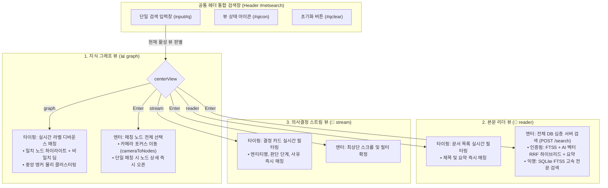

# 뷰 종속형 통합 검색(View-Contextual Unified Search) 및 지능형 자동 검색 엔진 아키텍처 설계

작성일: 2026-09-28 · 상태: **Implemented** · 기준: [GOALS.md](../../upstream/GOALS.md) 트랙2(추출·연결 품질) / UI·UX 고도화 · 관련 문서: [search.md](../../upstream/search.md), [API_HTTP_CONTRACT.md](../../contracts/API_HTTP_CONTRACT.md), [GRAPHVIEW_MODULARIZATION_AND_STATIC_ASSET_DESIGN.md](GRAPHVIEW_MODULARIZATION_AND_STATIC_ASSET_DESIGN.md)

---

## 1. 개요 및 배경

### 1.1 기존 검색 UI의 한계와 문제점
기존 Claire Bible의 검색 인터페이스는 사용자 경험 측면에서 다음과 같은 혼란과 인지적 부하를 유발했습니다:

1. **검색창 분절 및 위치 혼선**:
   - 좌측 사이드바 문서 목록 검색창과 중앙 작업 영역의 그래프 노드 검색창이 각각 분리되어 존재하여, 사용자가 지식을 검색할 때 어느 입력창을 사용해야 하는지 직관적으로 파악하기 어려웠습니다.
2. **기술적 옵션의 사용자 전가 (수동 체크박스 노출)**:
   - 톱니바퀴 버튼(`advsearchbtn`)과 드롭다운 패널(`advsearchpane`)을 통해 `Full-Text Search (FTS5)`와 `Semantic Search (의미 검색)` 체크박스가 노출되어 있었습니다.
   - 일반 사용자는 BM25 키워드 매칭과 벡터 임베딩 하이브리드의 차이를 알 필요가 없으며, 시스템이 자동으로 최적의 검색을 수행해야 함에도 수동 조작을 강요하는 구조였습니다.
3. **중앙 뷰와의 맥락 단절**:
   - 상단 헤더 탭에서 **그래프(📊)**, **본문(📖)**, **의사결정 스트림(📜)**으로 화면을 전환해도 검색창은 고정되어 있어 각 화면의 작업 대상과 유기적으로 연동되지 못했습니다.

### 1.2 재설계 목표
- **단일 통합 입력창(Single Unified Search)**: 공통 헤더 바 최좌측에 단 하나의 직관적인 검색창(`input#q`)을 배치하여 모든 지식 탐색의 진입점을 일원화합니다.
- **뷰 종속 지능형 분기(View-Contextual Behavior)**: 현재 활성화된 중앙 작업 뷰(그래프 / 본문 / 의사결정 스트림)에 맞추어 타이핑 시의 필터링 대상과 Enter 입력 시의 심층 액션이 자동으로 전환됩니다.
- **완전 무설정 자동 검색(Zero-Config Intelligent Retrieval)**: 수동 체크박스를 완전히 제거하고, 사용자의 인증 권한(`AUTH_SCOPE`)과 환경에 맞추어 백엔드가 FTS5 전문 검색, AI 벡터 임베딩 하이브리드 검색, LLM 지식 종합 요약을 완전 자동으로 결정합니다.

---

## 2. 뷰 종속형 통합 검색 아키텍처

---

## 3. 뷰별 동작 상세 명세

### 3.1 지식 그래프 뷰 (`graph`)
- **UI 표기**:
  - 아이콘: `📊`
  - 플레이스홀더: `그래프 노드 검색 (엔티티 이름)`
  - 툴팁: `그래프 노드 검색: 실시간 노드 하이라이트, Enter로 카메라 포커스`
- **타이핑 동작 (`onSearchInput`, 550ms 디바운스)**:
  - 현재 로드된 전역 그래프 노드(`allNodes`) 중 라벨에 검색어가 포함된 노드를 탐색합니다.
  - 매칭 노드를 `highlightSet`에 등록하고 비매칭 노드를 반투명하게 딤(dim) 처리합니다.
  - 가상 중앙 앵커(`cl_anchor`)와 인력 스프링 엣지를 일시 생성하여 매칭 노드들이 자연스럽게 뭉치도록 물리 클러스터링(`clusterMatches`)을 가동한 뒤 최적 줌 배율로 자동 피트(`fitToMatches`)합니다.
- **Enter 동작**:
  - 매칭된 노드들을 선택 상태로 전환하고 카메라를 해당 영역으로 이동(`cameraToNodes`)합니다.
  - 단일 매칭인 경우 해당 노드의 지식 상세 정보(속성, 관찰 주장, 출처 문서, 이웃 노드)를 우측 패널에 즉시 로드(`loadNode`)합니다.

### 3.2 본문 리더 뷰 (`reader`)
- **UI 표기**:
  - 아이콘: `📖`
  - 플레이스홀더: `문서 검색 (제목 필터링, Enter: 본문 심층 검색)`
  - 툴팁:
    - 인증 시: `문서 검색: 실시간 제목·요약 필터링, Enter로 AI 지식 검색 및 요약`
    - 익명 시: `문서 검색: 실시간 제목·요약 필터링, Enter로 전체 본문(FTS5) 전문 검색`
- **타이핑 동작 (`onDocqInput`, 350ms 디바운스)**:
  - 좌측 사이드바 문서 목록(`allDocs`)에서 제목(`title`)과 요약(`summary`)을 실시간 인메모리 필터링하여 일치하는 문서를 표시합니다.
- **Enter 동작 (`doDocServerSearch`)**:
  - DB 전체 본문을 대상으로 `POST /search` API를 호출하여 서버 사이드 심층 검색을 수행합니다.
  - 결과 수신 시 지식 연관도 점수(`rankScore`) 순으로 문서를 재정렬하여 렌더링합니다.
  - AI 종합 답변(`res.answer`)이 존재할 경우 문서 목록 상단에 **AI 지식 요약 카드(`search-ai-card`)**를 표출하며, 관련 엔티티 칩 클릭 시 해당 그래프 노드로 즉시 연계할 수 있는 바로가기를 제공합니다.

### 3.3 의사결정 스트림 뷰 (`stream`)
- **UI 표기**:
  - 아이콘: `📜`
  - 플레이스홀더: `의사결정 스트림 검색 (엔티티·속성·사유)`
  - 툴팁: `의사결정 스트림 검색: 엔티티 이름, 속성, 판단 사유 실시간 필터링`
- **타이핑 동작 (`filterDecisionStreamByQuery`)**:
  - 인제스트 과정에서 수집된 엔티티 해소(Entity Resolution) 결정 카드들을 실시간 필터링합니다.
  - 대상 필드: 엔티티 명칭(`entity`), 판정 후보(`candidate`), 판정 사유(`reason`), 판정 단계(`stage`).
- **Enter 동작**:
  - 검색어 필터링 상태를 유지한 채 스트림 컨테이너 최상단으로 부드럽게 스크롤합니다.

---

## 4. 백엔드 지능형 자동 검색 및 보안 엔진

### 4.1 권한 스코프 기반 자동 모드 결정
클라이언트 UI에서 수동 모드 선택 옵션이 제거되었으므로, 백엔드(`src/claire/api/server.py:do_search`) 및 프론트엔드 비동기 요청부가 권한 체계에 따라 안전하고 최적화된 검색 파이프라인을 자동 선택합니다.

| 사용자 권한 (`AUTH_SCOPE`) | 검색 모드 (`mode`) | LLM 지식 요약 (`summarize`) | 레이트 리밋 및 보안 정책 |
| :--- | :--- | :--- | :--- |
| **Owner (소유자)** | `hybrid` (FTS5 + Vector RRF) | `True` (자동 요약 생성) | 최대 20건 회수, 인용 기반 답변 합성 |
| **Collaborator / Readonly** | `hybrid` (FTS5 + Vector RRF) | `False` (요약 생략) | 공유 4-Job 슬롯, 고정밀 랭킹 결과 제공 |
| **Anonymous (익명 방문자)** | `fts` (SQLite FTS5 BM25) | `False` (요약 금지) | 분리된 전용 4-Job 슬롯, 외부 API 토큰 소모 원천 차단 |

### 4.2 비동기 검색 경쟁 방지 (Concurrency & Race Condition Guard)
- **원자적 요청 취소 (`AbortController`)**: 사용자가 새로운 검색어를 입력하거나 검색어를 비울 때, 진행 중이던 이전 HTTP 네트워크 요청을 `AbortController.abort()`로 즉시 중단하여 불필요한 네트워크 대역폭과 서버 리소스를 절약합니다.
- **시퀀스 단조 증가 추적 (`currentSearchSeq`)**: 비동기 응답 도착 시점의 시퀀스 번호와 현재 시퀀스 번호를 비교하여, 느리게 도착한 이전 검색 결과가 최신 검색 결과를 덮어쓰는 레이스 컨디션을 원천 차단합니다.

---

## 5. UI/UX 인터랙션 세부 규약

1. **검색어 즉시 초기화 (`qclear` 버튼 및 `Esc` 키)**:
   - 검색창 내부에 값이 존재할 때만 우측에 `✕` 초기화 버튼이 나타납니다.
   - `✕` 버튼을 누르거나 키보드 `Esc` 키를 누르면 입력값이 즉시 지워지며, 현재 활성 뷰에 맞는 전체 목록 복원 / 하이라이트 해제 / 카메라 초기 피트가 지연 없이 실행됩니다.
2. **포커스 자동 선택 (Auto-Select on Focus)**:
   - 검색 입력창을 클릭하거나 `Tab` 키로 포커스할 때 입력된 전체 텍스트가 자동 블록 선택(`select()`)되어, 기존 검색어를 빠르게 교체할 수 있습니다.
3. **접근성(A11y) 준수**:
   - `label.sr-only`를 통해 스크린 리더용 레이블(`통합 검색`, `문서 검색` 등)을 제공합니다.
   - `role="status"` 및 `aria-live="polite"`를 통해 검색 진행 상태 및 결과 건수를 보조 기기에 실시간 전달합니다.

---

## 6. 테스트 및 품질 보증 체계

### 6.1 프론트엔드 마커 및 무결성 검증 (`tests/test_graphview.py`)
- **수동 요소 부재 검증**:
  - `advsearchbtn`, `advsearchpane`, `sem`, `semchk`, `toggleAdvSearch` 등의 구형 수동 UI 식별자가 HTML 정적 자산 내에 존재하지 않음을 단언합니다.
- **통합 검색 핵심 컴포넌트 검증**:
  - `netsearch`, `barsearch`, `q`, `qicon`, `qclear`, `onCenterSearchInput`, `updateCenterSearchMode`가 공통 헤더 탭에 올바르게 배치되어 있음을 단언합니다.

### 6.2 백엔드 보안 및 계약 검증 (`tests/test_api_server.py`, `tests/test_api_security.py`)
- `POST /search` 요청 시 익명 스코프에 대한 `fts` 강제 및 요약 비활성화 검증.
- 4-Job 쿼터 격리 및 과도한 요청에 대한 `429 Too Many Requests` / `503 Service Unavailable` 복원력 검증.
