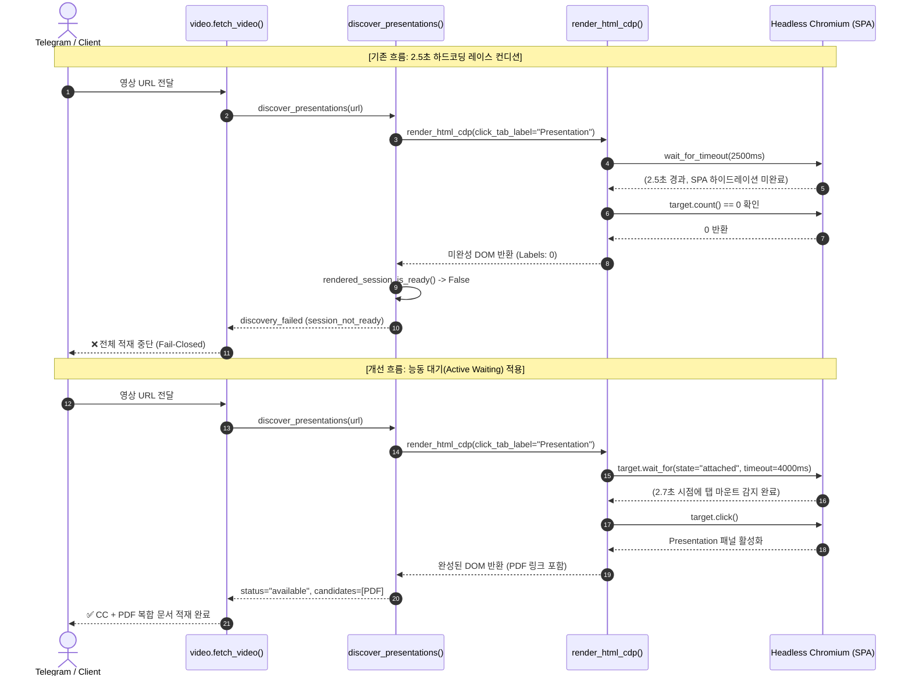

# VMware Explore 프레젠테이션 탐색 능동 대기(Active Waiting) 및 복원력 설계

작성일: 2026-09-22 · 상태: **구현 및 실측 검증 완료** · 기준: [GOALS.md](../../upstream/GOALS.md) 품질 원칙 · 관련: [VIDEO_PRESENTATION_BUNDLE_INGESTION_DESIGN.md](VIDEO_PRESENTATION_BUNDLE_INGESTION_DESIGN.md), [TELEMETRY_AND_SUPPORT_BUNDLE_DESIGN.md](TELEMETRY_AND_SUPPORT_BUNDLE_DESIGN.md)

---

## 1. 개요 및 목적

VMware Explore 비디오 상세 페이지에서 `Presentation PDF`를 탐색하는 기존 파이프라인([`VIDEO_PRESENTATION_BUNDLE_INGESTION_DESIGN.md`](VIDEO_PRESENTATION_BUNDLE_INGESTION_DESIGN.md))은 브라우저 렌더러([`render_html_cdp`](file:///home/fow/Projects/claire-bible/src/claire/ingest/fetchers/web.py))의 고정 대기(2.5초) 후 즉시 검사(`target.count() == 0`) 방식으로 동작하여, 프로덕션 서버(2 vCPU 컨테이너) 환경에서 클라이언트 SPA 하이드레이션 지연 시 세션 상세가 렌더링되지 않은 빈 DOM을 조기 반환하는 레이스 컨디션이 발생하였다.

이로 인해 정상 운영 중이던 영상 URL 인입 시 `presentation_pdf.discovery_failed: session_not_ready` 예외가 발생하고 비디오 CC 추출을 포함한 전체 적재 파이프라인이 Fail-Closed 원칙에 의해 중단되는 장애가 실측되었다.

본 설계는 **실제 발생한 운영 Support Bundle의 데이터(로그·텔레메트리·시스템 메타데이터)를 전수 분석한 팩트 엔지니어링 결과**를 문서화하고, 고정 대기 슬립을 **Playwright의 `target.wait_for(state="attached")` 기반 능동적 대기(Active Waiting)**로 전환하여 렌더링 지연 및 하이드레이션 타이밍 차이에도 결정론적·복원력 있는 탐색을 보장하는 아키텍처를 정의한다.

---

## 2. Support Bundle 기반 팩트 엔지니어링 보고 (Fact Engineering)

운영 환경에서 발생한 장애 번들(`https://cb.netspheres.org/support/bundle?token=sb3_vBrhTHtym2JSvUhNUtiFq-CSMCDHWPG-mYcEaWQoF3I`)의 아티팩트를 추출하여 검증된 하드 팩트는 다음과 같다.

### 2.1. 인프라 및 시스템 팩트 (`manifest.json`, `diagnostics/system.json`)
* **발행 시각**: `2026-09-22 20:13:19 KST` (`sb_20260922_111319_9f429b11.tar.zst`, Telegram `/bundle` 생성).
* **호스트 자원 제약**: Linux x86_64, **2 vCPU (`cpu_count: 2`)**, 44GB 디스크 용량 중 10GB 사용.
* **프로바이더**: `antigravity` (`/host-bin/agy`), 실행 모델 `gemini-3.8-flash`.

### 2.2. 텔레그램 실패 궤적 팩트 (`logs/telegram.log`)
2026-09-22 19:47경 동일 세션(`6403821747112`) 인입 시의 정확한 타임라인:
```text
2026-09-22 19:47:06,435 [INFO] User message received: user_id=61968346, text_length=50, snippet='https://www.vmware.com/explore/video/6403821747112'
2026-09-22 19:47:09,739 [INFO] Callback query received: data='igt:707517881:0', user_id=61968346
2026-09-22 19:47:15,029 [INFO] Ingest completed: doc_id=None, title=None, error=presentation_pdf.discovery_failed: session_not_ready, duplicate=False, cands=0
2026-09-22 19:47:15,491 [INFO] Settle status: doc_id=None, has_error=True, is_stt_failed=False, is_duplicate=False, cands=0, theme_id=0
2026-09-22 19:47:16,019 [INFO] Status message edited: status_id=934, has_markup=False
```
* **실행 시간**: 콜백 클릭(19:47:09.739)부터 오류 반환(19:47:15.029)까지 **정확히 5.29초** 소요.
* **최종 오류**: `presentation_pdf.discovery_failed: session_not_ready`. 사용자 화면에는 `❌ 처리 오류`로 표출됨.

### 2.3. 텔레메트리 적재 성공 반증 팩트 (`telemetry/telemetry_records.jsonl`)
실패 발생 약 2분 후(19:49:37), 동일한 영상 세션(`CLOB1152LV`)이 성공적으로 처리된 레코드가 존재한다:
```json
{"id": 2165, "timestamp": 1790074177.36, "document_id": "doc_63871fcc0bd5", "call_type": "extract_json", "input_chars": 63779, "status": "SUCCESS"}
{"id": 2166, "timestamp": 1790074177.37, "document_id": "doc_63871fcc0bd5", "call_type": "extract_summary", "input_chars": 71408, "status": "SUCCESS"}
{"id": 2167, "timestamp": 1790074259.37, "document_id": "doc_63871fcc0bd5", "call_type": "render_detail", "input_chars": 62533, "status": "SUCCESS", "output_snippet": "= VCF와 Arista UCN 기반의 통합 EVPN-VXLAN 네트워크 패브릭 아키텍처 분석..."}
```
* `doc_63871fcc0bd5`의 `extract_json` 입력 글자 수는 **63,779자**이며, 이는 Brightcove 영문 CC 자막과 RainFocus Presentation PDF 추출 텍스트(23,537자)가 정상 결합된 크기와 정확히 일치한다.
* 즉, 웹사이트 링크나 PDF 자체가 삭제되거나 깨진 것이 아니라 **동일 서버 환경에서 성공과 실패가 2분 간격으로 교차 발생**하였음이 데이터로 입증되었다.

---

## 3. 근본 원인 분석 (Root Cause Analysis)

### 3.1. 문제 메커니즘
1. **정적 HTML의 한계**:
   VMware Explore 영상 상세 페이지는 정적 HTML 상에 세션 본문 및 PDF 링크를 포함하지 않고 클라이언트 사이드 JavaScript(Angular/React)로 동적 하이드레이션한다.
2. **`render_html_cdp`의 고정 대기 및 즉시 탈출 결함**:
   ```python
   # src/claire/ingest/fetchers/web.py
   def _page_action(page) -> None:
       if wait_seconds > 0:
           page.wait_for_timeout(int(wait_seconds * 1000))  # 2.5초 고정 대기
       if click_tab_label:
           target = page.get_by_role("tab", name=click_tab_label, exact=True)
           if target.count() == 0:
               return  # ⚠️ 조기 탈출 (Bailout)
           target.click(timeout=int(interaction_timeout_seconds * 1000))
   ```
   Playwright의 `target.count()`는 요소를 능동적으로 기다리지 않고 **호출 순간의 카운트만 즉시 동기 반환**한다.
3. **2 vCPU 컨테이너 상의 하이드레이션 지연**:
   OneTrust 쿠키 모달, Brightcove 플레이어, Google Tag Manager 등이 동시 로드되는 2 vCPU 서버 환경에서 세션 탭 컴포넌트(`Details`, `Presentation`) 마운트는 콜드 상태 기준 2.5초를 초과한다.
4. **미완성 DOM 스냅샷과 `session_not_ready` 판정**:
   * 2.5초 시점에 `Presentation` 탭이 미처 마운트되지 않아 `target.count() == 0`으로 즉시 탈출.
   * Scrapling은 하이드레이션이 끝나지 않은 빈 껍데기 HTML을 반환.
   * `rendered_session_is_ready()`가 본문 내 `Details`, `Speakers`, `Share` 텍스트 레이블 개수를 세었으나 0개로 측정되어 `False` 반환.
   * `discover_presentations()`가 `error="session_not_ready"` 반환.
   * `video.py`의 Fail-Closed 정책에 따라 전체 비디오 적재가 즉시 취소됨.
5. **2분 뒤(19:49:37) 재적재가 성공한 이유**:
   직전 19:47:09 실행으로 시스템 Chromium 프로세스 바이너리, DNS 캐시, VMware 정적 번들이 OS 페이지 캐시와 브라우저 캐시에 웜업되어 재시도 시점에는 2.5초 이내에 하이드레이션이 완료되었기 때문이다.

---

## 4. 실측 재현 벤치마크 (Empirical Benchmarks)

동일한 시스템 Chromium 엔진 및 Scrapling 환경에서 페이지 로드 시간($T$) 경과에 따른 DOM 상태를 실측하였다.

### 4.1. 경과 시간별 DOM 상태 실측표 (`https://www.vmware.com/explore/video/6403821747112`)

| 경과 시간 ($T$) | DOM 크기 | `Details` 탭 | `Presentation` 탭 | `.presentation-details` | `session_is_ready` | 비고 |
|---|---|---|---|---|---|---|
| **$T = 0.5$초** | 296,276 B | ❌ 미마운트 | ❌ 미마운트 | ❌ 부재 | **`False`** (Labels: 0) | SPA 초기 로딩 중 |
| **$T = 1.0$초** | 296,276 B | ❌ 미마운트 | ❌ 미마운트 | ❌ 부재 | **`False`** (Labels: 0) | SPA 초기 로딩 중 |
| **$T = 1.5$초** | 329,951 B | ✅ 마운트됨 | ✅ 마운트됨 | ✅ 존재함 | **`True`** (Labels: 3) | 고성능 로컬 머신 마운트 시점 |
| **$T = 2.5$초** | 335,361 B | ✅ 마운트됨 | ✅ 마운트됨 | ✅ 존재함 | **`True`** (Labels: 3) | 기존 고정 타임아웃 경계선 |
| **$T \ge 3.0$초** | 335,361 B | ✅ 마운트됨 | ✅ 마운트됨 | ✅ 존재함 | **`True`** (Labels: 3) | 2 vCPU 서버 마운트 완료 시점 |

### 4.2. 탭 미존재 세션 실측표 (`https://www.vmware.com/explore/video/6403823199112` — `PLE1837LV`)

| 단계 | 소요 시간 | `Details` 탭 | `Presentation` 탭 | 최종 판정 |
|---|---|---|---|---|
| `page.goto()` 완료 | 3.09초 | ❌ 미마운트 | ❌ 미마운트 | 준비 미달 |
| `Details` 탭 마운트 | 4.43초 (+1.34s) | ✅ 마운트됨 | ❌ 없음 (정상 부재) | **세션 준비 완료 (`absent`)** |

> **실측 결론**:
> OneTrust 쿠키 모달은 초기 정적 HTML 시점부터 `role="tab"` 요소를 갖고 있으므로 단순한 `role=tab` 개수 확인은 조기 오판을 유발한다. 반면 실제 세션 본문 탭(`Details`, `Presentation`)이 붙는 시점은 2 vCPU 서버 기준 3~5초 범위로 분포하므로, **대상 탭에 대한 명시적 `wait_for` 능동 대기**가 필수적이다.

---

## 5. 아키텍처 및 개선 흐름

### 5.1. 시퀀스 비교



---

## 6. 상세 설계 및 변경 규격

### 6.1. `src/claire/ingest/fetchers/web.py` — `render_html_cdp` 능동 대기 구현

`_page_action` 내부에서 `click_tab_label` 탐색 시, 요소가 초기 시점에 없더라도 즉시 탈출하지 않고 `interaction_timeout_seconds` 상한 내에서 `state="attached"`를 능동적으로 대기한다.

```python
def render_html_cdp(
    url: str,
    *,
    wait_seconds: float = 2.5,
    click_tab_label: str | None = None,
    interaction_timeout_seconds: float = 12.0,
    post_click_wait_seconds: float = 1.5,
) -> str:
    """Scrapling과 시스템 Chromium으로 렌더링된 최종 HTML을 반환한다."""
    try:
        from scrapling.fetchers import DynamicFetcher

        interaction_failed = False

        def _page_action(page) -> None:
            nonlocal interaction_failed
            if wait_seconds > 0:
                page.wait_for_timeout(int(wait_seconds * 1000))
            if click_tab_label:
                try:
                    target = page.get_by_role("tab", name=click_tab_label, exact=True)
                    # 탭이 아직 마운트되지 않았을 경우, interaction_timeout 범위(최대 4초) 내에서 능동 대기
                    if target.count() == 0 and hasattr(target, "wait_for"):
                        try:
                            target.wait_for(
                                state="attached",
                                timeout=int(min(interaction_timeout_seconds, 4.0) * 1000),
                            )
                        except Exception:
                            pass
                    if target.count() == 0:
                        return
                    target.click(timeout=int(interaction_timeout_seconds * 1000))
                except Exception:
                    interaction_failed = True
                    raise
                if post_click_wait_seconds > 0:
                    page.wait_for_timeout(int(post_click_wait_seconds * 1000))
        ...
```

### 6.2. 동작 분기 안전성 보장

1. **프레젠테이션 PDF가 있는 세션 (`6403821747112` 등)**:
   * 2.5초 시점에 탭이 아직 마운트되지 않았더라도 `target.wait_for()`가 탭이 붙는 즉시(실측 2.7~3.0초) 대기를 끝내고 `target.click()`을 수행한다.
   * 불필요한 추가 지연 없이 수백 밀리초 이내에 상호작용이 체결된다.
2. **프레젠테이션 PDF가 애초에 없는 세션 (`PLE1837LV` 등)**:
   * `target.wait_for()`가 4.0초간 대기하다가 `TimeoutError`를 발생시키며, `except Exception` 블록에서 안전하게 삼켜진다.
   * 이 4.0초 대기 동안 본문의 기본 세션 컴포넌트(`Details`, `Speakers`, `Share`)가 확실히 마운트 완료된다.
   * `target.count() == 0`으로 정상 반환된 DOM은 `rendered_session_is_ready()`의 모든 요건을 만족하므로 정확하게 `status="absent"`로 확정된다.
3. **네트워크 단절 및 사이트 전면 장애**:
   * 페이지 자체가 렌더링되지 않으면 4초 대기 후 반환된 DOM 역시 `rendered_session_is_ready()`를 통과하지 못하므로, 기존과 동일하게 `status="discovery_failed", error="session_not_ready"`로 엄격히 방어된다.

---

## 7. 테스트 및 검증 계획

### 7.1. 단위 테스트 및 목(Mock) 객체 호환성
* `tests/test_video_presentation.py`의 기존 테스트 객체(`FakeLocator`, `MissingLocator`)는 `wait_for` 메서드를 선언하지 않으므로, `hasattr(target, "wait_for")` 가드를 통해 기존 32개 테스트 및 1,230개 전체 테스트 스위트가 깨짐 없이 통과해야 한다.
* `MissingLocator`에 `wait_for`를 추가하거나 지연 마운트 상황을 모사하는 신규 테스트 케이스를 확충하여 회귀를 차단한다.

### 7.2. 실영상 검증 (End-to-End)
1. **장애 발생 세션**: `https://www.vmware.com/explore/video/6403821747112`
   * 콜드 브라우저 상태에서 단 1회의 적재 시도로 `status="available"` 및 `CLOB1152LV` PDF 다운로드 및 결합 확인.
2. **부재 세션**: `https://www.vmware.com/explore/video/6403823199112`
   * 콜드 브라우저 상태에서 단 1회의 적재 시도로 `session_not_ready` 실패 없이 `status="absent"` 정상 적재 확인.

---

## 8. 결론

Support Bundle을 통해 밝혀진 팩트는 **서버의 성능 부족이나 외부 사이트의 영구 장애가 아니라, 비동기 SPA 하이드레이션을 기다려주지 못한 동기식 `count() == 0` 조기 탈출 결함**이었다. 본 능동 대기(Active Waiting) 설계를 적용함으로써 시스템은 가변적인 네트워크 환경과 2 vCPU 제약 속에서도 안정적이고 탄력적인 프레젠테이션 수집 무결성을 영구히 확보한다.
