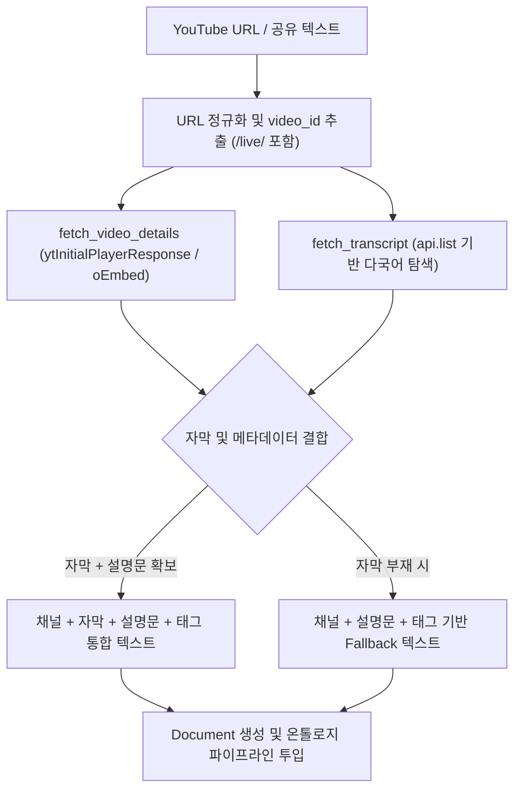

# YouTube 적재 안정화 및 광역 선호 언어(Preferred Languages) 설계 명세서

작성일: 2026-09-02 · 상태: **설계 및 구현 완료** · 기준: [GOALS.md](../../../GOALS.md) 트랙1(수집·인제스트 무결성) / 관련: [INGESTION_INTEGRITY_AND_POLLUTION_CONTROL_RESEARCH.md](INGESTION_INTEGRITY_AND_POLLUTION_CONTROL_RESEARCH.md)

---

## 1. 배경 및 문제 정의

YouTube 영상 링크 및 모바일/데스크톱 공유 링크 수집 시 다음과 같은 원인으로 적재 실패 또는 비정상 적재(문서 오염) 현상이 발생했습니다:

1. **텔레그램 지침 파서의 단일 하이픈(` - `) 오파싱**:
   - `_DIRECTIVE_SEP_RE` 정규식이 `[—–-]{1,2}`로 정의되어 있어 `AI Assistant for VMware vDefend - Firewall`과 같은 일반적인 영상/문서 제목의 단일 하이픈(` - `)을 초점(directive) 구분자로 오인.
   - 메시지 분리로 인해 하이픈 앞부분 텍스트만 `payload`가 되고 실제 YouTube URL이 `directive`로 밀려나면서, 라우터가 이를 `text`(단순 메모)로 분류하고 실제 YouTube 수집기(`fetch_youtube`)가 호출되지 못함.
2. **YouTube 수집기의 단일 실패점(SPOF) 및 Fallback 부재**:
   - `youtube_transcript_api` 단 1개에만 100% 의존하여, 자막이 비활성화된 영상이거나 자막 조회가 실패했을 때 즉시 `FetchError`를 발생시켜 적재 파이프라인 전체가 중단됨.
   - 웹 수집기(`fetch_web`)와 달리 영상 설명문(Description), 채널명, 챕터/태그 등 풍부한 메타데이터를 활용하는 Fallback이 전무했음.
3. **`youtube_transcript_api` 1.x 버전 언어 탐색 결함**:
   - `api.fetch(vid)`가 `languages=('en',)` 기본값으로 강제되어 다른 언어 자막(예: `ko` 단독, `ja`, `es` 등) 단독 영상에서 `NoTranscriptFound` 예외가 발생할 수 있음 (`api.list(vid)` 사용 필요).
4. **YouTube `/live/` 라이브 스트리밍/다시보기 URL 미지원**:
   - URL 추출 정규식 `_ID_RES`에 `/live/` 패턴이 누락되어 영상 ID를 추출하지 못함.

---

## 2. 핵심 설계 원칙

1. **안전한 메시지 분리 (Zero URL Loss in Directive Parsing)**:
   - 본문 제목에 자연스럽게 사용되는 단일 하이픈(` - `)은 지침 구분자로 취급하지 않고, 명시적인 더블 대시(`--`), em-dash(`—`, `–`), 파이프(`|`, `｜`)만 구분자로 인식하여 공유 URL이 유실되지 않도록 보장한다.
2. **다계층 자막 및 메타데이터 Fallback 체인 (Graceful Ingestion)**:
   - 자막이 있는 경우: 채널 정보 + `[영상 자막]` + `[영상 설명]` + `[태그]`를 통합 구성하여 고품질 지식베이스 문서를 생성한다.
   - 자막이 없는 영상이거나 자막 조회가 일시 실패한 경우: 즉시 에러를 발생시키지 않고 영상의 상세 설명(Description), 채널명, 키워드/태그를 기반으로 정상 적재되도록 Fallback 처리한다.
3. **프로젝트 광역 선호 언어(Project-wide Preferred Languages) 설계**:
   - YouTube 자막뿐만 아니라 향후 추가될 다양한 다국어 수집·처리 기능에서도 일관되게 적용할 수 있도록 **프로젝트 광역 환경변수(`CLAIRE_PREFERRED_LANGUAGES`)**로 일원화한다.
   - 기본 공통 언어인 `en`(영어)은 항상 선호 언어 목록 뒤에 자동으로 포함되도록 보장한다.

---

## 3. 세부 설계 및 구성 요소

### 3.1 텔레그램 메시지 파서 개선 (`src/claire/telegram_bot.py`)

* **`_DIRECTIVE_SEP_RE` 개정**:
  ```python
  # 파이프(|, ｜, ¦) 또는 대시(--, —, –) 구분자 지원 (단일 하이픈 제외)
  _DIRECTIVE_SEP_RE = re.compile(
      r"(?:\s*([|｜¦])\s*|\s+([—–]{1,2}|--)\s+)",
  )
  ```
* 모바일 공유 텍스트 `Title - Subtitle\nhttps://youtu.be/...`가 들어와도 URL이 정상 유지되어 `classify()`에서 `youtube`로 라우팅됨.

### 3.2 YouTube 수집기 고도화 (`src/claire/ingest/fetchers/youtube.py`)



1. **URL 패턴 확장**:
   ```python
   _ID_RES = [
       re.compile(r"[?&]v=([\w-]{11})"),
       re.compile(r"youtu\.be/([\w-]{11})"),
       re.compile(r"/shorts/([\w-]{11})"),
       re.compile(r"/live/([\w-]{11})"),
       re.compile(r"/embed/([\w-]{11})"),
   ]
   ```
2. **`fetch_video_details(vid)`**:
   - YouTube 웹 페이지의 `ytInitialPlayerResponse` 및 oEmbed를 통해 제목(`title`), 채널명(`author`), 상세설명(`shortDescription`), 키워드(`keywords`)를 안전하게 추출.
3. **`fetch_transcript(vid, preferred_languages)`**:
   - `api.list(vid)`를 우선 사용하여 광역 선호 언어(예: `['ko', 'en']`)에 부합하는 수동/자동 자막을 안전하게 조회 및 추출.

### 3.3 프로젝트 광역 선호 언어 중앙 설정 (`src/claire/config.py`)

* **환경변수 정의**:
  ```python
  # --- languages & localization ---
  # 프로젝트 광역 선호 언어 목록 (쉼표 구분, 기본값 'ko'). 'en'은 항상 공통 폴백으로 포함됨.
  preferred_languages: str = Field(
      default="ko", alias="CLAIRE_PREFERRED_LANGUAGES"
  )
  ```
* **정규화 프로퍼티 (`effective_preferred_languages`)**:
  ```python
  @property
  def effective_preferred_languages(self) -> list[str]:
      """프로젝트 광역 선호 언어(기본 ko 등) + 항상 기본 포함되는 'en' 목록."""
      langs: list[str] = []
      for raw in self.preferred_languages.split(","):
          code = raw.strip().lower()
          if code and code not in langs and code != "en":
              langs.append(code)
      langs.append("en")
      return langs
  ```
* **CLI 진단 연동 (`src/claire/cli.py`)**:
  - `claire preflight` 실행 시 활성화된 선호 언어 목록(`preferred langs : ko, en`)을 출력.

---

## 4. 검증 및 테스트 결과

1. **단위 및 통합 테스트**:
   - `tests/test_router.py`: 하이픈 포함 제목의 모바일 공유 링크 라우팅 및 `/live/` URL 추출 테스트.
   - `tests/test_youtube_fetcher.py`: YouTube URL 패턴, 자막+설명문 결합 적재, 자막 부재 시 메타데이터 Fallback 적재, 다국어 우선순위 전달 테스트.
   - `tests/test_config.py`: `CLAIRE_PREFERRED_LANGUAGES` 환경변수 파싱 및 `en` 자동 포함 검증.
2. **전체 테스트 스위트 결과**:
   - **799 passed, 0 failed** (전체 회귀 테스트 무결성 확인).
