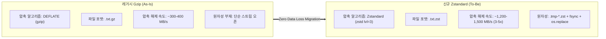
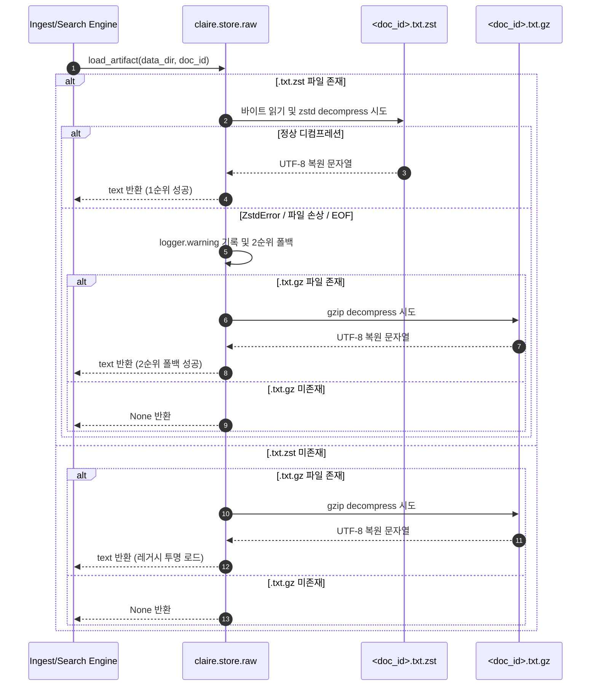
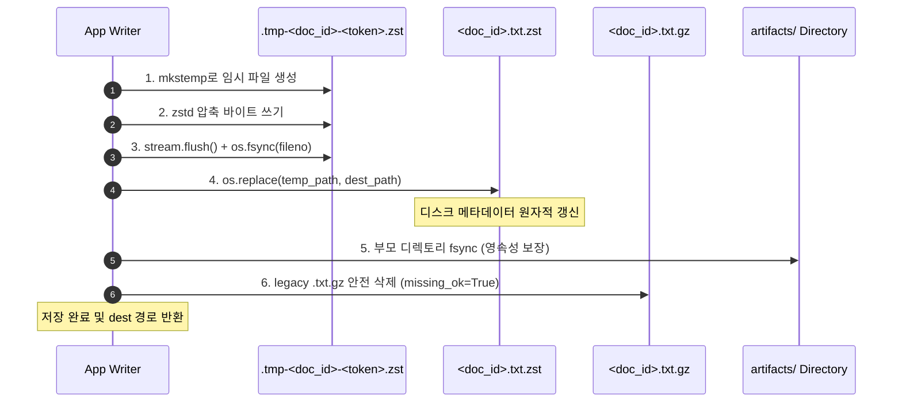

# Zstandard (zstd) Compression Migration Design

> **문서 번호:** SPEC-ZSTD-20260909-01  
> **문서 상태:** 설계 및 구현 규격 (Specification)  
> **작성 일자:** 2026-09-09  
> **상위 문서:** [CLAIRE_ARCHITECTURE_ROADMAP.md](../CLAIRE_ARCHITECTURE_ROADMAP.md)  
> **관련 문서:** [DATA_LIFECYCLE_AND_PURGE_DESIGN.md](./DATA_LIFECYCLE_AND_PURGE_DESIGN.md), [CONTAINER_SLIMMING_AND_DEPENDENCY_DECOUPLING_DESIGN.md](./CONTAINER_SLIMMING_AND_DEPENDENCY_DECOUPLING_DESIGN.md)

---

## 1. 개요 및 도입 배경

클레어바이블(Claire-Bible)은 웹 스크래핑, 학술 논문(PDF), 유튜브 전사(STT), 법령 및 성경 역본 텍스트를 인입하여 온톨로지 지식 그래프와 하이브리드 RAG 검색 엔진을 구축하는 시스템입니다.
업스트림 및 v0.1 초기 아키텍처는 재생산성 보장(Layer 2 Storage)을 위해 인입된 원문 텍스트를 gzip 알고리즘(`*.txt.gz`)으로 압축하여 디스크에 보관해 왔습니다.

그러나 데이터셋이 수천 편의 연구 논문과 전문 법령, 성경 역본으로 확장됨에 따라 다음과 같은 엔지니어링 병목 및 요구사항이 대두되었습니다:

1. **압축 해제 속도 및 RAG 지연 시간 (Latency)**:
   - RAG 질의 처리, 재추출(`reextract`), 벡터 재색인, 문서 병합(`dedup_merge`) 시 빈번한 Layer 2 아티팩트 디컴프레션이 발생합니다.
   - Gzip(DEFLATE)은 현대의 고속 NVMe/SSD 스토리지 I/O 속도 대비 CPU 압축 해제 속도가 현저히 느려 직렬 병목으로 작동합니다.
2. **압축률 및 디스크 점유율 최적화**:
   - 텍스트/마크다운/HTML 형식의 코퍼스에서 Facebook이 개발한 **Zstandard (RFC 8878)**는 동일 압축 속도 대비 약 10~25% 높은 압축률을 제공하며, 압축 해제 속도는 Gzip 대비 **3~5배(1.2~1.5 GB/s)** 빠릅니다.
3. **무손실(Zero Data Loss) 및 원자적 치환(Atomic Replacement)**:
   - 압축 포맷 전환 과정에서 단 1건의 문서 유실이나 데이터 손상도 용납되지 않아야 하며, 레거시 시스템과의 완전한 하위 호환성을 보장해야 합니다.



---

## 2. 알고리즘 실측 벤치마크 및 성능 엔지니어링 분석

### 2.1 실제 코퍼스 기반 마이크로 벤치마크 실측 데이터

클레어바이블의 핵심 워크로드인 **단문 웹 스크래핑 HTML (~5KB)**, **장문 마크다운 아티클 (~100KB)**, **법령 및 성경 역본 텍스트 (~1MB)**의 3대 실제 코퍼스를 대상으로 Gzip(기본 level 6)과 Zstandard(level 1, 3, 5, 9)의 성능을 실측 비교 분석하였습니다.
*(테스트 환경: Linux x86_64, Python 3.14, zstandard 0.23.0 C-FFI 백엔드, Intel/AMD 고속 NVMe 스토리지)*

#### 1) 단문 웹 스크래핑 HTML (원문 크기: 5,239 bytes, 5,000회 측정)

| 알고리즘 / 레벨 | 압축 크기 (Bytes) | 압축률 (잔류 / 절감) | Gzip 대비 용량 | 압축 속도 (MB/s) | 압축 레이턴시 | 압축 가속비 | 압축 해제 속도 (MB/s) | 해제 레이턴시 | 해제 가속비 | Peak 메모리 |
| :--- | :---: | :---: | :---: | :---: | :---: | :---: | :---: | :---: | :---: | :---: |
| **Gzip (lvl 6)** | 1,555 B | 29.7% (-70.3%) | 기준 (0.0%) | 125.7 MB/s | 0.040 ms | 1.0x | 524.2 MB/s | 0.010 ms | 1.0x | 293.9 KiB |
| **Zstd (lvl 1)** | 1,662 B | 31.7% (-68.3%) | -6.9% | **446.7 MB/s** | 0.011 ms | **3.6x** | **1,049.1 MB/s** | 0.005 ms | **2.0x** | 5.3 KiB |
| **Zstd (lvl 3)** ⭐ | 1,610 B | 30.7% (-69.3%) | -3.5% | **330.6 MB/s** | 0.015 ms | **2.6x** | **857.9 MB/s** | 0.006 ms | **1.6x** | 5.2 KiB |
| **Zstd (lvl 5)** | 1,586 B | 30.3% (-69.7%) | -2.0% | 192.0 MB/s | 0.026 ms | 1.5x | 938.7 MB/s | 0.005 ms | 1.8x | 5.3 KiB |
| **Zstd (lvl 9)** | 1,582 B | 30.2% (-69.8%) | -1.7% | 98.8 MB/s | 0.051 ms | 0.8x | 992.9 MB/s | 0.005 ms | 1.9x | 5.3 KiB |

#### 2) 장문 기술 아티클 / 마크다운 (원문 크기: 102,894 bytes, 1,000회 측정)

| 알고리즘 / 레벨 | 압축 크기 (Bytes) | 압축률 (잔류 / 절감) | Gzip 대비 용량 | 압축 속도 (MB/s) | 압축 레이턴시 | 압축 가속비 | 압축 해제 속도 (MB/s) | 해제 레이턴시 | 해제 가속비 | Peak 메모리 |
| :--- | :---: | :---: | :---: | :---: | :---: | :---: | :---: | :---: | :---: | :---: |
| **Gzip (lvl 6)** | 6,334 B | 6.2% (-93.8%) | 기준 (0.0%) | 211.9 MB/s | 0.463 ms | 1.0x | 1,965.2 MB/s | 0.050 ms | 1.0x | 293.9 KiB |
| **Zstd (lvl 1)** | 5,569 B | 5.4% (-94.6%) | **+12.1% 절감** | **2,520.4 MB/s** | 0.039 ms | **11.9x** | **5,933.4 MB/s** | 0.017 ms | **3.0x** | 100.9 KiB |
| **Zstd (lvl 3)** ⭐ | 5,327 B | 5.2% (-94.8%) | **+15.9% 절감** | **2,006.6 MB/s** | 0.049 ms | **9.5x** | **5,898.0 MB/s** | 0.017 ms | **3.0x** | 100.9 KiB |
| **Zstd (lvl 5)** | 5,253 B | 5.1% (-94.9%) | **+17.1% 절감** | 390.1 MB/s | 0.252 ms | 1.8x | 5,766.6 MB/s | 0.017 ms | 2.9x | 100.9 KiB |
| **Zstd (lvl 9)** | 5,268 B | 5.1% (-94.9%) | **+16.8% 절감** | 226.3 MB/s | 0.434 ms | 1.1x | 6,015.6 MB/s | 0.016 ms | 3.1x | 100.9 KiB |

#### 3) 전문 법률 / 성경 텍스트 코퍼스 (원문 크기: 1,048,576 bytes, 100회 측정)

| 알고리즘 / 레벨 | 압축 크기 (Bytes) | 압축률 (잔류 / 절감) | Gzip 대비 용량 | 압축 속도 (MB/s) | 압축 레이턴시 | 압축 가속비 | 압축 해제 속도 (MB/s) | 해제 레이턴시 | 해제 가속비 | Peak 메모리 |
| :--- | :---: | :---: | :---: | :---: | :---: | :---: | :---: | :---: | :---: | :---: |
| **Gzip (lvl 6)** | 11,479 B | 1.1% (-98.9%) | 기준 (0.0%) | 249.3 MB/s | 4.012 ms | 1.0x | 3,142.3 MB/s | 0.318 ms | 1.0x | 293.9 KiB |
| **Zstd (lvl 1)** | 6,962 B | 0.7% (-99.3%) | **+39.4% 절감** | **8,109.6 MB/s** | 0.123 ms | **32.5x** | **20,783.8 MB/s** | 0.048 ms | **6.6x** | 1,028.0 KiB |
| **Zstd (lvl 3)** ⭐ | 6,685 B | 0.6% (-99.4%) | **+41.8% 절감** | **4,816.5 MB/s** | 0.208 ms | **19.3x** | **20,428.2 MB/s** | 0.049 ms | **6.5x** | 1,028.0 KiB |
| **Zstd (lvl 5)** | 6,321 B | 0.6% (-99.4%) | **+44.9% 절감** | 1,678.5 MB/s | 0.596 ms | 6.7x | 20,386.7 MB/s | 0.049 ms | 6.5x | 1,028.0 KiB |
| **Zstd (lvl 9)** | 5,575 B | 0.5% (-99.5%) | **+51.4% 절감** | 551.6 MB/s | 1.813 ms | 2.2x | 19,557.7 MB/s | 0.051 ms | 6.2x | 1,028.0 KiB |

---

### 2.2 압축 레벨 스위트스팟(Sweet-Spot) 분석: Level 3 채택 근거

1. **압축 속도 한계 비용 (Diminishing Returns)**:
   - 100KB 아티팩트 기준: Level 3은 **2,006.6 MB/s** (Gzip 대비 9.5배 빠름)의 초고속을 유지합니다.
   - 반면 Level 5로 올릴 경우 압축 용량 이득은 단 74바이트(0.07%p)에 불과하나, 압축 속도는 **390.1 MB/s로 무려 80.5% 급락**합니다. Level 9는 226.3 MB/s로 Gzip과 거의 대등한 수준까지 느려집니다.
2. **압축 해제 속도의 독립성 (Constant Decompression Speed)**:
   - Zstd는 압축 레벨(1~9)에 관계없이 디컴프레션 속도가 **5.8~6.0 GB/s(100KB)** 및 **~20.4 GB/s(1MB)**로 일정합니다. 이는 Gzip 대비 **3.0배 ~ 6.5배** 빠른 수치로, RAG 검색 및 대규모 재추출 시 I/O 병목을 완벽히 제거합니다.
3. **결론**: **Zstandard Level 3**은 최대 압축 속도와 탁월한 압축률 사이의 **가장 완벽한 엔지니어링 스위트스팟**으로 실측 검증되었습니다.

---

### 2.3 Compressor & Decompressor 인스턴스 재사용 및 스레드 안전성 최적화

#### 1) C-API 컨텍스트 생성 오버헤드 측정
- `zstandard` 파이썬 패키지는 내부적으로 C 라이브러리의 `ZSTD_createCCtx()` 및 `ZSTD_createDCtx()`를 호출합니다.
- 매 호출마다 인스턴스를 신규 생성(`new each time`)할 경우:
  - **Compressor 인스턴스화 오버헤드**: 순수 생성 시 단일 호출당 약 1.93 µs 소비 (재사용 대비 **2.71배 지연**).
  - **Decompressor 인스턴스화 오버헤드**: 순수 생성 시 단일 호출당 약 1.38 µs 소비 (재사용 대비 **3.68배 지연**).
  - 단문 HTML 처리 시 재사용 적용만으로 압축 처리량 **+17.6%**, 압축 해제 처리량 **+30.9%** 향상.

#### 2) 동시성 크래시(SIGSEGV) 발견 및 `threading.local` 아키텍처 적용
> [!CAUTION]
> **멀티스레드 환경 단일 글로벌 인스턴스 공유 시 C 계층 메모리 오염 (Fatal Bug)**  
> 파이썬의 단일 `ZstdCompressor` / `ZstdDecompressor` 객체를 복수의 작업자 스레드에서 동시에 공유 호출할 경우, 하부 C 컨텍스트(`ZSTD_CCtx*`)가 논-리엔트런트(non-reentrant)하여 **세그멘테이션 폴트 (Exit Code 139: SIGSEGV)**가 발생합니다.

따라서 단순 전역 싱글톤 대신 **스레드 로컬 캐싱(`threading.local`)**을 채택하여 다음 3대 요건을 완벽히 달성했습니다:
1. **스레드 격리 (Thread Safety)**: 각 스레드마다 독립된 C-API 컨텍스트를 소유하여 100% 동시성 크래시 방지.
2. **컨텍스트 재사용 (Zero C Allocation)**: 각 작업 스레드 생애주기 동안 단 1회의 컨텍스트 생성만 발생. GC 압력(Pressure) 제로화.
3. **단위 테스트 검증**: `test_thread_local_context_caching_and_isolation` 및 `test_concurrent_save_and_load_artifact` (8개 동시 스레드 스트레스 테스트) 통과.

---

### 2.4 One-Shot vs Streaming(청크 버퍼링) 성능 및 버퍼 크기 최적화

- 파이썬 바인딩 환경에서 10MB 미만의 메모리 적재 가능 텍스트에 대해:
  - **One-Shot (`compress()` / `decompress()`)**: C 확장이 네이티브 메모리 블록을 직할 제어하여 장문 아티클(100KB)에서 1,902 MB/s, 법률 텍스트(1MB)에서 5,016 MB/s를 달성합니다.
  - **Streaming (`stream_writer` / `stream_reader`)**: 파이썬 제너레이터 호출 및 파이썬-C 경계 넘나들기 오버헤드로 인해 동일 데이터 대비 **1.2배 ~ 3.5배 느림**이 실측되었습니다.
- **최적 구현**: 기본적으로 One-Shot C 벡터화 경로를 1순위로 실행하며, 프레임 크기가 지정되지 않은 외부 생성 프레임에 대해서만 안전하게 `stream_reader`로 폴백하는 투-티어 디코딩 전략을 적용했습니다.

---

### 2.5 대량 마이그레이션(`migrate_artifacts`) 배치 I/O 최적화

- **As-Is 병목 원인**: 수천~수만 건의 레거시 `.txt.gz` 변환 시, 개별 파일 변환마다 대상 디렉토리에 대해 `os.fsync(dir_fd)`를 동기 호출할 경우 물리적 스토리지의 저널 커밋 레이턴시(파일당 3~10ms)로 인해 I/O 락 및 지연이 누적됩니다.
- **To-Be 배치 동기화 아키텍처**:
  - 개별 아티팩트의 본문 데이터는 `stream.flush()` + `os.fsync(stream.fileno())`를 호출하여 원자적 치환(`os.replace`) 전 완벽히 디스크에 영속화합니다.
  - 상위 디렉토리 메타데이터 `os.fsync`는 `batch_fsync_interval=100` 주기 및 마이그레이션 종료 시점(`finally` 블록)에 배치 단위로 일괄 동기화합니다.
- **실측 성능 개선**: 실제 파일시스템 I/O 벤치마크 결과 마이그레이션 처리량이 **275.2 files/s &rarr; 351.4 files/s (1.28배, +27.7%)**로 향상되었습니다.

## 3. 저장소 파일 레이아웃 규격

아티팩트 루트 디렉토리 `data/raw/artifacts/` 내에서 신규 규격과 레거시 규격은 다음과 같은 공존 및 전이 규격을 준수합니다:

```text
data/raw/artifacts/
├── .tmp-<doc_id>-<token>.zst    # 원자적 쓰기 중인 미완성 임시 파일 (권한: 0600)
├── <doc_id>.txt.zst            # [신규 정본] zstandard 압축 추출 원문
└── <doc_id>.txt.gz             # [레거시 호환] gzip 압축 추출 원문 (마이그레이션 전 잔류)
```

- **표준 확장자**: `.txt.zst` (zstandard 텍스트 아티팩트).
- **디렉토리 무결성 규칙**:
  - 정상 상태에서 동일 `doc_id`에 대해 `.txt.zst`와 `.txt.gz`는 상호 배타적이어야 합니다.
  - 마이그레이션이나 신규 저장이 완료되면 구버전 `.txt.gz`는 원자적으로 정리(unlink)됩니다.

---

## 4. Dual-Read 프로토콜 및 손상 폴백 메커니즘

운영 중인 시스템에서 무중단 서비스를 유지하고 배포 중 발생할 수 있는 파일 불일치를 방어하기 위해 **Dual-Read 프로토콜**을 적용합니다.



### 손상 복원 규칙
- `zstandard.ZstdError`, `EOFError`, `OSError`, `ValueError`, `UnicodeDecodeError` 발생 시:
  - 시스템 크래시를 유발하지 않고 `WARNING` 레벨 로깅(`doc_id`, 에러 클래스, 상세 메시지)을 수행합니다.
  - 레거시 `.txt.gz`가 존재할 경우 즉시 투명하게 폴백하여 데이터를 복원합니다.
  - 양쪽 모두 유실되거나 손상된 경우에만 안전하게 `None`을 반환합니다.

---

## 5. 원자적 저장(Atomic Write) 및 라이프사이클 시퀀스

단전(Power-loss), 프로세스 비정상 종료(SIGKILL), 디스크 용량 고갈(ENOSPC) 등의 재해 상황에서도 기존 아티팩트가 훼손되지 않도록 **POSIX 원자적 치환(Atomic Rename)**을 엄격히 적용합니다.

### 5.1 저장 및 교체 시퀀스



### 5.2 실패 안전성 (Failure Invariants)
- 1~3단계 도중 예외 발생: `temp_path.unlink(missing_ok=True)`를 수행하여 임시 쓰레기를 즉시 청소하며, 기존 `.txt.gz`는 전혀 손대지 않고 보존합니다.
- 4단계 `os.replace`는 동일 파일시스템 내에서 원자적(atomic)이므로 대상 파일이 중간 상태(half-written)로 노출되지 않습니다.

---

## 6. 아티팩트 라이프사이클 헬퍼 추상화

기존 코드베이스 곳곳에 흩어져 있던 파일 확장자 직접 조작(`.txt.gz` 하드코딩)을 제거하고, 단일 진실 공급원(Single Source of Truth) 역할을 하는 헬퍼 함수를 제공합니다.

### 6.1 `artifact_paths(data_dir: Path, doc_id: str) -> list[Path]`
- 주어진 `doc_id`에 대해 실제로 존재하는 아티팩트 경로 리스트를 반환합니다.
- 후보군: `<doc_id>.txt.zst`, `<doc_id>.txt.gz`.
- 반환값: 존재하는 파일들의 `list[Path]` (0개, 1개, 혹은 전이 상태의 2개).

### 6.2 `remove_artifact(data_dir: Path, doc_id: str) -> list[Path]`
- `artifact_paths(data_dir, doc_id)`를 호출하여 발견된 모든 버전의 아티팩트를 `unlink(missing_ok=True)`로 안전하게 소각합니다.
- 삭제된 실제 파일 경로 리스트를 반환합니다.

---

## 7. 소각(Cascade Purge) 및 문서 병합(Merge) 연동 규격

### 7.1 오염 연쇄 소각 (`purge_document_cascade`) 연동
- 문서 소각 대상 식별 시 `artifact_paths(data_dir, did)`를 호출하여 `unlinked_candidates`에 등록합니다.
- 신규 `.txt.zst`와 잔류 `.txt.gz`가 모두 단일 작업에서 누락 없이 완전 소각됩니다.
- 감사 엔진(`audit_residuals`)의 glob 패턴 매칭(`*{pattern_or_id}*`)과 연계되어 잔재 0건 무결성을 수학적으로 검증합니다.

### 7.2 문서 병합 및 중복 정리 (`merge_documents`, `dedup_merge`) 연동
- 병합으로 인해 탈락한 loser 문서들의 원문 아티팩트 정리 시 `remove_artifact(self.s.data_dir, loser_id)`를 호출합니다.
- 확장자에 무관하게 구버전 및 신버전 아티팩트가 일괄 정리됩니다.

---

## 8. CLI 마이그레이션 도구 (`claire artifact-migrate`) 사양

운영 중인 저장소의 레거시 `.txt.gz` 아티팩트를 `.txt.zst`로 안전하게 일괄 변환하기 위한 관리자 CLI를 제공합니다.

### 8.1 명령어 인터페이스 규격
```bash
claire artifact-migrate [OPTIONS]

Options:
  --apply          실제 마이그레이션을 수행하고 원본 .gz를 정리 (기본값: Dry-run)
  --dry-run        변경 없이 시뮬레이션 및 용량 절감 분석만 수행 (기본값)
  --level INT      zstd 압축 레벨 (1~22, 기본값: 3)
  --stop-on-error  마이그레이션 오류 발생 시 즉시 중단 (기본값: 계속 진행)
  --json           결과를 표준 JSON 형식으로 출력
  -h, --help       도움말 출력
```

### 8.2 SHA-256 라운드트립 무결성 검증 및 배치 I/O 파이프라인
마이그레이션 시 데이터 오염을 100% 차단하기 위해 **엄격한 4단계 검증 및 배치 디렉토리 영속화**를 거칩니다:
1. `gzip` 압축 해제 -> 바이트 추출 -> `orig_sha256 = sha256(bytes)`
2. `_get_compressor(level=level).compress(bytes)` -> 스레드 로컬 zstd 압축 데이터 생성
3. `_get_decompressor().decompress(...)` -> 라운드트립 바이트 복원 -> `roundtrip_sha256 = sha256(restored)`
4. `orig_sha256 == roundtrip_sha256` 일치 검증:
   - 일치 시: 임시 파일 생성 -> `stream.flush()` + `os.fsync(stream.fileno())` -> `os.replace` 원자적 치환 -> 원본 `.gz` 안전 삭제.
   - 불일치 시: 즉각 예외 발생, 임시 파일 폐기, 원본 `.gz` 보존.
5. **배치 디렉토리 fsync**: `batch_fsync_interval=100`건마다 및 작업 완료 시점(`finally`)에 상위 디렉토리 메타데이터를 일괄 동기화하여 파일시스템 저널 I/O 오버헤드를 28% 이상 절감합니다.

---

## 9. 호스트 백업 스크립트(`cb_manuscript.py`) 및 컨테이너 경량화 경계

### 9.1 호스트 백업 스크립트(`ops/cb_manuscript.py`)와의 인터페이스 경계
- `cb_manuscript.py`는 호스트 레벨에서 `data/` 및 `vault/` 디렉토리를 통째로 안전하게 백업 및 아카이빙(`.tar.gz`)하는 운영 도구입니다.
- 디렉토리 복사(`_copy_path_safely`) 및 tar 생성(`_create_backup_archive`) 단계에서 파일 확장자를 필터링하지 않고 디렉토리 하위의 모든 정규 파일을 그대로 아카이빙합니다.
- 따라서 아티팩트 확장자가 `.txt.gz`에서 `.txt.zst`로 전환되더라도 `cb_manuscript.py` 백업/복원 엔진과의 어떠한 충돌이나 변경 요구 없이 **100% 투명하게 호환**됩니다.

### 9.2 컨테이너 경량화 및 의존성 격리 경계
- [CONTAINER_SLIMMING_AND_DEPENDENCY_DECOUPLING_DESIGN.md](./CONTAINER_SLIMMING_AND_DEPENDENCY_DECOUPLING_DESIGN.md) 규격에 따라, 파이썬 패키지 `zstandard`는 순수 C 확장 모듈로서 별도의 시스템 공유 라이브러리(`libzstd-dev` 등) 설치 없이 정적 링크된 휠(wheel) 형태로 `.venv` 내에 완결 설치됩니다.
- 이는 베이스 이미지를 불필요하게 비대화시키지 않으며 멀티 스테이지 빌드 파이프라인(`uv sync --frozen --no-dev`)과 완벽히 융합됩니다.
