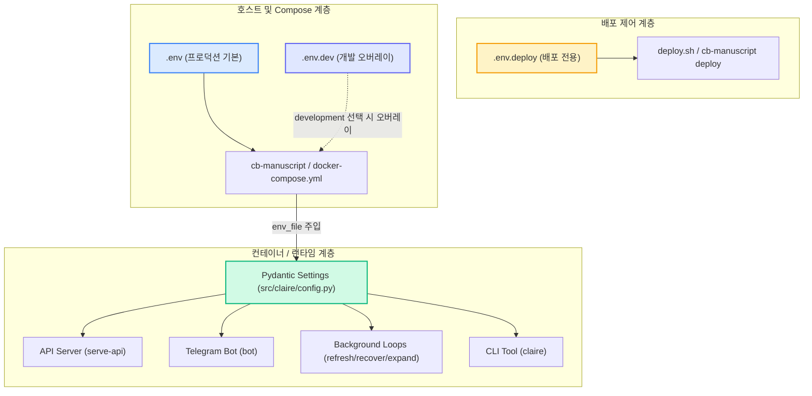

# Claire Bible 환경변수 매뉴얼 (`ENVIRONMENT_VARIABLES.md`)

이 문서는 Claire Bible의 모든 환경변수 설정, `.env` 파일 계층 구조, 우선순위 규칙, Pydantic 기반 유효성 검증 체계, 보안 경계 및 운영 모범 사례를 종합적으로 설명하는 공식 매뉴얼입니다.

---

## 1. 환경 설정 아키텍처 개요

Claire Bible은 **3개 계층의 격리된 설정 파일 체계**와 **엄격한 Pydantic Settings 유효성 검증**을 통해 운영 안정성과 보안성을 보장합니다.



### 1.1 설정 파일 계층 구조

| 파일명 | 역할 및 적용 환경 | 주요 용도 | 비고 |
| :--- | :--- | :--- | :--- |
| [`.env`](../../../.env.example) | **프로덕션 기본 설정** (`CLAIRE_ENVIRONMENT=production`) | Compose 호스트 포트/경로, 컨테이너 런타임, 시크릿, API 보안, LLM 설정 | `0600` 권한 필수, Git 커밋 금지 |
| [`.env.dev`](../../../.env.dev.example) | **개발 환경 오버레이** (`CLAIRE_ENVIRONMENT=development`) | 개발 포트(`8766`), mock 프로바이더 고정, 격리된 데이터 경로(`./.dev/`) | `.env` 뒤에 로드되어 값 오버라이드 |
| [`.env.deploy`](../../../.env.deploy.example) | **원격 배포 제어** (호스트 전용) | SSH 원격 대상, 배포 경로, rsync/update 동작 제어 | 앱 컨테이너 내부로 절대 유입되지 않음 |

### 1.2 설정 로딩 및 우선순위 규칙

1. **프로세스 환경변수 우선**: 프로세스에 이미 export되어 주입된 환경변수는 `.env` 파일의 값보다 항상 우선합니다.
2. **개발 환경 파일 오버레이**: `CLAIRE_ENVIRONMENT=development` 선택 시 `.env`를 먼저 읽고, `.env.dev`의 설정이 뒤이어 로드되어 덮어씁니다.
3. **셸 Sourcing 금지 (`treated as data`)**: `cb-manuscript`와 `deploy.sh`는 `.env` 파일을 셸 스크립트로 `source`하지 않으며, 자체 파서를 통해 안전하게 키-값 데이터로만 읽어 전달합니다.
4. **엄격한 DotEnv 파서 (`_ExactDotEnvSettingsSource`)**: 보안 selector(예: `CLAIRE_ANONYMOUS_READONLY`)는 따옴표나 외부 공백이 없는 exact `0` 또는 `1`만 허용하며, 중복 선언 시 기동 전 에러를 발생시킵니다.
5. **자동 마이그레이션 및 백필**: `./cb-manuscript init`, `install`, `update` 실행 시 신규 추가된 환경변수가 `.env.example` 및 `.env.dev.example`로부터 기존 사용자 설정을 훼손하지 않고 파일 끝에 자동으로 백필됩니다 ([OPERATIONAL_MIGRATION.md](../design/OPERATIONAL_MIGRATION.md) 참조).

---

## 2. 환경변수 상세 레퍼런스

### 2.1 런타임 환경 식별 및 타임존

| 환경변수명 | 기본값 | 허용 값 / 타입 | 설명 |
| :--- | :--- | :--- | :--- |
| `CLAIRE_ENVIRONMENT` | `production` (dev: `development`) | `production`, `development` | **[필수]** 실행 환경 selector. `.env`는 반드시 `production`, `.env.dev`는 반드시 `development`여야 합니다. 불일치 시 기동이 차단됩니다. |
| `TZ` | *(자동 감지)* | 문자열 (예: `Asia/Seoul`, `UTC`) | 컨테이너 내부 타임존. 빈 값일 경우 `cb-manuscript`가 호스트의 `timedatectl` 또는 시스템 타임존을 자동 감지하여 채웁니다. |

---

### 2.2 호스트 및 Docker Compose 오케스트레이션 (`CB_*`)

이 변수들은 `docker-compose.yml`, `docker-compose.dev.yml` 및 `cb-manuscript`가 호스트 레벨에서 컨테이너를 빌드하고 실행할 때 사용됩니다.

| 환경변수명 | 기본값 (prod / dev) | 허용 값 / 타입 | 설명 |
| :--- | :--- | :--- | :--- |
| `CB_PROJECT_NAME` | `claire-bible` / `claire-bible-dev` | 영소문자, 숫자, `-`, `_` | Docker Compose 프로젝트 이름 (컨테이너/네트워크 접두어로 사용). |
| `CB_IMAGE` | `claire-bible` | 문자열 | Docker 이미지 레포지토리 이름. |
| `CB_IMAGE_TAG` | `local` / `dev` | 문자열 (Git SHA 등) | Docker 이미지 태그. 프로덕션 배포 시 불변 Git SHA를 지정하여 동일 이미지 재현성을 확보합니다. |
| `CB_ENV_FILE` | `.env` | 파일 경로 | 프로덕션 환경변수 파일 경로. |
| `CB_DEV_ENV_FILE` | `.env.dev` | 파일 경로 | 개발 환경 오버레이 파일 경로. |
| `CB_DATA_DIR` | `./data` / `./.dev/data` | 호스트 디렉터리 경로 | SQLite DB, raw 아티팩트, 이미지 등이 저장되는 호스트 데이터 마운트 경로 (`/app/data`). |
| `CB_VAULT_DIR` | `./vault` / `./.dev/vault` | 호스트 디렉터리 경로 | Obsidian/AsciiDoc 볼트 파일이 동기화되는 호스트 마운트 경로 (`/app/vault`). |
| `CB_BIN_DIR` | `~/.local/bin` | 호스트 디렉터리 경로 | 호스트의 CLI 바이너리(예: `agy`)를 컨테이너 내부 `/host-bin`에 읽기 전용으로 마운트하기 위한 경로. |
| `CB_GEMINI_DIR` | `~/.gemini` | 호스트 디렉터리 경로 | 호스트의 Gemini CLI 인증 토큰 디렉터리를 컨테이너 내부 `/root/.gemini`로 마운트하기 위한 경로. |
| `CB_API_BIND` | `127.0.0.1` | 단일 IPv4 주소 | Docker가 호스트에 퍼블리시할 바인딩 IP. **`0.0.0.0` 또는 호스트명은 허용되지 않습니다.** 로컬 또는 고정 LAN IPv4를 지정합니다. |
| `CB_API_PORT` | `8765` / `8766` | 정수 (`1~65535`) | 호스트에 노출할 API 서비스 포트 번호. |
| `CB_WAIT_TIMEOUT` | `120` | 정수 (초 단위, `1~86400`) | 컨테이너 수명주기 명령(기동/재시작) 시 서비스 헬스체크 통과 대기 최대 시간. |

---

### 2.3 백그라운드 워커 스케줄링 (`CB_*`)

| 환경변수명 | 기본값 | 허용 값 / 타입 | 설명 |
| :--- | :--- | :--- | :--- |
| `CB_REFRESH_INTERVAL` | `3600` | 정수 (초) | `refresh-loop` 워커의 주기 크롤링 실행 간격 (기본 1시간). |
| `CB_REFRESH_BATCH` | `5` | 정수 | `refresh-loop` 1회 실행당 확인할 최대 watch 문서 수. |
| `CB_RECOVER_INTERVAL` | `600` | 정수 (초) | `recover-loop` 워커의 실패 문서 복구 재시도 루프 주기 (기본 10분). |
| `CB_RECOVER_BATCH` | `5` | 정수 | `recover-loop` 1회 실행당 재처리할 최대 실패 문서 수. |
| `CB_RECOVER_MAX_ATTEMPTS` | `5` | 정수 | 실패 문서에 대한 최대 복구 시도 횟수 (초과 시 영구 실패 처리). |
| `CB_RECOVER_BASE_DELAY` | `300` | 정수 (초) | 지수 백오프 복구 지연 기본 시간 (초). |
| `CB_EXPAND_INTERVAL` | `900` | 정수 (초) | `expand-loop` 워커의 1홉 자동확장 큐 처리 주기 (기본 15분). |
| `CB_EXPAND_BATCH` | `3` | 정수 | `expand-loop` 1회 실행당 처리할 최대 확장 후보 수. |

---

### 2.4 시크릿 및 접근 제어 (Secrets & Access Control)

| 환경변수명 | 기본값 | 허용 값 / 타입 | 설명 |
| :--- | :--- | :--- | :--- |
| `GEMINI_API_KEY` | `""` | 문자열 (AI Studio 키) | Google Gemini API 키. 누락 시 Gemini 프로바이더는 자동으로 `mock`으로 폴백됩니다. |
| `TELEGRAM_BOT_TOKEN` | `""` | 문자열 (`123456:ABC-DEF...`) | Telegram `@BotFather`에서 발급받은 봇 토큰. 비워두면 봇 프로필이 비활성화됩니다. |
| `CLAIRE_ALLOWED_USERS` | `""` | 쉼표 구분 정수 ID 목록 | 텔레그램 봇 사용이 허용된 Telegram User ID 목록 (예: `12345678,87654321`). 비워두면 모든 사용자가 접근 가능하므로 주의가 필요합니다. |
| `CLAIRE_OWNER_CHAT_ID` | `0` | 정수 (Telegram Chat ID) | 서비스 오류 및 운영 경보(Alert)를 수신할 소유자 Chat ID. `0`이면 `CLAIRE_ALLOWED_USERS`의 첫 번째 ID로 자동 폴백됩니다. |

---

### 2.5 LLM 프로바이더 및 추론 모델 (`CLAIRE_PROVIDER`, `CLAIRE_GEMINI_*`)

| 환경변수명 | 기본값 | 허용 값 / 타입 | 설명 |
| :--- | :--- | :--- | :--- |
| `CLAIRE_PROVIDER` | `mock` | `mock`, `gemini`, `antigravity`, `codex`, `codex-cli` | 지식 그래프 추출, 요약, 판정에 사용할 메인 LLM 프로바이더. 키/환경이 없으면 `mock`으로 안전 폴백됩니다. ([MULTI_PROVIDER_DESIGN.md](../design/MULTI_PROVIDER_DESIGN.md) 참조) |
| `CLAIRE_GEMINI_MODEL` | `gemini-3.1-flash-lite` | 문자열 | Gemini 프로바이더 사용 시 적용할 모델명. |
| `CLAIRE_GEMINI_EFFORT` | `medium` | `low`, `medium`, `high` | Gemini 모델 추론 사고 레벨 (Reasoning Effort). |
| `CLAIRE_GEMINI_EMBED_MODEL` | `gemini-embedding-001` | 문자열 | 임베딩 벡터 생성에 사용할 Gemini 모델명. |
| `CLAIRE_GEMINI_MIN_INTERVAL` | `4.0` | 부동소수점 (초) | Gemini API 호출 간 최소 대기 간격 (무료 티어 Rate Limit 보호용). |
| `CLAIRE_GEMINI_MAX_RETRIES` | `5` | 정수 | Gemini API 429/5xx 에러 발생 시 최대 재시도 횟수. |

---

### 2.6 Antigravity CLI 프로바이더 (`CLAIRE_AGY_*`)

> [!WARNING]
> Codex CLI 프로바이더는 호스트 네이티브 실행 환경 전용입니다. 

`CLAIRE_PROVIDER=antigravity` 또는 `CLAIRE_STT_PROVIDER=antigravity` 사용할 때 적용됩니다.

| 환경변수명 | 기본값 | 허용 값 / 타입 | 설명 |
| :--- | :--- | :--- | :--- |
| `CLAIRE_AGY_BIN` | `agy` | 실행 파일명 또는 절대 경로 | `agy` 실행 바이너리 경로 (호스트 PATH 또는 `/host-bin`에서 자동 탐색). |
| `CLAIRE_AGY_MODEL` | `gemini-3.7-flash` | 문자열 | Antigravity CLI 호출 시 사용할 기본 모델. |
| `CLAIRE_AGY_EFFORT` | `medium` | `low`, `medium`, `high` | Antigravity CLI 추론 사고 레벨. |
| `CLAIRE_AGY_TIMEOUT` | `120.0` | 부동소수점 (초) | `agy` 프로세스 실행 제한 시간. |
| `CLAIRE_AGY_MAX_CONCURRENCY` | `2` | 정수 | `agy` CLI 최대 동시 실행 프로세스 수. |

---

### 2.7 Codex CLI 프로바이더 (`CLAIRE_CODEX_*` - Native Host 전용)

> [!WARNING]
> Codex CLI 프로바이더는 호스트 네이티브 실행 환경 전용입니다. 

| 환경변수명 | 기본값 | 허용 값 / 타입 | 설명 |
| :--- | :--- | :--- | :--- |
| `CLAIRE_CODEX_BIN` | `codex` | 실행 파일명 또는 경로 | Codex CLI 실행 파일 경로. |
| `CLAIRE_CODEX_MODEL` | `""` | 문자열 | 사용할 Codex 모델명. 빈 문자열이면 인증된 계정의 기본 모델이 사용됩니다. |
| `CLAIRE_CODEX_EFFORT` | `medium` | `low`, `medium`, `high` | Codex CLI 추론 레벨. |
| `CLAIRE_CODEX_TIMEOUT` | `300.0` | 부동소수점 (초) | Codex CLI 실행 제한 시간. |
| `CLAIRE_CODEX_MAX_CONCURRENCY` | `1` | 정수 | Codex CLI 최대 동시 실행 수. |

---

### 2.8 비디오 및 오디오 음성 전사 (STT Pipeline)

| 환경변수명 | 기본값 | 허용 값 / 타입 | 설명 |
| :--- | :--- | :--- | :--- |
| `CLAIRE_ENABLE_VIDEO_TRANSCRIPTION` | `1` (`true`) | `0`, `1`, `true`, `false` | 자막이 없는 비디오/오디오 웹 문서 적재 시 ffmpeg/yt-dlp 및 STT 파이프라인 활성화 여부. ([VIDEO_AUDIO_TRANSCRIPTION_AND_INGESTION_DESIGN.md](../design/VIDEO_AUDIO_TRANSCRIPTION_AND_INGESTION_DESIGN.md) 참조) |
| `CLAIRE_STT_PROVIDER` | `antigravity` | `gemini`, `antigravity`, `mock` | 음성 텍스트 변환(STT)에 사용할 프로바이더 (`gemini` 권장, `STT_PROVIDER`, `STT_PROIVDER` 별칭 지원). |
| `CLAIRE_STT_MODEL` | `""` | 문자열 | STT 전용 모델명 (예: `gemini-3.5-transcribe`, `STT_MODEL` 별칭 지원). 비어있을 경우 프로바이더 기본 모델 사용. |
| `CLAIRE_STT_LANGUAGE` | `ko` | ISO 언어 코드 (예: `ko`, `en`, `ja`) | STT 기본 인식 대상 언어 (비어있을 경우 자동 감지). |
| `CLAIRE_VIDEO_CHUNK_DURATION_SEC` | `240` | 정수 (초) | 단일 오디오 분할 청크 길이. `gemini-3.5-transcribe`의 10K TPM 한도 보호를 위해 기본 240초(4분, 약 6,000 토큰)로 제한. |
| `CLAIRE_VIDEO_CACHE_TTL_SEC` | `259200` | 정수 (초) | 비디오 오디오 스트림 처리/적재 실패 시 로컬 보존 기간 (기본 3일 = 259,200초). 재적재 시 원격 다운로드를 건너뛰고 캐시 재사용. |
| `CLAIRE_FFMPEG_BIN` | `ffmpeg` | 실행 파일명 또는 경로 | 오디오 추출 및 다운샘플링에 사용할 `ffmpeg` 바이너리 경로. |
| `CLAIRE_YTDLP_EXTRACTOR_ARGS` | `generic:impersonate` | 문자열 | yt-dlp 브라우저 핑거프린트 위장 인자. |

---

### 2.9 저장소, 렌더링 포맷 및 데이터 수명주기

| 환경변수명 | 기본값 | 허용 값 / 타입 | 설명 |
| :--- | :--- | :--- | :--- |
| `CLAIRE_DB_PATH` | `data/claire.db` | 상대/절대 파일 경로 | SQLite 데이터베이스 파일 경로 (컨테이너 내부 기준). |
| `CLAIRE_VAULT_PATH` | `vault` | 상대/절대 디렉터리 경로 | 볼트(문서 본문) 저장소 경로 (컨테이너 내부 기준). |
| `CLAIRE_VECTOR_BACKEND` | `auto` | `auto`, `vec`, `brute` | 벡터 검색 백엔드 (`auto`: `sqlite-vec` 확장 우선, 미지원 시 `brute` 무차별 대입 폴백). |
| `CLAIRE_RENDER_FORMAT` | `adoc` | `adoc` (`asciidoc`), `md` (`markdown`) | 문서 읽기 및 저장 기본 렌더링 포맷. ([DUAL_FORMAT_ADOC_DESIGN.md](../design/DUAL_FORMAT_ADOC_DESIGN.md) 참조) |
| `CLAIRE_DATA_LIFECYCLE` | `append-only` | `append-only`, `purgeable` | **데이터 수명주기 정책**. `append-only`(기본값, 무손실 보존 모드)에서는 파괴적 소각(`claire purge`) 명령이 정책상 차단됩니다. |
| `CLAIRE_ALLOW_PURGE` | `0` (`false`) | `0`, `1`, `true`, `false` | 명시적 데이터 소각 허용 플래그. `1`로 설정하거나 `CLAIRE_DATA_LIFECYCLE=purgeable`이어야 소각 명령이 통과됩니다. ([DATA_LIFECYCLE_AND_PURGE_DESIGN.md](../design/DATA_LIFECYCLE_AND_PURGE_DESIGN.md) 참조) |

---

### 2.10 탐색, 1홉 자동확장 및 크롤링 정책

| 환경변수명 | 기본값 | 허용 값 / 타입 | 설명 |
| :--- | :--- | :--- | :--- |
| `CLAIRE_EXPAND_MAX` | `5` | 정수 | 1개 문서 적재 시 1홉 확장으로 탐색/적재할 최대 링크 수. |
| `CLAIRE_AUTO_EXPAND` | `1` (`true`) | `0`, `1`, `true`, `false` | 1홉 자동 확장 기능 활성화 여부. `0`으로 설정하면 백그라운드 확장 루프 및 텔레그램 confirm 버튼 경로가 비활성화됩니다. ([EXPAND_FILTERING_DESIGN.md](../design/EXPAND_FILTERING_DESIGN.md) 참조) |
| `CLAIRE_WATCH_INTERVAL_DAYS` | `1.0` | 부동소수점 (일 단위) | watch(주기 갱신) 등록 문서의 기본 재확인 주기. 개별 문서에 `watch_interval`이 지정된 경우 개별 설정이 우선합니다. |

---

### 2.11 텍스트 슬라이싱 및 글자 수 예산 (Budgets & Slicing)

| 환경변수명 | 기본값 | 허용 값 / 타입 | 설명 |
| :--- | :--- | :--- | :--- |
| `CLAIRE_RAW_CHAR_BUDGET` | `20000` | 정수 (글자 수) | 원문 텍스트 수집 기본 보관 상한 (웹, 텍스트 파일, X, 유튜브 등). |
| `CLAIRE_PDF_MAX_EXTRACT_CHARS` | `50000` | 정수 (글자 수) | PDF 파싱 시 스트림에서 추출할 최대 텍스트 분량. ([PDF_INGESTION_AND_ADAPTIVE_EFFORT_DESIGN.md](../design/PDF_INGESTION_AND_ADAPTIVE_EFFORT_DESIGN.md) 참조) |
| `CLAIRE_PDF_PAPER_THRESHOLD_CHARS` | `15000` | 정수 (글자 수) | 학술 논문 PDF 판정 및 고성능 추론(high effort) 적용 기준 글자 수. |
| `CLAIRE_PDF_EXCLUDE_APPENDIX` | `true` | `true`, `false`, `1`, `0` | 학술 논문 PDF 적재 시 참고문헌/부록(Appendix) 자동 제외 여부. |
| `CLAIRE_PDF_PAPER_EFFORT` | `high` | `low`, `medium`, `high` | 15,000자 이상 학술 논문 PDF 지식 추출 시 적용할 추론 레벨. |
| `CLAIRE_PDF_DEFAULT_EFFORT` | `""` | `low`, `medium`, `high`, `""` | 15,000자 미만 또는 일반 PDF 적재 시 기본 추론 레벨 (비어있으면 프로바이더 기본값 사용). |
| `CLAIRE_PDF_CLASSIFIER_EFFORT` | `low` | `low`, `medium`, `high` | 무료/저비용 어댑터 기반 1차 논문 분류 시 사용할 추론 레벨. |
| `CLAIRE_EXTRACT_CHAR_BUDGET` | `20000` | 정수 (글자 수) | 단일 문서 KG 추출 LLM 프롬프트에 투입할 본문 최대 글자 수. |
| `CLAIRE_MERGED_EXTRACT_CHAR_BUDGET` | `0` | 정수 (글자 수) | 병합 문서 KG 추출 투입 본문 상한. `0` 지정 시 `CLAIRE_EXTRACT_CHAR_BUDGET * 2`로 자동 계산됩니다. |
| `CLAIRE_SLICING_STRATEGY` | `table-exemption` | `table-exemption`, `strict` | 본문 슬라이싱 전략 (`table-exemption`: 본문 절단 시 테이블 구조 온전 보존, `strict`: 단순 길이 절단). ([TABLE_INGESTION_DESIGN.md](../design/TABLE_INGESTION_DESIGN.md) 참조) |
| `CLAIRE_EMBED_CHAR_BUDGET` | `8000` | 정수 (글자 수) | 임베딩 벡터 생성 시 투입할 본문 슬라이싱 상한. |
| `CLAIRE_EXPAND_CHAR_BUDGET` | `2000` | 정수 (글자 수) | 1홉 자동확장 후보 선별 시 LLM에 전달할 컨텍스트 상한. |
| `CLAIRE_RESEARCH_CONTEXT_BUDGET` | `8000` | 정수 (글자 수) | 리서치 보고서 작성 시 투입할 컨텍스트 상한. |

---

### 2.12 선호 언어 및 로컬라이제이션

| 환경변수명 | 기본값 | 허용 값 / 타입 | 설명 |
| :--- | :--- | :--- | :--- |
| `CLAIRE_PREFERRED_LANGUAGES` | `ko` | 쉼표 구분 언어 코드 (예: `ko,ja`) | **프로젝트 광역 선호 언어 목록**. 다국어 문서 수집, 번역, 요약 시 우선순위로 사용됩니다. 영어(`en`)는 명시하지 않아도 항상 공통 기본 폴백으로 포함됩니다. ([PREFERRED_LANGUAGES_DESIGN.md](../design/PREFERRED_LANGUAGES_DESIGN.md) 참조) |

---

### 2.13 웹 서비스, 인증 및 보안 경계 (Web API, Auth, Security)

> [!IMPORTANT]
> 웹 서비스의 보안 경계와 인증 토큰은 [EXTERNAL_ACCESS.md](EXTERNAL_ACCESS.md) 설계 명세를 엄격히 준수합니다.

| 환경변수명 | 기본값 (prod / dev) | 허용 값 / 타입 | 설명 |
| :--- | :--- | :--- | :--- |
| `CLAIRE_INJECT_HOST` | `127.0.0.1` | IPv4 주소 | API 서버 바인딩 호스트 (컨테이너 내부는 `0.0.0.0`으로 고정). |
| `CLAIRE_INJECT_PORT` | `8765` / `8766` | 정수 (`1~65535`) | API 서버 내부 포트 번호. |
| `CLAIRE_INJECT_TOKEN` | `""` | 32~128자 URL-safe 문자열 | **Owner 쓰기 토큰**. 문서 적재(Ingest), 중복 병합, 소유자 전용 API 호출에 필수적입니다. `./cb-manuscript init` 실행 시 비어있으면 32자 무작위 토큰으로 자동 생성됩니다. |
| `CLAIRE_READONLY_TOKEN` | `""` | 32~128자 URL-safe 문자열 | **Readonly 조회 토큰**. 에이전트/외부 시스템이 검색, 그래프 조회, 노드 상세 조회만 수행할 수 있도록 허용하는 읽기 전용 토큰입니다 (쓰기 차단). |
| `CLAIRE_ANONYMOUS_READONLY` | `1` | **exact `0` 또는 `1`** | **익명 Same-Origin 읽기 허용 플래그**. `1`이면 자격증명 없이 브라우저에서 읽기 전용 웹 UI 및 검색이 가능합니다 (숨김 문서는 제외). 쓰기 경로는 여전히 Owner 인증을 요구합니다. |
| `CLAIRE_PUBLIC_URL` | `""` / `http://127.0.0.1:8766` | URL (예: `https://claire.example.com`) | **[필수]** 브라우저 기준 canonical 공개 URL. Host 헤더 검증, Same-Origin 판정, 공유 링크(`/p?s=...`) 생성에 사용됩니다. |
| `CLAIRE_FQDN` | `""` | 도메인 호스트명 (예: `claire.example.com`) | 공개 FQDN 호스트명. 미설정 시 `CLAIRE_PUBLIC_URL`의 호스트명을 자동으로 추출하여 사용합니다. |
| `CLAIRE_CORS_ALLOWED_ORIGINS` | `""` | 쉼표 구분 Origin URL 목록 | Cross-Origin 브라우저 API 호출을 허용할 exact Origin 목록 (예: `https://app.example.com`). 비어있으면 Same-Origin 요청만 허용됩니다. |
| `CLAIRE_GA_MEASUREMENT_ID` | `""` | 문자열 (예: `G-XXXXXXXXXX`) | Google Analytics 4 측정 ID. 비워두면 GA 스크립트가 로드되지 않으며 외부 통신을 차단하는 엄격한 CSP 정책이 유지됩니다. |

---

### 2.14 소스 코드 저장소 메타데이터

| 환경변수명 | 기본값 | 허용 값 / 타입 | 설명 |
| :--- | :--- | :--- | :--- |
| `GITHUB_REPOSITORY` | `fofwisdom/claire-bible` | `소유자/저장소` | 애플리케이션 원본 소스 코드 저장소 식별자. |
| `SOURCE_BASE_URL` | `""` | URL 문자열 | 소스 코드 링크 베이스 URL. 비어있으면 `https://github.com/$GITHUB_REPOSITORY`로 자동 해석됩니다. |

---

### 2.15 원격 배포 제어 (`.env.deploy`)

이 변수들은 `deploy.sh` 및 `cb-manuscript deploy`가 로컬 개발 머신에서 원격 서버로 배포할 때 사용하며, 원격 컨테이너 내부로는 절대 주입되지 않습니다.

| 환경변수명 | 기본값 | 허용 값 / 타입 | 설명 |
| :--- | :--- | :--- | :--- |
| `DEPLOY_REMOTE` | `""` | `user@hostname` | **[필수]** 배포 대상 원격 서버 SSH 접속 주소. |
| `DEPLOY_PORT` | `22` | 정수 (`1~65535`) | 원격 SSH 접속 포트 번호. |
| `DEPLOY_PATH` | `""` | 원격 디렉터리 경로 | **[필수]** 배포 대상 서버의 프로젝트 디렉터리 (예: `private/claire` 또는 `/srv/private/claire`). |
| `DEPLOY_ENV_SYNC` | `if-missing` | `if-missing`, `force` | 원격 `.env` 동기화 정책 (`if-missing`: 원격 파일이 없을 때만 복사, `force`: 로컬 `.env`로 강제 덮어쓰기). |
| `DEPLOY_ACTION` | `update` | `update`, `install`, `restart` | 배포 완료 후 원격 서버에서 실행할 `cb-manuscript` 액션. |
| `SKIP_CI` | `0` | `0`, `1` | 배포 전 로컬 CI 테스트(`pytest`, lint 등) 통과 여부 검증 건너뛰기 플래그. |

---

## 3. 보안 및 운영 모범 사례

### 3.1 파일 권한 설정
환경변수 파일에는 API 키와 Bearer 토큰 등 민감한 시크릿이 포함되어 있으므로 타 사용자 접근을 차단해야 합니다.

```bash
chmod 0600 .env .env.dev .env.deploy
```

### 3.2 안전한 토큰 생성 (`cb-manuscript init`)
새로운 환경을 구성할 때 직접 토큰을 입력하지 않고 초기화 명령을 사용하면 안전한 32자리 무작위 토큰이 자동 생성됩니다.

```bash
# 프로덕션 .env 초기화 (토큰 자동 생성)
./cb-manuscript init

# 개발 .env.dev 초기화
./cb-manuscript --dev init
```

### 3.3 Reverse Proxy 및 네트워크 바인딩
- **`CB_API_BIND` 보안**: Docker 데몬이 모든 인터페이스(`0.0.0.0`)에 포트를 노출하지 않도록 기본값인 `127.0.0.1` 또는 신뢰할 수 있는 LAN 내부 고정 IP를 지정하십시오.
- **`CLAIRE_PUBLIC_URL` 일치**: Nginx, Caddy, Cloudflare Tunnel 등의 Reverse Proxy 뒤에 배포할 때는 사용자가 브라우저 주소창에 입력하는 실제 FQDN URL(`https://claire.example.com`)을 반드시 `CLAIRE_PUBLIC_URL`에 설정해야 정상적인 Host 헤더 검증과 공유 링크 동작이 가능합니다.

### 3.4 데이터 수명주기 보호
데이터 소각(`claire purge`) 명령을 방지하려면 기본값인 `CLAIRE_DATA_LIFECYCLE=append-only`와 `CLAIRE_ALLOW_PURGE=0`을 유지하십시오. 테스트 또는 정리 목적으로 소각이 필요할 때만 명시적으로 `CLAIRE_DATA_LIFECYCLE=purgeable`로 변경하십시오.

---

## 4. 환경별 설정 예제

### 4.1 프로덕션 환경 (`.env`) 권장 설정

```ini
# --- 런타임 및 환경 ---
CLAIRE_ENVIRONMENT=production
TZ=Asia/Seoul

# --- Compose 오케스트레이션 ---
CB_PROJECT_NAME=claire-bible
CB_IMAGE=claire-bible
CB_IMAGE_TAG=local
CB_DATA_DIR=./data
CB_VAULT_DIR=./vault
CB_API_BIND=127.0.0.1
CB_API_PORT=8765
CB_WAIT_TIMEOUT=120

# --- 시크릿 및 접근 제어 ---
GEMINI_API_KEY=AIzaSy...
TELEGRAM_BOT_TOKEN=123456789:ABCdefGhIJKlmNoPQRstuVWXyz
CLAIRE_ALLOWED_USERS=12345678
CLAIRE_OWNER_CHAT_ID=12345678

# --- LLM 프로바이더 ---
CLAIRE_PROVIDER=gemini
CLAIRE_GEMINI_MODEL=gemini-3.1-flash-lite
CLAIRE_GEMINI_EFFORT=medium

# --- 웹 서비스 및 보안 ---
CLAIRE_INJECT_TOKEN=secure_random_32_character_token_here_12345
CLAIRE_READONLY_TOKEN=optional_readonly_agent_token_here_67890
CLAIRE_ANONYMOUS_READONLY=1
CLAIRE_PUBLIC_URL=https://claire.example.com

# --- 저장소 및 수명주기 ---
CLAIRE_RENDER_FORMAT=adoc
CLAIRE_DATA_LIFECYCLE=append-only
CLAIRE_ALLOW_PURGE=0
CLAIRE_PREFERRED_LANGUAGES=ko
```

### 4.2 개발 환경 (`.env.dev`) 권장 설정

```ini
# --- 런타임 및 환경 ---
CLAIRE_ENVIRONMENT=development
CB_PROJECT_NAME=claire-bible-dev
CB_IMAGE_TAG=dev
CB_DATA_DIR=./.dev/data
CB_VAULT_DIR=./.dev/vault
CB_API_BIND=127.0.0.1
CB_API_PORT=8766

# --- 개발 격리 (비용 발생 방지) ---
CLAIRE_PROVIDER=mock
GEMINI_API_KEY=
TELEGRAM_BOT_TOKEN=

# --- 웹 서비스 ---
CLAIRE_INJECT_TOKEN=dev_insecure_owner_token_32_characters_123
CLAIRE_ANONYMOUS_READONLY=1
CLAIRE_PUBLIC_URL=http://127.0.0.1:8766
```

---

## 5. 관련 문서 링크

- [COMMANDS.md](COMMANDS.md): 전체 CLI 명령어 및 `cb-manuscript` / `claire` 실행 레퍼런스
- [OPERATIONS.md](OPERATIONS.md): 호스트 운영 및 서비스 수명주기 관리 가이드
- [EXTERNAL_ACCESS.md](EXTERNAL_ACCESS.md): 웹 접속, Reverse Proxy, 포트 및 인증/CORS 경계 명세
- [OPERATIONAL_MIGRATION.md](../design/OPERATIONAL_MIGRATION.md): 환경변수 및 DB 스키마 자동 마이그레이션 설계 명세
